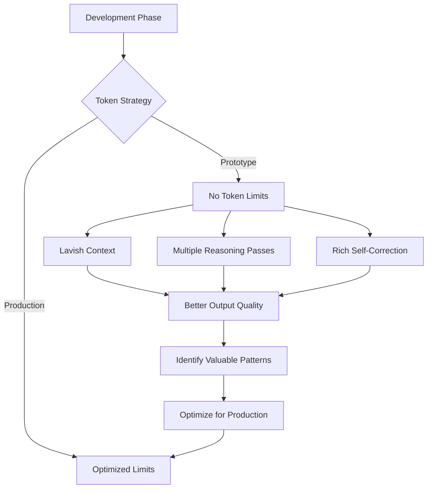

## Problem
Aggressive prompt compression to save tokens stifles reasoning depth and self-correction.

## Solution
During prototyping, **remove hard token limits**. Allow lavish context and multiple reasoning passes. Yes, it's pricier—but dramatically better outputs surface valuable patterns before optimizing.

## Example (token budget approach)

## References
- Raising An Agent - Episode 2 cost discussion—$1000 prototype spend justified by productivity.

[Source](https://www.nibzard.com/ampcode)