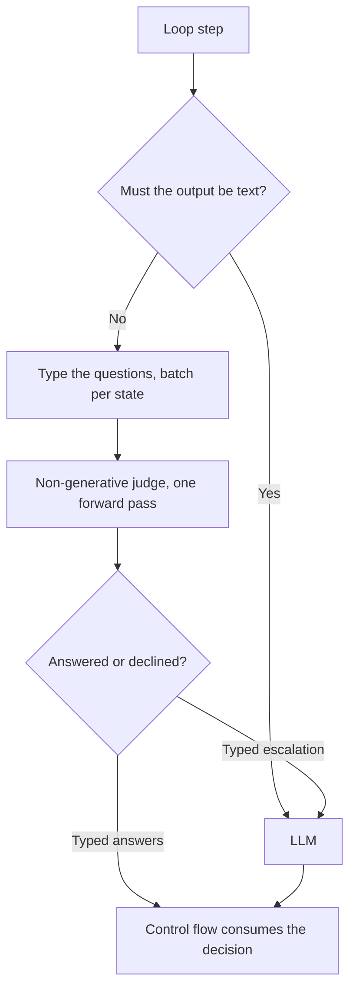

## Problem

An agent loop mixes two kinds of steps that look alike in the code and are not alike at all.

Some steps have to produce text: write the commit message, explain why the test failed, emit the patch, answer the user. The text *is* the deliverable.

Other steps only have to produce a decision that the control flow immediately consumes: is the build finished, which of these thirty page elements is the login button, is this shell command safe to run unattended, does this message still earn its place in the context window. Nothing downstream reads prose here — the loop reads one bit, one index, or one number.

Sending both kinds to the same generative model charges the same price for both. The decision step pays for a full autoregressive decode and its latency, and returns a free-form string the caller must parse back into the decision it already knew the shape of. Those steps are also the ones that repeat: they fire on every iteration, so their cost compounds while each one carries a token's worth of information. And because the answer space was never declared, the model can answer outside it — hedge, explain, invent a third option — leaving the caller to re-prompt or guess.

## Solution

Partition the loop's steps by one test: **does this step's output have to be text?**

1. **Split the step inventory.** Text-producing steps stay on the LLM. Decision-only steps go to a judgment path.
2. **Type the question.** Express each decision-only step as a question over an explicit state with a closed answer space: boolean (yes/no), pick-one over an enumerated set, or score over a bounded range. The caller declares the space, so the answer is in-set by construction rather than by instruction-following.
3. **Batch per state.** Every question about the *same* state goes in one call. The state is encoded once and the answers come back together, which is what turns a per-question cost into a per-observation cost.
4. **Answer without generating.** Route the batch to a non-generative judgment model — one that scores or classifies a state in a single forward pass instead of decoding tokens. There is no sampling loop to wait on and no string to parse.
5. **Escalate by type, never by default.** The judge may decline instead of answering, with a reason code. A useful set:

   | Reason | Meaning |
   |---|---|
   | `writing` | The real output is prose, code, or a document, not a decision. |
   | `open_ended` | No closed answer space exists for this question. |
   | `oversized` | The state is larger than the judge can faithfully take in. |
   | `unsure` | Confidence is below the configured threshold. |
   | `unreachable` | The judgment backend is unavailable. |

   Every one of these returns the step to the LLM. The contract deliberately has **no default branch**: a declined question never resolves to `false`, to the first enum member, or to a midpoint score. Guessing is exactly the failure this pattern exists to avoid, and a silent default reintroduces it where it is hardest to see.

```pseudo
step = next_step(loop_state)

if step.output_is_text:
    return llm(step)                    // writing stays with the LLM

questions = typed_questions_for(step)   // bool | pick_one(enum) | score(range)
verdict = judge(state=step.state, questions=questions)   // one call, no decoding

if verdict.escalated:                   // writing | open_ended | oversized
    return llm(step)                    // unsure   | unreachable
                                        // note: no `else: assume(default)`
return verdict.answers
```



The LLM path stays intact throughout. The judgment path is an accelerator in front of it, not a replacement for it, which is what makes the escalation contract cheap to honour and the whole mechanism safe to remove.

## Evidence

- **Evidence Grade:** `low`
- **Most Valuable Findings:** On one public implementation, a 454-judgment agreement study against a `claude-opus-5` reference reports 82.2% overall agreement and 89.5% among non-escalated verdicts, against a 68.7% majority-class baseline — so the judge carried real signal on that traffic, but not on every decision type. The same study reports context compaction at 56.3%, below a constant answerer, which is direct evidence that suitability is per-decision-type and not a property of the pattern.
- **Unverified / Unclear:** A single implementation and a single study. The same study's fair-baseline rerun put the latency advantage at roughly 3x once the generative baselines were enum-constrained, versus roughly 14x when they were not — so headline speedups measured against unconstrained generation overstate what this pattern buys. Nothing here has been replicated on other agents, other traffic, or other judgment backends.

## How to use it

- **Inventory before you build.** Take a real trace from your own loop and label each step by whether its output must be text. If the decision-only steps are a thin minority, stop here — there is nothing to route.
- **Start with the highest-frequency decision.** The economics come from repetition, so the first candidate is whatever the loop asks on every iteration: a completion check, a candidate selection, a keep/drop filter.
- **Declare the answer space in the call, not in the prompt.** The point is that "outside the set" is unrepresentable, rather than discouraged.
- **Batch by observation.** Group every question about one state into one call; resist the per-question call that makes the encoding cost repeat.
- **Measure agreement on your own traffic before acting on it unsupervised.** Sample real decisions, get reference labels from a strong model or a human, and compare against the majority-class baseline for that decision — a judge that "agrees 80% of the time" on a decision that is 78% one answer has told you nothing. Do this per decision type, not in aggregate.
- **Compare against the honest baseline.** When you measure latency, constrain the generative baseline to the same closed answer space. An unconstrained baseline flatters the judge.
- **Treat escalation rate as a first-class metric.** A rising `unsure` or `oversized` rate is the signal that the loop has drifted away from what the judge was measured on.
- **Keep the fallback live.** The LLM path must still work with the judge fully disabled; `unreachable` should be an ordinary, exercised code path, not an outage.

### Known implementations

- [jev-use](https://github.com/shitianfang/jev-use) -- a coding-agent plugin and MCP server that routes non-text agent steps to a judgment model with a typed escalation contract. Disclosed: authored by the contributor of this pattern, listed as an example rather than a recommendation.

## Trade-offs

- **Pros:** Removes the decode step from decisions that never needed one, so the loop's repeated steps get cheaper and faster. Closed answer spaces make control flow parseable by construction instead of by prompt discipline. Batching per state pays the encoding cost once. The typed escalation contract makes "the fast path does not apply here" an explicit, countable event rather than a silent wrong answer, and keeps the LLM path as the always-available fallback.
- **Cons:** Only pays inside loops that repeat the same kind of decision; a loop where nearly every step generates text gains little and still carries the extra component. Adds a second model, a second failure mode, and a question schema to maintain. The judge's accuracy is decision-type-specific and must be measured on your own traffic — published aggregates do not transfer, and at least one measured decision type scored below a constant answerer. Escalation logic is easy to get wrong in the direction that hurts most: any default-on-decline quietly converts the safety valve back into a guess. Speedups compared against unconstrained generation overstate the real gain.

## References

- [jev-use](https://github.com/shitianfang/jev-use) -- disclosed primary implementation, including the re-runnable agreement study and its raw data.
- [Your agent waits a full second to send the number 3](https://dev.to/shitianfang/your-agent-waits-a-full-second-to-send-the-number-3-2513) -- disclosed write-up by the same author, covering the measurements above and the cases where the approach lost.
- [Budget-Aware Model Routing with Hard Cost Caps](budget-aware-model-routing-with-hard-cost-caps.md) -- related in-repo pattern; it routes among generative models by cost and complexity, whereas this pattern routes by whether generation is needed at all.
