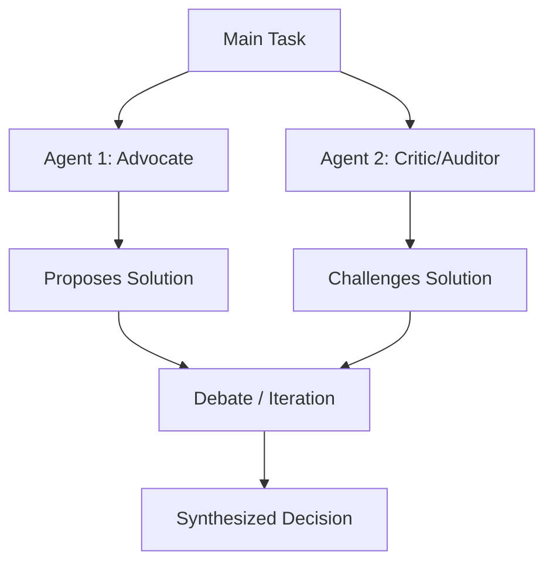

## Problem

Single-agent decision making can suffer from:

- **Confirmation bias**: Agent finds evidence supporting initial hypothesis
- **Limited perspectives**: One context window misses alternative approaches
- **Insufficient scrutiny**: No adversarial pressure to defend decisions
- **Unexamined assumptions**: Agent doesn't challenge its own reasoning

## Solution

Spawn **opposing agents** with different goals or perspectives to debate each other's positions. The conflict between agents surfaces blind spots, biases, and unconsidered alternatives.

**Key mechanism**: Create agents with opposing incentives or roles, let them critique each other's work, then synthesize results.

**Example configurations:**

- **Pro vs. Con**: One agent argues for acceptance, another for rejection
- **Optimistic vs. Conservative**: Different risk tolerances
- **User advocate vs. Company auditor**: Competing interests
- **Frontend dev vs. Backend dev**: Different technical perspectives

## How to use it

**Implementation pattern:**

1. Define opposing roles with clear incentives
2. Spawn both agents with same context but different system prompts
3. Have them work independently (uncorrelated context windows)
4. Collect their outputs
5. Either synthesize automatically or review differences manually

**Concrete example from transcript (expense filing):**

> "I have two subagents, one that represents me and one that represents the company. And they do battle to figure out what's the proper actual set of expenses. It's like an auditor subagent and a pro-Dan subagent."

**Other use cases:**

- **Code review**: Author-defender vs. Security-auditor
- **Architecture decisions**: Simplicity advocate vs. Future-proofing advocate
- **Content moderation**: Free speech vs. Safety
- **Resource allocation**: Different department representatives

**Historical inspiration (from transcript):**

Early Reddit thread showed subagents as: Frontend dev, Backend dev, Designer, Testing dev, PM—all debating implementation.

## Trade-offs

**Pros:**

- **Reduces bias**: Opposing views surface blind spots
- **Better decisions**: Adversarial pressure improves quality
- **Uncorrelated context**: Independent reasoning prevents groupthink
- **Explicit trade-offs**: Forces articulation of competing values
- **Checks and balances**: No single agent has unchallenged authority

**Cons:**

- **2x+ token cost**: Multiple agents processing same information
- **Slower execution**: Debate takes time compared to single decision
- **May produce conflict**: Agents might deadlock without resolution mechanism
- **Requires synthesis**: Need method to reconcile opposing views
- **Over-engineering for simple tasks**: Not every decision needs debate

## References

* Dan Shipper: "One of my non-technical Claude Code use cases is expense filing... I have two subagents, one that represents me and one that represents the company. And they do battle to figure out what's the proper actual set of expenses."
* Boris Cherny: "There's a Reddit thread where someone made subagents for front end dev, back end dev, designer, testing dev, PM... I think the value is actually the uncorrelated context windows where you have these two context windows that don't know about each other. You tend to get better results this way."
* [AI & I Podcast: How to Use Claude Code Like the People Who Built It](https://every.to/podcast/transcript-how-to-use-claude-code-like-the-people-who-built-it)
