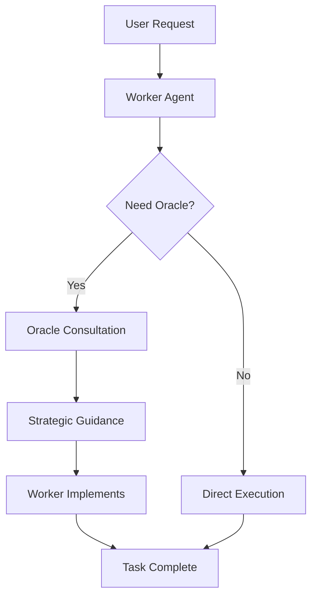

## Problem
Relying on a single AI model creates a trade-off between capability and cost. High-performance models are expensive for routine tasks, while cost-effective models may lack the reasoning power for complex problems.

## Solution
Implement a two-tier system with specialized roles:

- **The Worker (Claude Sonnet 4):** Fast, capable, and cost-effective agent handling bulk tool use and code generation
- **The Oracle (OpenAI o3 / Gemini 2.5 Pro):** Powerful, expensive model reserved for high-level reasoning, architectural planning, and debugging complex issues

The Worker can explicitly request Oracle consultation when stuck or needing better strategy. The Oracle reviews the Worker's approach and suggests course corrections without polluting the main agent's context.

## How to use it
Development environments, complex coding tasks, architectural decisions, debugging sessions where initial approaches fail.

## Trade-offs
* **Pros:** Cost-efficient use of frontier models; sophisticated problem-solving; specialized AI team approach
* **Cons:** Additional orchestration complexity; potential latency from model switching; requires careful Oracle invocation logic

## References
* Sourcegraph Team presentation on multi-model AI systems