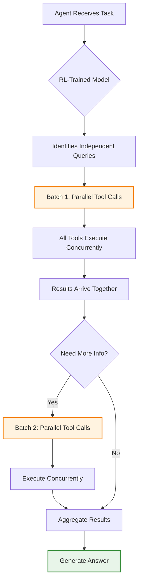

## Problem

Agents often execute tool calls sequentially even when they could run in parallel:

- **Unnecessary latency**: Sequential calls add up when tool execution time dominates inference time
- **Inefficient exploration**: Agent waits for one result before deciding the next action
- **Poor tool utilization**: Multiple independent information needs handled one-by-one
- **Suboptimal learned behavior**: Base models may not naturally parallelize without training signal

**Example bottleneck:**

```
Sequential (slow):
1. search("Intel financial data") → 2s
2. read_file("2023_report.pdf") → 1.5s
3. search("return metrics") → 2s
4. read_file("returns_table.csv") → 1.5s

Total: 7 seconds
```

Cognition observed this with Devon: the baseline model would make 8-10 sequential tool calls during file planning, taking significant time even though many calls could have run in parallel.

## Solution

**Use Agent RFT to teach the model to parallelize independent tool calls, dramatically reducing latency when tool execution is faster than inference.**

**How Models Learn Parallelization:**

During RL exploration, the agent discovers that:

1. Multiple tool calls can be made simultaneously
2. When tool results arrive together, the next reasoning step has more context
3. Parallel patterns receive similar rewards in less time (implicit efficiency reward)
4. The model naturally converges toward parallel execution patterns

**Natural Emergence through RL:**

Unlike explicit programming, the parallelization emerges from:

- **Exploration**: Agent tries different tool call patterns
- **Reward shaping**: Faster completions may get slight bonuses (optional)
- **Efficiency pressure**: Light penalty on token usage encourages efficiency
- **Pattern reinforcement**: Successful parallel patterns get reinforced

**Typical Learned Pattern:**

```
Parallel (fast):
Batch 1 (parallel):
  - search("Intel financial data")
  - read_file("2023_report.pdf")
  - search("return metrics")
  - list("/financial_reports")
→ All complete in ~2s (dominated by slowest)

Batch 2 (parallel, based on Batch 1 results):
  - read_file("returns_table.csv")
  - read_file("competitor_data.csv")
→ Complete in ~1.5s

Total: ~3.5s (50% faster)
```

## How to use it

**Prerequisites:**

Your infrastructure must support parallel tool execution:

```python
# Tool server must handle concurrent requests
@app.cls(
    image=base_image,
    concurrency_limit=10,  # Allow 10 concurrent tools per rollout
    allow_concurrent_inputs=True
)
class ParallelToolExecutor:
    @method()
    async def execute_tool(self, rollout_id: str, tool: str, params: dict):
        # Use async for I/O-bound operations
        result = await self._async_execute(tool, params)
        return result
```

**Training Setup:**

No special configuration needed - parallelization emerges naturally:

```python
# Standard Agent RFT setup
job = client.fine_tuning.jobs.create(
    training_file="file-abc123",
    model="gpt-4o",
    method="rft",
    rft={
        "tools": tools,
        "grader": grader,
        "hyperparameters": {
            "n_epochs": 3,
            "batch_size": 16,
            "compute_multiplier": 1
        }
    }
)

# No special "parallelization" flag needed!
# Model discovers this pattern during exploration
```

**Optional: Explicit Latency Rewards**

You can encourage parallelization through reward shaping:

```python
class LatencyAwareGrader:
    def grade(self, question, answer, tool_trace, ground_truth):
        # Standard correctness score
        correctness = self.check_correctness(answer, ground_truth)

        # Bonus for efficiency
        num_sequential_rounds = self.count_sequential_rounds(tool_trace)

        if num_sequential_rounds <= 3:
            efficiency_bonus = 0.1
        elif num_sequential_rounds <= 5:
            efficiency_bonus = 0.05
        else:
            efficiency_bonus = 0.0

        return {
            "score": correctness + efficiency_bonus,
            "subscores": {
                "correctness": correctness,
                "efficiency": efficiency_bonus
            }
        }

    def count_sequential_rounds(self, tool_trace):
        """
        Count how many back-and-forth rounds with tools
        Parallel calls in same round = 1 round
        """
        rounds = 0
        current_round_calls = set()

        for call in tool_trace:
            if call['type'] == 'tool_call':
                current_round_calls.add(call['id'])
            elif call['type'] == 'tool_response':
                if call['call_id'] in current_round_calls:
                    current_round_calls.remove(call['call_id'])
                    if not current_round_calls:
                        rounds += 1

        return rounds
```

**Monitoring Parallelization:**

Track during training to see if model learns parallel patterns:

```python
def analyze_parallelization(tool_trace):
    """
    Analyze how many parallel calls the agent made
    """
    parallel_batches = []
    current_batch = []

    for event in tool_trace:
        if event['type'] == 'tool_call':
            current_batch.append(event)
        elif event['type'] == 'assistant_message':
            # End of reasoning, start of new tool batch
            if current_batch:
                parallel_batches.append(len(current_batch))
                current_batch = []

    return {
        'num_batches': len(parallel_batches),
        'calls_per_batch': parallel_batches,
        'max_parallelism': max(parallel_batches) if parallel_batches else 0,
        'total_calls': sum(parallel_batches)
    }

# Example output showing learned parallelization:
# Baseline: {'num_batches': 8, 'calls_per_batch': [1,1,1,1,1,1,1,1], 'max_parallelism': 1}
# Fine-tuned: {'num_batches': 2, 'calls_per_batch': [4,2], 'max_parallelism': 4}
```

## Real-World Example: Cognition Devon

**Task**: File planning agent - identify which files need editing

**Tools Available**:

- `read_file(path)`: Read file contents (~500ms)
- `shell(command)`: Run grep/find/ls (~300ms)

**Baseline Behavior (Before RFT):**

Sequential pattern observed in traces:

```
1. shell("find . -name '*.py'")
2. read_file("main.py")
3. shell("grep 'UserAuth' .")
4. read_file("auth.py")
5. shell("grep 'DatabaseConnection' .")
6. read_file("db.py")
7. shell("ls tests/")
8. read_file("tests/test_auth.py")

Total: 8-10 sequential tool calls
```

**After Agent RFT:**

Learned parallel pattern:

```
Round 1 (parallel):
  - shell("find . -name '*.py'")
  - shell("grep 'UserAuth' .")
  - shell("grep 'DatabaseConnection' .")
  - shell("ls tests/")

Round 2 (parallel, based on Round 1):
  - read_file("main.py")
  - read_file("auth.py")

Round 3 (if needed):
  - read_file("db.py")

Total: 3-4 rounds (50% reduction in back-and-forth)
```

**Results:**

- Planning time reduced by ~50%
- Latency improvement even more dramatic when tool execution < inference time
- Model learned this without explicit parallelization reward

**Sam's Observation:**

> "We noticed that the model starts learning how to do a lot of parallel tool calls. The first action that the model does, it will kick off like eight different things... and then following on it will independently explore all of those things by again running more parallel tool calls."

## When Parallelization Helps Most

**High Impact Scenarios:**

1. **Tool execution << Inference time**
   - If tools return in 100ms but inference takes 2s, parallelization saves multiple inference rounds
   - Example: API calls, database queries, file reads

2. **Independent information gathering**
   - Multiple search queries
   - Reading multiple files
   - Checking multiple conditions

3. **Broad exploration phases**
   - Initial reconnaissance (find all Python files, check all tests, etc.)
   - Multi-source research (check docs, code, tests simultaneously)

**Low Impact Scenarios:**

1. **Sequential dependencies**
   - Must read file A to know which file B to read
   - Each tool result determines next action

2. **Tool execution >> Inference time**
   - If each tool takes 10s and inference takes 1s, parallelization saves less
   - Example: Heavy computation, large file processing

3. **Rate-limited APIs**
   - External APIs that throttle concurrent requests
   - Parallel calls just hit rate limits

## Comparison with Explicit Parallelization

| Approach | Agent RFT Learning | Manual Programming |
|----------|-------------------|-------------------|
| **Implementation** | Emerges from training | Explicit parallel tool API |
| **Flexibility** | Adapts to task | Fixed strategy |
| **Dependencies** | Learns safe patterns | Must hand-code logic |
| **Optimization** | Optimizes for your tools | Generic parallelization |
| **Maintenance** | Automatic with retraining | Manual updates |



## Trade-offs

**Pros:**

- **Dramatic latency reduction**: 40-50% reduction common when applicable
- **No manual coding**: Parallelization emerges from training, not programming
- **Adaptive**: Model learns optimal parallelization for your specific tools and tasks
- **Scales naturally**: Works across different numbers of tools and complexity levels
- **Better UX**: Faster agent responses improve user experience

**Cons:**

- **Infrastructure requirements**: Tool servers must handle concurrent requests
- **Resource usage**: More simultaneous tool calls = higher peak resource usage
- **Doesn't always emerge**: Requires enough variance in training data
- **May need reward shaping**: Explicit latency bonuses can help if parallelization doesn't emerge naturally
- **Debugging complexity**: Parallel execution makes traces harder to follow

## Implementation Checklist

- [ ] Tool infrastructure supports concurrent requests (async, multiple workers)
- [ ] Each tool can handle being called multiple times in parallel safely
- [ ] Monitoring tracks parallelization metrics (calls per batch, rounds per rollout)
- [ ] Reward function doesn't penalize parallelization (e.g., per-tool-call costs)
- [ ] Training data has variance in tool call patterns
- [ ] Optional: Latency-aware reward shaping to encourage parallelization
- [ ] Load testing confirms infrastructure can handle burst parallelism

## References

- [OpenAI Build Hour: Agent RFT - Cognition Case Study (November 2025)](https://youtu.be/1s_7RMG4O4U)
- [Parallel Tool Execution Pattern](./parallel-tool-execution.md)
- Related patterns: Agent Reinforcement Fine-Tuning, Tool Use Incentivization via Reward Shaping
