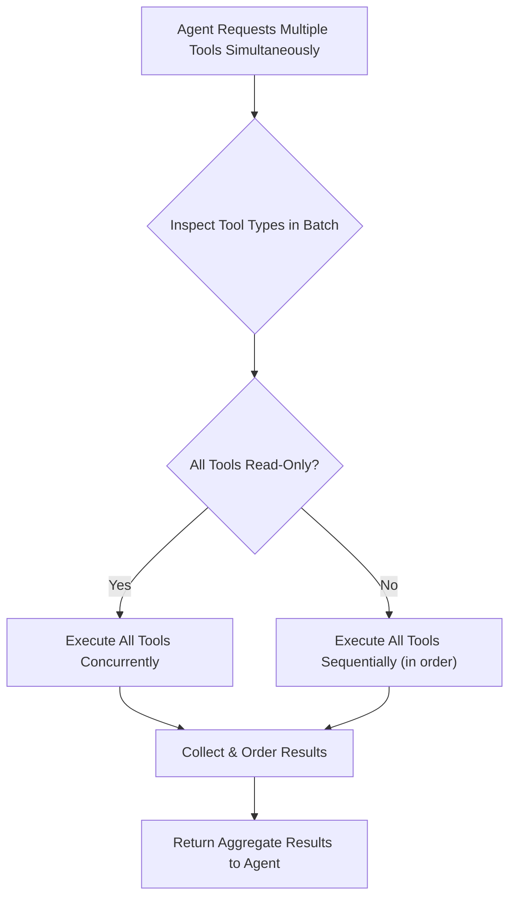

## Problem

When an AI agent decides to use multiple tools in a single reasoning step, executing them strictly sequentially can lead to significant delays, especially if many tools are read-only and could be run concurrently. Conversely, executing all tools in parallel without consideration can cause race conditions, data corruption, or unpredictable behavior if some tools modify state (e.g., write to files, change system settings).

## Solution

Implement a conditional execution strategy for batches of tools based on their operational nature:

1.  **Tool Classification**: Each tool available to the agent must declare whether it is:
    *   **Read-Only**: The tool only inspects data or system state without making changes (e.g., `FileRead`, `GrepTool`, `GlobTool`).
    *   **State-Modifying (Write)**: The tool makes changes to files, system state, or has other side effects (e.g., `FileEditTool`, `FileWriteTool`, `BashTool` for certain commands).

2.  **Execution Orchestration**: When the agent requests a batch of tools to be executed:
    *   The orchestrator inspects the classification of all tools in the current batch.
    *   **If all tools in the batch are Read-Only**: Execute all tools concurrently (in parallel) to maximize speed.
    *   **If any tool in the batch is State-Modifying**: Execute all tools in the batch sequentially, in the order requested by the agent, to ensure safety and predictability.

3.  **Result Aggregation**: After execution, collect all tool results. If tools were run in parallel, ensure the results are presented back to the agent (or for further processing) in a consistent order, typically matching the agent's original request sequence.

This strategy balances the need for performance (through parallelism for safe operations) with the need for safety and correctness (through serialization for state-modifying operations).

## How to use it

-   Ensure each tool in your agent's toolkit has a clearly defined property indicating if it's `isReadOnly` or state-modifying.
-   The agent's core execution loop, when processing a `tool_use` request involving multiple tools, should implement the conditional logic described above.
-   Consider a default concurrency limit for parallel execution to avoid overwhelming system resources.
-   When tools are executed in parallel, their individual results (which may arrive out of order) should be collected and then re-sorted to match the agent's original requested order before being passed back to the LLM or for further processing. This maintains predictability for the LLM.

## Trade-offs

-   **Pros:**
    -   Significantly improves performance for sequences of read-only tool calls.
    -   Maintains safety and prevents race conditions by serializing operations that modify state.
    -   Simpler to implement than full dependency graph analysis for tool execution, while still offering substantial benefits.
    -   **Model Behavior Alignment:** Some models (e.g., Claude Sonnet 4.5) naturally exhibit parallel tool execution behavior, making this pattern feel more natural and efficient.
-   **Cons/Considerations:**
    -   If a batch of tools contains mostly read-only operations but includes a single state-modifying operation early in the sequence, the entire batch might still be executed sequentially, limiting potential parallelism.
    -   The effectiveness relies on the accurate classification of tools as read-only or state-modifying. An incorrectly classified tool could lead to safety issues or missed optimization opportunities.
    -   **Context Consumption:** Parallel execution burns through context windows faster as multiple results return simultaneously, which may contribute to [context anxiety](context-window-anxiety-management.md) in context-aware models.

## References

-   This pattern is detailed in the book ["Building an Agentic System"](https://gerred.github.io/building-an-agentic-system/) by Gerred Dillon, particularly in the "Parallel Tool Execution" section and the "Tool Execution Strategy" part of the "Core Architecture" section.
-   The book describes this pattern in the context of the `anon-kode` / `Claude Code` agentic system: *"The system solves this by classifying operations as read-only or stateful, applying different execution strategies to each."* (from `src/parallel-tool-execution.md`) and *"Read vs. Write Classification... Smart Concurrency Control: Parallel for read operations... Sequential for write operations"* (from `src/core-architecture.md`).
-   The concept is based on the idea that read operations are generally idempotent and free of side-effects when run concurrently, while write operations require careful sequencing.
-   [Cognition AI: Devin & Claude Sonnet 4.5](https://cognition.ai/blog/devin-sonnet-4-5-lessons-and-challenges) observes that Sonnet 4.5 naturally maximizes actions per context window through parallel tool execution.