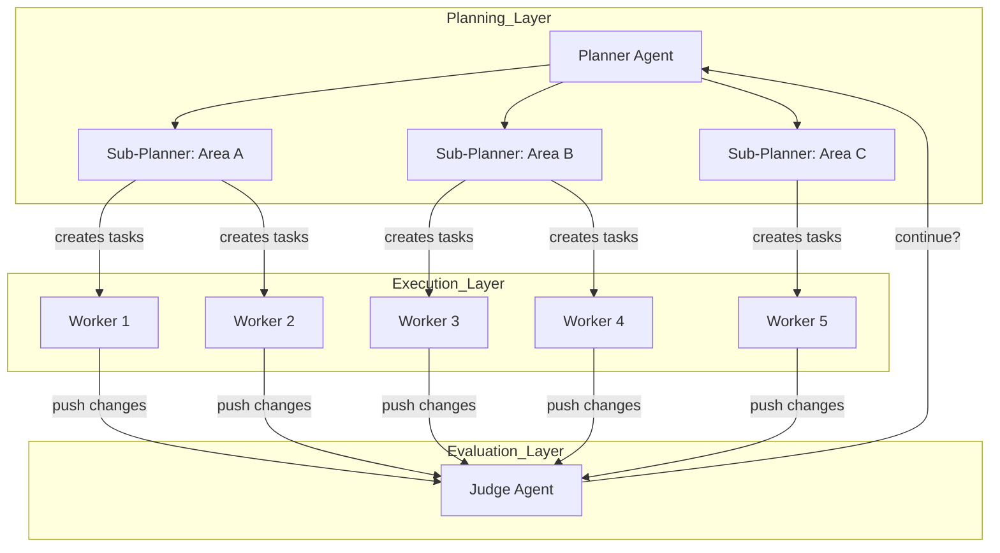

## Problem

Running multiple AI agents in parallel for complex, multi-week projects creates significant coordination challenges:

- **Flat structures** lead to conflicts, duplicated work, and agents stepping on each other
- **Dynamic coordination** through shared files with locking becomes a bottleneck - most agents spend time waiting rather than working
- **Equal status** agents become risk-averse, avoiding difficult tasks and making only small, safe changes instead of tackling end-to-end implementation
- **No agent takes ownership** of hard problems or overall project direction

## Solution

Separate agent roles into a hierarchical planner-worker structure:

- **Planners**: Continuously explore the codebase and create tasks. They can spawn sub-planners for specific areas, making planning itself parallel and recursive.
- **Workers**: Pick up tasks and focus entirely on completing them. They don't coordinate with other workers or worry about the big picture. They grind on their assigned task until done, then push changes.
- **Judge**: At the end of each cycle, determines whether to continue or if the goal is achieved.

This creates an iterative cycle where each iteration starts fresh, combating drift and tunnel vision.

## How to use it

**Use cases for planner-worker separation:**

1. **Massive codebases**: Projects that would take human teams months (1M+ lines of code, 1000+ files)
2. **Ambitious goals**: Building complex systems from scratch (web browser, Windows emulator, Excel clone)
3. **Large-scale migrations**: In-place framework migrations (Solid to React, Java LSP implementation)
4. **Performance optimization**: Complete rewrites in different languages for speed (C++ to Rust)

**Implementation considerations:**

- **Model choice per role**: Different models excel at different roles. Use planning-focused models for planners even if coding-focused models exist for workers.
- **Fresh starts**: Each cycle should start fresh to combat drift and tunnel vision from long-running contexts.
- **Parallel planning**: Planners can spawn sub-planners, making the planning process itself parallel and recursive.
- **Worker isolation**: Workers should be task-focused and not worry about coordination with other workers.

**Prompting is critical**: Getting agents to coordinate well, avoid pathological behaviors, and maintain focus over long periods requires extensive experimentation with prompts.

## Trade-offs

**Pros:**

- **Scalability**: Hundreds of agents can work concurrently on a single codebase for weeks
- **Clear ownership**: Planners own the big picture; workers own task completion
- **Parallel planning**: Planning itself scales through sub-planner spawning
- **Reduced coordination overhead**: Workers don't need to coordinate with each other
- **Combats tunnel vision**: Iterative cycles with fresh starts prevent drift

**Cons:**

- **System complexity**: Requires orchestration infrastructure for role separation and task distribution
- **Prompt engineering difficulty**: Coordination behavior requires extensive prompt experimentation
- **Cost**: Running hundreds of concurrent agents for weeks is expensive
- **Not perfectly efficient**: Significant token waste, but far more effective than expected
- **Still evolving**: Planners should wake up when tasks complete; agents sometimes run too long

## Key Insights

1. **Model choice matters**: GPT-5.2 models are better at extended autonomous work than Opus 4.5, which tends to stop early and take shortcuts. Different models excel at different roles - GPT-5.2 is a better planner than GPT-5.1-codex, even though the latter is coding-specific.

2. **Remove complexity**: Many improvements came from removing complexity rather than adding it. An initial "integrator" role for quality control created more bottlenecks than it solved - workers were already capable of handling conflicts.

3. **Middle structure**: The right amount of structure is in the middle. Too little structure and agents conflict, duplicate work, and drift. Too much structure creates fragility.

4. **Distributed systems don't always translate**: Initial attempts to model systems from distributed computing and organizational design didn't work for agents.

## Examples

**Cursor's experiments:**

- **Web browser from scratch**: 1 million lines of code across 1,000 files, running for close to a week
- **Solid to React migration**: 3 weeks with +266K/-193K edits in the Cursor codebase
- **Video rendering optimization**: 25x speedup with efficient Rust rewrite
- **Java LSP**: 7.4K commits, 550K LoC
- **Windows 7 emulator**: 14.6K commits, 1.2M LoC
- **Excel clone**: 12K commits, 1.6M LoC

## References

* [Scaling long-running autonomous coding](https://cursor.com/blog/scaling-agents) - Cursor blog post on running hundreds of concurrent agents for weeks at a time
* [Browser source code on GitHub](https://github.com/getcursor/browser) - 1M+ lines of agent-generated code
