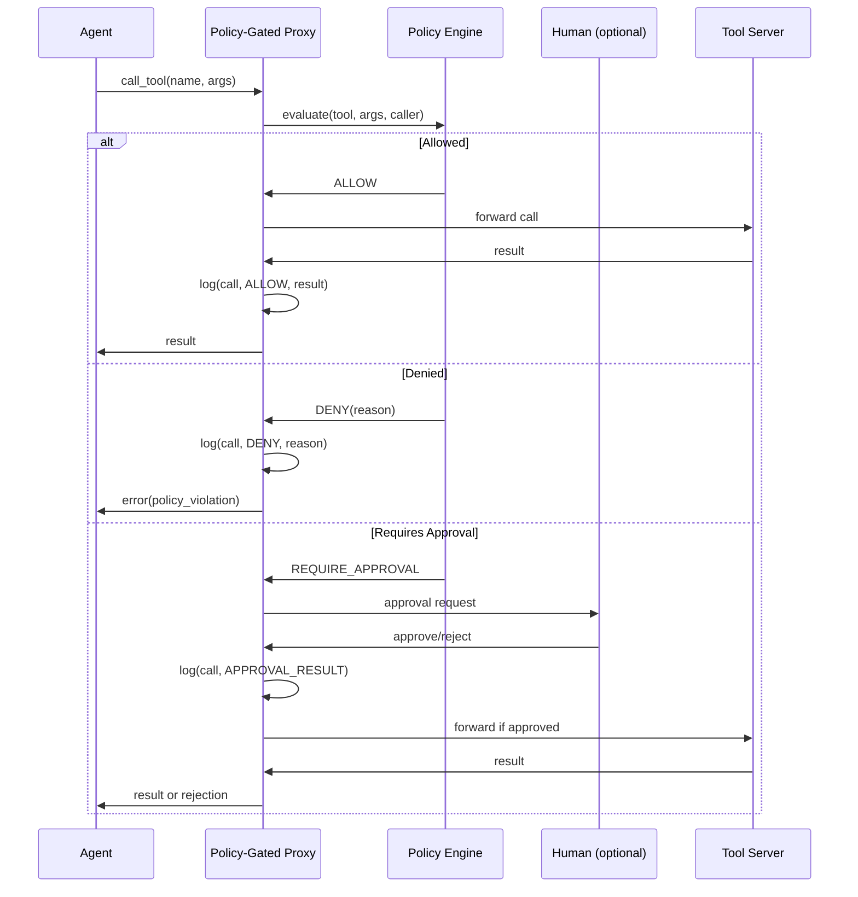

## Problem

AI agents call external tools (databases, APIs, file systems) through protocols like MCP. Once an agent has access to a tool server, it can invoke any tool with any arguments. There is no enforcement layer between "the agent decided to call this tool" and "the tool executed." This creates three gaps:

1. **No access control** -- agents can call tools they shouldn't (e.g., production DB delete when only reads are authorized).
2. **No audit trail** -- when something goes wrong, there's no record of what tool calls were made, by which agent, with what arguments.
3. **No policy enforcement** -- compliance rules (data residency, PII handling, rate limits) can't be enforced at the tool-call boundary.

## Solution

Place a transparent proxy between the agent and the tool server. The proxy intercepts every tool call, evaluates it against a policy engine, and either forwards the call, blocks it, or routes it through a human approval workflow. Every decision is logged to an append-only audit trail.

**Core components:**

- **Proxy layer**: sits between agent and tool server, speaks the same protocol on both sides (e.g., MCP in, MCP out). The agent doesn't know it's talking to a proxy.
- **Policy engine**: evaluates each tool call against declarative rules. Rules can match on tool name, argument values, caller identity, time of day, rate limits, or custom predicates.
- **Decision outcomes**: allow, deny, require-approval (routes to human), transform (modify arguments before forwarding).
- **Audit log**: append-only record of every tool call, policy evaluation result, and execution outcome. Ideally hash-chained for tamper evidence.



## How to use it

**When to apply:**

- Multi-agent systems where different agents need different tool permissions
- Regulated environments (finance, healthcare) requiring audit trails
- Production deployments where certain tool calls need human sign-off
- Any setup where "the agent has MCP access" is too coarse-grained

**Implementation approaches:**

1. **Standalone proxy process**: runs as a separate service. Agent connects to proxy, proxy connects to tool server. Works with any agent framework.
2. **Middleware/wrapper**: wraps the tool server SDK. Less infrastructure, but coupled to a specific language or framework.
3. **Gateway pattern**: a single proxy fronts multiple tool servers, providing unified policy and audit across all tools.

**Policy rule examples:**

```yaml
rules:
  - match: { tool: "database_query", args.query: "DELETE *" }
    action: deny
    reason: "Bulk deletes require manual execution"

  - match: { tool: "send_email", rate: "> 10/hour" }
    action: deny
    reason: "Email rate limit exceeded"

  - match: { tool: "deploy_production" }
    action: require_approval
    channel: slack
```

**Prerequisites:**

- Tool calls must go through a protocol with interceptable boundaries (MCP, REST, gRPC)
- Policy rules must be definable in advance (not all governance can be pre-specified)
- For human approval flows, a notification channel and reasonable response latency

## Trade-offs

**Pros:**

- Transparent to both agent and tool server -- no code changes on either side
- Policies are declarative and auditable, not buried in agent prompts
- Hash-chained audit logs provide tamper-evident compliance records
- Can enforce rate limits, data residency, and PII rules at the boundary
- Composable with other patterns (human-in-the-loop, observability)

**Cons:**

- Adds latency to every tool call (policy evaluation + logging)
- Policy rules require maintenance as tools and requirements evolve
- Human approval flows introduce blocking waits and availability dependencies
- Cannot catch policy violations that span multiple tool calls (need higher-level orchestration for that)
- Proxy must be as available as the tool servers it fronts

## References

- [Design Patterns for Securing LLM Agents](https://arxiv.org/abs/2506.08837) (Beurer-Kellner et al., ETH Zurich, 2025) -- formalizes separation of proposal and execution in agent security
- [Awesome MCP Gateways](https://github.com/e2b-dev/awesome-mcp-gateways) -- catalog of proxy/gateway implementations for MCP
- [SidClaw](https://github.com/sidclawhq/platform) -- open-source implementation of this pattern for MCP servers with hash-chain audit trails
- Related pattern: [Human-in-the-Loop Approval Framework](human-in-loop-approval-framework.md)
- Related pattern: [Sandboxed Tool Authorization](sandboxed-tool-authorization.md)
