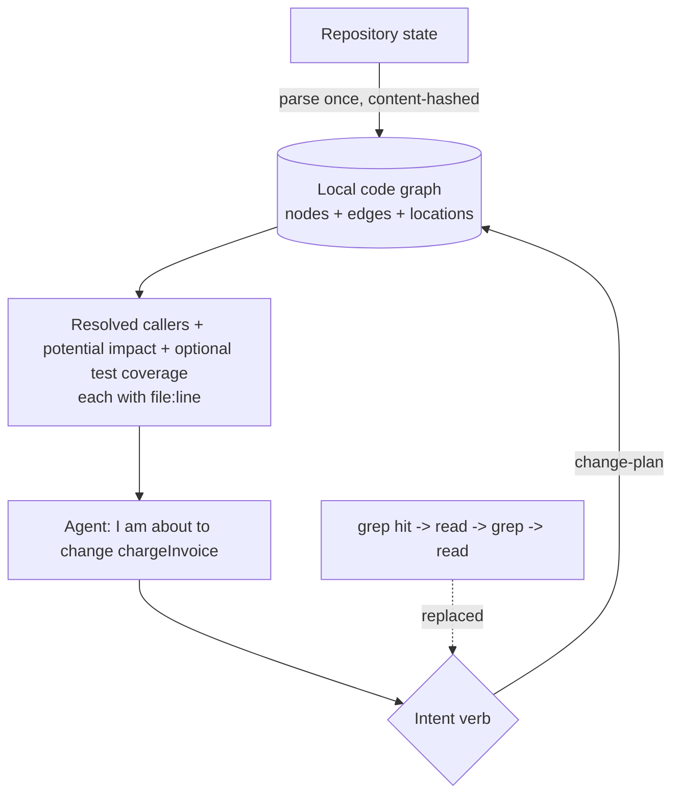

## Problem

A coding agent asked "who calls `chargeInvoice`?" or "what breaks if I change this signature?" typically answers by searching: grep a name, read the hits, grep the callers of the callers, read again. Every hop is a tool round-trip whose result the model must interpret, and the chain has three failure modes:

- **It is not reproducible.** The same question asked twice takes different paths and can produce different answers, because the model chooses the next search.
- **It stops early.** Search returns the first plausible matches; the agent decides it has enough and edits code whose second-order callers it never saw.
- **Impact questions are not search questions.** "What breaks if I change this" is a reverse traversal over a call/import graph. Text search can approximate it for unique names and fails silently for common ones.

The usual alternatives trade one problem for another. Embedding indexes ([agentic-search-over-vector-embeddings](agentic-search-over-vector-embeddings.md) documents why teams abandon them) add infrastructure and go stale against uncommitted work. Search subagents ([curated-code-context-window](curated-code-context-window.md)) spend an LLM call per question and inherit the model's non-determinism.

## Solution

Build the structural facts **once, ahead of the question**, into a local graph, and expose that graph to the agent as **verbs shaped like its intent** rather than as a search box.

Three properties do the work:

1. **Precomputed and deterministic.** A parser (tree-sitter, an LSP index, or a compiler front end) walks the repository and emits nodes (file, declaration) and edges (contains, imports, calls) with exact `file:line` locations. No model, no embeddings — the same repository state always yields the same graph, so an answer can be re-derived and checked.
2. **Intent-shaped verbs, not a query language.** The agent should not have to compose traversals. Ship the small set of questions agents actually ask, each answered in one call: locate a symbol, show a symbol's card (signature, definition site, callers, callees), show reverse impact, show a path between two symbols, and — the composed one — *"I am about to change X"*, which returns statically resolved callers and potential blast radius together, plus covering tests when a separate coverage map is available.
3. **Provenance on every answer.** Each fact carries the file and line range it came from, so the agent can cite it, and a reader can verify it without re-reading the codebase.

Freshness is handled by cheap re-derivation rather than by abandoning the index: hash file contents, re-parse only what changed, and mark the store stale when the working tree moves. This is what makes a precomputed index viable for agents in a way that an embedding index is not — rebuilding is parsing, not inference.

Resolution honesty matters more than coverage. Statically resolvable edges (imports, unique call targets) are facts; a call whose name is defined in several places is **ambiguous**, and the right behaviour is to say so — return the shortlist and point the agent at a literal search — rather than to guess and be confidently wrong. Dynamic dispatch, reflection and generated code remain outside what the graph can promise.

A parser alone does not establish which tests execute a symbol. Attach coverage from instrumented test runs, stamped with the source and test revisions; when it is absent or stale, report test coverage as unknown. Graph reachability estimates potential impact, not proof that a caller will break.

## Evidence

- **Evidence Grade:** `low`
- **Most Valuable Findings:** Deterministic structural indexes for code are long-established outside agents (ctags, LSIF/SCIP, Glean, Aider's tree-sitter repo map); the agent-specific move is exposing them as intent verbs with provenance rather than as context to be injected or a search API. Reverse-impact questions are the clearest win, because they are the ones text search cannot answer soundly.
- **Unverified / Unclear:** Whether this reduces *token* cost is not established — in the author's own measurements token savings did not materialise, because a graph answer that replaces several file reads is itself dense. Claims of end-to-end speedups are implementation- and corpus-specific and should be measured locally before being repeated. There is no public benchmark yet comparing agent task success with and without a precomputed graph.

## How to use it

- **Start with the verbs, not the schema.** Write down the five questions your agents actually ask before designing nodes and edges; a graph that cannot answer them in one call will be bypassed for grep.
- **Pick a parser you can run everywhere.** Tree-sitter grammars are the low-friction option (no build system, no compile step); an LSP/SCIP index is more precise where you already have one.
- **Keep the store local and inspectable.** Plain files that diff cleanly let a human check what the agent was told. A network service reintroduces the staleness and access problems the index was meant to remove.
- **Make staleness loud.** Stamp the store with the content hashes it was built from and refuse or warn when the working tree has moved past it; a silently stale graph is worse than no graph.
- **Tell the agent when to leave.** The instructions that ship with the tool should send it back to grep for literal sweeps, string constants, comments, and anything the graph marks ambiguous.
- **Prerequisites:** a parseable codebase, a place to keep a per-repository store, and an agent that can be instructed to prefer the tool over ad-hoc search.

## Trade-offs

- **Pros:**
  - Reverse-impact and caller questions get the graph’s statically resolved answer in one call instead of an open-ended search loop that may stop early.
  - Deterministic and citable: the same question yields the same answer with `file:line` provenance a human can verify.
  - No model, embeddings or vector store in the query path, so it runs offline and adds no inference cost or new data-egress surface.
- **Cons:**
  - Another artefact to build and keep fresh; a stale graph confidently reports the past.
  - Static resolution is incomplete — dynamic dispatch, reflection, DI containers and generated code produce missing or ambiguous edges, and the tool must admit that rather than paper over it.
  - Per-language work: every language needs a grammar or index, so polyglot repositories have uneven coverage.
  - Not a token-saving measure on its own (see Evidence); justify it by answer quality and reproducibility, not by cost.
  - Overkill for small repositories, where reading the files is simply cheaper.

## References

- [Aider repo map](https://github.com/Aider-AI/aider) — tree-sitter derived, ranked map of a repository's symbols; the closest widely used prior art for precomputing structure for a coding agent.
- [SCIP](https://github.com/sourcegraph/scip) and [LSIF](https://github.com/microsoft/lsif-node) — language-agnostic code-index formats defining symbols, definitions and references as a portable graph.
- [Glean](https://github.com/facebookincubator/Glean) — a system for storing and querying facts about source code, including cross-references, at scale.
- [tree-sitter](https://github.com/tree-sitter/tree-sitter) — incremental parsers usable without a build system, the common substrate for language-agnostic extraction.
- [universal-ctags](https://github.com/universal-ctags/ctags) — the long-standing minimal form of the same idea: precompute symbol locations, look them up instead of searching.
- Known implementation, disclosed: [ctx-optimize](https://github.com/muthuishere/ctx-optimize) (MIT), maintained by the author of this pattern — a CLI that builds the graph with tree-sitter and exposes `query`, `card`, `change-plan`, `affected` and `path` as the verbs described above. Listed as an example of the shape, not as a recommendation.
