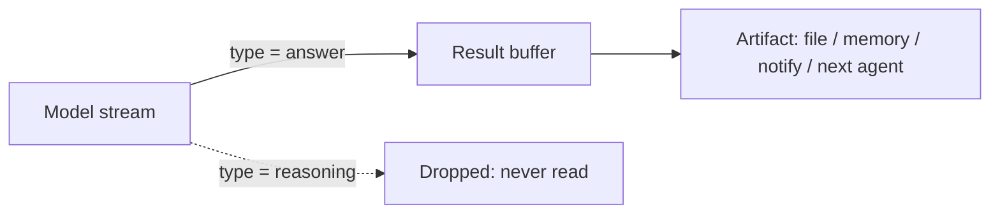

## Problem

Reasoning models emit two kinds of tokens in one response: private chain-of-thought and the final answer. When a harness builds its "result" from the whole stream and then tries to remove the reasoning afterward with string heuristics, it eventually leaks. Reasoning has no stable delimiter, the shape differs per model and per version, and a single missed case commits raw chain-of-thought into a file, a memory store, a notification, or the context of the next agent in the chain.

That leak is not just cosmetic. Chain-of-thought routinely contains half-formed conclusions, discarded plans, and sensitive scratch data. Once it lands in a durable artifact it is indistinguishable from the intended answer, it inflates memory and context, and it can surface content the model never meant to publish.

## Solution

Treat the response as **typed events and select, do not strip**. The provider already labels which chunks are reasoning and which are the answer (`type: "thought"` vs `type: "text"`, `reasoning_content` vs `content`, thinking blocks vs text blocks). Assemble the result **only** by concatenating the answer-typed events. The reasoning-typed events are never read into the result path at all, so the firewall is structural at assembly time, not a post-hoc filter over mixed text.

```pseudo
result = ""
for event in stream:
    if event.type == ANSWER:      # e.g. "text" / content / text-block
        result += event.data
    # reasoning events ("thought" / reasoning_content) are never read here
emit(result)
```

Design points:

- The selection is a **whitelist of answer-typed events**, not a blacklist of reasoning markers. A blacklist fails open on the first unrecognized marker; a whitelist fails closed.
- Enforce it at the **single choke point** where the artifact is assembled, so every downstream consumer (file write, memory, notification, next agent) inherits the guarantee for free.
- **Normalize across harnesses.** Each labels its channels differently; map them all to one internal "answer vs reasoning" distinction inside the adapter so no skill or agent downstream can reintroduce the leak.



## Evidence

- **Evidence Grade:** medium
- **Most valuable findings:**
  - In a public multi-harness adapter (`aeonfun/aeon`), the xAI path builds `.result` only from `type=="text"` chunks and never reads `type=="thought"`; the Mistral-Vibe path takes the assistant `content` and never `reasoning_content`; the Codex path takes the final `agent_message`, not reasoning. One firewall, six harnesses.
  - That project's run history leaked chain-of-thought precisely when the result was built from the whole stream. Switching to structural answer-only selection removed the leak as a class rather than case by case.
- **Unverified / Unclear:** prevalence of this leak across other frameworks, and whether every provider guarantees a clean type label in every mode (streaming vs non-streaming, tool calls, refusals).

## How to use it

- Reach for it whenever a harness exposes reasoning as a distinct stream channel (OpenAI reasoning models, Anthropic extended-thinking blocks, DeepSeek `reasoning_content`, xAI thought chunks) **and** the answer is persisted or forwarded.
- Prerequisites: a streaming or JSON mode that types its events, and one assembly function per harness.
- Put the firewall in the adapter that normalizes each harness to your internal envelope. Downstream skills then cannot reintroduce the leak even by accident.
- Add a regression test that feeds a stream containing reasoning chunks and asserts none of that text appears in the emitted result.

## Trade-offs

- **Pros:**
  - Eliminates a whole class of chain-of-thought-leak bugs instead of patching leaks one at a time.
  - Robust to model and version changes, because it relies on the provider's event type rather than fragile reasoning delimiters.
  - Single point of enforcement; keeps memory and artifacts clean and smaller.
- **Cons:**
  - Depends on the provider labeling channels correctly; a mislabeled chunk defeats it.
  - If you actually want the reasoning (debugging, transparency), you need a separate opt-in channel; see `verbose-reasoning-transparency`.
  - Non-streamed or untyped responses cannot use structural selection and fall back to weaker heuristics.

## References

- Aeon harness-adapter, a six-harness implementation of the firewall: https://github.com/aeonfun/aeon/tree/main/harness-adapter
- Related and complementary: `chain-of-thought-monitoring-interruption` (watches CoT for safety mid-run; different intent, same channel).
