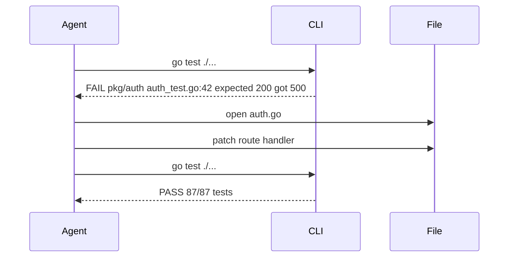

## Problem
Polishing a single prompt can't cover every edge-case; agents need ground truth to self-correct.

## Solution
Expose **iterative, machine-readable feedback**—compiler errors, test failures, linter output, screenshots—after every tool call.
The agent uses diagnostics to plan the next step, leading to emergent self-debugging.

## Example

## References

* Episode 1 & 3 discussions on "give it errors, not bigger prompts."

[Source](https://www.nibzard.com/ampcode)