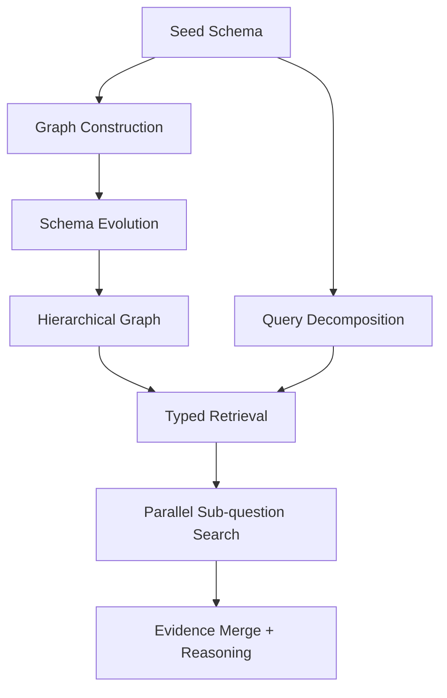

## Problem

Complex QA over private or domain-specific corpora often needs more structure than flat chunk retrieval, but naive GraphRAG systems still fail in predictable ways:

- **Retrieval is too broad:** entity, relation, keyword, and summary nodes all compete during search, so evidence gets noisy.
- **Question decomposition is disconnected from storage:** the planner breaks a query into sub-questions without knowing which entity types or relations actually exist in the graph.
- **Domain transfer is expensive:** each new corpus needs hand-tuned ontology work or brittle prompt rewrites.
- **Large graphs become hard to navigate:** even when the graph is correct, retrieval quality drops as the system lacks higher-level abstractions for routing.

The core issue is misalignment. Construction, retrieval, and reasoning each use different assumptions about the domain, so the graph accumulates structure that the retriever cannot reliably exploit.

## Solution

Treat the schema as the control surface for the entire GraphRAG pipeline, not just an extraction hint.

The same schema should guide:

1. **Graph construction:** define seed entity types, relations, and attributes that bound extraction.
2. **Schema evolution:** let the extraction stage propose high-confidence additions when new domains require new types.
3. **Hierarchical graph organization:** build higher-level keyword or community layers so retrieval can move across abstractions, not only raw triples.
4. **Query decomposition:** prompt an agent with the same schema to produce focused sub-questions plus the node, relation, and attribute types likely involved.
5. **Typed retrieval:** filter or bias retrieval toward those schema types before scoring and aggregating evidence.
6. **Parallel evidence gathering:** run the decomposed sub-questions concurrently, then merge triples and chunk evidence for final reasoning.

```text
schema = load_seed_schema()

graph = build_graph(
  documents,
  schema=schema,
  allow_schema_evolution=true
)

graph = add_keyword_and_community_layers(graph)

plan = decompose_question(
  question,
  schema=schema
)
# returns:
# {
#   sub_questions: [...],
#   involved_types: { nodes: [...], relations: [...], attributes: [...] }
# }

evidence = parallel_map(plan.sub_questions, sub_q =>
  retrieve(
    graph,
    query=sub_q,
    type_filter=plan.involved_types
  )
)

answer = reason_over(merge(evidence))
```



The distinctive move is not "use a graph" by itself. It is **reusing one schema across ingestion, planning, and retrieval** so the system can ask better sub-questions, search a narrower part of the graph, and adapt to new domains without redesigning the whole stack.

## Evidence

- **Evidence Grade:** `mixed`
- **Most Valuable Findings:** the repository contains concrete implementations of schema-guided decomposition, schema-type-aware retrieval, parallel sub-question execution, and schema evolution during extraction.
- **Most Valuable Findings:** the project reports better cost/accuracy trade-offs than its chosen baselines and presents the pattern as production-oriented for domain transfer.
- **Unverified / Unclear:** generality across domains, the exact contribution of each subsystem, and whether the reported gains hold outside the project's evaluation setup.

## How to use it

Use this pattern when:

- you need multi-hop reasoning over private or domain-specific knowledge;
- flat chunk retrieval produces too much irrelevant context;
- your domain has a stable enough ontology to define useful types up front;
- you want a GraphRAG system that can expand into adjacent domains without rebuilding everything.

Implementation guidance:

1. Start with a **small seed schema**. Define only the entity, relation, and attribute types that materially improve retrieval quality.
2. Store `schema_type` on extracted nodes and relations so the retriever can use it later.
3. Have the decomposer return both **sub-questions** and **involved schema types**. Without the second output, decomposition does not help retrieval much.
4. Apply typed filtering or typed ranking before global semantic search. This is where most of the precision gain comes from.
5. Add keyword/community layers only after the base graph works. They help large graphs, but they are not a substitute for good schema design.
6. Put strict thresholds around schema evolution. Otherwise the graph will drift into ontology sprawl.
7. Evaluate separately for:
   - retrieval precision/recall,
   - answer accuracy,
   - token cost,
   - latency added by decomposition and graph traversal.

## Trade-offs

**Pros:**

- Improves retrieval precision by narrowing search to relevant schema types.
- Makes multi-hop questions easier to answer through explicit sub-question planning.
- Creates a cleaner domain-transfer path than fully hand-crafted ontologies.
- Produces more interpretable reasoning traces than flat dense retrieval alone.
- Supports combining low-level evidence with higher-level community summaries.

**Cons:**

- Requires upfront schema design and ongoing governance.
- Bad schema choices can hide relevant evidence instead of improving search.
- Schema evolution can introduce noisy or overlapping types if left unchecked.
- More moving parts than simple vector search: extraction, graph maintenance, decomposition, typed retrieval, and aggregation.
- Parallel sub-question retrieval improves coverage but increases orchestration complexity and latency variance.

## References

- [Youtu-GraphRAG repository](https://github.com/TencentCloudADP/youtu-graphrag)
- [Youtu-GraphRAG paper entry on arXiv](https://arxiv.org/abs/2508.19855)
- Related: [Agentic Search Over Vector Embeddings](agentic-search-over-vector-embeddings.md)
- Related: [Agent-Driven Research](agent-driven-research.md)
