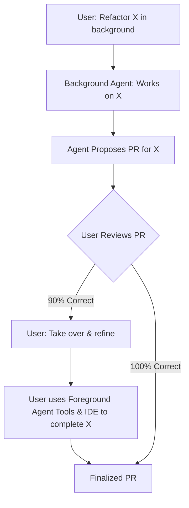

## Problem

While background agents can handle long-running, complex tasks autonomously, they might not achieve 100% correctness or perfectly match the user's nuanced intent. If an agent completes 90% of a task in the background but the remaining 10% requires human finesse, a clunky handoff process can negate the benefits of automation.

## Solution

Design the agent system to allow for a seamless transition from background (autonomous) agent work to foreground (human-in-the-loop or direct human control) work. This means:

1.  The background agent performs its task (e.g., generating a PR).
2.  The user reviews the agent's work.
3.  If the work is not entirely satisfactory (e.g., 90% correct), the user can easily "take control" or bring the task into their active foreground environment.
4.  The user can then utilize the same (or related) interactive AI tools and direct editing capabilities used in the foreground to refine, correct, or complete the remaining parts of the task.
5.  The context from the background agent's work should ideally be available to inform the foreground interaction.

**Core mechanisms for seamless handoff:**

- **Context preservation**: Background agents generate distilled summaries and artifacts (PRs, branches, decision logs) rather than transferring full conversation history, achieving 10:1 to 100:1 context compression.
- **Real-time progress visibility**: WebSocket streaming of agent progress enables users to identify optimal handoff moments and maintain trust during autonomous execution.
- **Artifact-based coordination**: Git-based workflows with branch-per-task and draft PRs provide durable handoff points that survive process boundaries.
- **Tool parity**: Background agents use the same tools as developers (IDE terminals, codebase annotations), ensuring workspace-native execution and eliminating context translation.

This pattern ensures that developers can leverage the power of autonomous background processing while retaining the ability to easily intervene and apply their expertise for the final touches, without losing context or efficiency.

## Example

## How to use it

- Use this when humans and agents share ownership of work across handoffs.
- Start with clear interaction contracts for approvals, overrides, and escalation.
- Capture user feedback in structured form so prompts and workflows can improve.

## Trade-offs

* **Pros:** Creates clearer human-agent handoffs and better operational trust; enables 90% automation while preserving 10% human expertise; better than pure autonomy when tasks require nuanced judgment.
* **Cons:** Needs explicit process design and coordination; context preservation at handoff boundaries adds implementation complexity; requires real-time progress visibility infrastructure.

## References

- Aman Sanger (Cursor) at 0:06:52: "...if it's only 90% of the way there, you want to go in and then take control and and do the rest of it. And then you want to use, you know, the features of Cursor in order to do that. So really being able to quickly move between the background and the foreground is really important."

- Primary source: https://www.youtube.com/watch?v=BGgsoIgbT_Y

- Allen, J. R., & Guinn, C. I. (2000). Mixed-Initiative Systems: A Survey and Framework. AI Magazine. (Foundational theory for control transfer)

- Zou, H. P., Huang, W.-C., Wu, Y., et al. (2025). A Survey on Large Language Model based Human-Agent Systems. arXiv:2505.00753 (Validates human-in-the-loop as primary paradigm over full autonomy)
