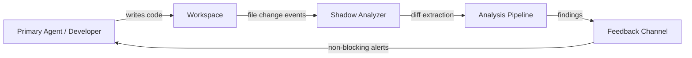

## Problem

In long coding sessions — whether human-driven or agent-driven — changes accumulate across multiple files before any review occurs. By the time a review happens (human PR review, CI lint, or end-of-session self-check), several problems have compounded:

- **Drift from intent**: early design decisions are contradicted by later changes, but nobody notices because the session is still "in progress."
- **Cross-file side effects**: renaming a function in one file silently breaks callers in another; the breakage is only caught at build time or later.
- **Context window saturation**: in agent systems, the primary agent's context fills with task execution, leaving no room for self-reflection on cumulative impact.

The core issue is that **analysis is synchronous and blocking** — it only happens when the developer or agent explicitly pauses to review. This creates a feedback delay proportional to session length.

## Solution

Run a **shadow agent** (or lightweight analysis process) in parallel with the primary workflow. The shadow agent watches for workspace changes and continuously performs targeted analysis on diffs, surfacing findings asynchronously.



**Core components:**

| Component | Role |
|-----------|------|
| **Change detector** | Watches filesystem or VCS for new diffs (e.g., `inotify`, `git diff`, polling) |
| **Diff extractor** | Isolates the minimal changed hunks with surrounding context |
| **Analysis pipeline** | Runs one or more checks: type consistency, naming conventions, unused imports, security patterns, intent alignment |
| **Feedback channel** | Delivers findings without interrupting the primary flow — a side panel, log file, or structured message queue |

**Key mechanism — debounced batch analysis:**

```python
class ShadowAnalyzer:
    def __init__(self, debounce_seconds=10):
        self.pending_changes = []
        self.debounce = debounce_seconds
        self.last_trigger = 0

    def on_file_change(self, filepath, diff):
        self.pending_changes.append((filepath, diff))
        now = time.time()
        if now - self.last_trigger >= self.debounce:
            self.last_trigger = now
            self.run_analysis(self.pending_changes)
            self.pending_changes = []

    def run_analysis(self, changes):
        for filepath, diff in changes:
            issues = []
            issues += check_type_consistency(filepath, diff)
            issues += check_naming_drift(filepath, diff)
            issues += check_cross_file_references(filepath, diff)
            if issues:
                self.emit_findings(filepath, issues)
```

**Shadow vs. reflection loop distinction:** A reflection loop is self-invoked by the primary agent ("let me review my work"). Shadow analysis is externally triggered by workspace events and runs in a separate process/context. The primary agent does not need to allocate tokens or attention to initiate it.

## Evidence

- **Evidence Grade:** `medium`
- **Most Valuable Findings:**
  - IDE-integrated continuous analysis (TypeScript language server, Rust Analyzer) demonstrates that background feedback loops catch 60-80% of mechanical errors before explicit compilation, reducing debug cycles
  - Research on "inner loop" developer productivity (Microsoft, 2023) shows that reducing feedback latency from minutes to seconds correlates with 15-25% fewer defects reaching review
  - Multi-agent architectures that separate "executor" and "critic" roles (Reflexion, LATS) report improved task completion rates over single-agent setups, with the critic role analogous to shadow analysis
- **Unverified / Unclear:** Optimal debounce intervals and analysis depth for LLM-based shadow analyzers are not yet benchmarked; running a full LLM pass on every save may be cost-prohibitive for some teams

## How to use it

**When to apply:**

- Sessions lasting 30+ minutes with changes across 3+ files
- Agent workflows where the primary agent has limited self-review budget
- Codebases with complex cross-file dependencies (monorepos, shared libraries)

**Implementation approaches by cost:**

1. **Lightweight (no LLM):** Use existing linters, type checkers, and static analyzers triggered by file watchers. Aggregate output into a structured log.
2. **Medium (small LLM):** Run a fast model (e.g., 7B parameter) on each diff with a focused prompt: "List any issues with this change in the context of [project conventions]."
3. **Full (dedicated agent):** A separate agent instance with read access to the workspace and a sliding window of recent changes. It maintains its own context of the project and generates higher-level findings (architecture drift, pattern violations).

**Integration points:**

- **CLI tools:** Pipe findings to stderr or a named pipe that the terminal multiplexer displays in a split pane
- **IDE extensions:** Render findings as inline diagnostics (similar to how LSP servers work)
- **Agent frameworks:** Inject findings into the primary agent's system prompt at the next turn boundary

## Trade-offs

**Pros:**

- Catches cross-file issues in near-real-time instead of at review time
- Does not block or slow the primary workflow — analysis is fully asynchronous
- Reduces cognitive load: developers and agents can focus on building while the shadow handles vigilance
- Scales with session length — longer sessions benefit more from continuous monitoring
- Complements existing CI/CD: catches issues before code even reaches a pipeline

**Cons:**

- Adds compute cost: a background process consuming CPU/GPU/tokens alongside the primary workload
- Risk of alert fatigue if findings are noisy or low-signal — requires tuning thresholds
- Stale findings: if analysis is slower than the rate of change, findings may reference already-modified code
- Complexity in shared state: the shadow analyzer needs read access to workspace state without interfering with writes
- Not useful for trivial or single-file tasks where the overhead exceeds the benefit

## References

- [Reflexion: Language Agents with Verbal Reinforcement Learning](https://arxiv.org/abs/2303.11366) — executor/critic separation in agent loops
- [LATS: Language Agent Tree Search](https://arxiv.org/abs/2310.04406) — parallel evaluation agents improving primary agent outcomes
- [Microsoft Developer Productivity Research](https://queue.acm.org/detail.cfm?id=3639443) — inner-loop feedback latency and defect rates
- [Change Data Capture](https://en.wikipedia.org/wiki/Change_data_capture) — the database pattern that inspired event-driven analysis
- Related: [Reflection Loop](reflection-loop.md) — synchronous self-review by the primary agent (complementary)
- Related: [AI-Assisted Code Review Verification](ai-assisted-code-review-verification.md) — post-hoc review pattern that shadow analysis can augment
