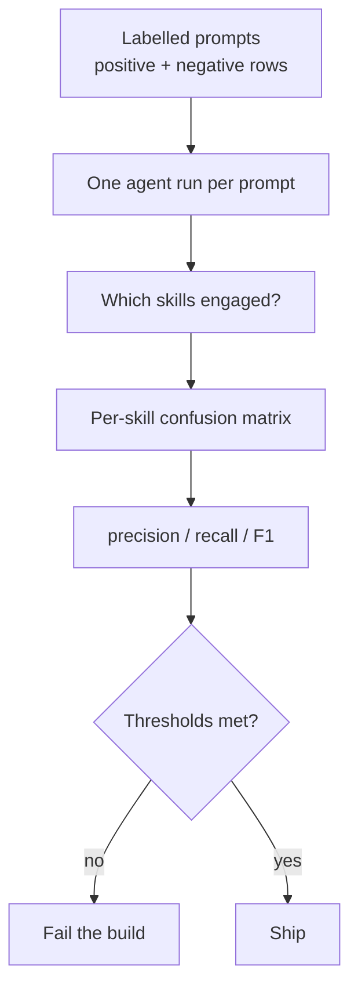

## Problem

A skill is usually tested as if it were a function: run it, check the output. But before a skill runs, the model must *choose* it. It reads your skill's description alongside every other skill's description and picks one. That choice is a routing decision, and it is what actually fails in production.

It fails in two directions, and both are silent:

- **Under-triggering (a recall problem).** The skill never loads. Users experience this as "your feature does not work," and blame the feature.
- **Over-triggering (a precision problem).** The skill loads on prompts it does not own. It hijacks a conversation, injects its playbook into an unrelated context, burns tokens on reference files nobody needed, and produces confidently wrong output because the agent is now steering toward the wrong goal.

The two are not symmetric in *detectability*. Under-triggering gets reported by users; over-triggering gets absorbed, because the output still looks like an answer. So the more damaging failure is the one you are less likely to hear about.

Worse, the decision is **coupled across the whole catalog**. Adding a skill, editing one sentence of a description, or merging two skills re-routes prompts that belong to skills you did not touch. Hand-testing five prompts once and shipping cannot see this, and nothing in a typical CI pipeline does either — descriptions are prose, so no linter, typechecker, or unit test has an opinion about them.

## Solution

Treat activation as what it is — a **classification problem** — and measure it with the standard instrument: a labelled dataset, per-skill precision/recall/F1, a confusion view, and thresholds that fail the build.

**1. Label a dataset, not a checklist.** One row per prompt, tagged with the set of skills that *should* engage. Use an empty set when none should engage; include all legitimate skills for a multi-skill task:

```jsonl
{"id": "flow-001", "prompt": "Convert checkout to a .flow process", "expected_skills": ["acme-flow"]}
{"id": "ins-014", "prompt": "Why is my Insights dashboard empty?",  "expected_skills": ["acme-insights"]}
{"id": "neg-007", "prompt": "Set up Acme Insights and connect it to our warehouse", "expected_skills": []}
```

**2. Include the negative region — it is most of real traffic.** A positive-only dataset can still catch *cross-skill interference* (skill B firing on a row labelled for skill A is a real false positive). What it cannot see is the much larger space where **no** skill should fire. Those rows carry an empty expected set.

**3. Evaluate every row against every skill.** This is the step that makes the measurement whole. Do not ask "did skill A fire on its own rows?" — ask, for each of the N skills, what happened on all M rows. One agent trace per row, N verdicts from it:

```pseudo
for row in dataset:                      # M prompts
    trace = run_agent(row.prompt)        # one trace, reused N times
    for skill in catalog:                # N skills
        fired    = skill_engaged(trace, skill)     # tool call, or skill-file read
        expected = (skill in row.expected_skills)
        confusion[skill][expected][fired] += 1
```

**4. Detect engagement harness-agnostically.** Whichever way your agent records it — a native skill-invocation event, or the agent reading the skill's files off disk — normalize both to one boolean so the same dataset scores across harnesses.

**5. Gate CI on the aggregate, not on individual rows.** Individual rows are non-deterministic; the per-skill aggregate over a few hundred rows is stable enough to threshold:

```yaml
success_criteria:
  - type: skill_triggered
    skill: acme-flow
    suite_thresholds: { recall: 0.70, precision: 0.90 }
```

Precision thresholds should usually be stricter than recall thresholds, because a false positive damages every interaction that brushes the trigger surface while a false negative degrades one skill.



## Evidence

- **Evidence Grade:** `medium` — one large internal suite plus several public catalogs measured; the technique is young and adoption is early.
- **Most Valuable Findings:**
  - **Routine edits move activation a lot.** On a catalog of ~20 skills with ~1,000 labelled prompts, adding *one sentence* to each skill description moved micro-recall from **46.3% to 67.3%**, and took the number of skills clearing 70% recall from **4 to 11**. A change that large under a routine edit cannot be verified by hand once and then trusted.
  - **Broad "router" descriptions absorb their own specialists.** In a 19-row pilot against a public vendor catalog, a router skill whose description claimed the capabilities of four specialists fired on its own 2 prompts *and* on 3 belonging to specialists — precision **0.40**. Every specialist that did fire, fired correctly (precision 1.00); every failure was recall. In 2 of the 3 absorbed rows the agent loaded the router and then reached for a *web fetch* instead of the local specialist — it absorbed the prompt and failed to route.
  - **Collisions are findable statically, before any run.** In the catalog above, the router's description claimed a *superset* of four specialists' own trigger lists, and one trigger phrase appeared verbatim in two different skills' descriptions — both readable off the frontmatter with no model calls. A static overlap scan is the cheap first pass, and it predicted the routing failures the run then measured.
- **Unverified / Unclear:** how few rows suffice (≈50 shows signal; the stability floor is unmeasured); how much of the measurement transfers across model versions; whether precision or recall thresholds should dominate in a safety-critical catalog, where a missed diagnostic skill may outweigh a spurious one.

## How to use it

**Start here, in this order:**

1. **Static scan first (free).** Diff every pair of skill descriptions for shared trigger phrases and shared nouns. Overlap here predicts collisions and costs nothing to find.
2. **Fifty rows, one skill pair.** Take the two skills you most suspect of competing. ~25 prompts each plus ~10 negatives will already show you a confusion matrix worth reading.
3. **Add the negative set.** Sample prompts from real traffic that no skill should own. This is where over-triggering becomes visible.
4. **Widen to the catalog, then threshold.** Once per-skill numbers are stable run to run, set thresholds slightly below current values and put them in CI, so the next description edit has to clear the bar it inherited.

**Prerequisites:** an agent runner that records which skills engaged; a sandbox, so rows cannot contaminate each other; and labels you trust. Labelling is the real cost — budget more time for deciding what each prompt *should* route to than for running the suite.

**Practical notes:**

- **State your labelling convention for out-of-scope prompts**, and score them as their own group. A domain-agnostic question answered with zero tool calls is defensible behaviour, not a failure, and it will otherwise pollute your precision figure.
- **Give the agent enough turns.** A too-tight turn budget reads as a non-activation.
- **Give codebase-shaped prompts a codebase.** A prompt like "review the query patterns here" against an empty sandbox measures your fixture, not your routing.
- **Replicate.** Two or three replicates per row separate a genuine routing failure from ordinary sampling noise.

## Trade-offs

**Pros:**

- Makes the **silent** failure mode visible, and the invisible one (over-triggering) measurable at all.
- Catches **catalog-wide coupling**: the suite scores every skill on every row, so an edit to one description cannot quietly re-route another skill's prompts.
- Produces a **threshold that can gate CI**, unlike a per-row assertion on a non-deterministic decision.
- The same labelled dataset **scores across harnesses**, so it doubles as a harness comparison.
- Directs the fix at the right artifact: descriptions, which are cheap to edit.

**Cons:**

- **Labelling is real work**, and disagreements about what a prompt "should" route to are common and legitimate.
- **Costs model calls.** One run per row, times replicates — the pilot above ran ~$0.06/row on a small model. Cheap per row, not free per catalog.
- **Non-deterministic**, so only the aggregate is trustworthy; a single flipped row means nothing.
- **Version-bound.** Numbers move with the model, so a threshold is a regression guard, not an absolute quality score.
- **Quadratic-ish reporting.** N skills × M rows produces a lot of cells; it needs a confusion view to be readable.
- **Measures selection, not usefulness.** A skill can route perfectly and still give bad advice. This pattern is upstream of output quality, not a substitute for it.

## References

- [Does your Claude Code skill actually trigger?](https://coder-eval.com/blog/does-your-claude-skill-trigger/) — the four-cell framing and the 46.3% → 67.3% case study.
- [neondatabase/agent-skills#76](https://github.com/neondatabase/agent-skills/issues/76) — the 19-row pilot above, reported publicly against a live catalog, including the rows that were excluded and why.
- [mongodb/agent-skills](https://github.com/mongodb/agent-skills) — independent adoption of the idea: [`testing/skills-boundaries/`](https://github.com/mongodb/agent-skills/tree/main/testing/skills-boundaries) holds pairwise skill-**selection** cases (3 pairs at the time of writing), alongside a `qa-eval` workflow.
- [Coder Eval](https://github.com/UiPath/coder_eval) — maintained by this pattern’s author; one open-source implementation (`skill_triggered` criterion, labelled datasets, suite thresholds).
- Related: [Workflow Evals with Mocked Tools](workflow-evals-with-mocked-tools.md) — the same instrument applied one layer down, to tool calls within a workflow.
- Related: [Anti-Reward-Hacking Grader Design](anti-reward-hacking-grader-design.md) — on keeping the grader honest once a threshold gates the build.
