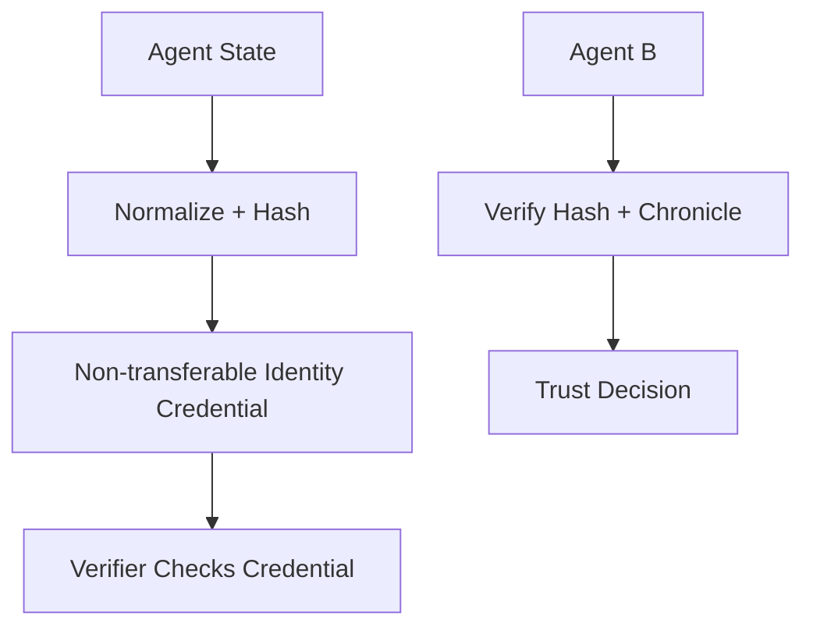

## Problem

As autonomous agents interact across networks, verifying identity and detecting prompt/operator drift becomes difficult. Without durable identity and an immutable change history, agents can impersonate others or silently diverge from authorized configurations.

## Solution

Bind agent identity and mutable metadata to a non-transferable credential and record identity-bearing state transitions in a tamper-resistant log.

**Pattern flow:**

1. Compute a stable hash of the normalized system prompt/state and commit it at registration.
2. Issue a non-transferable identity credential (for example an SBT-style token).
3. Record meaningful changes (prompt updates, operator changes, policy updates) as signed events.
4. Require verifiers to check both credential validity and state continuity before trusting outputs.

## Evidence

- **Evidence Grade:** `medium`
- **Most Valuable Findings:** Non-transferable credentials prevent credential theft and impersonation; hash-based state commitments enable verifiable continuity checks without requiring identity disclosure.
- **Unverified / Unclear:** Long-term operational costs and scalability across large agent fleets require further production validation.

## When to use

- Before delegating work to another agent.
- In agent marketplaces or multi-org delegations.
- For compliance workflows requiring auditable agent-state continuity.

## Trade-offs

- **Pros:** Non-transferability prevents credential delegation and theft; tamper-resistant logging provides auditable state history; enables verification without identity disclosure.
- **Cons:** Requires external registry and append-only log infrastructure; hash commitments verify state integrity but not semantic correctness; operational overhead for issuing/rotating credentials.

## Known Implementations

- [Chitin](https://chitin.id)
- [Chitin MCP Server](https://www.npmjs.com/package/chitin-mcp-server)
- [Chitin Contracts](https://github.com/chitin-id/chitin-contracts)

## How to use it

- Use this when tool access, data exposure, or action authority must be tightly controlled.
- Start with deny-by-default policy and minimal required privileges.
- Continuously audit logs for attempted policy bypass and anomalous behavior.

## References

- ERC-5192: Non-Transferable Tokens (Soulbound Tokens) - https://eips.ethereum.org/EIPS/eip-5192
- Vitalik Buterin on Soulbound Items - https://vitalik.ca/general/2022/01/26/soulbound.html
