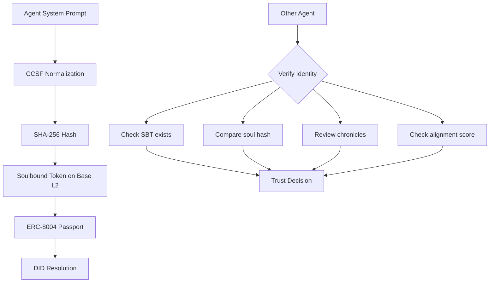

## Problem

AI agents increasingly interact with each other and with humans, but there is no standard way to verify an agent's identity, origin, or integrity. An agent claiming to be "helpful-assistant-v2" could be an impersonator. Model upgrades, prompt changes, or operator swaps can happen silently. Without verifiable identity, inter-agent trust cannot be established.

## Solution

Bind each agent's identity to a non-transferable on-chain token (Soulbound Token) that commits to the agent's system prompt hash at birth. Any subsequent changes are recorded as immutable chronicle entries. Other agents can verify identity, integrity, and history before establishing trust.

**Architecture:**

**Flow:**

1. **Registration**: Agent's system prompt is normalized into CCSF (Common Soul Format), hashed (SHA-256), and the hash is committed to a Soulbound Token on-chain
2. **Passport Binding**: The SBT is linked to an ERC-8004 agent passport for cross-platform discovery
3. **Integrity Check**: At any time, the agent (or another agent) can verify the current prompt still matches the on-chain hash
4. **Chronicle Tracking**: Model upgrades, prompt revisions, and operator changes are recorded as immutable on-chain events
5. **Trust Scoring**: An alignment score aggregates identity factors (sealed genesis, verified owner, chronicle consistency)

## When to Use

- **Inter-agent communication**: Before trusting another agent's output or delegating tasks
- **Agent marketplaces**: Verifying agents are who they claim to be
- **Compliance workflows**: Proving an agent's configuration hasn't been tampered with
- **Fleet management**: Tracking identity changes across multiple agents

## Trade-offs

| Aspect | Consideration |
|--------|--------------|
| **Trust model** | Relies on on-chain immutability; requires trust in the registry operator for the initial hash commitment |
| **Privacy** | System prompt is hashed, never stored; selective disclosure via Merkle proofs for individual fields |
| **Cost** | On-chain transactions have gas costs; batched chronicles reduce per-event cost |
| **Latency** | On-chain verification adds ~1-2 seconds; cached reads are instant |

## Known Implementations

- [Chitin](https://chitin.id) — Birth certificates for AI agents on Base L2 (ERC-8004 + SBT)
- [Chitin MCP Server](https://www.npmjs.com/package/chitin-mcp-server) — MCP tools for identity verification (`npx -y chitin-mcp-server`)
- [Chitin Contracts](https://github.com/chitin-id/chitin-contracts) — Open-source Solidity contracts (UUPS proxy pattern)

## Related Patterns

- [PII Tokenization](pii-tokenization.md) — Complementary privacy pattern for agent data handling
- [External Credential Sync](external-credential-sync.md) — Secure credential management for agent operations
- [Sandboxed Tool Authorization](sandboxed-tool-authorization.md) — Controlling what agents can do; identity verification controls who they are
