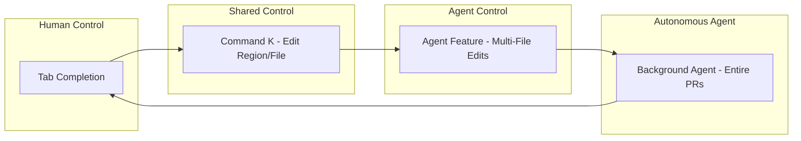

## Problem

AI agents for tasks like coding can offer various levels of assistance, from simple completions to complex, multi-step operations. A one-size-fits-all approach to agent autonomy doesn't cater to the diverse needs of users or the varying complexity of tasks. Users need to fluidly shift between direct control and delegating tasks to the agent.

## Solution

Design the human-agent interaction to support a spectrum of control, allowing users to choose the level of agent autonomy appropriate for the current task or their familiarity with the codebase. This involves providing multiple modes or features for interaction:

-   **Low Autonomy (High Human Control):** Simple, inline assistance like tab-completion for code, where the human is primarily driving and the AI augments their input.
-   **Medium Autonomy:** Agent assistance for more contained tasks, like editing a selected region of code or an entire file based on a specific instruction (e.g., "Command K" functionality). The human defines the scope and the high-level goal.
-   **High Autonomy:** Agent takes on larger, multi-file tasks or complex refactorings, potentially involving multiple steps, with less direct human guidance on each step (e.g., an "Agent" feature).
-   **Very High Autonomy (Asynchronous):** Background agents that can take on entire complex tasks like implementing a feature or fixing a set of bugs and creating a pull request, operating largely independently.

Users can seamlessly switch between these modes depending on their needs, allowing for a "blended initiative" where both human and AI contribute effectively.

## Evidence

- **Evidence Grade:** `high`
- **Most Valuable Find:** Concept has strong academic foundations dating to Sheridan-Verplank (1978) establishing Levels of Automation (LOA); Parasuraman et al. (2000) provided widely-cited 4-stage model; universal adoption across major AI coding tools with similar 4-5 level spectrums
- **Unverified:** Longitudinal studies on optimal control level selection heuristics

## Example

```mermaid
flowchart LR
    subgraph "Human Control"
        A[Tab Completion]
    end
    subgraph "Shared Control"
        B[Command K - Edit Region/File]
    end
    subgraph "Agent Control"
        C[Agent Feature - Multi-File Edits]
    end
    subgraph "Autonomous Agent"
        D[Background Agent - Entire PRs]
    end

    A --> B
    B --> C
    C --> D
    D --> A
```

## How to use it

- Use this when humans and agents share ownership of work across handoffs.
- Start with clear interaction contracts for approvals, overrides, and escalation.
- Capture user feedback in structured form so prompts and workflows can improve.
- Implement mode-switching controls (keyboard shortcuts, UI toggles) for explicit autonomy level selection.
- Pair with human-in-the-loop approval at higher autonomy levels for high-risk operations.

## Trade-offs

- **Pros:** Creates clearer human-agent handoffs, builds trust through progressive autonomy, enables error containment at lower levels, allows context-appropriate control selection
- **Cons:** Multiple modes can confuse users if not clearly presented, requires building/maintaining several interaction paths, users may struggle to choose appropriate autonomy level

## References

- Aman Sanger (Cursor) extensively discusses this spectrum at 0:05:16-0:06:44, detailing different features like tab completion, Command K, Agent for multi-file edits, and Background Agent for entire PRs, describing it as "almost a spectrum."
- Sheridan, T. B., & Verplank, W. L. (1978). Human and Computer Control of Undersea Teleoperators. https://doi.org/10.1109/THMS.1978.4309360
- Parasuraman, R., et al. (2000). A Model for Types and Levels of Human Interaction with Automation. https://doi.org/10.1109/3477.866864
- Horvitz, J. (1999). Principles of mixed-initiative user interfaces. CHI '99. https://doi.org/10.1145/303426.303426

- Primary source: https://www.youtube.com/watch?v=BGgsoIgbT_Y
