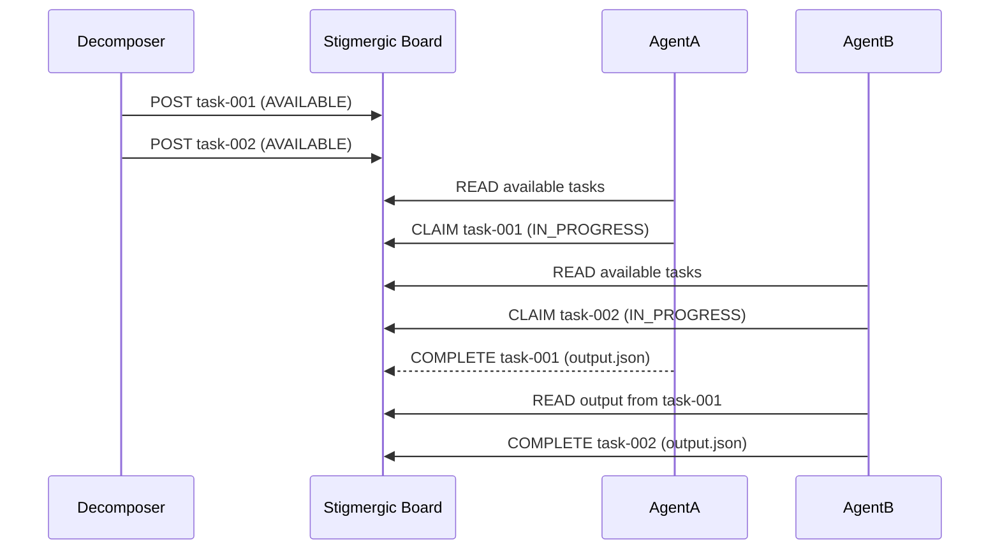

## Problem

Traditional multi-agent orchestration relies on a central coordinator that assigns tasks, tracks progress, and resolves conflicts. This creates:

- **Orchestrator bottleneck**: one agent decides everything — when it stalls, the whole pipeline stalls
- **No resilience**: coordinator crash = system failure
- **Wasted capacity**: idle agents wait for the coordinator to notice them
- **Hard to scale**: adding more agents increases coordinator complexity super-linearly

## Solution

**Stigmergic coordination** — agents self-organize by reading and writing to a shared marker board. No central scheduler needed. Agents check the board, claim available tasks, mark their progress, and post results. Other agents see these markers and adjust their behavior accordingly.

### How It Works

1. **Task decomposition**: the initial request is decomposed into sub-tasks, each posted as a stigmergic marker on a shared board
2. **Self-assignment**: agents periodically scan the board for AVAILABLE tasks matching their skills
3. **Claim & work**: an agent marks a task as IN_PROGRESS (with ETA), works on it, then marks COMPLETE
4. **Dependency resolution**: if a task blocks on another's output, the agent checks the board for the prerequisite COMPLETE marker
5. **Conflict resolution**: if two agents claim the same task, the first to mark IN_PROGRESS wins — others back off

```pseudo
# Stigmergic marker board protocol
/swarm/board/
├── AVAILABLE/{task-id}.json    # tasks ready for pickup
├── IN_PROGRESS/{task-id}.json  # claimed tasks (agent_id, eta)
├── COMPLETE/{task-id}.json     # finished tasks (output_ref)
├── CONFLICT/{task-id}.json     # CHP disagreements needing resolution
└── AUDIT/{run-id}.json         # full run audit trail
```



## When to Use

| Use Case | Why Stigmergy Wins |
|----------|-------------------|
| Long-running research tasks | Agents work in parallel without waiting for coordinator |
| Competitive analysis | Multiple agents explore different angles simultaneously |
| Code migration across modules | Each agent picks files independently |
| Monitoring/alert systems | Independent agents self-assign alert categories |
| Document review | Agents grab sections as they become available |

## Key Insights

- **Stigmergy beats central scheduling at >3 agents**: the orchestration overhead of a central coordinator grows O(n²). Stigmergy grows O(1) as agents only interact with the board
- **Crash resilience > perfect scheduling**: if Agent A crashes mid-task, Agent B can pick it up after a timeout. A central coordinator would need to detect the crash AND re-route — which is itself a single point of failure
- **Combine with adversarial consensus (CHP)**: stigmergy handles coordination; CHP handles quality. They're complementary

## Related Patterns

- [Swarm Migration Pattern](./swarm-migration-pattern.md) — map-reduce swarm for parallel code migration
- [Cross-Cycle Consensus Relay](./cross-cycle-consensus-relay.md) — structured state handoff between cycles
- [Cryptographic Governance Audit Trail](./cryptographic-governance-audit-trail.md) — audit integrity
