## Problem
Large multi-file tasks blow out the main agent's context window and reasoning budget.

## Solution
Let the main agent **spawn focused sub-agents**, each with its own fresh context, to work in parallel on shardable subtasks. Aggregate their results when done.

Recent developments show that improved agent [state externalization capabilities](proactive-agent-state-externalization.md) may make subagent delegation more practical by helping agents better identify which tasks are suitable for delegation and how to communicate necessary context to subagents.

## Example (YAML front-matter refactor)

```mermaid
sequenceDiagram
  MainAgent->>GlobTool: "*.md"
  MainAgent->>TaskTool: spawn 4 sub-agents with 9 files each
  loop per SubAgent
      SubAgent->>Files: update front-matter
      SubAgent->>Git: commit
  end
  MainAgent->>Git: merge branches ➜ single PR
```

## Advanced usage: Swarm migrations

For massive parallelization (10+ subagents), see the **Swarm Migration Pattern** which extends this concept for large-scale code migrations.

**High-volume use case at Anthropic:**

Users spending $1000+/month on Claude Code are typically running swarm migrations:

- Main agent creates comprehensive todo list
- Spawns 10+ parallel subagents
- Each handles batch of migration targets (e.g., 10 files)
- Common for framework migrations, lint rule rollouts, API updates
- Achieves 10x+ speedup vs. sequential execution

**Quote from Boris Cherny (Anthropic):**

> "There's an increasing number of people internally at Anthropic using a lot of credits every month. Spending over a thousand bucks. The common use case is code migration... The main agent makes a big to-do list for everything and map reduces over a bunch of subagents. You instruct Claude like start 10 agents and then just go 10 at a time and just migrate all the stuff over."

## References

* Raising An Agent - Episode 6: Claude 4 Sonnet edits 36 blog posts via four sub-agents.
* Boris Cherny (Anthropic) on swarm migrations for framework changes and lint rules
* [AI & I Podcast: How to Use Claude Code Like the People Who Built It](https://every.to/podcast/transcript-how-to-use-claude-code-like-the-people-who-built-it)
* [Cognition AI: Devin & Claude Sonnet 4.5](https://cognition.ai/blog/devin-sonnet-4-5-lessons-and-challenges) - discusses how improved model judgment about state externalization may make subagent delegation more practical

[Source](https://www.nibzard.com/ampcode)