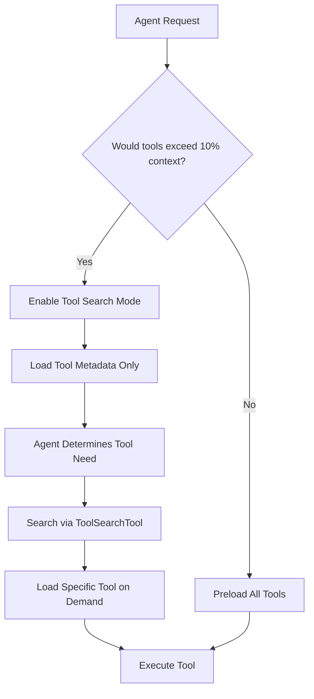

## Problem

As the Model Context Protocol (MCP) has grown, MCP servers may expose 50+ tools that consume significant context space. Documented setups with 7+ servers have been documented consuming 67k+ tokens just for tool descriptions. This creates a fundamental scalability issue:

* **Context bloat**: Preloading all tool descriptions consumes tokens that could be used for the actual task
* **Latency**: More tools means more processing overhead on every request
* **Discovery challenges**: Agents must scan through many irrelevant tools to find relevant ones
* **Memory pressure**: Large tool catalogs can exceed practical context limits

## Solution

Implement Tool Search: a lazy-loading mechanism where tools are dynamically loaded into context via search only when needed, rather than preloaded on initialization.

The pattern works by:

1. **Threshold detection**: Monitor when tool descriptions would exceed a context threshold (e.g., 10% of context window)
2. **Search interface**: Provide a ToolSearchTool that allows agents to search tool metadata and selectively load tools
3. **Server instructions**: Leverage MCP server instruction fields to guide the agent on when to search for specific tools
4. **Agentic search**: Use intelligent search rather than basic RAG to find relevant tools



**Implementation approach:**

```pseudo
function initialize_mcp_servers(servers) {
    total_tool_tokens = calculate_tool_tokens(servers)

    if (total_tool_tokens > CONTEXT_THRESHOLD) {
        // Lazy loading mode
        tool_registry = load_tool_metadata_only(servers)
        return ToolSearchTool(tool_registry)
    } else {
        // Traditional preload mode
        return preload_all_tools(servers)
    }
}

function tool_search(query: string, tool_registry) {
    // Agentic search - not basic RAG
    relevant_tools = agentically_search(tool_registry, query)
    return load_tool_definitions(relevant_tools)
}
```

## How to use it

**For MCP server creators:**

* **Enhance server instructions**: The "server instructions" field becomes more critical with tool search enabled. It helps the agent know when to search for your tools.
* **Descriptive metadata**: Include rich descriptions and tags to improve searchability
* **Logical grouping**: Organize related tools to make discovery more intuitive

**For MCP client creators:**

* **Implement ToolSearchTool**: Provide a search interface for tool discovery
* **Use agentic search**: Implement intelligent search rather than basic vector RAG
* **Set appropriate thresholds**: Choose context thresholds based on your use case (Claude Code uses 10%)
* **Provide opt-out**: Allow users to disable search if they prefer preloading

**Usage scenarios:**

* Development environments with many specialized tools (file operations, git, database access, API clients)
* Multi-server setups where each server provides domain-specific capabilities
* Agents that only need a subset of available tools for any given task

## Trade-offs

* **Pros:**
  * Dramatically reduces baseline context usage (67k+ tokens to just metadata)
  * Enables scaling to 100+ tools without context issues
  * Faster cold-start times when tools aren't needed
  * Better tool discovery through intentional search
  * Allows more MCP servers to be enabled simultaneously

* **Cons:**
  * Adds latency when tools need to be dynamically loaded
  * Requires search infrastructure and metadata management
  * May miss serendipitous tool discovery that happens when browsing full catalogs
  * Server instructions become more critical and require careful authoring
  * Additional complexity in client implementation

## References

* [Original announcement tweet](https://x.com/trq212/status/2011523109871108570) by Thariq (@trq212)
* [MCP Documentation](https://modelcontextprotocol.io/) for implementation details
* GitHub issue references on lazy loading for MCP servers

## Variations

**Toggle-based forcing**: Allow users to force enable tool search even under the 10% threshold, for consistency or testing purposes.

**Caching strategies**: Implement LRU caching for recently used tools to minimize reload overhead.

**Progressive loading**: Load commonly-used tools upfront while keeping long-tail tools in search-only mode.

**Programmatic composition**: Future direction allowing tools to be composed with each other via code (experimented with but deferred for tool search priority).

## Pitfalls

* **Poor server instructions**: Without clear guidance on when to search, agents may miss relevant tools
* **Inadequate search**: Basic RAG may not capture tool capabilities effectively; agentic search is preferred
* **Metadata neglect**: Failing to maintain rich, searchable tool descriptions defeats the purpose
* **Threshold tuning**: Setting the context threshold too low or too high can negate benefits or create unnecessary overhead
