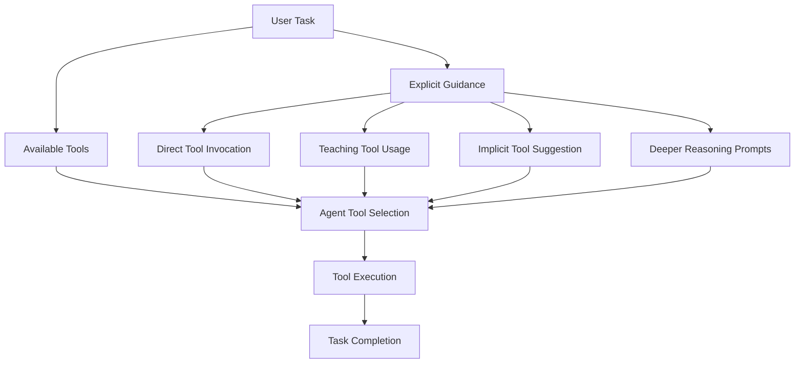

## Problem
AI agents equipped with multiple tools (e.g., shell access, file system operations, web search, custom CLIs) need clear guidance on when, why, and how to use these tools effectively. Simply having tools available doesn't guarantee they will be used appropriately for the task at hand, especially for tools unfamiliar to the base model or specific to a team's workflow.

## Solution
Guide the agent's tool selection and execution through explicit natural language instructions within the prompt. This includes:

-   **Direct Tool Invocation:** Telling the agent which tool to use for a specific part of a task (e.g., "Use the file search tool to find...", "Run a bash command to...").
-   **Teaching Tool Usage:** Instructing the agent on how to learn about or use a new or custom tool, including how to discover its options (e.g., "Use our `barley` CLI to check logs. You can use `-h` to see how to use it.").
-   **Implicit Tool Suggestion:** Using phrases or shorthands that the agent learns to associate with specific tool sequences (e.g., "commit, push, pr" for a Git workflow).
-   **Encouraging Deeper Reasoning for Tool Use:** Adding phrases like "*think hard*" to prompt more careful consideration before acting, potentially leading to better tool choices or sequences.

This pattern emphasizes the user's role in actively shaping the agent's behavior with respect to its available tools, rather than relying solely on autonomous tool selection.

## Example (tool guidance flow)

## References
- Based on examples and tips in "Mastering Claude Code: Boris Cherny's Guide & Cheatsheet," section III, particularly "Steering Claude to Use Tools" and "Tip #3: Teach Claude to use *your* team's tools."

[Source](https://www.nibzard.com/claude-code)