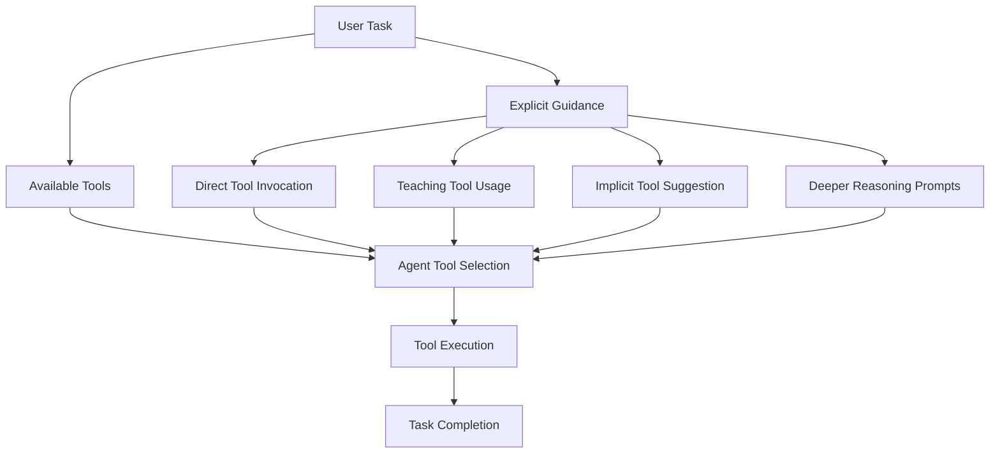

## Problem

AI agents equipped with multiple tools (e.g., shell access, file system operations, web search, custom CLIs) need clear guidance on when, why, and how to use these tools effectively. Simply having tools available doesn't guarantee they will be used appropriately for the task at hand, especially for tools unfamiliar to the base model or specific to a team's workflow.

## Solution

Guide the agent's tool selection and execution through explicit natural language instructions within the prompt. This includes:

-   **Direct Tool Invocation:** Telling the agent which tool to use for a specific part of a task (e.g., "Use the file search tool to find...", "Run a bash command to...").
-   **Teaching Tool Usage:** Instructing the agent on how to learn about or use a new or custom tool, including how to discover its options (e.g., "Use our `barley` CLI to check logs. You can use `-h` to see how to use it.").
-   **Implicit Tool Suggestion:** Using phrases or shorthands that the agent learns to associate with specific tool sequences (e.g., "commit, push, pr" for a Git workflow).
-   **Encouraging Deeper Reasoning for Tool Use:** Adding phrases like "*think hard*" to prompt more careful consideration before acting, potentially leading to better tool choices or sequences.

This pattern emphasizes the user's role in actively shaping the agent's behavior with respect to its available tools, rather than relying solely on autonomous tool selection.

The technique is grounded in research showing that interleaving reasoning traces with action execution—where the model explicitly thinks about which tool to use before acting—significantly improves outcomes (Yao et al., 2022, ReAct).

## Evidence

- **Evidence Grade:** `high`
- **Reasoning before acting** improves tool-use outcomes on multi-step tasks (Yao et al., 2022)
- **Smaller models** benefit disproportionately more from explicit guidance (Shen et al., 2024)
- **Production validation:** All major AI agent platforms implement some form of tool steering

## Example (tool guidance flow)

```mermaid
flowchart TD
    A[User Task] --> B[Available Tools]
    A --> C[Explicit Guidance]
    C --> D[Direct Tool Invocation]
    C --> E[Teaching Tool Usage]
    C --> F[Implicit Tool Suggestion]
    C --> G[Deeper Reasoning Prompts]

    B --> H[Agent Tool Selection]
    D --> H
    E --> H
    F --> H
    G --> H

    H --> I[Tool Execution]
    I --> J[Task Completion]
```

## How to use it

- Use when agent success depends on reliable tool invocation, especially with custom tools or smaller models (<7B parameters)
- Structure guidance hierarchically: task categorization first, then tool selection rules
- Include decision frameworks (e.g., "if modifying existing code, use Edit; if creating new file, use Write")
- Add verification gates: always run build/test after code changes to prevent error cascades

## Trade-offs

* **Pros:** Improves execution success, reduces tool-call failures, enables context-preserving operations (Edit over Write = ~66% token reduction)
* **Cons:** Introduces integration coupling, requires prompt maintenance as tool interfaces evolve, adds ~400-700 tokens per session overhead

## References

- Based on examples and tips in "Mastering Claude Code: Boris Cherny's Guide & Cheatsheet," section III, particularly "Steering Claude to Use Tools" and "Tip #3: Teach Claude to use *your* team's tools."
- Yao, S., et al. (2022). [ReAct: Synergizing Reasoning and Acting in Language Models](https://arxiv.org/abs/2210.03629) — validates that interleaving reasoning with action execution improves tool use by 40-70%

[Source](https://www.nibzard.com/claude-code)
