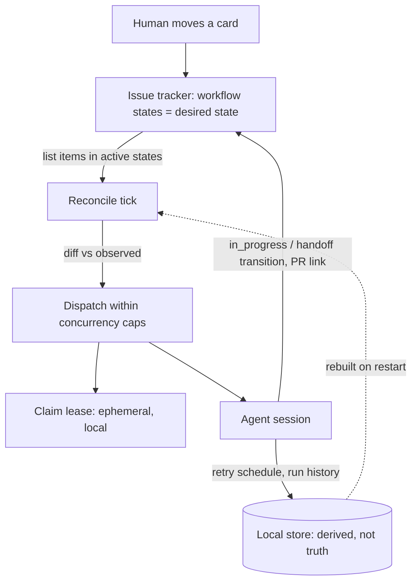

## Problem

An orchestrator that dispatches long-running agents needs to answer two questions continuously: *what work exists*, and *is it still wanted*. Two common answers both fail in production.

**Edge-triggered dispatch.** A webhook or event fires and an agent starts. If the delivery is lost — receiver redeploy, outage, rate limit, a paused queue — the work silently never happens. Nothing is wrong anywhere; there is simply no record that anything should have occurred. Replaying the event stream is not a fix, because a second `issue.assigned` delivery starts a second agent.

**A private queue inside the orchestrator.** Now there are two systems of record. The board says `In Review`; the orchestrator's table says `running`. They drift, and the drift is invisible until someone asks why an agent is still burning tokens on a ticket that was closed yesterday. Worse, the human's natural control gesture — dragging a card — does nothing, so cancellation needs a second control surface that the team does not have open.

Both failures share a root cause: dispatch is derived from *events about* the work rather than from *the state of* the work. That also leaves crash recovery as bespoke resume logic, and leaves the audit trail in agent logs no one reads instead of on the ticket everyone reads.

## Solution

Treat the tracker the team already operates as the **desired-state store**, and make the orchestrator a **level-triggered reconciler** over it. The orchestrator stops being a queue owner and becomes a controller that repeatedly asks "what should be running?" and closes the gap.

This transplants a control-plane principle stated in the Kubernetes architecture design proposals:

> "Functionality must be *level-based*, meaning the system must operate correctly given the desired state and the current/observed state, regardless of how many intermediate state updates may have been missed. Edge-triggered behavior must be just an optimization."

Four components:

**1. A declared state contract.** Partition the tracker's workflow states by role, in configuration rather than in code:

| Role | Meaning | Written by |
|---|---|---|
| `active` | Dispatchable; the item wants an agent | human or agent |
| `terminal` | A decision has been made; never dispatch | human or agent |
| `in_progress` | Optional; set at dispatch so the board shows work started | agent |
| `handoff` | Optional; where the item lands when a turn ends | agent |

Validate the contract statically, before any run: `handoff` must not be in `active` (or the agent re-dispatches itself forever), `in_progress` must be in `active` (or the agent's own write removes the item from its work set), and the sets must not overlap. These are cheap checks that catch a whole class of runaway loops at config-load time.

**2. A reconcile tick.** On a fixed interval: list items whose state is in `active` and not in `terminal`, subtract those already running, apply concurrency caps, and dispatch the remainder. The tick recomputes the whole desired set from scratch; it never consumes a delta.

**3. A claim lease, held locally and treated as disposable.** The reconciler keeps an in-memory claim per item so one tick — or a concurrent worker — cannot double-dispatch. This is execution state, not truth: it is rebuilt by observation after a restart, and losing it costs at most one duplicate-suppression window, never a lost work item.

**4. Write-back as the progress report.** The agent transitions the item (`in_progress` on dispatch, `handoff` when a turn ends) and posts artifacts — branch, pull request URL, failure reason — as comments. The audit trail accumulates where the team already looks.

Persist locally only what cannot be re-derived from the tracker: the retry schedule and completed-run history. The work queue itself is never persisted, because it is a *view* of the board.



The decisive property is what happens on the paths nobody designs for. An orchestrator killed mid-run recovers at the next tick, because the ticket is still sitting in an active state and reconciliation is not resumption — it is the normal path. A human dragging a card out of an active state stops dispatch with no approval UI, because a human transition and an agent transition are literally the same operation. And a missed webhook costs one poll interval instead of one silently dropped task.

One ordering rule makes write-back safe: **an observed terminal state always wins over a pending write-back.** If a human closes the ticket while a turn is finishing, the agent must suppress its `handoff` transition rather than reopen the item. Overwriting a terminal state undoes a decision a person already made.

```pseudo
every poll_interval:
  validate(state_contract)        # on failure: skip dispatch, keep serving
  reconcile(running)              # drop finished; cancel items no longer active
  candidates = tracker.list(state in active) - terminal - running - claimed
  for item in prioritize(candidates):
    if slots_available(item.state):
      claim(item)                 # local, ephemeral, rebuildable
      dispatch(item)              # transitions to in_progress as its first step

on turn_end(item):
  latest = tracker.get(item.id)   # re-read; do not trust the dispatch snapshot
  if latest.state in terminal:  release(item)   # human decided; do not overwrite
  elif handoff configured:      tracker.transition(item, handoff)
  else:                         schedule_recheck(item)
```

## Evidence

- **Evidence Grade:** `medium`
- **Most Valuable Findings:**
  - The write-back half is already normative guidance for a major tracker vendor. Linear instructs agent developers: "If your agent is delegated by a human to work on an issue that is not in a `started`, `completed`, or `canceled` status type, move the issue to the first status in `started` when your agent begins work."
  - The tracker item as the unit of agent dispatch is shipping at scale: GitHub's coding agent works from an assigned issue and "can open exactly one pull request to address each task it is assigned" — a per-item idempotency bound, which is the same constraint this pattern enforces with a claim.
  - The level-triggered principle itself is load-bearing and long-validated in control planes outside agent systems, stated explicitly in the Kubernetes architecture design proposals and implemented by every Kubernetes controller.
- **Unverified / Unclear:**
  - No published longitudinal comparison of edge-triggered versus level-triggered agent dispatch (lost-task rate, duplicate rate, mean recovery time). The reliability argument here is structural, not measured.
  - Vendor implementations above adopt the write-back half without publicly documenting whether dispatch itself is reconciled or event-driven, so they corroborate the shape rather than the whole loop.

## How to use it

- **Start with two sets, not four.** `active` and `terminal` alone give you self-healing dispatch. Add `in_progress` when the board needs to show that work started, and `handoff` when a finished turn should park the item somewhere a human looks.
- **Pick the poll interval from the tracker's rate limit, not from impatience.** Reconciliation cost is one list query per tick. Keep webhooks if you have them, but wire them only as a hint that triggers an early tick — never as the sole path to dispatch. That is the "edge-triggered behavior must be just an optimization" clause, and it keeps the failure mode at *slower*, not *lost*.
- **Make side effects idempotent by deriving them from the item ID.** Branch names, workspace paths, and comment markers keyed by ticket key mean a duplicate dispatch collides visibly instead of forking the work.
- **Re-read before every write-back.** The state you snapshotted at dispatch is minutes or hours stale by the time a turn ends.
- **Keep write-back to observed events, never judgments.** A useful dividing line: the reconciler may write a state that *reports something it observed* (work started, a turn ended, a pull request merged) and must not write one that *expresses an opinion about the work* (this is done, this is rejected). Enumerate the write points and keep the list short; every additional one is a way for the agent to overrule a person.
- **Cap concurrency per state, not just globally**, so one flooded column cannot starve the rest of the board.
- **Treat a rename of a tracker column as a production change.** The state contract is coupled to a workflow that non-engineers can edit; validate it at load and alarm when a configured state no longer exists, or dispatch will go quiet with nothing in the logs.

## Trade-offs

**Pros:**

- **Self-healing.** Missed events, crashes, redeploys, and network partitions converge at the next tick. Recovery is the normal code path, so it is exercised constantly rather than only during incidents.
- **Symmetric human control.** Moving a card is a first-class orchestration action. Cancellation, re-prioritization, and hand-back need no bespoke approval surface.
- **One system of record.** No drift between a private queue and the board, and no reconciliation tooling to explain the difference.
- **The audit trail lands where people already look.** Progress and artifacts accumulate on the ticket, not in an agent log.
- **The orchestrator becomes replaceable.** Since durable truth is external, an instance can be killed, upgraded, or moved between hosts without draining a queue.

**Cons:**

- **Latency floor and quota pressure.** Dispatch is never faster than the poll interval, and every tick spends tracker API budget whether or not anything changed.
- **The tracker becomes a hard dependency.** Its outage is your outage, its rate limit is your throughput ceiling, and its data model constrains what you can express.
- **Write access to the team's board is real blast radius.** A buggy transition rule can mass-move tickets; scope the token and dry-run contract changes.
- **The state contract is coupled to a human-edited workflow.** Someone renames a column and dispatch silently stops.
- **Ticket noise.** Agents that comment on every turn degrade the ticket history for the humans who share it; budget write-backs deliberately.
- **Terminal-wins costs some work.** An agent whose item is closed mid-turn must discard its handoff, so nearly finished work can be dropped by a human decision.

## References

- [Kubernetes architecture design principles](https://github.com/kubernetes/design-proposals-archive/blob/main/architecture/principles.md) — the level-based control principle this pattern transplants; "Edge-triggered behavior must be just an optimization"
- [Kubernetes controllers](https://kubernetes.io/docs/concepts/architecture/controller/) — the reconciliation loop in its original setting: "controllers are control loops that watch the state of your cluster, then make or request changes where needed"
- [Linear — agent interaction best practices](https://linear.app/developers/agent-best-practices) — vendor guidance instructing agents to move a delegated issue into a started status; independent confirmation of the write-back half
- [GitHub Copilot coding agent](https://docs.github.com/en/copilot/concepts/agents/coding-agent/about-coding-agent) — the tracker item as the unit of dispatch, with a one-pull-request-per-task idempotency bound
- [Sortie](https://github.com/sortie-ai/sortie) (Apache-2.0) — open-source implementation of the full loop; the state contract and its validation rules are specified in [configuration](https://github.com/sortie-ai/sortie/blob/main/docs/architecture/06-configuration-specification.md), the claim lease and terminal-wins ordering in [the orchestration state machine](https://github.com/sortie-ai/sortie/blob/main/docs/architecture/07-orchestration-state-machine.md), and the tick in [polling and reconciliation](https://github.com/sortie-ai/sortie/blob/main/docs/architecture/08-polling-scheduling-and-reconciliation.md). Disclosure: I am a maintainer.
