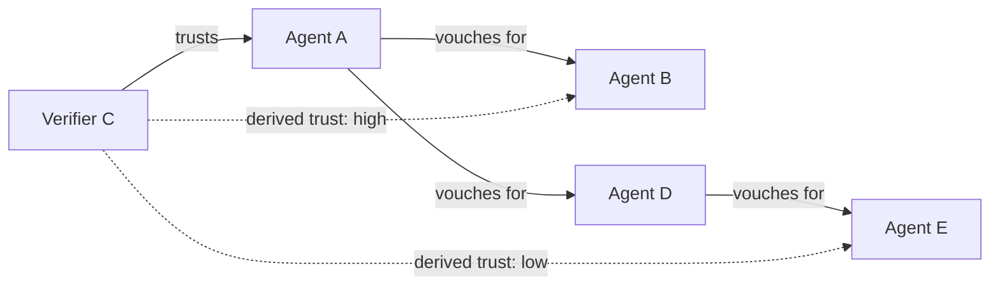

## Problem

When autonomous agents interact without a central authority, trust decisions are binary: either you trust an agent completely or you do not trust it at all. There is no mechanism to derive partial, evidence-based trust from indirect relationships.

Traditional approaches fail in different ways:
- **Central registries** create single points of failure and require all agents to trust the same authority.
- **Self-asserted identity** (claiming "I am X") provides no verification — any agent can claim any identity.
- **Binary web-of-trust** (PGP model) only answers "is this key valid?" but not "how much should I trust this agent's competence or intent?"

Agents need a way to build trust networks where trust propagates through verified relationships, decays with distance, and remains auditable end-to-end.

## Solution

Implement a directed, signed vouch graph where each edge is a cryptographically signed attestation from one agent about another. Trust propagates transitively along chains, with configurable decay at each hop.

**Core components:**

1. **Agent identity:** Each agent holds a keypair (e.g., Ed25519) and derives a decentralized identifier from the public key.
2. **Vouch:** A signed statement from agent A asserting trust in agent B, optionally scoped (e.g., "I trust B for code review" vs. general trust).
3. **Chain verification:** When agent C encounters unknown agent B, C can trace a chain: C trusts A, A vouched for B. C assigns B a derived trust score that decays with chain length.
4. **Revocation:** Vouches can be revoked by signing a revocation statement, immediately severing that edge in the trust graph.

**Pattern flow:**

```
Agent A (trusted by C)
  │
  ├── vouches for B (signed, timestamped)
  │     │
  │     └── B can now present this chain to C
  │           C verifies: A's signature valid? A trusted? → B gets derived trust
  │
  └── vouches for D
        │
        └── D vouches for E
              E is 3 hops from C → lower trust score
```



**Trust score calculation (example):**

```pseudo
function trust_score(verifier, target, graph, decay=0.7):
    if verifier == target: return 1.0
    paths = find_all_paths(graph, verifier, target, max_depth=5)
    if not paths: return 0.0
    // Take the highest-trust path
    best = 0.0
    for path in paths:
        score = 1.0
        for hop in path:
            verify_signature(hop.vouch)  // cryptographic check
            score *= decay
        best = max(best, score)
    return best
```

The key difference from PGP's web of trust: vouch chains carry semantic weight (not just key validity), support scoped trust categories, and are designed for automated verification by agents rather than manual human review.

## Evidence

- **Evidence Grade:** `low`
- **Most Valuable Findings:** The isnad (chain of transmission) methodology has been used for over a millennium in hadith scholarship to evaluate reliability of transmitted information through narrator chains. The same structural principle — trust derived through verified intermediaries — applies to agent networks. Early implementations show the model works for small networks (tens of agents).
- **Unverified / Unclear:** Scalability beyond small networks is untested. Sybil resistance depends on the cost of creating identities. Trust decay parameters need empirical tuning across different use cases.

## How to use it

**When to apply:**
- Multi-agent systems where agents from different organizations or operators need to collaborate.
- Marketplaces where agents offer services to other agents.
- Any system where agents must make trust decisions about previously unknown agents.

**Prerequisites:**
- Each agent must have a stable cryptographic identity (keypair + identifier).
- A registry or gossip protocol for publishing and discovering vouches.
- Domain-separated signatures to prevent cross-protocol replay (e.g., prefix vouch messages with `vouch:` before signing).

**Implementation steps:**
1. Define your identity scheme (DID, public key hash, etc.).
2. Implement vouch creation: agent signs a statement binding its identity to the target's identity.
3. Implement chain traversal: given a target, find paths through the vouch graph back to trusted roots.
4. Choose decay parameters based on your trust requirements (higher decay = more conservative).
5. Implement revocation: signed revocation statements that invalidate specific vouches.

## Trade-offs

- **Pros:**
  - No central authority required — trust emerges from the network.
  - Auditable — every trust decision can be traced back through the chain.
  - Graceful degradation — losing one node only affects agents that depended on that specific chain.
  - Composable with other trust signals (reputation scores, behavioral history, etc.).

- **Cons:**
  - Cold-start problem — new agents have no vouches and therefore zero derived trust.
  - Sybil vulnerability — an attacker can create many identities and vouch for them all (mitigated by identity cost or proof-of-work).
  - Graph traversal cost grows with network size (mitigated by caching and max-depth limits).
  - Trust decay parameters are subjective and application-dependent.

## Known Implementations

- [AIP (Agent Identity Protocol)](https://github.com/nickzsche/aip-identity) — Python SDK implementing Ed25519-based identity, signed vouches, and chain verification for AI agents.

## References

- Jonathan A.C. Brown, *Hadith: Muhammad's Legacy in the Medieval and Modern World* — historical analysis of isnad chain methodology.
- Phil Zimmermann, [PGP Web of Trust](https://www.philzimmermann.com/EN/essays/) — foundational work on decentralized trust.
- W3C, [Decentralized Identifiers (DIDs)](https://www.w3.org/TR/did-core/) — standard for decentralized identity.
