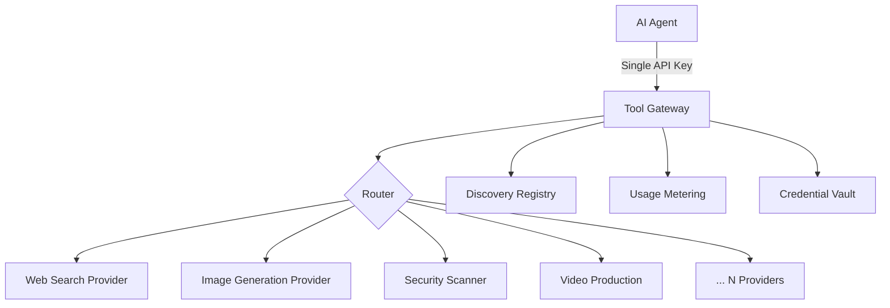

## Problem

As agent capabilities grow, they need access to an expanding set of external tools — web search, image generation, competitor research, security scanning, video production, and more. Each tool typically requires its own API key, authentication flow, rate-limiting logic, and billing integration.

This creates several compounding problems:

* **Credential sprawl**: Agents or their operators must manage dozens of API keys across different providers, each with different authentication schemes.
* **Integration tax**: Every new tool requires custom integration code — error handling, retries, schema translation, and response normalization.
* **Billing fragmentation**: Usage is scattered across many provider dashboards, making cost tracking and budget enforcement difficult.
* **Discovery overhead**: Agents have no unified way to find what tools are available or what capabilities they can access.

## Solution

Place a single gateway between the agent and all external tool providers. The gateway handles discovery, authentication, routing, execution, and billing — exposing a uniform interface to the agent regardless of the underlying provider.

The pattern works through four layers:

1. **Discovery layer**: A unified registry where agents query available tools and their capabilities via a single endpoint or protocol (e.g., MCP `tools/list`).
2. **Authentication layer**: The gateway holds provider credentials on behalf of the agent. The agent authenticates once to the gateway; the gateway handles per-provider auth.
3. **Routing layer**: Incoming tool calls are routed to the correct provider, with schema translation if needed. Long-running tools are dispatched to async workers.
4. **Metering layer**: Every call is logged, metered, and billed through a single system, enabling budget caps and usage visibility.



```pseudo
// Agent-side: one key, one protocol
gateway = ToolGateway(api_key="tr_xxx")

// Discovery
tools = gateway.discover(category="research")
// → [{name: "web_search", skills: ["search", "deep_research"]}, ...]

// Execution — gateway handles provider auth, retries, billing
result = gateway.call("web_search", "search", {query: "AI agent patterns"})

// Async for long-running tools
job = gateway.call("video_production", "generate_clip", {prompt: "..."})
// → {job_id: "abc", status: "processing"}
result = gateway.get_result(job.job_id)
```

## How to use it

**Best for:**

- Teams deploying agents that need 10+ external capabilities
- Platforms offering tool access to multiple agents or users
- Scenarios requiring centralized billing, rate limiting, or audit logging

**Implementation considerations:**

- **Protocol choice**: MCP (Model Context Protocol) provides a natural fit since agents already speak it natively. The gateway acts as an MCP server exposing all tools.
- **Sync vs async**: Short tools (search, lookups) execute inline. Long tools (video generation, large scrapes) return a job ID and execute on background workers.
- **Credential management**: Users can bring their own API keys for specific providers (BYOK) to reduce costs, while the gateway provides default keys for convenience.
- **Schema normalization**: Each provider's response is normalized to a consistent output schema so agents don't need provider-specific parsing logic.
- **Rate limiting**: Apply per-user and per-tool rate limits at the gateway level to prevent abuse and manage costs.

## Trade-offs

**Pros:**

- Agents integrate once rather than per-provider — dramatically reduces integration surface
- Centralized billing and usage tracking across all tools
- New tools become available to all agents without code changes
- Single point for rate limiting, logging, and access control
- Credential isolation — agents never see raw provider API keys

**Cons:**

- Single point of failure — gateway outage blocks all tool access
- Added latency from the extra network hop through the gateway
- Cost markup — gateway operators typically add a fee on top of provider costs
- Vendor lock-in risk if the gateway uses proprietary protocols
- Less control over provider-specific features or optimizations

## References

- [API Gateway Pattern](https://microservices.io/patterns/apigateway.html) — the microservices predecessor pattern that inspired this approach
- [Model Context Protocol specification](https://modelcontextprotocol.io/) — the emerging standard for agent-tool communication
- [OpenAI Plugins Architecture](https://platform.openai.com/docs/plugins) — early exploration of unified tool access for agents
- [ToolRouter](https://toolrouter.com) — a production implementation of this pattern with 150+ tools accessible via MCP
