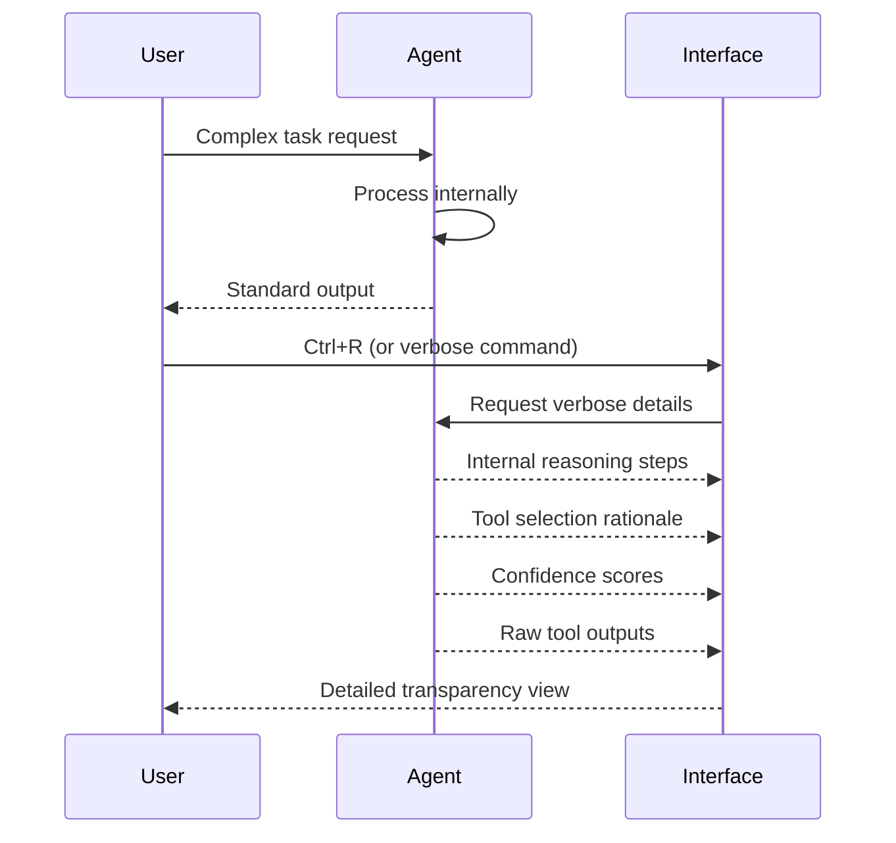

## Problem
AI agents, especially those using complex models or multiple tools, can sometimes behave like "black boxes." Users may not understand why an agent made a particular decision, chose a specific tool, or generated a certain output. This lack of transparency can hinder debugging, trust, and the ability to effectively guide the agent.

## Solution
Implement a feature that allows users to inspect the agent's internal "thought process" or reasoning steps on demand. This could be triggered by a keybinding (e.g., `Ctrl+R` in Claude Code) or a command.

When activated, the verbose output might reveal:
-   The agent's interpretation of the user's prompt.
-   Alternative actions or tools it considered.
-   The specific tool(s) it selected and why (if available).
-   Intermediate steps or sub-tasks it performed.
-   Confidence scores or internal states.
-   Raw outputs from tools before they are processed or summarized.

This transparency helps users understand the agent's decision-making process, identify issues if the agent is stuck or producing incorrect results, and learn how to prompt more effectively.

## Example (transparency activation)

## References
-   Based on the `Ctrl+R` keybinding for showing verbose output in "Mastering Claude Code: Boris Cherny's Guide & Cheatsheet," section V.

[Source](https://www.nibzard.com/claude-code)