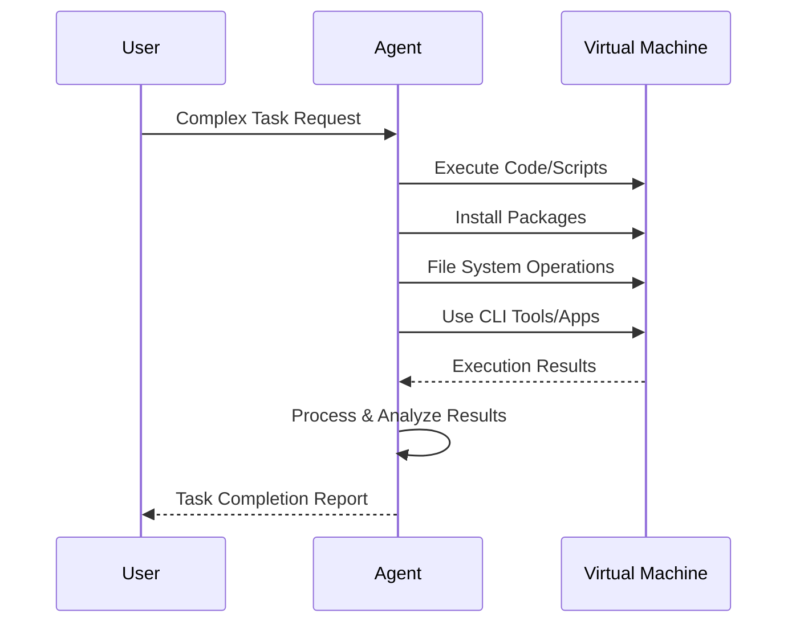

## Problem

AI agents need to perform complex tasks beyond simple code generation or text manipulation. They require the ability to interact with a full computer environment to execute code, manage system resources, install software, and operate various applications.

## Solution

Equip the AI agent with access to a dedicated virtual machine (VM) environment. The agent is trained or designed to understand how to operate within this VM, treating it as its direct workspace. This allows the agent to:

- Execute arbitrary code and scripts.
- Install and manage software packages.
- Read from and write to the file system.
- Utilize other command-line tools and applications available within the VM.

This pattern transforms the agent from a specialized tool into a more general-purpose digital operator.

Common implementation approaches include:

- **Full virtual machines** (EC2, GCP) - Maximum isolation, higher overhead
- **MicroVMs** (Firecracker, Modal, E2B) - Balanced isolation with fast startup
- **Container isolation** (Docker, Kubernetes) - Faster startup, shared kernel risk
- **Tool-mediated execution** - Minimal overhead, capability-scoped

## Example (flow)

```mermaid
sequenceDiagram
    participant User
    participant Agent
    participant VM as Virtual Machine

    User->>Agent: Complex Task Request
    Agent->>VM: Execute Code/Scripts
    Agent->>VM: Install Packages
    Agent->>VM: File System Operations
    Agent->>VM: Use CLI Tools/Apps
    VM-->>Agent: Execution Results
    Agent->>Agent: Process & Analyze Results
    Agent-->>User: Task Completion Report
```

## How to use it

- Use this when agent success depends on reliable tool invocation and environment setup.
- Start with a narrow tool surface and explicit parameter validation.
- Add observability around tool latency, failures, and fallback paths.
- Implement automatic cleanup via idle timeouts and hard execution limits.
- Ensure state isolation: fresh filesystem per session, no shared network namespaces.

## Trade-offs

* **Pros:** Improves execution success and lowers tool-call failure rates.
* **Cons:** Introduces integration coupling, environment-specific upkeep, and cold-start latency (1-120s depending on isolation level).

## References

- Based on Amjad Masad's description of advanced computer use agents: "People think of computer use as something like an operator, but actually it is more like you give the model a virtual machine, and it knows how to execute code on it, install packages, write scripts, use apps, do as much as possible with the computer." (Quote from the "How AI Agents Are Reshaping Creation" blog post).

[Source](https://www.nibzard.com/silent-revolution)

- Beurer-Kellner et al. (2025). "Design Patterns for Securing LLM Agents." arXiv:2506.08837 - Comprehensive framework for secure LLM agent execution including Action Selector and Code-Then-Execute patterns.

- Yao et al. (2022). "ReAct: Synergizing Reasoning and Acting in Language Models." arXiv:2210.03629 - Foundational reasoning-acting paradigm (Thought → Action → Observation).
