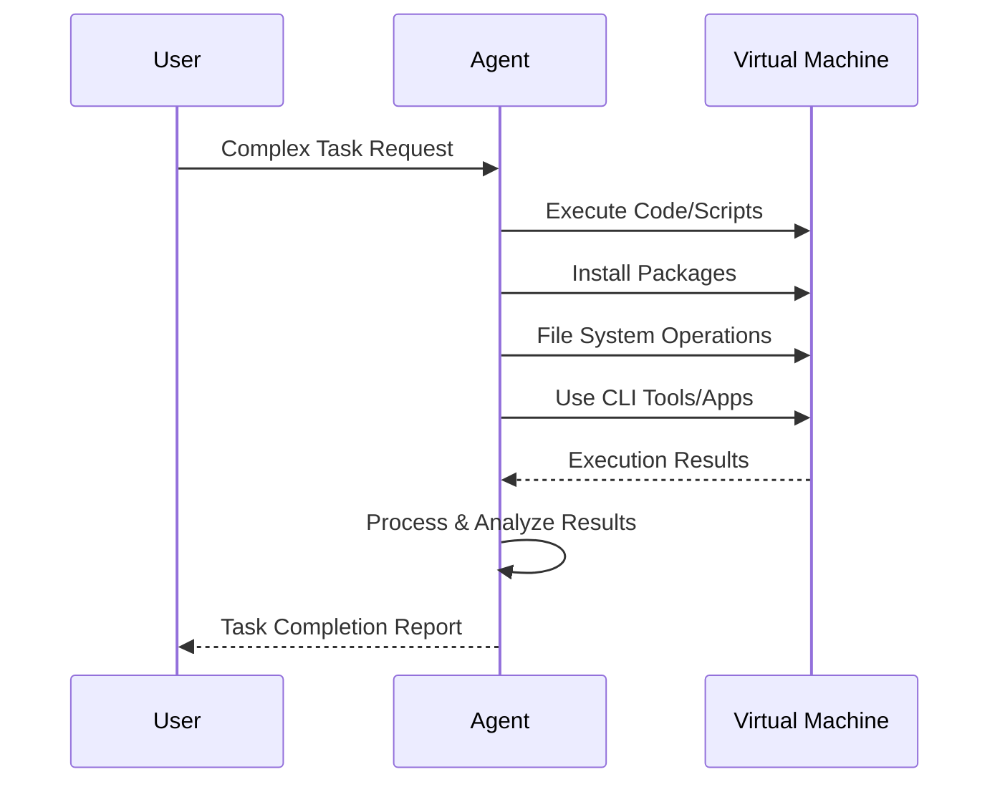

## Problem
AI agents need to perform complex tasks beyond simple code generation or text manipulation. They require the ability to interact with a full computer environment to execute code, manage system resources, install software, and operate various applications.

## Solution
Equip the AI agent with access to a dedicated virtual machine (VM) environment. The agent is trained or designed to understand how to operate within this VM, treating it as its direct workspace. This allows the agent to:

- Execute arbitrary code and scripts.
- Install and manage software packages.
- Read from and write to the file system.
- Utilize other command-line tools and applications available within the VM.

This pattern transforms the agent from a specialized tool into a more general-purpose digital operator.

## Example (flow)

## References
- Based on Amjad Masad's description of advanced computer use agents: "People think of computer use as something like an operator, but actually it is more like you give the model a virtual machine, and it knows how to execute code on it, install packages, write scripts, use apps, do as much as possible with the computer." (Quote from the "How AI Agents Are Reshaping Creation" blog post).

[Source](https://www.nibzard.com/silent-revolution)