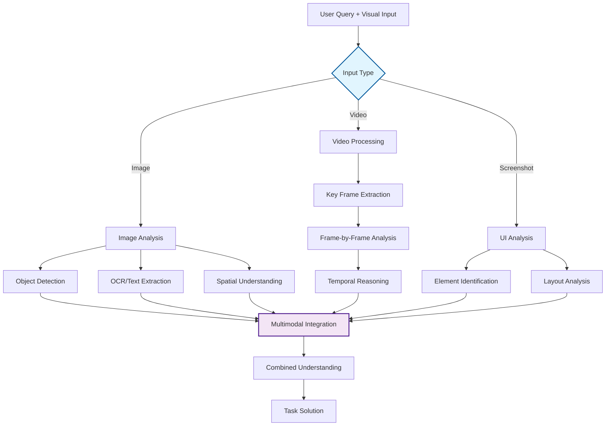

## Problem

Many real-world tasks require understanding and processing visual information alongside text. Traditional text-only agents miss critical information present in images, videos, diagrams, and visual interfaces. This limitation prevents agents from helping with tasks like analyzing screenshots, debugging UI issues, understanding charts, processing security footage, or working with visual documentation.

## Solution

Integrate large multimodal models (LMMs) into agent architectures to enable visual understanding capabilities. This pattern involves:

1. **Visual Input Handling**: Accept images, videos, or screenshots as input alongside text
2. **Visual Analysis**: Use multimodal models to extract information, identify objects, read text, understand spatial relationships
3. **Cross-Modal Reasoning**: Combine visual and textual information for comprehensive understanding
4. **Visual-Guided Actions**: Take actions based on visual understanding (clicking UI elements, describing scenes, counting objects)

The integration can be implemented through specialized visual processing agents or by upgrading existing agents with multimodal capabilities.

## Example

```python
class VisualAIAgent:
    def __init__(self, multimodal_llm, text_llm=None):
        self.mm_llm = multimodal_llm
        self.text_llm = text_llm or multimodal_llm
        
    async def process_visual_task(self, task_description, visual_inputs):
        # Analyze each visual input
        visual_analyses = []
        for visual in visual_inputs:
            analysis = await self.analyze_visual(visual, task_description)
            visual_analyses.append(analysis)
        
        # Combine visual analyses with task
        combined_context = self.merge_visual_context(
            task_description, 
            visual_analyses
        )
        
        # Generate solution using combined understanding
        return await self.solve_with_visual_context(combined_context)
    
    async def analyze_visual(self, visual_input, context):
        prompt = f"""
        Task context: {context}
        
        Analyze this {visual_input.type} and extract:
        1. Relevant objects and their positions
        2. Any text present (OCR)
        3. Colors, patterns, or visual indicators
        4. Spatial relationships
        5. Anything relevant to the task
        
        Provide structured analysis:
        """
        
        return await self.mm_llm.analyze(
            prompt=prompt,
            image=visual_input.data
        )
    
    async def solve_with_visual_context(self, context):
        return await self.text_llm.generate(f"""
        Based on the visual analysis and task requirements:
        {context}
        
        Provide a comprehensive solution that incorporates 
        the visual information.
        """)

# Specialized visual agents for specific domains
class UIDebugAgent(VisualAIAgent):
    async def debug_ui_issue(self, screenshot, issue_description):
        ui_analysis = await self.analyze_visual(
            screenshot, 
            f"UI debugging: {issue_description}"
        )
        
        return await self.mm_llm.generate(f"""
        UI Analysis: {ui_analysis}
        Issue: {issue_description}
        
        Identify:
        1. Potential UI problems visible in the screenshot
        2. Specific elements that might cause the issue
        3. Recommendations for fixes
        4. Exact coordinates or selectors if applicable
        """)

class VideoAnalysisAgent(VisualAIAgent):
    async def analyze_video_segment(self, video_path, query):
        # Process video in chunks
        key_frames = await self.extract_key_frames(video_path)
        
        frame_analyses = []
        for frame in key_frames:
            analysis = await self.analyze_visual(frame, query)
            frame_analyses.append({
                'timestamp': frame.timestamp,
                'analysis': analysis
            })
        
        # Temporal reasoning across frames
        return await self.temporal_reasoning(frame_analyses, query)
```



## Use Cases

- **UI/UX Debugging**: Analyze screenshots to identify visual bugs or usability issues
- **Document Processing**: Extract information from charts, diagrams, and visual documents
- **Video Analysis**: Count objects, identify events, or generate timestamps in videos
- **Security Monitoring**: Analyze security footage for specific activities or anomalies
- **Medical Imaging**: Assist in analyzing medical images (with appropriate disclaimers)
- **E-commerce**: Analyze product images for categorization or quality control

## Trade-offs

**Pros:**
- Enables entirely new categories of tasks
- More natural interaction (users can show rather than describe)
- Better accuracy for visual tasks
- Can handle complex multimodal reasoning

**Cons:**
- Higher computational costs for visual processing
- Larger model requirements
- Potential privacy concerns with visual data
- May require specialized infrastructure for video processing
- Quality depends on visual model capabilities

## References

- [Andrew Ng on Visual AI and Agentic Workflows (2024)](https://www.deeplearning.ai/the-batch/)
- [GPT-4V(ision) System Card](https://openai.com/research/gpt-4v-system-card)
- [Claude 3 Vision Capabilities](https://www.anthropic.com/claude)
- [Google Gemini Multimodal Features](https://deepmind.google/technologies/gemini/)