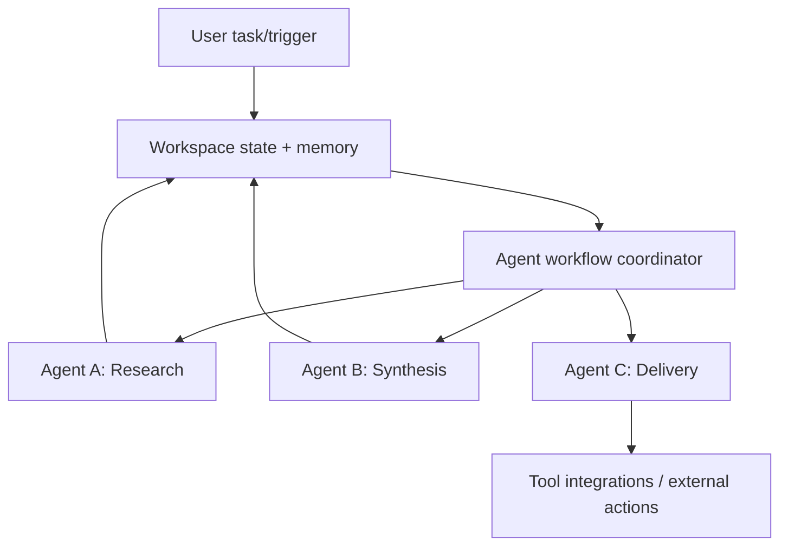

## Problem

Many teams struggle to run agentic workflows because their agent tooling is separate from their day-to-day collaboration environment. The result is fragmented context, brittle integrations, and high setup overhead.

Common pain points include:

- Agents are difficult to create and version for non-engineering users.
- Context, memory, and knowledge sources are spread across ad hoc systems.
- Multi-agent workflows require custom glue for routing, event triggers, and state transfer.
- Integrating agents with operational tools (issue trackers, docs, chat, CRM) is expensive.

## Solution

The pattern is to make agents native participants in the workspace platform itself, so they share the same context, memory, and lifecycle as human collaborators. This approach builds on established patterns like blackboard architecture (shared memory for coordination) and tuple spaces (associative addressing for decoupled communication).

**Core components:**

1. **Agent definitions are shared, versioned artifacts**: each agent has role/constraints/tool access defined in one place.
2. **Shared workspace memory**: persistent, team-curated sources (documents, URLs, files) feed agent context. Memory types include episodic (past executions), semantic (knowledge base), and procedural (capabilities and tools).
3. **Workflow orchestration inside the workspace**: outputs from one agent can trigger downstream agents via event-driven workflows. Trigger patterns include direct (event → action), conditional (event + condition → action), composite (multiple events → action), and temporal (event + delay → action).
4. **Standardized integration surface**: expose tools/actions through a consistent protocol layer (for example MCP-compatible tool interfaces).
5. **Cross-platform accessibility**: keep behavior consistent across web, desktop, mobile, and browser contexts.

## How to use it

- Start with one use-case, then scale to more complex agent handoffs.
- Define a clear contract per agent (scope, outputs, allowed tools).
- Use shared memory sources and update them programmatically when workflows complete.
- Keep trigger graph small at first; expand to chained agents only where dependencies are clear.
- Prefer protocol-based integrations so alternate agent runtimes can consume the same workspace actions.

## Trade-offs

- **Pros:**
  - Lowers onboarding friction for teams without heavy automation infrastructure.
  - Preserves context across sessions via shared, persistent workspace memory.
  - Improves handoff quality between agents and humans.
  - Reduces integration effort through standardized action surfaces.

- **Cons/considerations:**
  - Strong coupling to the chosen workspace platform.
  - Some advanced behaviors may still require custom agent code.
  - Workflow chains can become difficult to debug as they grow.
  - Operational dependency and governance requirements sit in platform settings.

## References

- [Taskade AI Agents](https://taskade.com/agents)
- [Taskade MCP Server](https://github.com/taskade/mcp)
- [Taskade AI App Builder](https://taskade.com/ai/apps)
- [Taskade Automations](https://taskade.com/automate)
- Nii, H. P. (1986). [Blackboard Systems: A Survey](https://doi.org/10.1145/6499.6503). AI Magazine.
- Gelernter, D. (1985). [Generative Communication in Linda](https://doi.org/10.1145/2166.2168). ACM TOPLAS.
