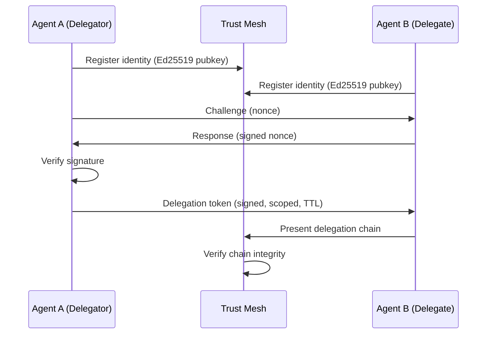

## Problem
In multi-agent systems, agents must communicate and delegate tasks to each other, but there is no standard mechanism for verifying agent identity or establishing trust. Without cryptographic identity and trust verification, malicious agents can impersonate legitimate ones, delegation chains become unverifiable, and there is no way to enforce governance policies across agent boundaries.

## Solution
Apply zero-trust networking principles to multi-agent AI systems. Every agent gets a cryptographic identity (Ed25519 key pair), and all inter-agent communication requires mutual trust verification through a handshake protocol.

Key components:
- **Agent Identity**: Each agent holds an Ed25519 keypair. Identity is verified cryptographically, not by network location.
- **Trust Handshake**: Before communication, agents perform mutual challenge-response verification.
- **Delegation Chain**: When Agent A delegates to Agent B, it creates a signed delegation token. Agent B can prove its authority traces back to Agent A. Chain depth is bounded to prevent abuse.
- **Trust Scoring**: Agents accumulate trust scores based on behavior. Scores decay over time if not refreshed.

```python
# Establish trust between two agents
alice = AgentIdentity.generate("alice")
bob = AgentIdentity.generate("bob")

handshake = TrustHandshake(alice)
session = await handshake.connect(bob.public_key)

# Delegate with cryptographic proof
chain = DelegationChain.create(alice, bob, scope="read-only", ttl=3600)
assert chain.verify()  # Cryptographic chain verification
```



## How to use it
- **Single-agent governance**: Use [Agent OS](https://github.com/imran-siddique/agent-os) for POSIX-inspired safety primitives (policy engine, resource quotas, audit logging).
- **Multi-agent trust**: Use [AgentMesh](https://github.com/imran-siddique/agent-mesh) for identity, trust handshakes, delegation chains, and reward distribution.
- **HTTP integration**: Drop-in Flask/FastAPI middleware verifies trust on every request.
- **Framework adapters**: Works with CrewAI, LangChain, AutoGen, LlamaIndex, and A2A protocol.

## Trade-offs
* **Pros:** Cryptographic guarantees (not just access control lists), bounded delegation prevents chain-of-trust attacks, trust decay encourages good behavior, framework-agnostic
* **Cons:** Adds latency to inter-agent communication (handshake overhead ~10ms), requires key management infrastructure, trust scoring parameters need tuning per deployment

## References
* [AgentMesh - Multi-agent trust layer](https://github.com/imran-siddique/agent-mesh)
* [Agent OS - Single-agent governance kernel](https://github.com/imran-siddique/agent-os)
* [NIST SP 800-207: Zero Trust Architecture](https://csrc.nist.gov/publications/detail/sp/800-207/final)
* [A2A Protocol - Agent-to-Agent communication](https://github.com/a2aproject/A2A)