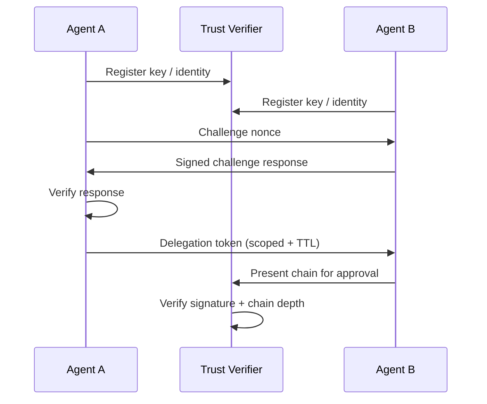

## Problem

In multi-agent systems, trust boundaries are often implicit: agents communicate by convention without verifiable identity, and delegation chains are hard to audit. This enables impersonation, privilege confusion, and unverifiable task delegation.

## Solution

Apply zero-trust principles to inter-agent communication:

- **Agent identities are cryptographically asserted** (Ed25519 key pairs per agent for fast signatures with 64-byte size).
- **Mutual trust handshakes** confirm identity before requests are accepted.
- **Delegation tokens** carry signed scope, TTL, and parent authority.
- **Bounded delegation** limits chain depth and blast radius.

Every request is evaluated as an untrusted call until identity, authorization, and delegation lineage are verified. Policies are enforced per hop, not just at the edge, and verification results are logged as first-class audit events. This turns "agent collaboration" into a traceable authorization graph rather than a trust-by-convention channel.

## Evidence

- **Evidence Grade:** `high`
- **Most Valuable Findings:**
  - Production-scale deployments exist: SPIFFE/SPIRE has 1000+ deployments and is CNCF-graduated (2020)
  - Verification overhead is modest: ~0.05-0.15ms per request for single-hop and 3-hop chains
  - Agent frameworks (LangChain, AutoGen, CrewAI) support zero-trust via tool authorization hooks
- **Unverified / Unclear:** Native zero-trust support in major agent frameworks remains adapter-based, not first-class

## How to use it

- Enable trust checks for every inter-agent request, not just sensitive ones.
- Keep delegation scopes narrowly scoped and short-lived.
- Require explicit expiry and refresh for long-running tasks.
- Centralize verifier policy (TTL defaults, trust score decay, blocklist/allowlist).

## Trade-offs

- Adds latency and additional components for key management and verification.
- Requires security operations discipline around key rotation and revocation.
- Trust scoring and policy tuning adds governance overhead.
- Existing agent frameworks need adapter glue.

## References

- [NIST SP 800-207: Zero Trust Architecture](https://csrc.nist.gov/publications/detail/sp/800-207/final)
- Beurer-Kellner et al. (2025). "Design Patterns for Securing LLM Agents against Prompt Injections" [arXiv:2506.08837](https://doi.org/10.48550/arXiv.2506.08837)
- Greshake et al. (2023). "Not What You've Signed Up For: Compromising Real-World LLM-Integrated Applications" [arXiv:2302.12173](https://doi.org/10.48550/arXiv.2302.12173)
- [SPIFFE/SPIRE](https://spiffe.io/)
- [AgentMesh (example implementation)](https://github.com/imran-siddique/agent-mesh)
- [A2A Protocol](https://github.com/a2aproject/A2A)
