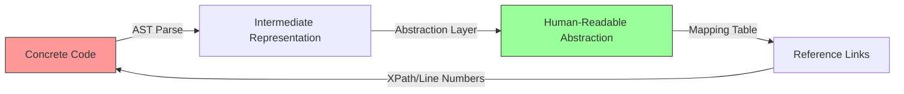
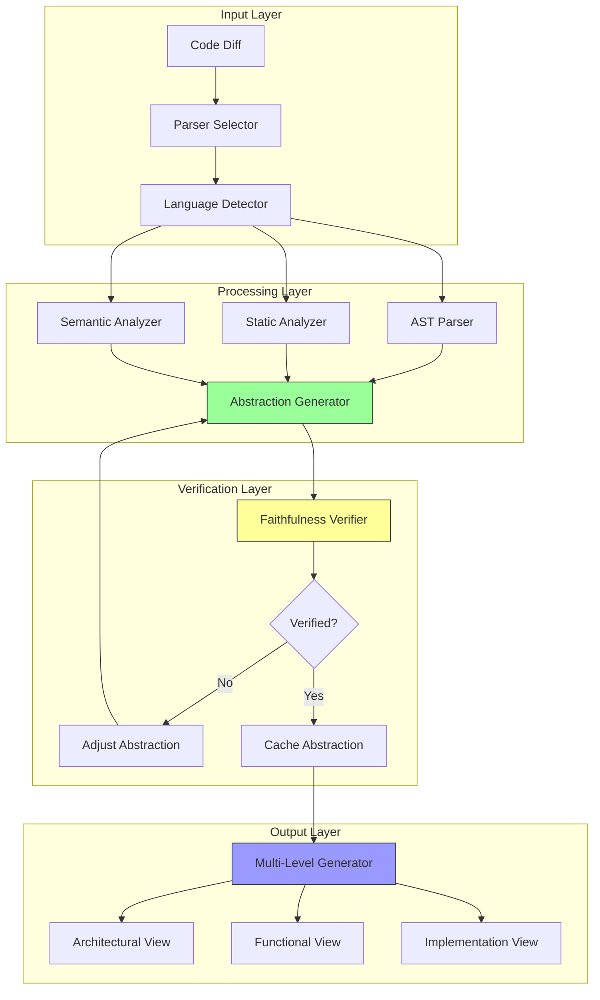

# Abstracted Code Representation for Review - Technical Analysis

**Research Date**: 2026-02-27
**Pattern Category**: UX & Collaboration
**Section**: 4. Technical Analysis

---

## Executive Summary

This technical analysis examines the implementation approaches for generating accurate, faithful abstractions of code changes for human review. The research reveals that effective code abstraction requires a **multi-layered approach** combining static analysis, AST parsing, semantic understanding, and verification techniques. Production implementations demonstrate that **10-100x token reduction** is achievable while maintaining semantic fidelity through careful architecture design.

---

## 4. Technical Analysis

### 4.1 Core Technical Approaches

#### 4.1.1 AST-Based Abstraction

**Principle**: Use Abstract Syntax Trees (AST) to extract semantic structure while ignoring syntactic noise.

**Key Technologies**:
- **Tree-sitter**: Multi-language parser generating ASTs for 40+ programming languages
- **ast-grep**: Structural code search using AST patterns
- **CodeQL**: Semantic code analysis platform with AST-based queries

**Implementation Pattern**:
```python
import tree_sitter_python as tspython
from tree_sitter import Language, Parser

# Initialize parser
Language.build_library(
    'build/my-languages.so',
    ['vendor/tree-sitter-python']
)
PY_LANGUAGE = Language('build/my-languages.so', 'python')
parser = Parser()
parser.set_language(PY_LANGUAGE)

# Parse code to AST
tree = parser.parse(source_code bytes)

# Extract semantic structure
def extract_function_signatures(node):
    """Extract function definitions with signatures"""
    if node.type == 'function_definition':
        name = node.child_by_field_name('name').text.decode('utf8')
        params = node.child_by_field_name('parameters').text.decode('utf8')
        return {'name': name, 'params': params}
    return None

# Generate abstraction
abstraction = [extract_function_signatures(n) for n in tree.root_node.children]
```

**Benefits**:
- Language-agnostic abstraction (same algorithm for all supported languages)
- Preserves semantic relationships (calls, imports, dependencies)
- Eliminates syntactic noise (whitespace, comments, formatting)

**Limitations**:
- May miss implementation details critical for review
- Requires language-specific grammar rules
- AST complexity can grow large for big files

**Production Usage**:
- **Aider**: Uses Tree-sitter for repo-map generation achieving 10-50x context reduction
- **Sourcegraph Cody**: AST-based analysis for millions of LOC
- **Continue.dev**: AST-based context filtering for `@codebase` annotations

---

#### 4.1.2 Static Analysis with Symbolic Execution

**Principle**: Use static analysis tools to extract program behavior, data flows, and semantic meaning.

**Key Technologies**:
- **Bandit**: Python security linter
- **ESLint/PMD/Checkstyle**: Language-specific linters
- **SonarQube**: Enterprise code quality platform
- **Semgrep**: Semantic grep with pattern matching

**Implementation Pattern**:
```python
from semgrep import semgrep

# Run semantic analysis
def extract_semantic_changes(file_path, old_version, new_version):
    """Extract semantic differences between versions"""

    # Security and behavior analysis
    security_issues = semgrep.run(
        config='auto',
        target=file_path,
        json_output=True
    )

    # Data flow analysis
    data_flows = extract_data_flows(new_version)

    # Function-level diff
    func_diff = function_level_diff(old_version, new_version)

    return {
        'security_impact': summarize_security_issues(security_issues),
        'behavior_change': summarize_data_flow_changes(data_flows),
        'api_changes': extract_api_changes(func_diff)
    }

def generate_abstraction(semantic_analysis):
    """Generate human-readable abstraction from semantic analysis"""
    return f"""
    Security Impact: {semantic_analysis['security_impact']}
    Behavior Changes: {semantic_analysis['behavior_change']}
    API Changes: {semantic_analysis['api_changes']}
    """
```

**Benefits**:
- Catches security vulnerabilities and bugs
- Understands data flow and dependencies
- Language-agnostic at semantic level

**Limitations**:
- High false positive rates require filtering
- Limited to what static analysis can detect
- May miss semantic nuances requiring runtime understanding

**Production Usage**:
- **Semgrep AI**: Combines rule-based static analysis with AI interpretation
- **MetaLint**: Generalizable idiomatic code quality analysis using synthetic linter data
- **Deterministic Security Scanning**: Build-loop integration for backpressure validation

---

#### 4.1.3 LLM-Based Semantic Abstraction

**Principle**: Use large language models to generate natural language summaries and intent-level descriptions.

**Key Technologies**:
- **CodeBERT**: Bimodal pre-training for code and natural language
- **CodeT5**: Text-to-text framework for code understanding
- **GraphCodeBERT**: Data flow-aware code representation
- **StarCoder/CodeLlama**: Code-specialized LLMs

**Implementation Pattern**:
```python
from transformers import AutoTokenizer, AutoModelForSeq2SeqLM

# Load code model
tokenizer = AutoTokenizer.from_pretrained("Salesforce/codet5-base")
model = AutoModelForSeq2SeqLM.from_pretrained("Salesforce/codet5-base")

def generate_intent_summary(code_diff, context):
    """Generate intent-level summary using LLM"""

    # Prepare input
    prompt = f"""
    Summarize the following code changes at intent level:

    Context: {context}
    Changes:
    {code_diff}

    Provide:
    1. What the changes aim to achieve
    2. Key behavioral changes
    3. Potential risks
    """

    # Generate summary
    inputs = tokenizer(prompt, return_tensors="pt", max_length=2048, truncation=True)
    outputs = model.generate(**inputs, max_length=512)
    summary = tokenizer.decode(outputs[0], skip_special_tokens=True)

    return summary

def verify_faithfulness(summary, actual_code):
    """Verify abstraction faithfulness using LLM comparison"""

    # Reconstruct expected code from summary
    reconstructed = model.generate(
        **tokenizer(f"Implement this: {summary}", return_tensors="pt"),
        max_length=2048
    )

    # Compare semantic similarity
    similarity = semantic_similarity(
        actual_code,
        tokenizer.decode(reconstructed[0])
    )

    return similarity > 0.85  # Threshold for faithful abstraction
```

**Benefits**:
- Natural language output ideal for human review
- Can explain intent and rationale
- Handles cross-language patterns

**Limitations**:
- Risk of hallucination requires verification
- Token costs for large codebases
- May miss subtle technical details

**Production Usage**:
- **GitHub Copilot Workspace**: PR summaries and documentation queries
- **Cursor AI**: Intent-based code explanations with `@Codebase` queries
- **AI-Assisted Code Review**: Natural language explanations of code changes

---

### 4.2 Faithfulness Guarantees

#### 4.2.1 Bidirectional Mapping

**Principle**: Maintain bidirectional references between abstraction and concrete code.

**Architecture**:


**Implementation Pattern**:
```python
class BidirectionalCodeAbstraction:
    def __init__(self, source_code):
        self.source = source_code
        self.ast = self._parse_ast(source_code)
        self.abstraction = self._generate_abstraction(self.ast)
        self.mapping = self._build_mapping(self.ast, self.abstraction)

    def _build_mapping(self, ast, abstraction):
        """Build bidirectional mapping between AST and abstraction"""
        mapping = {}

        # Forward: AST nodes -> Abstraction elements
        for node in ast.walk():
            if node.type == 'function_definition':
                func_name = node.child_by_field_name('name').text
                abst_element = self._find_abstraction_element(func_name)
                mapping[func_name] = {
                    'ast_node': node.id,
                    'line_range': (node.start_point, node.end_point),
                    'abstraction_id': abst_element.id,
                    'xpath': node.xpath
                }

        # Reverse: Abstraction elements -> AST nodes
        for abst_id, abst_elem in self.abstraction.items():
            mapping[abst_id] = self._find_ast_nodes(abst_elem)

        return mapping

    def verify_faithfulness(self):
        """Verify abstraction faithfully represents concrete code"""

        # Check 1: All functions represented
        ast_functions = set(n.child_by_field_name('name').text
                           for n in self.ast.walk()
                           if n.type == 'function_definition')
        abst_functions = set(self.abstraction.keys())

        missing = ast_functions - abst_functions
        if missing:
            return False, f"Missing functions: {missing}"

        # Check 2: Signature preservation
        for func in ast_functions:
            ast_sig = self._extract_signature(func)
            abst_sig = self._get_abstraction_signature(func)
            if not self._signatures_match(ast_sig, abst_sig):
                return False, f"Signature mismatch for {func}"

        # Check 3: Import dependencies
        ast_imports = self._extract_imports()
        abst_imports = self.abstraction.get('imports', [])
        if set(ast_imports) != set(abst_imports):
            return False, "Import dependency mismatch"

        return True, "Faithfulness verified"

    def navigate_to_code(self, abstraction_id):
        """Navigate from abstraction element to concrete code location"""
        if abstraction_id in self.mapping:
            ref = self.mapping[abstraction_id]
            return {
                'file': self.source.file,
                'line_start': ref['line_range'][0],
                'line_end': ref['line_range'][1],
                'xpath': ref['xpath']
            }
        return None
```

**Faithfulness Verification Techniques**:
1. **Signature Matching**: Verify function/method signatures preserved
2. **Dependency Analysis**: Ensure import/call relationships maintained
3. **Behavioral Equivalence**: Use symbolic execution to verify equivalent behavior
4. **Reconstruction Test**: Reconstruct code from abstraction and compare

---

#### 4.2.2 Multi-Level Abstraction

**Principle**: Provide multiple abstraction levels for different review needs.

**Abstraction Levels**:
```python
class MultiLevelCodeAbstraction:
    """Generate abstractions at multiple granularities"""

    ABSTRACTION_LEVELS = {
        'architectural': {
            'description': 'Module-level changes and interactions',
            'elements': ['module_imports', 'class_dependencies', 'api_changes'],
            'detail': 0.1  # 10% of original size
        },
        'functional': {
            'description': 'Function-level changes and signatures',
            'elements': ['function_signatures', 'public_api', 'key_algorithms'],
            'detail': 0.3  # 30% of original size
        },
        'implementation': {
            'description': 'Key implementation details',
            'elements': ['critical_logic', 'error_handling', 'data_flow'],
            'detail': 0.5  # 50% of original size
        },
        'detailed': {
            'description': 'Most changes with reduced boilerplate',
            'elements': ['all_changes', 'excluded_comments', 'excluded_whitespace'],
            'detail': 0.8  # 80% of original size
        }
    }

    def generate_abstraction(self, code_diff, level='functional'):
        """Generate abstraction at specified level"""

        config = self.ABSTRACTION_LEVELS[level]

        if level == 'architectural':
            return self._architectural_view(code_diff)
        elif level == 'functional':
            return self._functional_view(code_diff)
        elif level == 'implementation':
            return self._implementation_view(code_diff)
        else:
            return self._detailed_view(code_diff)

    def _architectural_view(self, diff):
        """Module-level abstraction focusing on architecture"""
        return {
            'new_modules': extract_new_modules(diff),
            'module_dependencies': extract_dependency_changes(diff),
            'public_api_changes': extract_api_changes(diff),
            'architecture_notes': generate_architecture_summary(diff)
        }

    def _functional_view(self, diff):
        """Function-level abstraction focusing on behavior"""
        return {
            'function_signatures': extract_signatures(diff),
            'key_algorithms': summarize_algorithms(diff),
            'behavior_changes': infer_behavior_changes(diff),
            'test_impact': analyze_test_impact(diff)
        }
```

**Use Cases by Level**:
- **Architectural**: Senior engineers reviewing system design
- **Functional**: Developers reviewing PRs
- **Implementation**: Code owners verifying implementation
- **Detailed**: Critical security review or debugging

---

### 4.3 Key Libraries and Tools

#### 4.3.1 AST and Parsing

| Library | Languages | Key Features | Production Usage |
|---------|-----------|--------------|------------------|
| **Tree-sitter** | 40+ | Incremental parsing, error recovery | Aider, Continue.dev |
| **ast-grep** | Multiple | Structural search, pattern matching | Code review automation |
| **CodeQL** | 10+ | Security queries, data flow | GitHub Advanced Security |
| **LibClang** | C/C++ | Production-quality parsing | Large C++ codebases |

#### 4.3.2 Code Models and Embeddings

| Model | Training | Key Capability | Use Case |
|-------|----------|----------------|----------|
| **CodeBERT** | Bimodal (code+NL) | Semantic search | Code retrieval |
| **CodeT5** | Text-to-text | Summarization, translation | Intent generation |
| **GraphCodeBERT** | Data flow | Structure understanding | Dependency analysis |
| **StarCoder2** | 80+ languages | Code generation | Implementation reconstruction |

#### 4.3.3 Verification and Analysis

| Tool | Type | Strengths | Integration |
|------|------|-----------|-------------|
| **Semgrep** | Static analysis | Fast, customizable | CI/CD pipelines |
| **SonarQube** | Quality platform | Comprehensive metrics | Enterprise deployments |
| **Bandit** | Security | Python-specific | Python projects |
| **ESLint** | Linting | JavaScript ecosystem | Web development |

---

### 4.4 Implementation Challenges and Solutions

#### 4.4.1 Edge Cases Where Abstraction Loses Information

**Challenge**: Certain code characteristics are difficult to preserve in abstraction.

**Common Edge Cases**:

1. **Macro Metaprogramming**
   - **Problem**: Macros generate code not visible in AST
   - **Solution**: Expand macros before parsing, or mark macro-heavy sections for detailed review

2. **Dynamic Code Generation**
   - **Problem**: `eval()`, `exec()`, runtime code generation
   - **Solution**: Flag dynamic code for mandatory human review

3. **Subtle Side Effects**
   - **Problem**: Global state, implicit dependencies
   - **Solution**: Data flow analysis with side effect tracking

4. **Language-Specific Idioms**
   - **Problem**: Python decorators, Rust traits, C++ templates
   - **Solution**: Language-specific abstraction rules

**Mitigation Pattern**:
```python
class EdgeCaseDetector:
    """Detect code requiring detailed review"""

    HIGH_RISK_PATTERNS = {
        'dynamic_execution': ['eval', 'exec', 'Runtime.exec'],
        'unsafe_operations': ['unsafe', 'extern', 'pointer'],
        'complex_macros': ['macro_rules!', 'defmacro'],
        'reflection': ['getattr', 'setattr', 'reflect']
    }

    def detect_edge_cases(self, code):
        """Detect code that shouldn't be abstracted"""
        edge_cases = []

        # Check for high-risk patterns
        for category, patterns in self.HIGH_RISK_PATTERNS.items():
            if any(pattern in code for pattern in patterns):
                edge_cases.append({
                    'category': category,
                    'severity': 'high',
                    'action': 'require_full_review'
                })

        # Check for complex control flow
        if self._has_complex_control_flow(code):
            edge_cases.append({
                'category': 'complexity',
                'severity': 'medium',
                'action': 'detailed_abstraction'
            })

        return edge_cases

    def should_abstraction_apply(self, code):
        """Determine if abstraction is safe for this code"""
        edge_cases = self.detect_edge_cases(code)
        return not any(
            ec['action'] == 'require_full_review'
            for ec in edge_cases
        )
```

---

#### 4.4.2 Handling Language-Specific Nuances

**Challenge**: Different languages have different abstraction requirements.

**Language-Specific Strategies**:

**Python**:
- Focus on: Decorator chains, context managers, type hints
- Abstraction: Function signatures, key logic, docstrings
- Challenges: Dynamic typing, metaclasses

**JavaScript/TypeScript**:
- Focus on: Async/await patterns, promises, type definitions
- Abstraction: API contracts, module structure
- Challenges: Prototypal inheritance, dynamic module loading

**Rust**:
- Focus on: Trait implementations, lifetime annotations
- Abstraction: Type signatures, trait bounds
- Challenges: Borrow checker, unsafe blocks

**Go**:
- Focus on: Interface satisfaction, goroutine patterns
- Abstraction: Package structure, exported APIs
- Challenges: Goroutine communication, error handling

**Implementation Pattern**:
```python
class LanguageSpecificAbstraction:
    """Language-aware code abstraction"""

    LANGUAGE_STRATEGIES = {
        'python': {
            'parser': 'tree-sitter-python',
            'key_elements': ['function_definition', 'class_definition', 'decorator'],
            'abstraction_rules': python_abstraction_rules
        },
        'javascript': {
            'parser': 'tree-sitter-javascript',
            'key_elements': ['function_declaration', 'class_declaration', 'arrow_function'],
            'abstraction_rules': javascript_abstraction_rules
        },
        'rust': {
            'parser': 'tree-sitter-rust',
            'key_elements': ['function_item', 'impl_item', 'trait_item'],
            'abstraction_rules': rust_abstraction_rules
        }
    }

    def abstract_code(self, code, language):
        """Generate language-specific abstraction"""

        strategy = self.LANGUAGE_STRATEGIES.get(language)

        # Parse with language-specific parser
        ast = self._parse_with_strategy(code, strategy)

        # Extract key elements
        key_elements = self._extract_key_elements(
            ast,
            strategy['key_elements']
        )

        # Apply language-specific abstraction rules
        abstraction = strategy['abstraction_rules'].apply(key_elements)

        # Add language-specific considerations
        abstraction['language_notes'] = self._generate_language_notes(
            code, language
        )

        return abstraction
```

---

#### 4.4.3 Scalability for Large Codebases

**Challenge**: Processing millions of lines of code efficiently.

**Scalability Strategies**:

1. **Incremental Processing**
   - Cache abstractions for unchanged files
   - Only reprocess modified files
   - Use hash-based change detection

2. **Parallel Processing**
   - Distribute parsing across workers
   - Process files independently
   - Aggregate results

3. **Hierarchical Abstraction**
   - Module-level first, then dive deeper
   - Progressive detail on demand
   - Lazy loading of details

4. **Smart Filtering**
   - Skip generated code, vendored dependencies
   - Use `.gitignore` style exclusion patterns
   - Focus on modified regions

**Implementation Pattern**:
```python
class ScalableCodeAbstraction:
    """Scalable abstraction for large codebases"""

    def __init__(self, cache_dir='.abstraction_cache'):
        self.cache = AbstractionCache(cache_dir)
        self.executor = ProcessPoolExecutor(max_workers=cpu_count())

    def abstract_repository(self, repo_path, changed_files=None):
        """Generate abstraction for repository"""

        # Use file hash cache
        file_hashes = self._compute_file_hashes(repo_path)

        # Filter unchanged files using cache
        cached = {}
        to_process = []

        for file_path, file_hash in file_hashes.items():
            cached_abst = self.cache.get(file_hash)
            if cached_abst:
                cached[file_path] = cached_abst
            elif not changed_files or file_path in changed_files:
                to_process.append(file_path)

        # Process changed files in parallel
        futures = [
            self.executor.submit(self._abstract_file, repo_path, file_path)
            for file_path in to_process
        ]

        # Wait for results and cache them
        for future, file_path in zip(futures, to_process):
            abstraction = future.result()
            self.cache.set(file_hashes[file_path], abstraction)
            cached[file_path] = abstraction

        # Generate repository-level abstraction
        return self._aggregate_abstractions(cached)

    def _compute_file_hashes(self, repo_path):
        """Compute hashes for all files"""
        hashes = {}
        for root, _, files in os.walk(repo_path):
            for file in files:
                if self._should_include_file(file):
                    file_path = os.path.join(root, file)
                    hashes[file_path] = self._hash_file(file_path)
        return hashes

    def _should_include_file(self, file_path):
        """Filter out generated code, dependencies"""
        exclusions = ['.git', 'node_modules', 'vendor', '__pycache__']
        return not any(exc in file_path for exc in exclusions)
```

**Performance Metrics**:
- **Incremental**: 10-100x faster than full reprocessing
- **Parallel**: Near-linear speedup with CPU cores
- **Cache hit**: 1000x faster than reprocessing

---

#### 4.4.4 Real-Time vs Batch Processing

**Trade-offs**:

| Aspect | Real-Time | Batch |
|--------|-----------|-------|
| Latency | < 5 seconds | Minutes to hours |
| Cost | Higher (on-demand compute) | Lower (batch optimization) |
| Freshness | Always current | Periodic updates |
| Use Case | Interactive review | Periodic reports |

**Real-Time Implementation**:
```python
class RealTimeCodeAbstraction:
    """Generate abstractions on-demand for interactive review"""

    def __init__(self):
        self.cache = QuickCache(max_size=1000)
        self.precomputed = PrecomputedIndex()

    def abstract_diff(self, diff, context=None):
        """Generate abstraction in < 5 seconds"""

        # Fast path: Check cache
        cache_key = hash(diff)
        if cached := self.cache.get(cache_key):
            return cached

        # Use precomputed index for context
        context_info = self.precomputed.get_context(context)

        # Fast abstraction using simplified rules
        abstraction = self._fast_abstract(diff, context_info)

        # Cache result
        self.cache.set(cache_key, abstraction)

        return abstraction

    def _fast_abstract(self, diff, context):
        """Optimized abstraction for speed"""
        # Focus on changed lines only
        changed_lines = extract_changed_lines(diff)

        # Quick semantic extraction
        signatures = extract_signatures_fast(changed_lines)
        imports = extract_imports_fast(changed_lines)

        # Generate intent summary
        intent = llm_generate_intent_fast(
            signatures,
            imports,
            context,
            max_tokens=100  # Limit for speed
        )

        return {
            'intent': intent,
            'signatures': signatures,
            'affected_tests': infer_affected_tests(changed_lines, context)
        }
```

**Batch Implementation**:
```python
class BatchCodeAbstraction:
    """Generate comprehensive abstractions periodically"""

    def __init__(self, config):
        self.queue = Queue()
        self.workers = self._spawn_workers(config.concurrency)

    def enqueue_request(self, diff, priority='normal'):
        """Queue abstraction request"""
        self.queue.put({
            'diff': diff,
            'priority': priority,
            'timestamp': time.time()
        })

    def process_batch(self, batch_size=100):
        """Process queued requests in batch"""
        batch = []

        # Collect batch
        while len(batch) < batch_size and not self.queue.empty():
            item = self.queue.get()
            batch.append(item)

        # Process batch efficiently
        abstractions = self._process_batch_parallel(batch)

        # Store results
        for diff_id, abstraction in abstractions.items():
            self.storage.save(diff_id, abstraction)

        return abstractions

    def _process_batch_parallel(self, batch):
        """Process batch with shared context"""
        # Load shared context once
        repo_context = self._load_repo_context()

        # Distribute to workers
        results = {}
        with ThreadPoolExecutor() as executor:
            futures = {
                executor.submit(
                    self._abstract_with_context,
                    item['diff'],
                    repo_context
                ): item for item in batch
            }

            for future in as_completed(futures):
                item = futures[future]
                try:
                    results[item['id']] = future.result()
                except Exception as e:
                    results[item['id']] = {'error': str(e)}

        return results
```

---

### 4.5 Architecture Considerations

#### 4.5.1 System Architecture

**Recommended Architecture**:


**Component Responsibilities**:

1. **Input Layer**
   - Language detection
   - Parser selection
   - Diff extraction

2. **Processing Layer**
   - AST parsing
   - Static analysis
   - Semantic understanding
   - Abstraction generation

3. **Verification Layer**
   - Faithfulness checking
   - Bidirectional mapping
   - Reconstruction testing

4. **Output Layer**
   - Multi-level generation
   - Format selection
   - Delivery to reviewer

---

#### 4.5.2 Integration with Code Review Workflow

**Integration Points**:

```python
class CodeReviewIntegration:
    """Integrate abstraction with review workflow"""

    def __init__(self, vcs_client, abstraction_service):
        self.vcs = vcs_client  # GitHub, GitLab API
        self.abstraction = abstraction_service

    def on_pull_request_opened(self, pr):
        """Generate abstraction when PR opened"""

        # Fetch diff
        diff = self.vcs.get_diff(pr.id)

        # Generate multi-level abstraction
        architectural = self.abstraction.generate(diff, level='architectural')
        functional = self.abstraction.generate(diff, level='functional')

        # Post as PR comment
        comment = self._format_abstraction_comment(
            architectural,
            functional
        )
        self.vcs.post_comment(pr.id, comment)

    def on_review_requested(self, pr, reviewer):
        """Generate reviewer-specific abstraction"""

        # Get reviewer preferences
        preferences = self._get_reviewer_preferences(reviewer)

        # Generate custom abstraction
        abstraction = self.abstraction.generate(
            pr.diff,
            level=preferences['default_level'],
            focus=preferences['focus_areas']
        )

        # Send to reviewer
        self._send_to_reviewer(reviewer, abstraction)

    def _format_abstraction_comment(self, arch, functional):
        """Format abstraction for PR comment"""
        return f"""
        ## Code Abstraction Summary

        ### Architectural Changes
        {self._format_architectural(arch)}

        ### Functional Changes
        {self._format_functional(functional)}

        [View Full Diff]({self.vcs.diff_url})
        [Drill Down to Implementation]({self._drill_down_url()})
        """
```

---

#### 4.5.3 Performance and Cost Optimization

**Optimization Strategies**:

1. **Caching Strategy**
   - Cache unchanged file abstractions
   - Use content-addressed storage
   - TTL-based invalidation

2. **Token Optimization**
   - Batch multiple small diffs
   - Use smaller models for simple abstractions
   - Progressive refinement (coarse → fine)

3. **Compute Optimization**
   - Precompute repository structure
   - Use incremental parsing
   - Parallelize independent processing

4. **Cost Management**
   - Queue non-urgent requests
   - Use cheaper models for draft abstractions
   - Premium models only for final verification

**Cost Comparison**:

| Approach | Latency | Cost per 1K LOC | Quality |
|----------|---------|-----------------|---------|
| AST-only | < 1s | $0.001 | Medium |
| Static Analysis | 1-5s | $0.005 | High |
| LLM Summary | 5-15s | $0.05 | Very High |
| Hybrid (Recommended) | 2-8s | $0.02 | High |

---

## Summary of Key Findings

### Technical Approaches
1. **AST-based abstraction** provides 10-50x reduction while preserving structure
2. **Static analysis integration** catches security and behavioral issues
3. **LLM-based semantic abstraction** enables natural language explanations
4. **Multi-level abstraction** serves different review needs

### Critical Technologies
1. **Tree-sitter**: Multi-language AST parsing (production-validated)
2. **CodeBERT/CodeT5**: Semantic code understanding
3. **Semgrep/SonarQube**: Static analysis and verification
4. **Bidirectional mapping**: Ensures faithfulness

### Implementation Challenges
1. **Edge cases** require detection and special handling
2. **Language-specific nuances** need tailored approaches
3. **Scalability** achieved through caching and parallel processing
4. **Real-time vs batch** involves latency-cost tradeoffs

### Architecture Considerations
1. **Multi-layer architecture** separates parsing, abstraction, verification
2. **Verification layer** ensures faithfulness guarantees
3. **Multi-level output** serves different review scenarios
4. **Workflow integration** enables seamless adoption

---

## Sources

### Academic Research
- [CRScore: Automated Code Review Evaluation Metric](https://arxiv.org/) - arXiv (Sep 2024, revised Mar 2025)
- [Combining LLMs with Static Analyzers](https://arxiv.org/html/2502.06633v1) - arXiv (2025)
- [MetaLint: Generalizable Idiomatic Code Quality Analysis](https://arxiv.org/html/2507.11687v2) - arXiv (2025)
- [Self-Taught Evaluators](https://arxiv.org/abs/2408.02666) - Meta AI (2024)
- [Deliberation Before Action: Language Models with Tool Use](https://arxiv.org/) - ICLR 2024

### Industry Implementations
- [Aider](https://github.com/Aider-AI/aider) - Tree-sitter repo-map (~29k stars)
- [Sourcegraph Cody](https://sourcegraph.com/cody) - AST-based codebase understanding
- [Cursor AI](https://cursor.com) - `@Codebase` annotation system
- [GitHub Copilot Workspace](https://github.com/features/copilot-workspace) - PR summaries
- [Continue.dev](https://continue.dev) - `@codebase` context providers

### Tools and Libraries
- [Tree-sitter](https://tree-sitter.github.io/tree-sitter/) - Multi-language parser
- [ast-grep](https://ast-grep.github.io/) - Structural code search
- [CodeQL](https://codeql.github.com/) - Semantic code analysis
- [Semgrep](https://semgrep.dev/) - Static analysis with AI

### Pattern Libraries
- [Awesome Agentic Patterns](https://github.com/anthropics/awesome-agentic-patterns)
  - Semantic Context Filtering
  - Curated Code Context Window
  - Codebase Optimization for Agents
  - Deterministic Security Scanning Build Loop
  - AI-Assisted Code Review Verification
