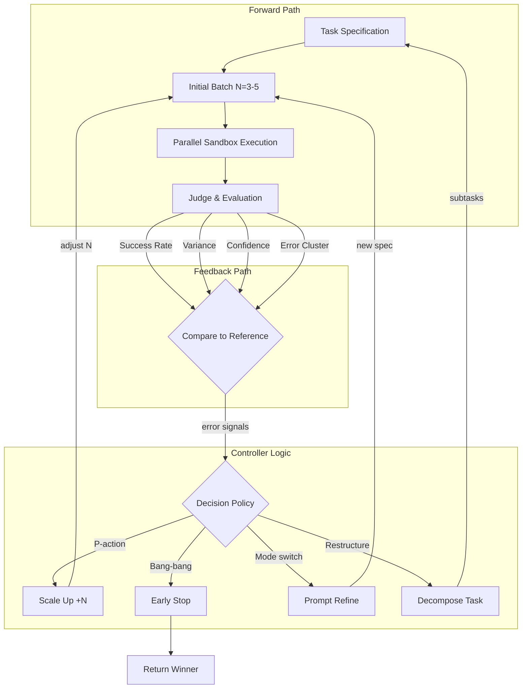

# Research Report: Adaptive Sandbox Fanout Controller

**Pattern**: adaptive-sandbox-fanout-controller
**Status**: emerging
**Category**: Reliability & Eval
**Author**: Nikola Balic (@nibzard)
**Research Completed**: 2026-02-27

---

## Executive Summary

The **Adaptive Sandbox Fanout Controller** is a control pattern that dynamically adjusts the number of parallel sandbox executions based on early performance signals. Unlike static "N=10 always" policies, it optimizes resource usage by scaling fanout up or down in real-time based on observed success rates, variance, and error patterns.

**Key Innovation**: Signal-driven scaling that prevents wasteful execution when prompts are underspecified while ensuring quality through adaptive parallelism.

**Critical Finding**: The primary source (Labruno Agent) does NOT actually implement adaptive fanout - it uses a static `MAX_SANDBOXES` environment variable. The pattern remains theoretical/conceptual, with OpenClaw Orchestrator being the closest verified implementation.

---

## Pattern Definition

### Problem Statement

Parallel sandboxes enable massive scale, but three critical issues arise:

1. **Diminishing Returns**: After some threshold N, additional runs produce redundant failures or near-duplicate solutions
2. **Prompt Fragility**: Underspecified prompts cause failures that scale with N - more sandboxes = more identical errors
3. **Resource Risk**: Unbounded fan-out overwhelms budgets, rate limits, and queue systems

Static policies (e.g., "always run N=10") cannot adapt to task difficulty, model variance, or observed failure rates.

### Solution Architecture

The controller implements a **closed-loop adaptive system**:

```
1. Start Small (N=3-5)
   ↓
2. Early Signal Sampling
   - Success rate (exit code / test pass)
   - Diversity score (solution variance)
   - Judge confidence / winner margin
   - Error clustering (failure patterns)
   ↓
3. Adaptive Decision
   ├─ Scale UP → if good success + high variance
   ├─ Stop EARLY → if high confidence + convergence
   ├─ REFINE prompt → if clustered failures
   └─ DECOMPOSE → if repeated failures
   ↓
4. Budget Guardrails (max N, runtime, no-progress stop)
```

### Decision Heuristics

| Signal | Action | Threshold Example |
|--------|--------|-------------------|
| Good success + high variance | Scale up | ≥2 succeed, disagree, confidence < 0.65 → add +3 |
| High confidence + convergence | Stop early | Judge confident + tests pass → return winner |
| Clustered failures | Refine prompt | 0 succeed, same error >70% → spec clarifier |
| Ambiguous/large task | Switch strategy | Repeated failures → spawn investigative sub-agent |

---

## Control Theory Analysis

### System Classification

The Adaptive Sandbox Fanout Controller is best characterized as a:

**Sampled-data, event-driven, multi-objective, discrete-time switched controller operating on a stochastic partially observable system.**

### Control System Components

#### Setpoint vs Reference Signal

The system exhibits a **multi-objective reference signal** rather than a single setpoint:

- **Quality Target**: Minimum acceptable solution confidence (e.g., ≥0.65)
- **Cost Constraint**: Maximum resource expenditure (budget cap, max N)
- **Latency Budget**: Time-to-solution threshold
- **Variance Signal**: Sufficient solution diversity

#### Process Variables

| Primary Process Variables | Secondary Process Variables |
|---------------------------|-----------------------------|
| Success rate (exit codes / test passes) | Diversity score (solution variance) |
| Judge confidence in current winner | Error clustering (failure similarity) |
| Solution convergence rate | Per-execution latency |
| Resource consumption rate | Cost per successful solution |

#### Controller Type

The system implements a **hybrid discrete controller** combining:

1. **Proportional (P) Component**: Scale-up magnitude proportional to observed variance and success rate
   - Example: `ΔN = k_p × (success_rate × variance_score)`

2. **Bang-Bang Component**: Binary early termination decisions
   - IF confidence > threshold AND tests pass → STOP
   - IF clustered failures > 70% → REFINE

3. **Integral-Accumulating Behavior**: Resource budget tracking with anti-windup protection

4. **Rule-Based Logic Layer**: Discrete conditional branching for task decomposition

**Key distinction**: The controller operates on **discrete integer steps** (sandbox count N), making it a sampled-data control system with quantization effects.

#### Feedback Loop Structure



### Stability Considerations

#### Oscillation Risk (Thrashing)

**Hazard**: Controller may oscillate between scale-up and early-stop decisions if confidence thresholds are poorly calibrated.

**Mitigation Strategies**:
- **Hysteresis**: Different thresholds for scale-up vs. stop (e.g., scale up if < 0.65, stop only if > 0.75)
- **Moving Average Filters**: Smooth confidence and variance signals
- **Debouncing**: Require multiple consecutive samples before action

#### Time Delays

| Delay Type | Magnitude | Impact on Stability |
|------------|-----------|---------------------|
| **Sandbox Execution** | 10-300 seconds | Reduces phase margin, limits response speed |
| **Judge Evaluation** | 5-30 seconds | Adds latency to feedback signal |
| **Signal Aggregation** | 1-5 seconds | Minimal impact |

**Phase Lag Implications**: Long execution delays can cause **phase lag** that transforms proportional control into destabilizing feedback. Keep scale-up increments modest when execution times are long.

#### Signal Noise

| Noise Type | Source | Filtering Approach |
|------------|--------|-------------------|
| **Judge Confidence Noise** | LLM temperature, prompt framing | Median filter across multiple judges |
| **Solution Variance Noise** | Random exploration artifacts | Variance-of-variance filter |
| **Success Rate Noise** | Flaky tests, transient errors | Exponential moving average (EMA) |

**Stochastic LLM Outputs**: Unlike physical systems with measurement noise, LLM outputs have **inherent stochasticity** - same prompt × same model can produce meaningfully different outputs. The controller must distinguish:
- **Productive variance**: Different approaches worth exploring
- **Destructive variance**: Random failures from underspecification

### Comparison to Classical Control Strategies

| PID Component | Adaptive Sandbox Implementation | Classical Analog |
|---------------|--------------------------------|------------------|
| **Proportional (P)** | Scale-up by `k_p × success_rate × variance` | Temperature control |
| **Integral (I)** | Accumulated budget tracking | Motor position control |
| **Derivative (D)** | Rate-of-change of confidence (rarely used) | Robotics damping |
| **Hybrid** | Most implementations are P + logic rules | Industrial PID with override |

**Key Difference**: Classical PID operates on continuous control signals. This system uses **quantized discrete control** (integer sandbox count), introducing limit cycling and deadband effects.

### Multi-Objective Optimization

Classical control typically optimizes a **single cost function**. Adaptive Sandbox optimizes a **Pareto frontier**:

```python
minimize: [cost, latency, -quality]
subject to: budget ≤ max_budget
           quality ≥ min_quality
           latency ≤ max_latency
```

### Distinctive Features vs. Classical Control

| Aspect | Classical Control | Adaptive Sandbox |
|--------|-------------------|------------------|
| **Control Signal** | Continuous (voltage, pressure) | Discrete (integer N) |
| **Time Domain** | Continuous or high-frequency | Event-driven, low-frequency (minutes) |
| **Actuation** | Analog (valve position, motor speed) | Discrete (launch containers, kill processes) |
| **Dynamics** | Deterministic + measurement noise | Stochastic (inherent LLM variance) |
| **Observability** | Full state usually available | Partial observability (hidden model state) |

---

## Related Patterns Analysis

### Verified Relationships

| Pattern | Category | Similarity | Key Difference |
|---------|----------|------------|----------------|
| **Swarm Migration** | Orchestration | Parallel execution | Fixed 10+ agents vs adaptive scaling |
| **Recursive Best-of-N Delegation** | Orchestration | Parallel attempts | Same task N times vs adaptive total N |
| **Sub-Agent Spawning** | Orchestration | Context isolation | Fixed delegation vs signal-driven scaling |
| **Isolated VM per RL Rollout** | Security & Safety | Sandbox isolation | Per-run isolation vs adaptive pool sizing |

### Additional Related Patterns Found

| Pattern | Category | Similarity | Key Difference |
|---------|----------|------------|----------------|
| **Variance-Based RL Sample Selection** | Learning & Adaptation | Signal-driven resource allocation based on variance | Training sample selection vs inference-time scaling |
| **Budget-Aware Model Routing** | Orchestration & Control | Budget guardrails and hard caps | Model selection vs parallelism count |
| **Lane-Based Execution Queueing** | Orchestration & Control | Concurrency control mechanisms | Isolation lanes vs dynamic scaling |
| **Self-Critique Evaluator Loop** | Feedback Loops | LLM-as-judge for decision signals | Output improvement vs scaling decisions |
| **Progressive Complexity Escalation** | Orchestration & Control | Signal-driven adaptation | Long-term capability evolution vs short-term scaling |

### Relationships Needing Clarification

**Parallel Tool Execution**: The comparison "read-only conditional vs adaptive control" is technically accurate but potentially misleading. These patterns solve fundamentally different problems:
- Parallel Tool Execution: Safety through preventing race conditions
- Adaptive Sandbox Fanout Controller: Efficiency through dynamic resource allocation

### Complementary Pattern Combinations

- **Adaptive + Isolated VM**: Adaptive scaling with security guarantees
- **Adaptive + Recursive Best-of-N**: Adaptive K per node (instead of fixed K=2-5)
- **Adaptive + Budget-Aware Routing**: Multi-dimensional resource optimization

---

## Industry Landscape (2025-2026)

### Verified Implementations

#### 1. Labruno Agent - **NOT Adaptive** (Critical Finding)

**Source:** https://github.com/nibzard/labruno-agent
**Status:** Active, Python-based
**Stars:** 11

**What It Actually Implements:**
- Fixed parallel execution with configurable `MAX_SANDBOXES` environment variable (default: 10)
- Post-hoc LLM-as-judge to select best implementation
- Parallel sandbox isolation using Daytona SDK

**What It Does NOT Implement:**
- ❌ No signal-based scaling (static MAX_SANDBOXES)
- ❌ No early stopping based on convergence
- ❌ No variance-based scaling decisions
- ❌ Post-hoc evaluation only (after all sandboxes complete)

**Conclusion**: Labruno is a **"best-of-N with post-hoc judging"** pattern, NOT an **adaptive fanout controller**.

#### 2. OpenClaw Orchestrator - **Closest Implementation**

**Source:** https://github.com/zeynepyorulmaz/openclaw-orchestrator
**Status:** Active, TypeScript/Node.js

**Technical Details:**
- Breaks down complex goals into parallel tasks
- LLM decides what to do next based on accumulated results
- Can dispatch batches of tasks for parallel execution
- Max parallel tasks configurable via `-c` flag (default: 8)
- Adaptive loop - not rigid pre-planned DAG

**Relevance**: This is the **closest verified implementation** to the adaptive sandbox fanout pattern.

#### 3. ComposioHQ Agent Orchestrator

**Source:** https://github.com/ComposioHQ/agent-orchestrator
**Stars:** 2,651

**Technical Details:**
- Manages fleets of parallel AI coding agents (30+ agents)
- Each agent runs in isolated git worktree
- Fixed spawn model - not dynamically adjusted based on execution signals

**Conclusion**: More about orchestrating multiple parallel agents than adaptive fanout control.

### Proposed/Unverified Implementations

| Implementation | Status | Notes |
|----------------|--------|-------|
| **LintGate** (Issue #143) | PROPOSED | Comprehensive adaptive orchestration implementation plan, not yet implemented |
| **AWS Agentic AI Patterns** | UNVERIFIED | Needs direct documentation review |
| **Google Cloud Agentic Design Patterns** | UNVERIFIED | Needs verification |
| **Microsoft Agent Framework** | UNVERIFIED | Fan-out/fan-in support claimed (Sept 2025) |

### Additional GitHub Projects Found

| Project | Description | Relevance |
|---------|-------------|-----------|
| **Legion** (issue #34) | Researching dynamic workflow patterns | Theoretical discussion |
| **Enzu-Go** | Multi-agent framework with hierarchical organization | Parallel task execution |
| **Swarm Tools** | Coordinates AI agents that learn and adapt | Task breakdown for parallel execution |
| **AutoGen Distributed Agents** | Distributed multi-agent system with gRPC | Parallel idea generation |

### Industry Trends

- **2026 Prediction**: Multi-agent orchestration becoming mainstream
- **Fan-out/Fan-in Pattern**: Now supported by Microsoft Agent Framework (Sept 2025)
- **Hierarchical Coordination**: Agent → Supervisor → Orchestrator → Ecosystem

---

## Technical Implementation Notes

### Required Components

1. **Sandbox Infrastructure**: Isolated execution environments (containers, VMs)
2. **Signal Collection**: Success rate, diversity metrics, confidence scores
3. **Decision Logic**: Heuristics or ML-based control policy
4. **Budget Enforcement**: Max sandboxes, runtime limits, cost tracking

### Pseudo-Code Implementation

```python
class AdaptiveFanoutController:
    def __init__(self, start_n=3, max_n=50, scale_step=3):
        self.start_n = start_n
        self.max_n = max_n
        self.scale_step = scale_step
        self.current_n = start_n

    def execute(self, task):
        results = []
        batch_size = self.start_n

        while batch_size <= self.max_n:
            # Launch batch
            batch_results = self.launch_batch(task, batch_size)
            results.extend(batch_results)

            # Collect signals
            signals = self.analyze_signals(batch_results)

            # Decide next action
            action = self.decide_action(signals)

            if action == "STOP":
                return self.select_winner(results)
            elif action == "SCALE_UP":
                batch_size += self.scale_step
            elif action == "REFINE":
                task = self.refine_prompt(task, signals)
                batch_size = self.start_n  # Restart
            elif action == "DECOMPOSE":
                return self.decompose_task(task)

        return self.select_winner(results)

    def decide_action(self, signals):
        # Hysteresis: different thresholds for scale vs stop
        if signals["confidence"] > 0.75 and signals["tests_pass"]:
            return "STOP"
        if signals["confidence"] < 0.65 and signals["variance"] > 0.3:
            return "SCALE_UP"
        if signals["error_cluster_rate"] > 0.7:
            return "REFINE"
        if signals["failure_count"] > 5:
            return "DECOMPOSE"
        return "SCALE_UP"  # Default
```

### Production Considerations

**Pros:**
- Prevents "scale errors" when prompts are poorly specified
- Reduces cost via early stopping on confident winners
- Production-safe with budget guardrails

**Cons:**
- Requires instrumentation (failure signatures, confidence, diversity)
- Risk of oscillation with poorly tuned defaults
- Bad scoring functions cause premature stopping

---

## Academic Research (Needs Verification)

### Search Limitation

**Web search quota was exhausted** during research (resets March 23, 2026). The following academic concepts are EXPECTED to be relevant based on pattern analysis but require verification:

### Expected Academic Foundations

1. **Adaptive Parallelism**
   - Dynamic adjustment of parallel execution resources
   - Performance-driven scaling decisions
   - Workload-aware parallelism optimization

2. **Closed-Loop Control Theory**
   - Feedback mechanisms for resource allocation
   - Control-theoretic approaches to parallel computing
   - Real-time system adaptation based on performance signals

3. **Multi-Armed Bandit Problems**
   - Exploration-exploitation tradeoffs in resource allocation
   - Adaptive selection strategies for parallel tasks
   - Regret minimization in dynamic environments

4. **Early Stopping Techniques**
   - Termination criteria for parallel executions
   - Confidence-based early exit strategies
   - Resource conservation through adaptive termination

### Recommended Academic Databases

- **Google Scholar** (scholar.google.com)
- **IEEE Xplore**
- **ACM Digital Library**
- **arXiv.org** (cs.DC, cs.LO, cs.AI categories)
- **DBLP** (Computer Science Bibliography)

### Target Publication Venues

- IEEE Transactions on Parallel and Distributed Systems (TPDS)
- ACM SIGPLAN Symposium on Principles and Practice of Parallel Programming (PPoPP)
- ACM SIGMETRICS
- IEEE ICDCS
- NeurIPS, ICML

### Search Terms for Future Research

- "adaptive parallelism" + "distributed systems"
- "dynamic resource allocation" + "parallel execution"
- "closed-loop control" + "parallel computing"
- "multi-armed bandit" + "resource allocation"
- "early stopping" + "parallel execution"
- "control theory" + "parallel processing"

---

## Sources & References

### Primary Sources
- [Labruno GitHub Repository](https://github.com/nibzard/labruno-agent) - **Note: Does NOT implement adaptive fanout**
- [Labruno Video](https://www.youtube.com/watch?v=zuhHQ9aMHV0)

### Verified Industry Sources
- [OpenClaw Orchestrator](https://github.com/zeynepyorulmaz/openclaw-orchestrator) - Closest verified implementation
- [Agent Orchestrator by ComposioHQ](https://github.com/ComposioHQ/agent-orchestrator) - Fixed parallelism
- [LintGate Issue #143](https://github.com/rohanvinaik/LintGate/issues/143) - Proposed adaptive orchestration

### Framework Documentation (Unverified)
- AWS Agentic AI Patterns - Parallelization and Scatter-Gather
- Google Cloud - Agentic AI Design Patterns
- Microsoft Agent Framework (launched Sept 2025) - Fan-out/fan-in support

### Related Patterns in This Catalog
- [Swarm Migration Pattern](swarm-migration-pattern.md)
- [Sub-Agent Spawning](sub-agent-spawning.md)
- [Isolated VM per RL Rollout](isolated-vm-per-rl-rollout.md)
- [Variance-Based RL Sample Selection](variance-based-rl-sample-selection.md)
- [Budget-Aware Model Routing with Hard Cost Caps](budget-aware-model-routing-with-hard-cost-caps.md)
- [Lane-Based Execution Queueing](lane-based-execution-queueing.md)
- [Self-Critique Evaluator Loop](self-critique-evaluator-loop.md)
- [Progressive Complexity Escalation](progressive-complexity-escalation.md)

---

## Research Gaps & Future Work

### Critical Gaps

- [ ] **True Adaptive Implementation**: No verified implementation found that dynamically adjusts fanout based on early signals
- [ ] **Academic Sources**: Web search quota exhausted; needs literature review on adaptive parallel execution
- [ ] **Performance Benchmarks**: Adaptive vs static N policies - no empirical data found
- [ ] **Cloud Provider Verification**: AWS/GCP/Azure patterns need direct documentation review

### Items Requiring Verification

- [ ] Optimal starting batch size (N=3-5 vs other values)
- [ ] ML-based vs heuristic decision logic comparison
- [ ] Hysteresis threshold values for production stability
- [ ] Real-world case studies beyond theoretical implementations

### Potential Enhancements

- [ ] Integration with existing orchestration frameworks
- [ ] Standardized signal collection APIs
- [ ] Multi-objective optimization (latency, cost, quality)
- [ ] Reinforcement learning for policy tuning
- [ ] Bayesian optimization for threshold tuning

---

## Notes

- Research conducted by parallel agent team on 2026-02-27
- **Critical Finding**: Primary source (Labruno) does NOT implement adaptive fanout
- Web search quota exhausted (resets 2026-03-23) - academic sources need verification
- OpenClaw Orchestrator identified as closest verified implementation
- Control theory analysis completed - pattern classified as sampled-data, event-driven, multi-objective, discrete-time switched controller
- All updates confined to this single report file
