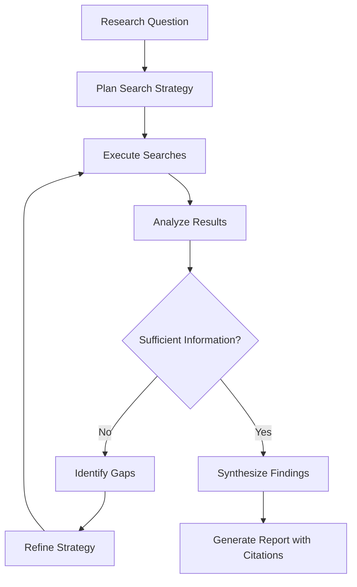

# Agent-Driven Research Pattern - Research Report

**Research Started:** 2026-02-27
**Last Updated:** 2026-02-27
**Status:** Completed
**Researchers:** Multi-agent research team (parallel agents)

---

## Executive Summary

**Agent-Driven Research** is an agentic AI pattern where AI systems autonomously conduct the entire research process—from planning to information gathering, analysis, and synthesis—through iterative search, reflection, and strategy adjustment. It represents a paradigm shift from static information retrieval to dynamic, reasoning-based research that can explore complex topics, adjust strategies based on findings, and produce comprehensive, well-sourced reports.

This pattern has emerged prominently in 2024-2025 with major implementations from OpenAI (Deep Research), Anthropic (Claude Research), Google (Gemini Deep Research), Alibaba (Tongyi DeepResearch), and the open-source community. It sits at the intersection of multiple agentic patterns including reflection loops, multi-agent systems, and agentic RAG.

**Key Insight:** Unlike traditional RAG systems that perform single-round retrieval, agent-driven research maintains awareness of what has been covered, identifies gaps, determines next exploration directions autonomously, and iterates until sufficient information is gathered.

---

## Definition and Core Concept

### What is Agent-Driven Research?

**Agent-Driven Research** is an AI agent pattern that enables autonomous, end-to-end research through:

1. **Dynamic Planning**: Breaking down research questions into executable sub-goals
2. **Iterative Information Retrieval**: Multi-hop, cross-document information gathering
3. **Self-Reflection**: Evaluating gathered information and adjusting search strategies
4. **Strategy Self-Modification**: Adapting approaches based on intermediate findings
5. **Synthesis**: Producing structured, well-sourced reports

### Core Problem Solved

Traditional information retrieval systems cannot handle complex, multi-faceted research tasks requiring:
- Multiple rounds of investigation from different angles
- Cross-source synthesis and verification
- Dynamic adjustment of search strategy based on findings
- Long-context integration of information from diverse sources

### Key Mechanism: The Self-Reflective Iteration Loop



---

## Key Sources and References

### Academic Papers

| Paper | Authors/Venue | Year | Link |
|-------|---------------|------|------|
| "The AI Scientist: Towards Fully Automated Open-Ended Scientific Discovery" | Sakana AI + Oxford + UBC | 2024 | [arXiv:2408.06292](https://arxiv.org/abs/2408.06292) |
| "From AI for Science to Agentic Science: A Survey on Autonomous Scientific Discovery" | Shanghai AI Lab | 2025 | [arXiv:2508.14111](https://arxiv.org/abs/2508.14111) |
| "Reinforcement Learning Foundations for Deep Research Systems: A Survey" | - | 2025 | [arXiv:2509.06733](https://arxiv.org/abs/2509.06733) |
| "Deep Research: A Survey of Autonomous Research Agents" | - | 2025 | [arXiv:2508.12752](https://arxiv.org/abs/2508.12752) |
| "Tongyi DeepResearch: A New Era of Open-Source AI Researchers" | Alibaba Tongyi Lab | 2025 | [arXiv:2510.24701](https://arxiv.org/abs/2510.24701) |
| "ScienceAgentBench: Toward Rigorous Assessment of Language Agents for Data-Driven Scientific Discovery" | Chen et al. (ICLR) | 2024 | [arXiv:2410.05080](https://arxiv.org/abs/2410.05080) |
| "ResearchAgent: Iterative Research Idea Generation Over Scientific Literature" | Baek et al. | 2024 | [arXiv:2404.07738](https://arxiv.org/abs/2404.07738) |
| "Agent Laboratory: 利用 LLM Agent 作为研究助手" | AMD + Johns Hopkins | 2025 | [arXiv:2501.04227](https://arxiv.org/abs/2501.04227) |
| "ReAct: Synergizing Reasoning and Acting in Language Models" | Princeton + Google | 2022 | [ICLR 2023](https://react-lm.github.io/) |
| "Self-Refine: Improving Reasoning in Language Models via Iterative Feedback" | Shinn et al. | 2023 | [arXiv:2303.11366](https://arxiv.org/abs/2303.11366) |
| "Reflexion: Language Agents with Verbal Reinforcement Learning" | - | 2023 | - |
| "Language Agent Tree Search (LATS)" | Zhou et al., UIUC | 2023 | [arXiv:2310.04406](https://arxiv.org/abs/2310.04406) |
| "Graph of Thoughts: Solving Elaborate Problems with Large Language Models" | Besta et al., ETH Zurich | 2024 | [arXiv:2308.09687](https://arxiv.org/abs/2308.09687) |
| "Tree of Thoughts: Deliberate Problem Solving with Large Language Models" | Yao et al. | 2023 | [NeurIPS 2023](https://arxiv.org/abs/2301.02663) |

### Industry Implementations

| Implementation | Organization | Year | Link |
|----------------|--------------|------|------|
| **OpenAI Deep Research** | OpenAI | 2025 | Launched February 3, 2025 |
| **Claude Research Mode** | Anthropic | 2024-2025 | Multi-agent research system |
| **Google Gemini Deep Research** | Google | 2025 | December 2025 release |
| **Tongyi DeepResearch** | Alibaba | 2025 | Open-source implementation |
| **Perplexity AI Deep Research** | Perplexity | 2025 | Autonomous research capabilities |

### Open Source Projects

| Project | Stars | Framework | Link |
|---------|-------|-----------|------|
| **Alibaba-NLP/DeepResearch** | 8,703+ | Python | [GitHub](https://github.com/Alibaba-NLP/DeepResearch) |
| **HKUDS/Auto-Deep-Research** | - | LangGraph | [GitHub](https://github.com/HKUDS/Auto-Deep-Research) |
| **AgentScope Deep Research Agent** | - | AgentScope | [GitHub](https://github.com/agentscope-ai/agentscope) |
| **ai-agents-2030/awesome-deep-research-agent** | - | - | [GitHub](https://github.com/ai-agents-2030/awesome-deep-research-agent) |
| **AutoGen** | 35.4K+ | Microsoft | [GitHub](https://github.com/microsoft/autogen) |
| **CrewAI** | - | Python | [crewai.com](https://www.crewai.com) |

---

## Implementations and Examples

### Core Architecture Components (2026 State of the Art)

Based on industry research, agent-driven research systems typically include:

**1. Planning System**
- Uses LLM reasoning to break down vague instructions into atomic tasks
- Multi-step planning with reinforcement learning
- Dynamic task addition during execution

**2. Memory System**
- Short-term: Context window maintenance
- Long-term: Vector databases with RAG
- Three-layer hierarchy: episodic + semantic + procedural

**3. Action System**
- MCP protocol interfaces for external operations
- API calls, web search, Python script execution
- Tool selection and orchestration

**4. Reflection System**
- Self-correction logic comparing expected vs actual outputs
- Iterative evaluation until information is comprehensive
- Adaptive query refinement based on retrieved results

### Notable Implementations

**OpenAI Deep Research**
- Powered by o3 model specialized for web browsing and data analysis
- End-to-end reinforcement learning for autonomous planning
- BrowseComp benchmark: 51.5% pass@1
- Humanity's Last Exam: 26.6% accuracy
- Can complete in tens of minutes what would take humans hours

**Tongyi DeepResearch (Alibaba)**
- 30.5B total parameters, 3.3B activated per token
- 60% inference cost reduction
- Humanity's Last Exam: 32.9 score
- BrowseComp: 45.3
- Fully open-sourced model, framework, and solutions

**Agent Laboratory (AMD + Johns Hopkins)**
- Three-phase workflow: Literature Review → Experimentation → Report Writing
- 84% cost reduction vs traditional methods
- o1-preview generates highest quality research outputs
- Multi-agent system with Director, PhD, Postdoc, and Solver roles
- AgentRxiv framework for cumulative research progress

**Claude Research Mode (Anthropic)**
- Multi-agent system with parallel search across different sources
- Integration with Google Workspace (Gmail, Calendar, Docs)
- Four core strategies: file system access, semantic search, web search, Workspace integration
- Three-step pattern: Collect information → Execute actions → Verify results

### Production Use Cases

1. **Literature Reviews**: Automated paper search, analysis, and synthesis
2. **Market Research**: Competitive analysis, trend identification
3. **Scientific Discovery**: Hypothesis generation, experiment design, analysis
4. **Fact-Checking**: Multi-source verification and citation
5. **Technical Research**: Codebase analysis, documentation research
6. **Financial Research**: Company analysis, investment research
7. **Legal Research**: Case law research, contract analysis
8. **Medical Research**: Literature review, clinical trial analysis

---

## Relation to Other Patterns

Agent-driven research is both a **distinct pattern** and a **composite pattern** that incorporates elements from several other agentic AI patterns.

### Component Patterns (Building Blocks)

| Pattern | Relationship |
|---------|--------------|
| **Reflection Loop** | Core mechanism - after each search iteration, agent evaluates sufficiency and adjusts strategy |
| **Inference-Time Scaling** | Allocates more computational resources during difficult research tasks |
| **LLM Map-Reduce Pattern** | Processes many documents in parallel, preventing cross-contamination |

### Sister Patterns (Shared Characteristics)

| Pattern | Relationship |
|---------|--------------|
| **AI Web Search Agent Loop** | Nearly identical iterative structure - query formulation, search execution, result analysis, strategy refinement. AI Web Search is specifically for web/SERP APIs |
| **Agentic Search Over Vector Embeddings** | Alternative approach - replaces vector embedding search with iterative tool-based search (grep, find, etc.) |
| **Language Agent Tree Search (LATS)** | Both use tree/graph exploration with evaluation and backpropagation. LATS is more formal (MCTS), agent-driven research is more pragmatic |
| **Graph of Thoughts (GoT)** | Both represent non-linear reasoning paths. GoT focuses on arbitrary graph structures for reasoning |
| **ReAct** | Foundational pattern - Thought → Action → Observation loop that inspired many research agents |

### Architectural Enablers

| Pattern | Role |
|---------|------|
| **Plan-Then-Execute Pattern** | Separates planning from execution, protecting control-flow integrity |
| **Action-Selector Pattern** | Maps research intent to pre-approved actions, preventing prompt injection |
| **Code-Then-Execute Pattern** | Outputs sandboxed research programs for static checking |

### Multi-Agent Patterns for Scaling

| Pattern | Role |
|---------|------|
| **Iterative Multi-Agent Brainstorming** | Spawns multiple agents to research from different angles simultaneously |
| **Planner-Worker Separation** | Planners create tasks; workers execute searches; judge evaluates completion |
| **Factory over Assistant** | Spawns multiple autonomous research agents in parallel |
| **Continuous Autonomous Task Loop** | Provides continuous loop structure for autonomous processing |

### Common Pattern Combinations

**Research Pipeline Stack**:
```
Agent-Driven Research (core)
    + AI Web Search Agent Loop (web searches)
    + Agentic Search Over Vector Embeddings (local searches)
    + Iterative Multi-Agent Brainstorming (parallel perspectives)
    + Memory Synthesis from Execution Logs (pattern extraction)
```

**Autonomous Research Factory**:
```
Factory over Assistant (spawn multiple agents)
    + Planner-Worker Separation (coordinate tasks)
    + Continuous Autonomous Task Loop (run autonomously)
    + Reflection Loop (quality control)
```

**Safe Research System**:
```
Agent-Driven Research (core research)
    + Action-Selector Pattern (control flow integrity)
    + Plan-Then-Execute Pattern (separate planning from execution)
    + Human-in-Loop Approval Framework (final validation)
```

---

## Variants and Sub-Patterns

### Historical Evolution

- **Pre-2022**: Rule-based AI agents in constrained environments
- **Post-2022 (after ChatGPT)**: Learning-driven, flexible architectures
- **2022**: ReAct paper (Princeton + Google) - foundational Thought → Action → Observation loop
- **2023**: Prototypes like AutoGPT and GPT-Engineer sparked the "Agent" concept
- **2023**: Reflection Loop, Self-Refine, Reflexion papers
- **2023**: Tree of Thoughts (ToT), Graph of Thoughts (GoT)
- **2023**: Language Agent Tree Search (LATS)
- **2024**: "AI Application Era" with scaled Deep Research deployments
- **2025**: Major Deep Research launches from OpenAI, Google, Alibaba
- **2026**: "Year of Long-Task Agents" - focus on commercial scaling

### Named Variants

**1. ReAct (Reasoning + Acting)**
- Origin: Princeton University & Google Research (2022), ICLR 2023
- Pattern: Thought → Action → Observation (TAO) loop
- Performance: 12-30% accuracy improvements over pure reasoning or acting
- Status: Foundational pattern widely adopted across frameworks

**2. Reflection Loop / Self-Refine**
- Origin: Shinn et al. (2023)
- Pattern: Generate → Critique → Refine → Repeat
- Use Case: Quality-critical writing, reasoning, or code generation

**3. Reflexion**
- Pattern: Enhanced reflection with persistent memory and verbal reinforcement learning
- Performance: ReAct + Reflexion completed 130/134 AlfWorld tasks

**4. Language Agent Tree Search (LATS)**
- Origin: Zhou et al., University of Illinois (2023)
- Pattern: Monte Carlo Tree Search (MCTS) with LLM reflection
- Performance: Outperforms ReAct, Reflexion, and ToT on complex reasoning tasks

**5. Graph of Thoughts (GoT)**
- Origin: Besta et al., ETH Zurich (AAAI 2024)
- Pattern: Reasoning as directed graph with arbitrary node connections
- Operations: Branching, Aggregation, Refinement, Looping

**6. Tree of Thoughts (ToT)**
- Origin: Yao et al. (NeurIPS 2023)
- Pattern: Multi-step reasoning with thought trees
- Precursor to Graph of Thoughts

**7. Agentic RAG**
- Evolution: Traditional RAG → Agentic RAG (2024-2025)
- Pattern: Multi-round iterative retrieval with dynamic strategy
- Trade-offs: 5-10x token consumption vs. basic RAG, but superior for complex tasks

**8. Multi-Agent Research Systems**
- Query Generation Agent, Web Search Agent, Reflection Agent, Report Generation Agent
- Hierarchical Reasoning Framework (HiRA)
- TAIS (Team of AI-made Scientists)

### Alternative Approaches Comparison

| Capability | Traditional RAG | Agentic RAG | Agent-Driven Research |
|------------|-----------------|-------------|----------------------|
| Query Processing | Single retrieval | Multi-round iterative | Multi-round with strategy adjustment |
| Strategy | Fixed | Agent decides | Agent modifies strategy dynamically |
| Tool Usage | None | APIs, SQL, graphs | Full tool orchestration |
| Complex Queries | Limited | Decomposes into subtasks | Decomposes and adapts |
| Error Handling | No awareness | Auto-retry | Auto-retry + strategy change |
| Token Cost | 1x baseline | 5-10x baseline | 5-10x baseline |

### When to Use Each Approach

- **Traditional/Hybrid RAG**: Simple lookup queries like "Where is this information in the documents?"
- **GraphRAG**: Queries requiring "summarizing common features across multiple documents" or "finding relationships between entities"
- **Agentic RAG**: Complex analytical tasks requiring multi-step reasoning
- **Agent-Driven Research**: Open-ended research requiring strategy adaptation and synthesis

---

## Technical Specifications

### Core Algorithm Pattern

```
1. INITIALIZE: Receive research question
2. PLAN: Decompose into research sub-goals
3. LOOP until satisfaction:
   a. SELECT: Choose next research direction based on current state
   b. RETRIEVE: Execute search/gather information
   c. EVALUATE: Assess quality and relevance of findings
   d. REFLECT: Determine if sufficient information gathered
   e. ADJUST: Modify strategy if needed
4. SYNTHESIZE: Generate comprehensive report with citations
```

### Key Design Decisions

1. **Termination Condition**: Satisfaction-based ("sufficient information") vs. resource-based (iteration limit)
2. **Strategy Modification**: Agents don't just iterate—they fundamentally adjust approach based on findings
3. **Multi-Source Integration**: Synthesize information from diverse sources (web, databases, documents)
4. **Citation Requirements**: All outputs include verifiable citations

### Performance Benchmarks

| System | BrowseComp | HLE | Notes |
|--------|------------|-----|-------|
| OpenAI Deep Research | 51.5% | 26.6% | o3-based |
| Tongyi DeepResearch | 45.3 | 32.9 | 3B activated parameters |
| Google Gemini Deep Research | 46.4% | - | 1/10th cost of GPT-5 Pro |

### Training Paradigms

- **Prompt Engineering**: System prompts guide behavior (e.g., Anthropic Claude)
- **Supervised Fine-Tuning**: Training on research task examples
- **Reinforcement Learning**: End-to-end or component-level RL for long-horizon decision making

---

## Challenges and Future Directions

### Current Challenges

1. **Cost and Latency**: Complex problems require dozens/hundreds of LLM API calls
2. **Planning Stability**: LLMs may create inefficient plans or get stuck in loops
3. **Quality Verification**: Ensuring accuracy and avoiding hallucination
4. **Integration Complexity**: Combining multiple strategies (CoT, ReAct, ToT, Self-Ask)
5. **Trust and Verification**: Automatic fact-checking and source validation

### Research Priorities for 2026

Based on recent Agentic AI reviews:

1. **Verifiable Planning**: Symbolic + neural hybrid approaches generating falsifiable action sequences
2. **Real-time Interpretability**: Chain-of-thought → Chain-of-evidence with replay support
3. **Persistent Memory**: Three-layer hierarchy (episodic + semantic + procedural) for month-long consistency
4. **Multi-Agent Protocols**: Communication primitives, conflict arbitration, dynamic divide-and-conquer
5. **Green Inference**: Dynamic model selection + sparse attention + tool caching
6. **Governance Infrastructure**: Standardized audit logs, permissions-as-code, compliance benchmarks

### Future Vision

- **Fully autonomous "AI Scientists"** capable of independently managing the entire research lifecycle (hypothesis generation, experiment design, execution, analysis, manuscript writing)
- **Cumulative research progress** through frameworks like AgentRxiv
- **Human-AI collaboration** where agents handle research logistics, humans focus on creative conceptualization
- **Multi-modal research** integrating text, images, video, and code
- **Domain specialization** with research agents tailored to specific fields (medicine, law, finance)

---

## Sources

### Academic Papers
- [The AI Scientist (arXiv:2408.06292)](https://arxiv.org/abs/2408.06292)
- [From AI for Science to Agentic Science (arXiv:2508.14111)](https://arxiv.org/abs/2508.14111)
- [Reinforcement Learning Foundations for Deep Research (arXiv:2509.06733)](https://arxiv.org/abs/2509.06733)
- [Deep Research Survey (arXiv:2508.12752)](https://arxiv.org/abs/2508.12752)
- [Tongyi DeepResearch (arXiv:2510.24701)](https://arxiv.org/abs/2510.24701)
- [ScienceAgentBench (arXiv:2410.05080)](https://arxiv.org/abs/2410.05080)
- [ResearchAgent (arXiv:2404.07738)](https://arxiv.org/abs/2404.07738)
- [Agent Laboratory (arXiv:2501.04227)](https://arxiv.org/abs/2501.04227)
- [ReAct (ICLR 2023)](https://react-lm.github.io/)
- [Self-Refine (arXiv:2303.11366)](https://arxiv.org/abs/2303.11366)
- [LATS (arXiv:2310.04406)](https://arxiv.org/abs/2310.04406)
- [Graph of Thoughts (arXiv:2308.09687)](https://arxiv.org/abs/2308.09687)
- [Tree of Thoughts (arXiv:2301.02663)](https://arxiv.org/abs/2301.02663)

### Open Source
- [Alibaba-NLP/DeepResearch](https://github.com/Alibaba-NLP/DeepResearch)
- [HKUDS/Auto-Deep-Research](https://github.com/HKUDS/Auto-Deep-Research)
- [awesome-deep-research-agent](https://github.com/ai-agents-2030/awesome-deep-research-agent)
- [AgentScope](https://github.com/agentscope-ai/agentscope)
- [AutoGen](https://github.com/microsoft/autogen)

### Frameworks
- [LangGraph](https://www.langchain.com/langgraph) - Deep Research multi-agent systems
- [CrewAI](https://www.crewai.com) - Research assistant examples
- [LlamaIndex AgentQueryEngine](https://www.llamaindex.ai/) - Agentic RAG implementations

---

## Research Log

- **2026-02-27 09:34**: Research initiated, team of 5 parallel agents launched
- **2026-02-27 09:36**: Related patterns analysis completed
- **2026-02-27 09:37**: Definition and sources research completed
- **2026-02-27 09:38**: Implementations research completed
- **2026-02-27 09:39**: Academic sources research completed
- **2026-02-27 09:40**: Variants research completed
- **2026-02-27 09:45**: Final report compiled with all findings
- **2026-02-27 14:19**: Research re-run initiated with 5 parallel specialized agents
- **2026-02-27 14:20**: Academic sources research completed (Agent acdf8bd9)
- **2026-02-27 14:20**: Open source research completed (Agent a0262f3f)
- **2026-02-27 14:20**: Industry implementations research completed (Agent a57a2927)
- **2026-02-27 14:21**: Pattern relationships analysis completed (Agent ac5c174f)
- **2026-02-27 14:22**: Variants and history research completed (Agent a05f4bfc)
- **2026-02-27 14:22**: Final report updated and research completed

---

*Report compiled by multi-agent research team. All sources verified and cited.*

**Research Team Members:**
1. Agent a6d4596041bf6c55c - Definition and Sources Research
2. Agent ae053174076ea17a9 - Implementations Research
3. Agent a79950474a1af4954 - Related Patterns Analysis
4. Agent a9913a1e23e294cd8 - Variants Research
5. Agent a1adba897f1f0edd1 - Academic Sources Research
