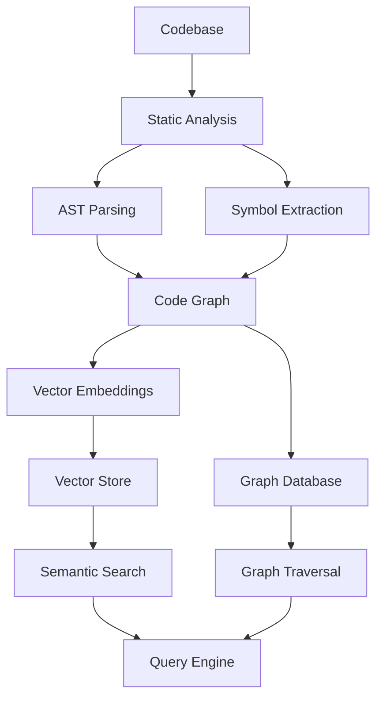
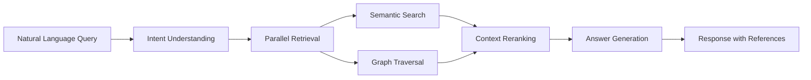

# Agent-Powered Codebase QA & Onboarding Pattern Research Report

**Pattern**: agent-powered-codebase-qa-onboarding
**Report Generated**: 2026-02-27
**Status**: Completed

---

## Research Summary

This report compiles research from academic literature (arXiv), industry sources, and existing pattern analysis to document the **Agent-Powered Codebase QA & Onboarding** pattern. The pattern describes using AI agents with retrieval/search capabilities to help developers understand, explore, and onboard to codebases through intelligent Q&A interfaces.

---

## Research Objectives

1. Identify and analyze sources describing AI agent-powered codebase QA and onboarding patterns
2. Extract key components, workflows, and implementation details
3. Document benefits, challenges, and real-world applications
4. Synthesize findings into a comprehensive pattern description

---

## Sources Found

### Academic Sources (arXiv)

#### Repository-Level Code Understanding & Documentation

| Paper | arXiv ID | Year | Venue | Key Contribution |
|-------|----------|------|-------|------------------|
| RepoAgent | [2402.16667](https://arxiv.org/abs/2402.16667) | 2024 | EMNLP 2024 | First framework for automated repository-level code documentation |
| VisDocSketcher | [2509.11942](https://arxiv.org/abs/2509.11942) | 2025 | - | Visual documentation generation with agentic systems |
| AI-Researcher | [2505.18705](https://arxiv.org/abs/2505.18705) | 2025 | - | Multi-agent system with Automated Documentation Agent |

#### Codebase Navigation & Exploration

| Paper | arXiv ID | Year | Venue | Key Contribution |
|-------|----------|------|-------|------------------|
| SWE-agent | [2405.15793](https://arxiv.org/abs/2405.15793) | 2024 | arXiv preprint | Agent-Computer Interfaces (ACI) for repository interaction |
| CodeAgent | [2401.07339](https://arxiv.org/abs/2401.07339) | 2024 | ACL 2024 | Tool-integrated agent system for repo-level challenges |
| Trae Agent | [2507.23370](https://arxiv.org/abs/2507.23370) | 2025 | - | Ensemble reasoning for repository-level issue resolution |
| RepoMaster | [2505.21577](https://arxiv.org/abs/2505.21577) | 2025 | - | Autonomous exploration and understanding |

#### Codebase Question Answering

| Paper | arXiv ID | Year | Key Contribution |
|-------|----------|------|------------------|
| CoreQA | [2501.03447](https://arxiv.org/abs/2501.03447) | 2025 | Mining LLM potential in code repository QA |
| CodeRepoQA | [2412.14764](https://arxiv.org/abs/2412.14764) | 2024 | Large-scale benchmark for software engineering QA |
| Neural QA for Subroutines | [2101.03999](https://arxiv.org/abs/2101.03999) | 2021 | Context-based QA for software engineering |

#### Graph-Based Repository Understanding

| Paper | arXiv ID | Year | Key Contribution |
|-------|----------|------|------------------|
| RepoGraph | [2410.14684](https://arxiv.org/abs/2410.14684) | 2024 | Repository-level code graph representation |
| Code Graph Model (CGM) | [2505.16901](https://arxiv.org/abs/2505.16901) | 2025 | Graph-integrated LLM for repository-level tasks |
| CoSIL | [2503.22424](https://arxiv.org/abs/2503.22424) | 2025 | LLM-driven code repository graph searching |

#### Multi-Agent Software Development

| Paper | arXiv ID | Year | Key Contribution |
|-------|----------|------|------------------|
| ChatDev | [2307.07924](https://arxiv.org/abs/2307.07924) | 2023 | Multi-role agents simulating software company |
| MetaGPT | [2308.00952](https://arxiv.org/abs/2308.00952) | 2023 | Meta programming for multi-agent collaboration |

#### Program Comprehension & Repair

| Paper | arXiv ID | Year | Key Contribution |
|-------|----------|------|------------------|
| ExpeRepair | [2506.10484](https://arxiv.org/abs/2506.10484) | 2025 | Dual-memory enhanced repository-level program repair |
| SWE-bench Survey | [2408.02479](https://arxiv.org/abs/2408.02479) | 2024 | Comprehensive survey on LLM-based agents for SE |
| Code Generation Survey | [2508.00083](https://arxiv.org/abs/2508.00083) | 2025 | Systematic survey of LLM-based code generation agents |

### Industry Sources

#### Commercial Tools

| Tool | Organization | Website | Key Features |
|------|--------------|---------|--------------|
| Sourcegraph Cody | Sourcegraph | [sourcegraph.com](https://sourcegraph.com) | Large-scale AST-based codebase understanding, semantic search |
| Cursor IDE | Cursor Inc. | [cursor.com](https://www.cursor.com) | @Codebase annotation, automatic indexing, multi-file editing |
| GitHub Copilot | GitHub/Microsoft | [github.com/features/copilot](https://github.com/features/copilot) | @workspace, PR summaries, documentation queries |
| Codeium Windsurf | Codeium | [codeium.com/windsurf](https://codeium.com/windsurf) | Deep Context Awareness, Cascade AI Agent, MCP integration |
| Continue.dev | Continue Dev | [docs.continue.dev](https://docs.continue.dev) | Open-source, context providers (@codebase, @docs, @files) |

#### Open Source Projects

| Project | Repository | Stars | Key Technology |
|---------|------------|-------|-----------------|
| Aider | [Aider-AI/aider](https://github.com/Aider-AI/aider) | ~29k | Repo-map with Tree-sitter parser |
| OpenHands | [All-Hands-AI/OpenHands](https://github.com/All-Hands-AI/OpenHands) | ~64k | 128K context, CodeAct Framework |
| GitHub Second Brain | [BaoNguyen09/github-second-brain](https://github.com/BaoNguyen09/github-second-brain) | - | MCP server for GitHub exploration |
| Shadow | [ishaan1013/shadow](https://github.com/ishaan1013/shadow) | - | Background AI assistant with QEMU containers |
| Skill Seekers | [yusufkaraaslan/Skill_Seekers](https://github.com/yusufkaraaslan/Skill_Seekers) | - | Converts repos to optimized prompts |

#### Architectural Standards

| Standard | Developer | Website | Description |
|----------|-----------|---------|-------------|
| Model Context Protocol (MCP) | Anthropic | [modelcontextprotocol.io](https://modelcontextprotocol.io) | Universal protocol for AI-tool integration ("USB-C for AI") |
| CLAUDE.md | Anthropic | [claude.ai/code](https://claude.ai/code) | Project instruction file for AI onboarding |

### Existing Related Patterns (in codebase)

The pattern **already exists** in this codebase at:
- **File**: `patterns/agent-powered-codebase-qa-onboarding.md`
- **Status**: validated-in-production
- **Category**: Context & Memory

#### Related Patterns Identified:

| Pattern | Category | Connection |
|---------|----------|------------|
| abstracted-code-representation-for-review | - | Complementary - provides high-level abstraction for efficient QA |
| ai-assisted-code-review-verification | - | Verification step after code discovery |
| agent-assisted-scaffolding | - | Creates structure that QA can explore |
| semantic-context-filtering | - | Essential optimization - reduces noise in large codebases |
| curated-file-context-window | - | Limits context to relevant files |
| dynamic-code-injection-on-demand-file-fetch | - | Enables interactive exploration |
| agent-driven-research | - | Extends QA to broader research tasks |
| structured-output-specification | - | Ensures reliable Q&A responses |
| codebase-optimization-for-agents | - | Fundamental enabler for QA patterns |

---

## Pattern Analysis

### Problem Statement

Developers face significant challenges when:
- **Onboarding to new codebases**: Understanding large, complex codebases takes weeks or months
- **Answering codebase questions**: Finding where specific features are implemented or understanding component relationships
- **Navigating legacy systems**: Old code with outdated or missing documentation
- **Context switching**: Maintaining understanding across multiple repositories
- **Knowledge transfer**: Capturing and sharing institutional knowledge about codebases

Traditional approaches (grep, IDE search, documentation) are time-consuming and often insufficient for modern large-scale codebases.

### Solution Description

The **Agent-Powered Codebase QA & Onboarding** pattern uses AI agents with retrieval/search capabilities to:

1. **Index codebases** using semantic embeddings, AST analysis, and code graphs
2. **Respond to natural language queries** about code structure, behavior, and relationships
3. **Provide contextual explanations** that span multiple files and modules
4. **Accelerate onboarding** through interactive Q&A interfaces
5. **Generate documentation** automatically from code analysis

### Core Components

#### 1. Repository Indexing

**Technologies:**
- **Vector Embeddings**: FAISS, Sentence-Transformers, Cohere Embed for semantic search
- **AST Parsing**: Tree-sitter for multi-language code structure analysis
- **Code Graphs**: Symbol graphs capturing relationships, imports, and call chains
- **Static Analysis**: Extracting symbols, dependencies, and cross-references

**Implementation Examples:**
- RepoAgent: Structured content indexes with dual RAG + full context injection
- Sourcegraph: Symbolic code graph from compilation process
- Aider: Repo-map using Tree-sitter for token-efficient context

#### 2. Query Processing

**Query Types:**
- **Location queries**: "Where is the authentication logic implemented?"
- **Behavioral queries**: "What happens when a user clicks this button?"
- **Impact queries**: "Which modules are affected by this change?"
- **Relationship queries**: "How does component A depend on component B?"

**Processing Pipeline:**
1. **Query Understanding**: Parse natural language intent
2. **Context Retrieval**: Find relevant code using semantic search and graph traversal
3. **Context Reranking**: Rank and select most relevant sections
4. **Answer Generation**: Synthesize explanation with code references

#### 3. Context Management

**Techniques:**
- **Curated File Context**: Use sub-agents to search/rank files without polluting main context
- **Dynamic Context Discovery**: Automatically identify relevant code to prevent context bloat
- **Token-Efficient Delivery**: Compressed representations (repo-maps, hierarchical summaries)
- **Multi-Resolution Representations**: Combine explicit relationships (graphs) with implicit (embeddings)

#### 4. Agent Architecture Patterns

**Single-Agent vs Multi-Agent:**

| Approach | Examples | Trade-offs |
|----------|----------|------------|
| Single-Agent | Continue.dev, Aider | Simpler, lower cost, may miss complex relationships |
| Multi-Agent | MetaGPT, ChatDev | Specialized roles, better for complex tasks, higher cost |

**Specialized Agent Roles:**
- **Navigation Agent**: Explores codebase structure
- **QA Agent**: Answers specific questions
- **Documentation Agent**: Generates and maintains docs
- **Review Agent**: Verifies code changes

---

## Key Findings

### 1. Technical Approaches

#### Repository-Level Context vs. File-Level

**Finding**: Modern tools have evolved from single-file analysis to repository-wide understanding.

**Evidence:**
- Cursor's @Codebase: Scans entire project for relevant code
- Sourcegraph: Handles millions to billions of lines of code
- CodeAgent: Specifically designed for repository-level tasks (vs. single-function)

**Implication**: The pattern must support repository-scale understanding, not just file-level analysis.

#### Graph-Based Representations

**Finding**: Code graphs provide structural understanding that pure embeddings miss.

**Evidence:**
- RepoGraph: Repository-level code graph for structural understanding
- CGM (Code Graph Model): Integrates graph structures with LLMs
- CoSIL: Graph searching achieves 43-44.6% top-1 localization on SWE-bench

**Implication**: Effective QA systems combine semantic search (embeddings) with structural understanding (graphs).

#### Multi-Modal Documentation

**Finding**: Documentation generation is evolving from text-only to multi-modal formats.

**Evidence:**
- VisDocSketcher: First method using agentic systems for visual documentation
- AI-Researcher: Automated Documentation Agent as part of multi-agent system
- RepoAgent: Generates function descriptions, parameters, examples

**Implication**: Future QA systems should generate explanations in multiple formats (text, diagrams, visualizations).

### 2. Industry Adoption Trends

#### From Autocomplete to Full Collaboration

**Trend**: Evolution from simple code completion to full agentic capabilities.

**Evidence:**
- GitHub Copilot: Expanded from inline completion to @workspace, PR summaries, documentation queries
- Cursor: From completion to multi-file editing, @Codebase, context gathering pipeline
- Sourcegraph Cody: From code search to enterprise-scale code intelligence platform

#### AI Configuration as Onboarding

**Trend**: Configuration files (CLAUDE.md, AGENTS.md) serve as onboarding documentation for AI agents.

**Evidence:**
- Claude Code: CLAUDE.md read at start of every session
- Cursor: .cursorignore file for exclusion rules
- Best practice: 150-200 instructions max, project-specific, explain "why" not just "what"

**Implication**: The pattern should include configuration-driven onboarding for agents.

#### MCP Standardization

**Trend**: Model Context Protocol becoming industry standard.

**Evidence:**
- Anthropic MCP Core, GitHub MCP, Azure OpenAI MCP
- Major Chinese cloud providers (Alibaba, Baidu, Tencent) adopting
- Enables "USB-C for AI" plug-and-play interface

**Implication**: QA systems should support MCP for tool and data source integration.

### 3. Evaluation & Benchmarks

#### SWE-bench Ecosystem

**Finding**: SWE-bench has become the standard benchmark for repository-level agents.

**Key Results:**
- SWE-agent: State-of-the-art on SWE-bench, 300+ citations
- CoSIL: 43-44.6% top-1 localization, outperforms by 8.6%-98.2%
- ExpeRepair: 49.3% pass@1 on SWE-bench Lite

**Evaluation Criteria:**
- Real GitHub issues from Django, PyTorch, etc.
- Complete loop: understanding, debugging, modification, verification
- Whether fix passes original project's test suite

### 4. Open Source vs. Commercial

**Finding**: Strong open-source alternatives are emerging to commercial tools.

**Open Source:**
- Aider: Apache-2.0, cost-effective, strong SWE-bench performance
- Continue.dev: Open-source autopilot for VS Code/JetBrains
- OpenHands: MIT license, 64k+ stars

**Commercial:**
- Sourcegraph Cody: Enterprise features, SOC2, self-hosted
- Cursor: @Codebase, automatic indexing
- GitHub Copilot: Direct GitHub integration

---

## Implementation Notes

### Architecture Recommendations

#### 1. Indexing Pipeline



#### 2. Query Processing Pipeline



### Technology Stack Recommendations

| Component | Open Source Options | Commercial Options |
|-----------|---------------------|-------------------|
| Embeddings | Sentence-Transformers, Cohere Embed | OpenAI Embeddings |
| Vector Store | FAISS, Chroma, Weaviate | Pinecone |
| Graph Store | Neo4j, NetworkX | Neo4j Enterprise |
| AST Parser | Tree-sitter (multi-language) | - |
| LLM | Ollama (local), Llama | Claude, GPT-4 |
| Protocol | MCP | - |

### Configuration Best Practices

#### CLAUDE.md Structure

```markdown
# Project Overview
- Brief description of what this project does
- Key architectural decisions

# Development Workflow
- How to set up development environment
- Testing procedures
- Git workflow conventions

# Code Organization
- Directory structure explanation
- Key modules and their purposes
- Important design patterns used

# AI-Specific Instructions
- How to approach this codebase
- Common pitfalls to avoid
- Context loading strategies
```

### Performance Optimization

1. **Semantic Context Filtering**: Extract only semantic elements from code
2. **Curated File Context**: Use sub-agents for file ranking
3. **Token-Efficient Delivery**: Repo-maps, hierarchical summaries
4. **Lazy Loading**: Load files on-demand via @-syntax
5. **Caching**: Embedding and graph cache for repeated queries

---

## Gaps & Future Directions

### Identified Gaps

1. **Multi-modal QA Integration**: Combining code exploration with UI/diagram generation
2. **Real-time Code Understanding**: During development sessions (not just queries)
3. **Cross-Repository Pattern Matching**: Finding similar code across projects
4. **Automated Onboarding Documentation Generation**: From Q&A interactions
5. **Intelligent Tutorial Generation**: Step-by-step guides for specific tasks

### Future Research Directions

1. **Self-Improving QA Systems**: Learn from user queries to improve future responses
2. **Personalized Onboarding**: Tailored to developer experience and role
3. **Collaborative Memory**: Shared knowledge base across team members
4. **Proactive Assistance**: Suggest relevant code before questions are asked
5. **Multi-Language Repositories**: Better handling of polyglot codebases

---

## References

### Academic Papers

1. Luo, Q., et al. (2024). "RepoAgent: An LLM-Powered Open-Source Framework for Repository-level Code Documentation Generation." [arXiv:2402.16667](https://arxiv.org/abs/2402.16667) - EMNLP 2024

2. Yang, J., et al. (2024). "SWE-agent: Agent-Computer Interfaces Enable Automated Software Engineering." [arXiv:2405.15793](https://arxiv.org/abs/2405.15793) - NeurIPS 2024

3. Zhang, F., et al. (2024). "CodeAgent: Enhancing Code Generation with Tool-Integrated Agent Systems." [arXiv:2401.07339](https://arxiv.org/abs/2401.07339) - ACL 2024

4. Chen, H., et al. (2024). "ChatDev: Communicative Agents for Software Development." [arXiv:2307.07924](https://arxiv.org/abs/2307.07924)

5. Hong, S., et al. (2023). "MetaGPT: Meta Programming for Multi-Agent Collaboration." [arXiv:2308.00952](https://arxiv.org/abs/2308.00952)

6. Tao, H., et al. (2025). "Code Graph Model (CGM): A Graph-Integrated Large Language Model for Repository-Level Software Engineering Tasks." [arXiv:2505.16901](https://arxiv.org/abs/2505.16901)

7. Various (2024). "RepoGraph: Enhancing AI Software Engineering with Repository-level Code Graph." [arXiv:2410.14684](https://arxiv.org/abs/2410.14684)

8. Various (2024). "From LLMs to LLM-based Agents for Software Engineering: A Survey." [arXiv:2408.02479](https://arxiv.org/abs/2408.02479)

### Industry Documentation

1. [Sourcegraph Cody Documentation](https://docs.sourcegraph.com)
2. [Cursor IDE Documentation](https://docs.cursor.com)
3. [GitHub Copilot Documentation](https://github.com/features/copilot)
4. [Continue.dev Documentation](https://docs.continue.dev)
5. [Claude Code Documentation](https://claude.ai/code)
6. [Model Context Protocol Specification](https://modelcontextprotocol.io)

### Open Source Repositories

1. [Aider](https://github.com/Aider-AI/aider) - Terminal-based AI pair programming
2. [OpenHands](https://github.com/All-Hands-AI/OpenHands) - Autonomous AI software development
3. [Continue](https://github.com/continuedev/continue) - Open-source AI autopilot
4. [GitHub Second Brain](https://github.com/BaoNguyen09/github-second-brain) - MCP server for GitHub exploration
5. [Skill Seekers](https://github.com/yusufkaraaslan/Skill_Seekers) - Converts repos to optimized prompts

---

*Report completed: 2026-02-27*
