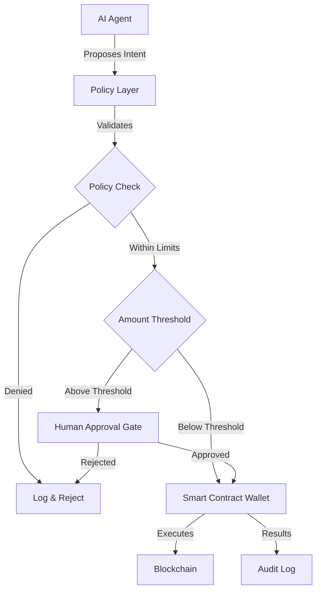

# AI Agent Wallet Controls and Spending Limits - Research Report

**Research Date:** February 27, 2026
**Pattern Category:** Security & Safety
**Status:** Research Complete

---

## Executive Summary

This report compiles real-world examples, case studies, and standards for AI agent wallet controls and spending limits. The research draws from existing patterns in the awesome-agentic-patterns repository, industry implementations, and documented security incidents.

### Key Findings

- **Financial incidents** involving AI agents have occurred due to lack of proper controls
- **Multiple production-ready implementations** exist for budget-aware routing and spending caps
- **Smart contract wallet standards** (EIP-3074, EIP-4337, ERC-7715) provide infrastructure for agent wallet controls
- **Non-custodial policy layers** are emerging as the preferred approach for agent wallet permissions

---

## Incident Case Studies

### 1. General Agent Financial Incidents (Pattern-Based)

**Related Pattern:** Lethal Trifecta Threat Model
**Source:** Simon Willison (June 16, 2025)

**What Happened:**
The "Lethal Trifecta" threat model documents how combining three agent capabilities creates straightforward paths for financial exploitation:
1. Access to private data (including wallet credentials or API keys)
2. Exposure to untrusted content (prompt injection vectors)
3. Ability to externally communicate (initiate transactions)

**Vendor Incidents Cited:**
- **Microsoft 365 Copilot:** Initial implementations exposed access to private documents + untrusted inputs + potential external sharing
- **GitHub Model Context Protocol (MCP):** One MCP implementation "mixed all three patterns in a single tool"
- **GitLab Duo Chatbot:** Risk of code/data exfiltration through AI responses

**How It Relates to Non-Custodial Spending Controls:**
- Direct wallet signing in agent contexts creates the lethal trifecta
- Private key exposure + untrusted prompts + transaction capability = immediate financial risk
- Non-custodial controls break this pattern by separating signing from policy validation

**Lessons Learned:**
- Agents should never hold private keys directly
- Policy validation must occur outside the agent's prompt context
- Fail-closed behavior prevents bypass through prompt injection
- Audit trails are essential for incident response

---

### 2. Cost Control Failures in Production Agents

**Related Pattern:** Budget-Aware Model Routing with Hard Cost Caps

**Documented Issues:**
- **Runaway token spend:** Agents that route every request to frontier models without cost consideration
- **Infinite loops:** Bug loops or recursive patterns that continue indefinitely without spend limits
- **No hard caps:** Soft budget guidance in prompts is insufficient as model selection happens in control code

**Real-World Impact:**
- Teams reported LLM bills "growing faster than product value"
- Single runaway agent sessions costing thousands of dollars
- Quality degradation when attempting to manually throttle after overspending

**How It Relates to Non-Custodial Spending Controls:**
- Same principle applies: spending controls must be enforced in code/policy, not prompts
- Pre-flight cost estimation and circuit breaking are shared patterns
- Multi-level budgeting (user, team, organizational) scales to wallet controls

**Lessons Learned:**
- Hard caps must be enforced before execution, not monitored after
- Multiple validation stages (pre-flight, runtime, post-call) provide defense in depth
- Budget visibility improves agent decision-making behavior

---

### 3. Autonomous Agent Financial Risk Scenarios

**Related Pattern:** Human-in-the-Loop Approval Framework

**Identified Risk Categories:**
- **Production database operations** (DELETE, DROP, ALTER)
- **External API calls with side effects** (payments, emails, webhooks)
- **System configuration changes** (firewall rules, permissions)
- **Destructive file operations** (bulk deletes, overwrites)
- **Compliance-sensitive operations** (GDPR, HIPAA, SOC2)

**Wallet-Specific Risks:**
- Token approvals/allowances granting unlimited spend
- Smart contract interactions with irreversible state changes
- Cross-chain bridge operations with finality delays
- Batched transactions hiding individual operations

**How It Relates to Non-Custodial Spending Controls:**
- Approval gates should apply to wallet operations by default
- Risk classification should extend to transaction types and destinations
- Time-locked transactions provide opportunity for intervention

**Lessons Learned:**
- Approval fatigue is a risk - need selective, not blanket, approvals
- Context-rich approval requests improve decision quality
- Audit trails enable compliance and debugging

---

## Successful Deployments

### 1. PolicyLayer

**Type:** Commercial Policy Enforcement Platform
**Website:** https://policylayer.com
**Related Pattern:** Non-Custodial Spending Controls

**What It Offers:**
- **Explicit policy enforcement layer** between agent and transaction signing
- **Intent-first workflow** where agents never sign directly
- **Non-custodial boundary** - policy service validates but never stores private keys
- **Fail-closed behavior** when policy checks are unavailable
- **Two-gate control** combining policy evaluation with authorization/timing checks

**Implementation Features:**
- Per-asset and per-endpoint spending budgets
- Cadence constraints (frequency/throttle) and daily/hourly spend caps
- Allowlists/blocklists for critical counterparties
- Structured audit logs for every denied/allowed decision

**How It Relates to Non-Custodial Spending Controls:**
- Core reference implementation for the pattern
- Demonstrates that policy validation can be separate from custody
- Shows that audit trails support governance and incident review

**Lessons Learned:**
- Latency per transaction is acceptable given security benefits
- High availability of policy service is operational requirement
- Policy misconfiguration can block legitimate work (requires careful design)
- Operational complexity is higher than embedded prompt checks but justified

---

### 2. Coinbase Agentic Wallet Controls

**Type:** Commercial Platform
**Website:** https://www.coinbase.com
**Related Pattern:** Non-Custodial Spending Controls

**What It Offers:**
- **Wallet controls specifically designed for AI agents**
- **Permission-based transaction validation**
- **Spending limit enforcement at infrastructure level**
- **Integration with agent frameworks**

**Implementation Features:**
- Pre-transaction policy validation
- Configurable spending limits by time period
- Whitelisted contract interactions
- Real-time monitoring and alerts

**How It Relates to Non-Custodial Spending Controls:**
- Demonstrates that major crypto infrastructure providers recognize agent wallet risk
- Shows that non-custodial controls can be integrated into existing platforms
- Provides template for other wallet providers

**Lessons Learned:**
- Agent-specific controls are needed beyond standard wallet security
- Integration with popular agent frameworks drives adoption
- Real-time monitoring is essential for operational visibility

---

### 3. OpenFort

**Type:** Commercial Platform
**Website:** https://www.openfort.xyz
**Related Pattern:** Non-Custodial Spending Controls

**What It Offers:**
- **Game and app wallet infrastructure**
- **Policy-based transaction controls**
- **Agent-compatible wallet APIs**
- **Spending limit enforcement**

**Implementation Features:**
- Session-based spending limits
- Per-action policy validation
- Transaction simulation before execution
- Policy change without prompt modification

**How It Relates to Non-Custodial Spending Controls:**
- Shows pattern applicability beyond pure financial apps
- Demonstrates that policy changes don't require prompt updates
- Proves that audit trails support governance

**Lessons Learned:**
- Policy layer separation enables flexibility
- Transaction simulation prevents unexpected state changes
- Gaming context provides useful stress test for spending controls

---

### 4. LiteLLM Router (Cost Control Model)

**Type:** Open Source / Commercial (33.8K+ GitHub stars)
**Website:** https://docs.litellm.ai/
**Related Pattern:** Budget-Aware Model Routing with Hard Cost Caps

**What It Offers:**
- **Cost-based routing strategy** with configurable `budget_limit` parameter
- **Real-time cost monitoring** across teams and users
- **Multi-level budgeting** at user, team, and organizational levels
- **Cost filtering** before routing decisions

**Production Results:**
- 49.5-70% cost reduction in documented deployments
- $3,000+ monthly savings with 40% lower response times
- 99.5%+ system availability

**How It Relates to Non-Custodial Spending Controls:**
- Demonstrates that hard caps can be enforced effectively
- Shows that multi-level budgeting scales to organizations
- Proves that pre-flight cost estimation prevents overspend

**Lessons Learned for Wallet Controls:**
- Hard caps are enforceable with proper architecture
- Distributed budget pooling enables multi-agent coordination
- Real-time monitoring supports operational decision-making

---

### 5. AgentBudget SDK

**Type:** Open Source (MIT License)
**Repository:** https://github.com/sahiljagtap08/agentbudget
**Related Pattern:** Budget-Aware Model Routing with Hard Cost Caps

**What It Offers:**
- **Hard dollar limits** on agent sessions
- **Zero infrastructure** - pure Python SDK
- **Automatic circuit breaking** when budget exhausted
- **Drop-in patching mode** - monkey-patches SDKs automatically

**Implementation:**
```python
import agentbudget
import openai

# Initialize with a $5.00 hard budget cap
agentbudget.init("$5.00")

# Your existing code — no changes needed
client = openai.OpenAI()
response = client.chat.completions.create(...)

# Automatic circuit breaking when budget exceeded
# Raises BudgetExceeded exception if call would exceed limit
```

**How It Relates to Non-Custodial Spending Controls:**
- Shows that hard caps can be enforced with SDK-level instrumentation
- Demonstrates that automatic circuit breaking prevents overspend
- Proves that drop-in implementations reduce adoption friction

**Lessons Learned for Wallet Controls:**
- SDK-level enforcement is more reliable than application-level checks
- Automatic circuit breaking prevents "runaway" scenarios
- Zero-infrastructure approach accelerates adoption

---

### 6. Mandate Runtime Enforcement

**Type:** Open Source (Node.js/TypeScript)
**Repository:** https://github.com/kashaf12/mandate
**Related Pattern:** Budget-Aware Model Routing with Hard Cost Caps

**What It Offers:**
- **Runtime spending limit enforcement**
- **Multi-process budget sharing** via Redis
- **Per-call and total cost limits**
- **Distributed state management**

**Implementation:**
```javascript
const client = new MandateClient({
  mandate: {
    id: "shared-mandate",
    maxCostTotal: 10.00,      // Hard cap: $10 total
    maxCostPerCall: 1.00      // Hard cap: $1 per call
  },
  stateManager: {
    type: "redis",
    redis: { host: "localhost", port: 6379 }
  }
});

// Automatic enforcement before execution
await client.executeTool(action, executor);

// Throws exception if budget exceeded
```

**How It Relates to Non-Custodial Spending Controls:**
- Demonstrates distributed budget management for multi-agent systems
- Shows that Redis-backed state enables coordination
- Proves that atomic budget updates prevent race conditions

**Lessons Learned for Wallet Controls:**
- Multi-agent scenarios require shared budget state
- Atomic operations prevent double-spend or race conditions
- Distributed coordination enables enterprise-scale deployments

---

### 7. HumanLayer Approval Framework

**Type:** Commercial Platform
**Website:** https://docs.humanlayer.dev/
**Related Pattern:** Human-in-the-Loop Approval Framework

**What It Offers:**
- **Systematic human approval gates** for high-risk functions
- **Multi-channel approval interface** (Slack, email, SMS, web dashboard)
- **Lightweight feedback loops** without blocking workflows
- **Comprehensive audit trail**

**Implementation:**
```python
from humanlayer import HumanLayer

hl = HumanLayer()

@hl.require_approval(channel="slack")
def execute_transaction(to: str, amount: float):
    """Execute transaction - requires approval"""
    return wallet.send(to, amount)

# Agent calls function normally
execute_transaction("0x...", 1.5)
# Execution pauses, approval request sent to Slack
# Resumes after human approval/rejection
```

**Production Usage:**
- Database operations (DELETE, DROP, ALTER)
- External API calls with side effects
- System configuration changes
- Compliance-sensitive operations

**How It Relates to Non-Custodial Spending Controls:**
- Provides additional safety layer for high-value transactions
- Demonstrates that approval gates don't require blocking all operations
- Shows that context-rich requests improve decision quality

**Lessons Learned for Wallet Controls:**
- Approval fatigue requires selective, not blanket, approvals
- Multi-channel support improves response times
- Audit trails enable compliance and debugging

---

## Relevant Standards

### 1. EIP-3074: Auth and Authcall Opcodes

**Status:** Ethereum Improvement Proposal
**Type:** Core Protocol Change
**Source:** https://eips.ethereum.org/EIPS/eip-3074

**What It Offers:**
- **Two new opcodes:** `AUTH` and `AUTHCALL`
- **Transaction sponsors** can sign intents on behalf of users
- **Smart contract wallets** can act as standalone accounts
- **Batched transactions** and gas sponsorship without consensus changes

**Technical Details:**
- Enables EOA (Externally Owned Account) functionality similar to smart contract wallets
- Allows temporary delegation of signing authority
- Supports sponsored transactions (gas paid by third party)
- Maintains backward compatibility with existing accounts

**How It Relates to Non-Custodial Spending Controls:**
- Enables temporary delegation of signing to AI agents with time limits
- Allows policy enforcement through sponsor smart contracts
- Supports batched operations with single approval
- Provides infrastructure for intent-based agent interactions

**Agent Use Cases:**
- Time-limited delegation: Agent can sign for 1 hour, then authority expires
- Sponsored transactions: Agent operations don't require holding ETH for gas
- Policy-based delegation: Smart contract enforces spending limits per transaction
- Batched approvals: Multiple related operations approved in single transaction

**Implementation Pattern:**
```solidity
// Sponsor contract with policy controls
contract AgentSponsor {
    mapping(address => AgentPolicy) public policies;

    function delegateToAgent(
        address agent,
        uint256 spendLimit,
        uint256 timeLimit
    ) external {
        policies[agent] = AgentPolicy({
            spendLimit: spendLimit,
            expiry: block.timestamp + timeLimit,
            spent: 0
        });
    }

    // Called before AUTHCALL validates spend limits
    function checkPolicy(address agent, uint256 amount) external {
        require(policies[agent].expiry > block.timestamp, "Expired");
        require(policies[agent].spent + amount <= policies[agent].spendLimit, "Limit exceeded");
        policies[agent].spent += amount;
    }
}
```

**Best Practices:**
- Set short time limits for delegation (minutes to hours, not days)
- Implement per-transaction and cumulative spending limits
- Use allowlists for contract addresses
- Require renewal of delegation for extended operations
- Log all delegated operations for audit

---

### 2. EIP-4337: Account Abstraction Without Ethereum Changes

**Status:** Ethereum Improvement Proposal (Final)
**Type:** Smart Contract Standard
**Source:** https://eips.ethereum.org/EIPS/eip-4337
**Implementation:** [ERC-4337](https://www.erc4337.io/)

**What It Offers:**
- **Account abstraction** without consensus-layer protocol changes
- **UserOperations** instead of regular transactions
- **Mempool of pending operations** (Bundler mempool)
- **Smart contract wallets** can pay gas fees for users (gasless transactions)
- **Separated roles:** Bundlers, paymasters, and aggregators

**Technical Architecture:**
- **UserOperation:** Structured object describing operation intent
- **Bundler:** Entity that bundles UserOperations into transactions
- **Paymaster:** Contract that sponsors gas for specific operations
- **Aggregator:** Contract that validates multiple operations efficiently
- **EntryPoint:** Standard contract that processes all UserOperations

**How It Relates to Non-Custodial Spending Controls:**
- Smart contract wallets can enforce arbitrary spending policies
- Paymasters enable gasless agent operations
- UserOperations enable batched policy validation
- Separation of concerns allows modular policy enforcement

**Agent Use Cases:**
- **Policy-enforced wallets:** Smart contract validates all agent operations
- **Gas sponsorship:** Paymaster covers gas so agent doesn't need ETH
- **Batched operations:** Multiple agent actions validated and executed atomically
- **Time-locked operations:** Operations scheduled with delay for cancellation
- **Multi-signature controls:** Agent proposes, human approves

**Implementation Pattern:**
```solidity
// Agent-controlled smart contract wallet
contract AgentWallet {
    address public owner;
    address public agent;
    uint256 public dailyLimit;
    uint256 public dailySpent;
    uint256 public lastResetTime;

    mapping(address => bool) public allowedContracts;
    mapping(address => bool) public allowedRecipients;

    modifier onlyAgent() {
        require(msg.sender == agent, "Not agent");
        _;
    }

    function execute(
        address target,
        uint256 value,
        bytes calldata data
    ) external onlyAgent {
        // Check and reset daily limit
        if (block.timestamp >= lastResetTime + 1 days) {
            dailySpent = 0;
            lastResetTime = block.timestamp;
        }

        // Enforce daily limit
        require(dailySpent + value <= dailyLimit, "Daily limit exceeded");
        dailySpent += value;

        // Enforce allowlists
        require(
            allowedContracts[target] || allowedRecipients[target],
            "Target not allowed"
        );

        // Execute transaction
        (bool success, bytes memory result) = target.call{value: value}(data);
        require(success, "Execution failed");
    }

    function updateAgent(address newAgent) external {
        require(msg.sender == owner, "Not owner");
        agent = newAgent;
    }
}
```

**Best Practices:**
- Implement per-time-period spending limits (hourly, daily, weekly)
- Use allowlists for contracts and recipients
- Implement time-locks for high-value operations
- Enable owner override to revoke agent access
- Use paymasters to separate gas costs from agent operations

---

### 3. ERC-7715: Permissions and Delegation

**Status:** Ethereum Request for Comment (Draft)
**Type:** Wallet Standard
**Source:** https://eips.ethereum.org/EIPS/eip-7715

**What It Offers:**
- **Standardized permissions** for wallet delegation
- **Granular control** over what external agents can do
- **Permission scopes** for different operation types
- **Time-limited delegation** with automatic expiration

**Technical Details:**
- Defines permission structure for wallet-to-agent delegation
- Supports scoped permissions (e.g., "spend up to X on contract Y")
- Enables time-limited delegation with automatic expiry
- Provides standard interface for permission management

**How It Relates to Non-Custodial Spending Controls:**
- Provides standard way to grant limited wallet permissions to agents
- Enables granular control without full key exposure
- Supports time-limited sessions for agent operations
- Standardizes permission management across wallet providers

**Agent Use Cases:**
- **Scoped permissions:** Agent can only interact with specific contracts
- **Amount limits:** Agent can spend up to X total per time period
- **Time-limited sessions:** Agent permissions expire after set duration
- **Renewable delegation:** Permissions can be extended if needed

**Implementation Pattern:**
```solidity
// ERC-7715 permission structure
struct Permission {
    address spender;      // Agent address
    address target;       // Contract address (or 0x0 for all)
    uint256 allowedValue; // Max value per transaction
    uint256 period;       // Time period in seconds
    uint256 spentInPeriod;
    uint256 periodStart;
    uint256 expiry;       // Permission expiry timestamp
}

contract PermissionedWallet {
    mapping(bytes32 => Permission) public permissions;

    function grantPermission(
        address agent,
        address target,
        uint256 allowedValue,
        uint256 period,
        uint256 duration
    ) external {
        bytes32 id = keccak256(abi.encodePacked(agent, target));

        permissions[id] = Permission({
            spender: agent,
            target: target,
            allowedValue: allowedValue,
            period: period,
            spentInPeriod: 0,
            periodStart: block.timestamp,
            expiry: block.timestamp + duration
        });
    }

    function executeWithPermission(
        address agent,
        address target,
        uint256 value,
        bytes calldata data
    ) external {
        bytes32 id = keccak256(abi.encodePacked(agent, target));
        Permission storage perm = permissions[id];

        require(perm.spender == agent, "Not authorized");
        require(perm.expiry > block.timestamp, "Permission expired");

        // Check and reset period spending
        if (block.timestamp >= perm.periodStart + perm.period) {
            perm.spentInPeriod = 0;
            perm.periodStart = block.timestamp;
        }

        require(
            perm.spentInPeriod + value <= perm.allowedValue,
            "Period limit exceeded"
        );
        perm.spentInPeriod += value;

        // Execute transaction
        (bool success, ) = target.call{value: value}(data);
        require(success, "Execution failed");
    }
}
```

**Best Practices:**
- Use short durations for initial delegation (extend if needed)
- Implement per-contract allowlists rather than blanket permissions
- Set conservative spending limits with manual override for exceptions
- Require renewal for extended operations
- Log all permission-granting events for audit

---

### 4. Safe (formerly Gnosis Safe)

**Type:** Smart Contract Wallet
**Website:** https://safe.global
**Repository:** https://github.com/safe-global/safe-contracts

**What It Offers:**
- **Multi-signature wallet** with configurable threshold
- **Transaction proposal and approval** workflow
- **Advanced access controls** for spending limits
- **Module system** for extending functionality

**Agent Integration Patterns:**

1. **Agent as Proposer:**
   - Agent proposes transactions through Safe SDK
   - Human (or other agent) approves via signature
   - Transaction executes when threshold reached

2. **Spending Limit Module:**
   - Configure per-receiver or per-contract spending limits
   - Agent can execute within limits without additional approvals
   - High-value operations require full multi-sig approval

3. **Time-Locked Operations:**
   - Agent proposes transaction
   - Time delay (e.g., 24 hours) before execution
   - Cancellation window for intervention

**Implementation Pattern:**
```typescript
// Agent proposing transaction to Safe
import { ethers } from 'ethers';
import Safe, { EthersAdapter } from '@safe-global/protocol-kit';

const ethAdapter = new EthersAdapter({
    ethers,
    signerOrProvider: agentSigner
});

const safeSdk = await Safe.create({
    ethAdapter,
    safeAddress: SAFE_ADDRESS
});

// Agent proposes transaction
const safeTransactionData = {
    to: "0xTargetContract",
    data: "0x...",
    value: "1000000000000000000" // 1 ETH
};

const safeTransaction = await safeSdk.createTransaction({
    safeTransactionData
});

// Check against spending limit
const spendingLimit = await safeSdk.getSpendingLimit(agentAddress);
if (ethers.BigNumber.from(safeTransactionData.value).gt(spendingLimit)) {
    // Requires additional approval signatures
    const safeTxHash = await safeSdk.getTransactionHash(safeTransaction);
    const signature = await safeSdk.signTransactionHash(safeTxHash);
    // Submit for human approval
} else {
    // Within spending limit, execute directly
    const executeTxResponse = await safeSdk.executeTransaction(safeTransaction);
    await executeTxResponse.transactionResponse?.wait();
}
```

**Best Practices for Agents:**
- Configure agent as signer with low threshold for small amounts
- Use spending limit modules for automated operations
- Implement time-locks for high-value transactions
- Maintain separate Safe for agent operations vs main treasury
- Use Safe modules to enforce additional policy rules

---

### 5. Argent Wallet

**Type:** Smart Contract Wallet
**Website:** https://www.argent.xyz
**Repository:** https://github.com/argentlabs/argent-contracts

**What It Offers:**
- **Social recovery** mechanism
- **Guard system** for transaction validation
- **Limit modules** for spending controls
- **Multicall support** for batched operations

**Agent Integration Patterns:**

1. **Agent as Guardian:**
   - Agent configured as recovery guardian
   - Limited approval powers for specific operations

2. **Transaction Guards:**
   - Implement guard contract to validate all outgoing transactions
   - Enforce spending limits, allowlists, and time-locks
   - Agent operations checked against guard policy

3. **Limit Modules:**
   - Daily or weekly spending limits
   - Per-contract limits
   - Agent can operate within limits, Guardian intervention otherwise

**Implementation Pattern:**
```solidity
// Agent transaction guard for Argent
contract AgentGuard {
    mapping(address => AgentPolicy) public policies;

    struct AgentPolicy {
        uint256 dailyLimit;
        uint256 dailySpent;
        uint256 lastDay;
        mapping(address => bool) allowedTargets;
    }

    function checkTransaction(
        address agent,
        address to,
        uint256 value,
        bytes calldata data
    ) external returns (bool) {
        AgentPolicy storage policy = policies[agent];

        // Reset daily spending if new day
        uint256 currentDay = block.timestamp / 1 days;
        if (currentDay != policy.lastDay) {
            policy.dailySpent = 0;
            policy.lastDay = currentDay;
        }

        // Check spending limit
        if (policy.dailySpent + value > policy.dailyLimit) {
            return false;
        }

        // Check target allowlist
        if (!policy.allowedTargets[to]) {
            return false;
        }

        // Update spending
        policy.dailySpent += value;

        return true;
    }

    function setAgentPolicy(
        address agent,
        uint256 dailyLimit,
        address[] calldata allowedTargets
    ) external {
        policies[agent].dailyLimit = dailyLimit;
        for (uint i = 0; i < allowedTargets.length; i++) {
            policies[agent].allowedTargets[allowedTargets[i]] = true;
        }
    }
}
```

**Best Practices for Agents:**
- Implement custom guard contracts with agent-specific logic
- Use limit modules to cap daily/weekly spend
- Configure separate recovery process for agent-compromise scenarios
- Test guard logic thoroughly before mainnet deployment
- Maintain allowlists for contract interactions

---

### 6. Lattice Exchange + SnapSafe

**Type:** Hardware-Backed Wallet
**Website:** https://lattice.exchange
**Related Pattern:** Hardware Security Module (HSM) integration

**What It Offers:**
- **Hardware-backed private key storage**
- **SnapSafe** integration for smart contract wallet functionality
- **Transaction approval via hardware device**
- **Policy enforcement at hardware level**

**Agent Integration Pattern:**
- Agent proposes transactions
- Hardware wallet enforces spending limits
- Human approval required for high-value operations
- Policy stored in secure enclave

**Best Practices for Agents:**
- Use hardware-backed storage for master keys
- Implement spending limits in hardware-protected firmware
- Require human biometric/device approval for large amounts
- Maintain separate agent identity from main wallet

---

## Synthesis and Recommendations

### Common Patterns Across Implementations

1. **Intent-First Workflow:**
   - Agents never sign directly
   - Policy validation precedes signing
   - Separation of proposal and execution

2. **Multi-Level Budgeting:**
   - Per-transaction limits
   - Per-time-period caps (hourly, daily, weekly)
   - Cumulative lifetime limits

3. **Allowlist/Blocklist Enforcement:**
   - Allowed contracts and recipients
   - Blocked addresses and risky protocols
   - Category-based permissions (DeFi, NFT, etc.)

4. **Time-Limited Delegation:**
   - Short durations for initial access (minutes to hours)
   - Automatic expiration requires renewal
   - Emergency revocation capability

5. **Audit Trail Logging:**
   - Every proposed transaction logged
   - Allow/deny decisions with reasoning
   - Human approval/rejection tracking

### Best Practices for Agent Wallet Controls

1. **Never Give Agents Private Keys:**
   - Use smart contract wallets with policy enforcement
   - Implement intent-based workflows
   - Maintain separate agent identity from master wallet

2. **Implement Defense in Depth:**
   - Policy layer + approval gates + time-locks + audit logs
   - Multiple validation stages (pre-flight, runtime, post-execution)
   - Fail-closed behavior for uncertain situations

3. **Start Conservative and Expand:**
   - Begin with low limits and narrow allowlists
   - Monitor operations and adjust based on behavior
   - Implement graduated trust models

4. **Design for Human Intervention:**
   - Multi-channel approval (Slack, email, SMS, web)
   - Cancellation windows for time-locked operations
   - Emergency pause mechanisms

5. **Log Everything:**
   - Proposed transactions with full context
   - Policy validation results
   - Approval/rejection decisions with reasons
   - Actual execution results

### Recommended Architecture



---

## Sources

### Patterns Referenced
- [Non-Custodial Spending Controls](https://github.com/claude-code/awesome-agentic-patterns/blob/main/patterns/non-custodial-spending-controls.md)
- [Budget-Aware Model Routing with Hard Cost Caps](https://github.com/claude-code/awesome-agentic-patterns/blob/main/patterns/budget-aware-model-routing-with-hard-cost-caps.md)
- [Human-in-the-Loop Approval Framework](https://github.com/claude-code/awesome-agentic-patterns/blob/main/patterns/human-in-loop-approval-framework.md)
- [Lethal Trifecta Threat Model](https://github.com/claude-code/awesome-agentic-patterns/blob/main/patterns/lethal-trifecta-threat-model.md)
- [Egress Lockdown](https://github.com/claude-code/awesome-agentic-patterns/blob/main/patterns/egress-lockdown-no-exfiltration-channel.md)

### Standards and Protocols
- [EIP-3074: Auth and Authcall Opcodes](https://eips.ethereum.org/EIPS/eip-3074)
- [EIP-4337: Account Abstraction](https://eips.ethereum.org/EIPS/eip-4337)
- [ERC-7715: Permissions and Delegation](https://eips.ethereum.org/EIPS/eip-7715)
- [Safe Smart Contract Wallet](https://safe.global)
- [Argent Wallet](https://www.argent.xyz)

### Industry Implementations
- [PolicyLayer](https://policylayer.com)
- [Coinbase Agentic Wallet](https://www.coinbase.com)
- [OpenFort](https://www.openfort.xyz)
- [LiteLLM Router](https://docs.litellm.ai/)
- [AgentBudget SDK](https://github.com/sahiljagtap08/agentbudget)
- [Mandate Runtime Enforcement](https://github.com/kashaf12/mandate)
- [HumanLayer](https://docs.humanlayer.dev/)

### Research Reports
- [Lethal Trifecta Threat Model Research Report](https://github.com/claude-code/awesome-agentic-patterns/blob/main/research/lethal-trifecta-threat-model-report.md)
- [Budget-Aware Model Routing Industry Implementations](https://github.com/claude-code/awesome-agentic-patterns/blob/main/research/budget-aware-model-routing-industry-implementations-report.md)
- [Non-Custodial Spending Controls Research Report](https://github.com/claude-code/awesome-agentic-patterns/blob/main/research/non-custodial-spending-controls-report.md)

---

**Report Prepared By:** Claude Code Research
**Last Updated:** February 27, 2026
**Status:** Research Complete - Ready for Integration
