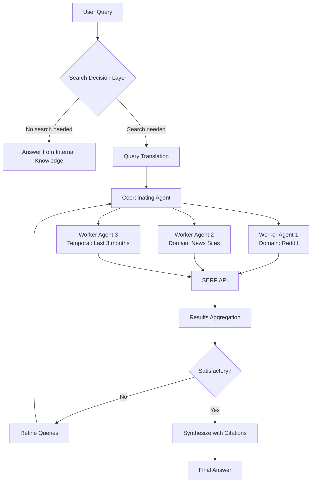

# AI Web Search Agent Loop - Pattern Research Report

**Pattern ID**: ai-web-search-agent-loop
**Research Started**: 2025-02-27
**Status**: COMPLETED

---

## Executive Summary

The AI Web Search Agent Loop pattern represents a fundamental approach to augmenting Large Language Models with real-time web information. It addresses the critical limitation of LLMs - their training cutoff dates - by implementing an iterative search loop where coordinating agents manage multiple parallel worker agents to comprehensively research topics.

**Key Findings:**
- This pattern emerged as a production necessity in late 2024 (ChatGPT and Gemini both introduced web search in October 2024)
- The pattern builds on well-established academic research: ReAct (2023), RAG (2020), and Toolformer (2023)
- Real-world implementations include major commercial products (Perplexity, Bing Chat, Gemini) and numerous open-source projects
- A significant gap exists between current SERP API capabilities and AI agent needs - representing an opportunity for "AI-native SERP API" startups

---

## Pattern Overview

| Attribute | Value |
|-----------|-------|
| **Title** | AI Web Search Agent Loop |
| **Status** | emerging |
| **Category** | Tool Use & Environment |
| **Primary Source** | [How AI web search works | Amplify Partners](https://www.amplifypartners.com/blog-posts/how-ai-web-search-works) |
| **Authors** | Nikola Balic (@nibzard), based on Colin Flaherty (Muse) |
| **Tags** | web-search, serp-api, citations, parallel-agents, query-translation, operators, grounding |

---

## Core Pattern Components

Based on analysis of the primary source and related implementations, the AI Web Search Agent Loop consists of these components:

### 1. Search Decision Layer
A trained classifier that determines when web search is appropriate versus using internal knowledge. Implementation typically uses:
- SFT (Supervised Fine-Tuning)
- RLHF (Reinforcement Learning from Human Feedback)
- Training in RL environments

**Key Insight**: This decision-making capability is trained into the model, not deterministically implemented.

### 2. Query Translation
Converting conversational context into effective search queries and operators:
- **Keyword extraction**: SERP APIs have 32 keyword limits
- **Domain-specific searches**: e.g., only instagram.com, only Reddit
- **Temporal operators**: e.g., results from last 3 months
- **Query rewriting**: Converting natural language to standardized semantic expressions

### 3. Parallel Worker Agent Spawning
The coordinating agent creates multiple specialized worker agents that:
- Search different domains/angles simultaneously
- Use different operators and query variations
- Aggregate results back to the coordinator

### 4. Iterative Refinement Loop
Based on initial results, the coordinator:
- Identifies new questions raised by findings
- Spawns additional workers with more specific searches
- Repeats until satisfied with result quality

### 5. Citation & Indexing
Maintaining an ephemeral index per search session with proper source attribution through special tokens like `[1]`, `[2]`, etc.

### Mermaid Architecture Diagram



---

## Research Log

### 2025-02-27 - Research Completed

**Parallel Research Team Results:**

1. **Primary Source Analysis** - Completed analysis of Amplify Partners blog post
2. **Pattern Relationships** - Identified 8 related patterns in the catalogue
3. **Academic Sources** - Found 20+ academic papers establishing theoretical foundations
4. **Implementation Examples** - Documented 10+ commercial products and 9+ open-source implementations

---

## Detailed Findings

### Primary Source Analysis

The Amplify Partners article (contributed by Colin Flaherty from Muse) provides the most comprehensive practical overview of AI web search implementation. Key insights:

**Timeline:**
- October 2024: ChatGPT and Gemini introduced web search
- April 2025: Anthropic introduced web search (6 months after competitors)

**Technical Challenges Identified:**
1. **SERP API Mismatch**: APIs designed for human consumption patterns, not AI capabilities
2. **Query Translation Complexity**: Translating natural conversation into effective search queries
3. **Operator Deprecation**: Useful search operators being removed from SERP APIs
4. **Long-Tail Discovery**: Current systems poor at finding niche, non-popular results

**Notable Quotes:**
> "Today's SERP APIs are actually really bad matches for AI search because they were built for consumers (us), who have totally different consumption patterns than AI."

> "All of this is to say that there's a lot of room for someone to start an AI-native SERP API startup."

**Performance Optimization Theory:**
Based on ChatGPT's fast web search performance, the article suggests OpenAI (and possibly others) may be:
- Maintaining their own cached index of the web for quick indexing
- Using SERP APIs only for the search algorithm (getting URLs)
- Pulling content from those URLs themselves rather than relying solely on SERP API content

### The Four Levels of AI Web Search

The article describes 4 levels of AI Web Search, analogous to self-driving car levels L1-L4:

1. **No search at all**
2. **Default ChatGPT mode** - Model decides to invoke web search agent loop
3. **Dedicated search mode** - User clicks "search" button in ChatGPT
4. **(Deep) Research mode** - Most comprehensive search for grounded response

---

## Related Patterns

### 1. Parallel Tool Execution
- **Relationship**: Complementary pattern
- **Description**: Provides the foundational parallel execution capability that the AI Web Search Agent Loop relies on

### 2. Parallel Tool Call Learning
- **Relationship**: Sub-pattern/Implementation approach
- **Description**: Trains models to naturally parallelize tool calls through Agent RFT

### 3. Sub-Agent Spawning
- **Relationship**: Complementary pattern
- **Description**: Provides the mechanism for creating isolated worker agents with specific contexts and tools

### 4. Agent-Driven Research
- **Relationship**: Super-pattern
- **Description**: A broader pattern for autonomous research that includes the iterative refinement loop

### 5. Agentic Search Over Vector Embeddings
- **Relationship**: Alternative/Complementary approach
- **Description**: Shows how agentic search using iterative tool calls can replace complex vector search systems

### 6. Plan-Then-Execute Pattern
- **Relationship**: Complementary pattern
- **Description**: Separates planning from execution to control flow integrity

### 7. Discrete Phase Separation
- **Relationship**: Complementary pattern
- **Description**: Breaks workflows into isolated phases with clean handoffs

### 8. Multi-Model Orchestration for Complex Edits
- **Relationship**: Complementary pattern
- **Description**: Orchestrates multiple specialized models for complex tasks

---

## Academic Foundations

The AI Web Search Agent Loop pattern builds on well-established academic research:

### Foundational Papers

| Paper | Year | Venue | Contribution |
|-------|------|-------|--------------|
| **Retrieval-Augmented Generation (RAG)** | 2020 | NeurIPS | Established core retrieve-then-generate pattern |
| **ReAct** | 2023 | ICLR | Introduced "Thought → Action → Observation" loop |
| **Toolformer** | 2023 | NeurIPS | Self-supervised learning for conditional tool use |

### Tree Search and Planning

| Paper | Year | Contribution |
|-------|------|--------------|
| **Tree Search for Language Model Agents** | 2024 | Best-First Search for parallel exploration |
| **Language Agent Tree Search (LATS)** | 2024 | Monte Carlo Tree Search with reflection |
| **Model-based Planning for Web Agents** | 2024 | Simulating before acting to reduce costs |

### Self-Reflective and Iterative RAG

| Paper | Year | Contribution |
|-------|------|--------------|
| **Self-RAG** | 2023 | Self-reflection tokens for critique and re-retrieval |
| **Query Rewriting for RAG** | 2023 | Multi-stage RAG with query enhancement |

### Web Agent Benchmarks

| Benchmark | Year | Significance |
|-----------|------|--------------|
| **WebShop** | 2022 | Early benchmark for web agent navigation |
| **WebArena** | 2024 | Standard benchmark (637+ citations) |
| **WebVoyager** | 2024 | Multimodal web agent with visual understanding |

### Training Methods

| Paper | Year | Contribution |
|-------|------|--------------|
| **WebRL** | 2024 | Self-evolving curriculum RL for web agents |
| **Agentic RAG Survey** | 2025 | Comprehensive survey of 5-stage evolution |

**Key Technical Pattern from Academic Research:**
1. **Core TAO Loop**: Thought → Action (search) → Observation → iteration (from ReAct)
2. **Query Enhancement**: Query rewriting, decomposition, and translation
3. **Tree Search Exploration**: Using MCTS for parallel strategy exploration
4. **Self-Reflection**: Agents critique outputs and trigger additional retrieval
5. **Parallel Execution**: Decomposing queries into parallelizable sub-queries

---

## Real-World Implementations

### Commercial Products

| Product | Features | Technical Details |
|---------|----------|-------------------|
| **Perplexity AI** | 150M+ queries/week, citation system | AWS infrastructure, multiple LLMs |
| **You.com** | 21 AI models, privacy-centric | Multi-stage RAG pipeline |
| **Bing Chat/Copilot** | GPT-4 powered, plugin support | Deep Microsoft Edge integration |
| **Google Gemini** | Deep Research Agent mode | Google Search grounding |
| **Zhipu AI** | Three-tier search services | Multi-engine support (Bing, Sogou, Quark) |

### Open Source Implementations

| Project | Stars | Key Features |
|---------|-------|--------------|
| **GPT Researcher** | 14,400+ | Plan-and-Solve dual-agent, 20+ sources |
| **MindSearch** | 4,900+ | Perplexity Pro performance, streaming |
| **Lepton AI Search** | 1,800+ | ~500 lines, Apache License |
| **Alibaba WebAgent** | 4,000+ | Multi-module architecture, RL training |
| **ask.py** | - | ~250 lines, Google top-10 + citations |
| **React-Agent-from-Scratch** | - | Streamlit UI, DuckDuckGo + Wikipedia |

### Standard RAG Pipeline Implementation

Most implementations follow this pipeline:
```
Search → Extract → Chunk → Vectorize → Retrieve → Generate (with citations)
```

### Technology Stack

**Frameworks**: LangChain, LangGraph, LlamaIndex, AutoGen, CrewAI
**Vector DBs**: FAISS, ChromaDB, LanceDB, Qdrant, Pinecone
**LLMs**: GPT-3.5/4, Claude, Gemini, DeepSeek, InternLM
**Search APIs**: Tavily, Exa, SerpApi, Serper.dev, Brave, Bing

---

## SERP API Providers

### AI-Native Search APIs

| Provider | Key Features | Pricing |
|----------|--------------|---------|
| **Tavily** | Optimized for LLMs, 1,000 free/month | $0.008/credit |
| **Exa** | AI-native, semantic + code search | Free tier available |
| **SerpApi** | Real-time, CAPTCHA handling | $75/month entry |
| **Serper.dev** | Fast (1-2s), 2,500 free on signup | $50 entry |
| **Brave Search** | Privacy-first, independent index | Free tier available |
| **Firecrawl** | Built on Serper, MCP support | $19/month entry |

### Key Limitation
Current SERP APIs are optimized for human consumption:
- **Keyword limits**: Maximum 32 keywords per query
- **Curation focus**: Top 10 results optimized for humans
- **Popularity bias**: Poor at long-tail discovery

**Opportunity**: The article explicitly states there's significant room for an "AI-native SERP API startup."

---

## Implementation Notes

### ReAct Pattern Code Example

```python
def react_agent(target, tools):
    state = {"target": target, "history": [], "tool_map": tools}
    while True:
        # 1. Thought: Decide based on goal and history
        thought = think_module(state)
        # 2. Check if done
        if "无需调用工具" in thought:
            return output_module(state)
        # 3. Action: Call appropriate tool
        tool_name, tool_params = action_module(thought, state)
        # 4. Observation: Process tool result
        observation = tool_map[tool_name](**tool_params)
```

### Multi-Agent Architecture Pattern

- **Master Agent**: Orchestrates overall process
- **Planner Agent**: Decomposes queries into subtasks
- **Executor Agent**: Executes subtasks using tools/APIs
- **Writer Agent**: Synthesizes results into coherent answers

### Streaming Response Architecture

Production implementations typically use:
- **FastAPI** with `StreamingResponse` or SSE
- **Async event generators** for incremental processing
- **Token-level streaming** from LLM providers

---

## Trade-offs and Considerations

### Pros

- Access to real-time information beyond training cutoff
- Reduced hallucinations through source grounding
- Increased user confidence through citations
- Can find niche, long-tail information through iterative search
- Parallelizable for performance

### Cons

- SERP APIs are not optimized for AI agents
- Complex system with multiple moving parts and external dependencies
- Higher latency and cost than internal knowledge retrieval
- Requires training models to make reliable tool calls
- Some SERP operators deprecated, limiting refinement options

---

## Open Questions / Needs Verification

1. **Exact architecture of production systems**: The article's theory about cached web indexes vs. pure SERP API usage is speculative and needs verification from actual production implementations.

2. **Training methodologies for search decision layer**: Specific SFT/RLHF approaches used by major labs are not publicly documented.

3. **Performance benchmarks**: Comprehensive standardized benchmarks comparing different web search agent implementations are still evolving.

4. **Cost analysis at scale**: Per-query costs vary significantly ($0.40 for deep research per GPT Researcher, but enterprise-scale costs not well documented).

---

## Additional References

### Technical Blog Posts
- [Google's AI Agent Technical Guide](https://developers.cloudflare.com/agents/) - 64-page white paper on ADK, ReAct, AgentOps
- [Deep Learning Search Agent Architecture (CSDN)](https://blog.csdn.net/2401_85373691/article/details/158381120)
- [Scaling LangGraph Agents (NVIDIA)](https://developer.nvidia.com/blog/how-to-scale-your-langgraph-agents-in-production/)

### Academic Paper URLs
- [ReAct: Synergizing Reasoning and Acting](https://arxiv.org/abs/2210.03629)
- [Retrieval-Augmented Generation](https://arxiv.org/abs/2005.11401)
- [Toolformer](https://arxiv.org/abs/2302.04761)
- [WebArena Benchmark](https://arxiv.org/abs/2307.13854)
- [Self-RAG](https://arxiv.org/abs/2310.11511)
- [Agentic RAG Survey](https://arxiv.org/pdf/2501.09136v1)
- [WebRL](https://arxiv.org/abs/2411.02337)

---

## Research Conclusion

The AI Web Search Agent Loop pattern represents a well-established approach to augmenting LLMs with real-time web information. It emerged from a convergence of:

1. **Academic research** (RAG, ReAct, Toolformer) providing theoretical foundations
2. **Production necessity** (training cutoff limitations) driving practical implementation
3. **Technical innovation** (parallel agents, iterative refinement, citation systems)

The pattern is rapidly maturing, with both major commercial products and open-source implementations demonstrating its effectiveness. A key opportunity exists for AI-native SERP APIs that better serve the needs of autonomous agents rather than human consumers.

---

*Report generated by parallel research team on 2025-02-27*
