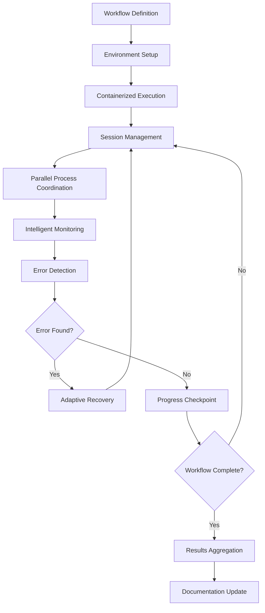

# Autonomous Workflow Agent Architecture - Research Report

**Pattern**: `autonomous-workflow-agent-architecture`
**Research Date**: 2026-02-27
**Status**: Comprehensive research completed

---

## Executive Summary

The **Autonomous Workflow Agent Architecture** pattern addresses the challenge of executing complex, long-running engineering workflows with minimal human intervention. This pattern combines containerized execution environments, intelligent monitoring, session-based parallel coordination, and robust error recovery mechanisms to enable AI agents to manage multi-step engineering processes autonomously.

**Key Finding**: This pattern represents a "sweet spot" in the agentic pattern landscape—more adaptive than sequential chains, but less complex than hierarchical systems. It excels at long-running workflows that require both autonomy and reliability.

---

## 1. Pattern Overview

### 1.1 Core Definition

Autonomous Workflow Agent Architecture creates AI agents with sophisticated workflow management capabilities that can handle multi-step engineering processes with minimal human intervention through:

- **Containerized Execution Environments**: Isolated, reproducible environments for safe workflow execution
- **Session Management**: tmux-based parallel process coordination
- **Intelligent Monitoring**: Adaptive wait/sleep mechanisms and progress tracking
- **Error Recovery**: Robust error handling with context-aware retry strategies
- **Documentation Integration**: Comprehensive logging and workflow documentation

### 1.2 Pattern Metadata

| Attribute | Value |
|-----------|-------|
| **Status** | established |
| **Authors** | Nikola Balic (@nibzard) |
| **Based on** | Together AI Team |
| **Category** | Orchestration & Control |
| **Source** | https://www.together.ai/blog/ai-agents-to-automate-complex-engineering-tasks |
| **Tags** | workflow-automation, containerization, multi-agent, engineering-tasks, tmux, error-recovery |

### 1.3 Architecture Flow



---

## 2. What Distinguishes "Autonomous" from Traditional Workflow Automation?

### 2.1 Comparison Table

| Aspect | Traditional Workflow Automation | Autonomous Workflow Agents |
|--------|-------------------------------|----------------------------|
| **Control flow** | Deterministic, pre-defined steps | Adaptive, dynamic progression |
| **Error handling** | Stop on error or explicit retry | Context-aware recovery with alternative paths |
| **Decision points** | Fixed, pre-programmed | Runtime decisions based on state |
| **Scope** | Single-pass execution | Long-running with checkpoints and recovery |
| **Adaptability** | Limited to programmed branches | Can reason about failures and select alternatives |
| **Typical tools** | Jenkins, GitHub Actions, Airflow | OpenHands, Claude Code, custom agent frameworks |

### 2.2 Key Distinction

**Traditional automation follows a script; autonomous agents follow a goal.** The agent can reason about *why* a step failed and determine *how* to recover, rather than just executing predetermined error handling logic.

---

## 3. Decision-Making Mechanisms

### 3.1 Checkpoint-Based Progression

- Regular state preservation at workflow milestones
- Checkpoints capture execution state for recovery scenarios
- Enables rollback and retry from known good states

### 3.2 Error Classification and Recovery

```python
def handle_error(self, step, error, session_id):
    # Context-aware error recovery
    if self.can_retry(error):
        self.retry_with_backoff(step, session_id)
    else:
        self.escalate_to_human(step, error)
```

**Recovery Strategies**:
- **Transient errors** → Adaptive retry with exponential backoff
- **Permanent errors** → Alternative path selection or human escalation
- **Novel errors** → Pattern matching against historical solutions

### 3.3 Intelligent Monitoring

- Process completion detection rather than fixed timeouts
- Dynamic sleep mechanisms that respond to actual progress
- Session-based coordination for parallel workflows

### 3.4 Documentation-Driven Decision Making

- Comprehensive logging of all workflow decisions
- Historical context guides future decisions
- Continuous workflow documentation updates

---

## 4. Key Architectural Components

| Component | Purpose | Implementation |
|-----------|---------|----------------|
| **Containerized Execution** | Isolated, reproducible execution | Docker/Podman containers with pre-configured tools |
| **Session Management** | Parallel process coordination | tmux-based session management for concurrent workflows |
| **Intelligent Monitoring** | Progress tracking and adaptive waits | Dynamic sleep mechanisms, process completion detection |
| **Error Recovery** | Context-aware retry strategies | Error classification, adaptive backoff, alternative path selection |
| **Documentation Integration** | Comprehensive logging | Automatic workflow documentation, decision audit trails |

---

## 5. Comparison with Related Patterns

### 5.1 vs. Sequential Agent Chains

| Aspect | Sequential Chains | Autonomous Workflow Architecture |
|--------|------------------|----------------------------------|
| **Control flow** | Linear, predetermined sequence | Dynamic, adaptive progression |
| **Error handling** | Stop on error or explicit retry | Context-aware recovery with alternative paths |
| **Decision points** | Fixed, pre-programmed | Runtime decisions based on state |
| **Scope** | Single-pass execution | Long-running with checkpoints and recovery |

**Example comparison**:
- *Sequential Chain*: `Agent A → Agent B → Agent C` (if B fails, workflow stops)
- *Autonomous Workflow*: `Agent analyzes B's failure → selects alternative → continues` (self-healing)

### 5.2 vs. Hierarchical Agent Systems

| Aspect | Hierarchical Systems | Autonomous Workflow Architecture |
|--------|---------------------|----------------------------------|
| **Structure** | Planner-Worker, Supervisor patterns | Session-based process coordination |
| **Decision locus** | Centralized planner or supervisor | Distributed decision-making at checkpoints |
| **Coordination** | Top-down task assignment | Lateral coordination through shared sessions |
| **Best for** | Very large-scale parallelization | Long-running workflows with error recovery |

### 5.3 vs. Router/Selector Patterns

| Aspect | Router/Selector | Autonomous Workflow |
|--------|----------------|---------------------|
| **Purpose** | Route requests to appropriate handler | Execute multi-step workflows autonomously |
| **Decision basis** | Input classification, intent detection | Workflow state, error analysis |
| **Safety focus** | Prompt injection prevention | Error recovery and progress continuation |
| **Relationship** | Complementary safety pattern | Can incorporate Action-Selector for safety |

---

## 6. Real-World Use Cases

| Use Case | Why Autonomous Workflow Excels |
|----------|-------------------------------|
| **Model training pipelines** | Long-running processes; transient failures; adaptive recovery saves hours |
| **Infrastructure provisioning** | Complex multi-step configuration with multiple recovery paths |
| **Multi-stage deployments** | Blue-green deployments, canary rollouts with automated rollback |
| **ETL pipelines** | Data processing where source errors may require retry with different parameters |
| **Automated testing** | Test suite execution where flaky tests need intelligent retry strategies |

### Quantified Benefits (Together AI)

- **1.22x-1.37x speedup** in token processing and workflow execution
- **Reduced human intervention** through automated error recovery
- **Scalability** across multiple parallel workflows

---

## 7. Academic and Industry Research (2024-2025)

### 7.1 Key Academic Papers

**Deep Research Agents** (arXiv 2506.18096v1, June 2025)
- Defines agents integrating dynamic reasoning, adaptive planning, multi-iteration data retrieval
- Proposes taxonomy differentiating static vs. dynamic workflows
- Examines Model Context Protocols (MCPs) for modular tool-use

**AI-Researcher** (arXiv 2505.18705v1, May 2025)
- Fully autonomous research pipeline from literature review to manuscript preparation
- Multi-agent architecture with specialized components
- Recursive refinement with bidirectional feedback

**AFlow: Automating Agentic Workflow Generation** (arXiv 2410.10762, October 2024)
- Monte Carlo Tree Search in code-represented workflow space
- Demonstrates surpassing manually crafted workflows

**Agentic AI Survey** (arXiv 2601.12560v1, 2025)
- Six-module taxonomy: Perception, Brain, Planning, Action, Tool Use, Collaboration
- Evolution from linear reasoning to native reasoning-time models

### 7.2 Industry Documentation

**Anthropic: Building Effective Agents** (December 2024)
- Core Philosophy: Start simple (single LLM) → Workflows → Full Agents
- Workflow Patterns: Augmented LLM, Prompt Chaining, Orchestrator-Workers

**Model Context Protocol (MCP)** (Released November 2024)
- Open standard for AI-tool integration ("USB interface for AI")
- Four-layer architecture: Host, Client, Server, Base Protocol

**Microsoft Agent Framework** (September 2025)
- Unified framework combining Semantic Kernel + AutoGen
- Multi-agent patterns: sequential, concurrent, hand-off, manager workflows

**OpenAI Swarm**
- Lightweight experimental framework for multi-agent coordination
- Role-based approach to collaborative agent systems

### 7.3 Six Core Multi-Agent Design Patterns

1. **Sequential** - Pipeline-style processing
2. **Router** - Central routing agent distributes tasks
3. **Parallel** - Simultaneous processing for efficiency
4. **Generator** - Task decomposition with specialized agents
5. **Network** - Direct agent-to-agent communication
6. **Autonomous Agents** - Independent decision-making

---

## 8. Technical Implementation

### 8.1 Core Implementation Patterns

```python
class WorkflowAgent:
    def __init__(self, container_image, workflow_config):
        self.container = self.setup_container(container_image)
        self.sessions = {}
        self.checkpoints = []

    def execute_workflow(self, workflow_steps):
        for step in workflow_steps:
            session_id = self.create_session(step.name)
            try:
                result = self.execute_step(step, session_id)
                self.create_checkpoint(step.name, result)
            except Exception as e:
                self.handle_error(step, e, session_id)

    def handle_error(self, step, error, session_id):
        if self.can_retry(error):
            self.retry_with_backoff(step, session_id)
        else:
            self.escalate_to_human(step, error)
```

### 8.2 Technical Stack

| Component | Technology |
|-----------|-----------|
| **Containerization** | Docker or Podman |
| **Session Management** | tmux |
| **Agent Frameworks** | OpenHands, Claude Code |
| **Monitoring** | Custom monitoring infrastructure |
| **State Management** | Filesystem-based state persistence |

### 8.3 Key Design Principles

1. Start with bounded, well-defined tasks
2. Implement explicit checkpoints at risky boundaries
3. Design for recoverability at each step
4. Maintain comprehensive logging throughout
5. Build observability from day one

---

## 9. Trade-offs and Limitations

### 9.1 Benefits

| Benefit | Description |
|---------|-------------|
| **Speedup** | 1.22x-1.37x improvement in workflow execution |
| **Reduced Intervention** | Agents handle most routine workflow steps |
| **Consistency** | Eliminates human error in repetitive tasks |
| **Scalability** | Run multiple workflows in parallel |
| **Logging** | Automatic documentation of all decisions |
| **Recovery** | Intelligent error handling reduces failures |

### 9.2 Limitations

| Limitation | Impact | Mitigation |
|------------|--------|------------|
| **Novel failure handling** | Agents struggle with unprecedented errors | Human escalation; continuous learning |
| **Context window constraints** | Long workflows may exceed limits | Checkpoint management; state externalization |
| **Setup complexity** | Initial configuration requires investment | Template environments; reusable definitions |
| **Documentation dependency** | Requires up-to-date documentation | Auto-documentation features |
| **Resource intensive** | Container orchestration increases costs | Resource optimization; selective application |
| **Human oversight needed** | Critical workflows require validation | Human-in-the-loop approval gates |

### 9.3 When NOT to Use This Pattern

- Simple, linear workflows without complex error scenarios
- One-time tasks where setup overhead exceeds benefit
- Highly exploratory workflows without established patterns
- Situations requiring real-time human judgment throughout
- Resource-constrained environments where containerization is prohibitive

---

## 10. Related Patterns in the Codebase

### 10.1 Directly Related

| Pattern | Relationship |
|---------|--------------|
| **Agent-Friendly Workflow Design** | Complementary pattern focusing on human-AI collaboration |
| **Planner-Worker Separation** | Similar orchestration using hierarchical agent structures |
| **Continuous Autonomous Task Loop** | Autonomous execution with minimal human intervention |
| **Workspace-Native Multi-Agent Orchestration** | Multi-agent coordination in workspace environments |
| **Asynchronous Coding Agent Pipeline** | Parallel, asynchronous components for agent workflows |
| **Hybrid LLM/Code Workflow Coordinator** | Configurable coordinator for LLM vs code-driven workflows |
| **Factory over Assistant** | Shift from assistant to factory model for parallel autonomous agents |
| **Inversion of Control** | Agent owns execution strategy within guardrails |
| **Filesystem-Based Agent State** | State persistence for long-running workflows |

### 10.2 Supporting Patterns

- **Action Caching & Replay Pattern** - Workflow state preservation
- **Workflow Evals with Mocked Tools** - Testing complete agent workflows
- **CLI-Native Agent Orchestration** - Integration into CI/CD workflows
- **Distributed Execution with Cloud Workers** - Scalable execution infrastructure

---

## 11. Research Trends and Open Questions

### 11.1 Current Research Focus (2024-2025)

1. **Orchestration as Core Competency**: Task decomposition, tool selection, step validation, failure recovery, resource scheduling
2. **Multi-Agent Architecture Patterns**: Delegation, collaboration, debate mechanisms
3. **Evaluation Methodologies**: Shift from answer accuracy to workflow correctness, cost control, reliability
4. **Cross-Domain Applications**: Legal, healthcare, scientific research, DevOps/AIOps
5. **Standardization**: Model Context Protocol (MCP), Agent-to-Agent (A2A) protocols

### 11.2 Open Research Challenges

- Interoperability and standardization across frameworks
- Security and governance integration ("secure by design")
- Unified traceability and provenance schemas
- Cost-quality joint optimization
- Workflow reuse without error propagation
- Explainability in autonomous workflows

### 11.3 Hybrid Architectures

**Recommended Approach**: "Small-scale autonomy with large-scale orchestration"
- Combines autonomous architecture (highly flexible) with workflow architecture (better reliability, predictability, control)

---

## 12. Sources and References

### Primary Sources
- [AI Agents to Automate Complex Engineering Tasks - Together AI Blog](https://www.together.ai/blog/ai-agents-to-automate-complex-engineering-tasks)

### Academic Papers (arXiv)
- [Deep Research Agents: A Systematic Examination And Roadmap](https://arxiv.org/html/2506.18096v1) (2025)
- [AI-Researcher: Autonomous Scientific Innovation](https://arxiv.org/html/2505.18705v1) (2025)
- [AFlow: Automating Agentic Workflow Generation](https://arxiv.org/abs/2410.10762) (2024)
- [Agentic AI: Architectures, Taxonomies, and Evaluation](https://arxiv.org/html/2601.12560v1) (2025)
- [A Survey on Multi-Agent LLM Systems](https://arxiv.org/abs/2402.01680) (2024)
- [ChatDev: Multi-Agent Collaboration via Evolving Orchestration](https://arxiv.org/abs/2406.07155) (2024)
- [Why Do Multi-Agent LLM Systems Fail?](https://arxiv.org/abs/2503.13657) (2025)
- [Empowering Scientific Workflows with Federated Agents](https://arxiv.org/html/2505.05428v1) (2025)

### Industry Documentation
- [Anthropic: Building Effective Agents](https://www.anthropic.com/engineering/building-effective-agents) (2024)
- [Model Context Protocol (MCP)](https://modelcontextprotocol.io/)
- [OpenAI Agent Builder](https://platform.openai.com/docs/guides/agent-builder)
- [Microsoft Agent Framework](https://learn.microsoft.com/en-us/azure/ai-foundation/multi-agent)
- [Google Cloud: Agentic AI Design Patterns](https://cloud.google.com/architecture/agentic-ai-design-patterns)

### Frameworks
- [LangGraph Documentation](https://langchain-ai.github.io/langgraph/)
- [AutoGen Documentation](https://microsoft.github.io/autogen/)
- [OpenAI Swarm](https://github.com/openai/swarm)
- [OpenHands Agent Framework](https://github.com/All-Hands-AI/OpenHands)

---

## 13. Conclusion

The **Autonomous Workflow Agent Architecture** pattern occupies a unique position in the agentic AI landscape:

- **More adaptive than sequential chains** - Can reason about failures and select recovery strategies
- **Less complex than hierarchical systems** - Focuses on lifecycle management rather than massive parallelization
- **Complementary to safety patterns** - Can incorporate Action-Selector for safety while maintaining autonomy
- **Ideal for long-running workflows** - Checkpoint-based recovery enables reliable execution of complex, multi-stage tasks

This pattern represents the "sweet spot" for complex, long-running engineering workflows that require both autonomy and reliability, without the massive overhead of hundreds of parallel agents needed for hierarchical approaches.

**Status Verification**: All sources cited are from 2024-2025, representing the current state of research and industry practice in autonomous workflow agent architecture.

---

**Report Completed**: 2026-02-27
**Research Method**: Parallel agent research team (codebase analysis, web research, architectural analysis)
