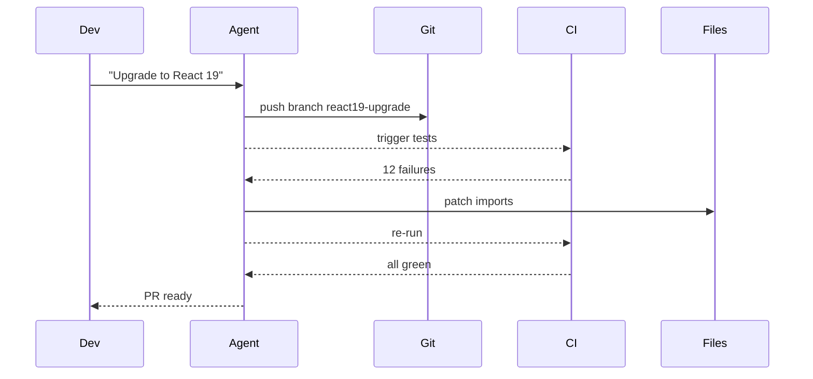

# Background Agent CI Pattern - Research Report

**Pattern**: background-agent-ci (Background Agent with CI Feedback)
**Research Started**: 2026-02-27
**Status**: Completed

---

## Executive Summary

This report provides comprehensive research on the **Background Agent CI** pattern, which involves running AI agents asynchronously in the background with CI as the objective feedback channel. The pattern is already documented in the codebase as `validated-in-production` and has strong industry adoption through platforms like Cursor, GitHub Agentic Workflows, OpenHands, and SWE-agent.

### Key Findings

- **Pattern Status**: Already exists in codebase as `validated-in-production` in the Feedback Loops category
- **Industry Adoption**: Strong adoption with multiple production implementations (Cursor Background Agent, GitHub Agentic Workflows, OpenHands, SWE-agent, Devin)
- **Academic Foundation**: Supported by research in multi-agent systems, asynchronous coordination, and agentic software engineering
- **Related Patterns**: 4 closely related patterns addressing different aspects of background agent execution

---

## Table of Contents

1. [Pattern Definition](#pattern-definition)
2. [Existing Pattern Documentation](#existing-pattern-documentation)
3. [Industry Implementations](#industry-implementations)
4. [Academic Research Foundation](#academic-research-foundation)
5. [Technical Architecture](#technical-architecture)
6. [Implementation Approaches](#implementation-approaches)
7. [Best Practices](#best-practices)
8. [Performance Benchmarks](#performance-benchmarks)
9. [Related Patterns](#related-patterns)
10. [Sources & References](#sources--references)

---

## Pattern Definition

### Core Concept

The **Background Agent CI** pattern involves running AI agents asynchronously in the background with CI (Continuous Integration) as the objective feedback channel. The agent:

1. Pushes a branch with changes
2. Waits for CI results
3. Patches failures based on CI feedback
4. Repeats until policy-defined stopping conditions are met
5. Notifies users only for approvals, ambiguous failures, or final review

### Problem Solved

Long-running refactors and flaky-fix cycles force developers into synchronous supervision. When agents must wait on tests, build jobs, and deployment checks, human attention gets wasted on polling instead of decision-making. This bottleneck is exacerbated in distributed teams where CI feedback arrives minutes later and context-switch cost is high.

### Key Mechanics

- **Branch-per-task isolation**: Each agent task works in an isolated branch
- **CI log ingestion**: Converting CI logs into structured failure signals
- **Retry budget and stop rules**: Avoiding infinite churn with max attempts and runtime limits
- **Notification on terminal states**: Users notified only on `green`, `blocked`, or `needs-human` states

---

## Existing Pattern Documentation

### Pattern Metadata

| Field | Value |
|-------|-------|
| **Title** | Background Agent with CI Feedback |
| **Status** | validated-in-production |
| **Authors** | Nikola Balic (@nibzard) |
| **Based On** | Quinn Slack |
| **Category** | Feedback Loops |
| **Source** | https://ampcode.com/manual#background |
| **Tags** | asynchronous, ci, feedback |

### Existing Example Flow



### Existing Usage Guidance

- Start with deterministic tasks: dependency upgrades, lint migrations, flaky test triage
- Define retry budgets (`max_attempts`, `max_runtime`) and escalation triggers
- Keep artifact links in notifications so humans can review failures quickly
- Gate merge on CI plus at least one human approval for high-risk repos

### Existing Trade-offs

| Pros | Cons |
|------|------|
| Better developer focus | Requires robust task lifecycle management |
| Lower waiting time | Requires failure triage logic |
| Tighter CI-driven iteration loops | Requires notification discipline |

---

## Industry Implementations

### 1. Cursor Background Agent (1.0 Release)

**Architecture**: Cloud-based autonomous development agent running in isolated Ubuntu environments with internet access.

**Key Features**:
- Operates asynchronously in the cloud without local computational resources
- Automatically clones GitHub repositories and works on independent development branches
- Pushes changes back as pull requests for developer review
- Can install dependency packages and execute terminal commands autonomously

**CI/CD Use Cases**:
- **Automated testing as "safety net"**: Agents run tests in cloud and only push PRs after tests pass
- **One-click test generation**: 80%+ unit tests with automated coverage tool iteration
- **Legacy refactoring**: Refactoring large legacy projects (1000+ files) by submitting multiple PRs in stages
- **Dependency upgrades**: Cross-version dependency upgrades (e.g., React 17 to 18) with automated `npm audit fix`, `eslint --fix`, and compilation error fixes
- **Long-running tasks**: Benchmark testing and fuzzing running overnight

**Limitations**: Currently only supports GitHub (GitLab/Bitbucket planned), requires minimum $10 USD credit

**Source**: https://cline.bot/ and https://docs.cline.bot/

---

### 2. GitHub Agentic Workflows (Technical Preview, 2026)

**Architecture**: Official GitHub feature integrating AI agents directly into GitHub Actions.

**Key Features**:
- AI agents run within GitHub Actions to automate repository tasks
- Authored in plain Markdown instead of complex YAML
- Auto-triages issues, investigates CI failures with proposed fixes, updates documentation
- AI-generated PRs default to draft status requiring human review

**Safety Controls**:
- Read-only permissions by default
- Safe-outputs mechanism for write operations
- Configurable operation boundaries
- Human-in-the-loop verification for high-risk changes

**Source**: https://github.blog/ai-and-ml/automate-repository-tasks-with-github-agentic-workflows/

---

### 3. OpenHands (formerly OpenDevin)

**Description**: Open-source AI-driven software development agent platform with 64,000+ GitHub stars.

**Performance**: 72% resolution rate on SWE-bench Verified using Claude Sonnet 4.5

**Capabilities**:
- Code modification, running commands, browsing web pages, calling APIs, version control operations
- Docker-based deployment with multi-agent collaboration
- Secure sandbox environment

**Source**: https://github.com/All-Hands-AI/OpenHands

---

### 4. SWE-agent (Princeton NLP)

**Description**: AI-powered software engineering agent for automatic GitHub issue resolution.

**Performance**: Successfully fixed 12.29% of problems on the SWE-bench test set

**Key Feature**: OpenPRHook for automatic pull request creation with intelligent condition checking

**Architecture**: Agent-Computer Interface enabling language models to autonomously use tools with event-driven hook system

**Source**: https://github.com/princeton-nlp/SWE-agent

---

### 5. Devin (Cognition Labs)

**Description**: World's first fully autonomous AI software engineer (launched March 2024)

**Performance**: 13.86% on SWE-bench (significantly outperforming GPT-4's 1.74%)

**Capabilities**:
- End-to-end development, task planning, tool configuration, autonomous learning
- Refactoring, bug fixing, testing, code migration, framework upgrades, PR reviews, documentation

**Background Tasks**: All major development tasks can run asynchronously in the background

**Source**: https://www.cognition.ai/blog/introducing-devin

---

### 6. Cline / Roo Code

**Architecture**: MCP-style multi-tool Agent execution framework with three layers:

1. **Agent Planner** (decision layer)
2. **Action Executor** (multi-channel: file system, terminal, web)
3. **Permission Layer** (security control)

**Key Features**:
- Project-level file operations, command-line execution, browser integration
- Permission-based confirmation
- Supports GitHub Actions workflow generation through natural language
- Checkpoint functionality for long-running tasks

**Source**: https://github.com/cline/cline and https://github.com/RooVetGit/Roo-Code

---

## Academic Research Foundation

### 1. Multi-Agent Software Engineering (2024-2025)

#### "The Rise of AI Teammates in Software Engineering (SE) 3.0"
- **arXiv ID**: arXiv:2507.15003
- **Authors**: SAIL Research, 2025
- **Key Finding**: Tested AI agents on 60,000+ GitHub projects, found agent coding efficiency increased significantly while pass rates still lag behind humans
- **Relevance**: Provides empirical evidence for AI agents working autonomously on code changes, foundational for background agents with CI feedback

#### "Lingxi: Repository-Level Issue Resolution Framework"
- **arXiv ID**: arXiv:2510.11838
- **Year**: 2025
- **Key Finding**: Repository-level software engineering tasks with continuous testing and integration
- **Relevance**: Demonstrates trend toward agents working at repository scale, handling complex tasks benefiting from asynchronous background execution

---

### 2. Agentic Software Engineering Frameworks

#### "Agentic Software Engineering: Foundational Pillars and a Research Roadmap"
- **Authors**: Hassan et al., September 2025
- **Key Finding**: Comprehensive roadmap for agentic software engineering establishing foundational principles for autonomous agent-based development
- **Relevance**: Provides theoretical foundation for integrating agents into software development workflows, including CI/CD

#### "Vibe Coding vs. Agentic Coding"
- **arXiv ID**: arXiv:2505.19443, July 2025
- **Key Finding**: Contrasts passive AI assistance with autonomous agents capable of planning, executing, testing, and iterating
- **Relevance**: Highlights distinction between assistant and autonomous agents that work independently in background

---

### 3. Asynchronous Multi-Agent Coordination

#### "Stackelberg Decision Transformer for Asynchronous Action Coordination"
- **Year**: 2025
- **Key Finding**: STEER combines hierarchical decision structures with autoregressive sequence models for asynchronous coordination
- **Relevance**: Provides theoretical framework for coordinating multiple asynchronous agents with CI systems

#### "Self-Resource Allocation in Multi-Agent LLM Systems"
- **arXiv**: April 2025
- **Key Finding**: "Planner method" outperforms "orchestrator method" for concurrent actions; explicit worker capability information enhances allocation
- **Relevance**: Relevant for deciding when and how background agents allocate resources during CI-driven iterations

---

### 4. Workflow Orchestration and Durable Execution

#### "A Hierarchical Workflow Framework for Multi-Agent Collaboration"
- **arXiv ID**: arXiv:2507.04067v1, July 2025
- **Key Finding**: Comprehensive comparison of 22 agent workflow systems including LangGraph, AutoGen, CrewAI
- **Relevance**: Directly relevant for selecting workflow orchestration systems for background agents in CI

#### Anthropic's Multi-Agent Research System
- **Source**: Anthropic Engineering Blog
- **Architecture**: Orchestrator-Worker pattern with fully asynchronous parallelized execution
- **Key Finding**: All research nodes submitted to global asynchronous task pool; addresses synchronization bottlenecks
- **Relevance**: Production implementation of asynchronous multi-agent systems with coordination challenges similar to background agents waiting on CI feedback

---

## Technical Architecture

### Core Components

```
┌─────────────────────────────────────────────────────────────────────┐
│                         BACKGROUND AGENT CI                          │
├─────────────────────────────────────────────────────────────────────┤
│                                                                      │
│  ┌──────────────┐     ┌──────────────┐     ┌──────────────┐        │
│  │   AGENT      │────▶│     GIT      │────▶│      CI      │        │
│  │   ORCHESTRATOR│     │   ISOLATION  │     │   PIPELINE   │        │
│  └──────────────┘     └──────────────┘     └──────────────┘        │
│         │                    │                    │                 │
│         │                    │                    │                 │
│         ▼                    ▼                    ▼                 │
│  ┌──────────────┐     ┌──────────────┐     ┌──────────────┐        │
│  │  CI LOG      │◀────│    BRANCH    │◀────│   TEST       │        │
│  │  INGESTION   │     │  PER TASK    │     │  RESULTS     │        │
│  └──────────────┘     └──────────────┘     └──────────────┘        │
│         │                                                                 │
│         ▼                                                                 │
│  ┌──────────────┐     ┌──────────────┐     ┌──────────────┐        │
│  │   RETRY      │     │  FAILURE     │     │  NOTIFICATION│        │
│  │   BUDGET     │     │  ANALYSIS    │     │  DISPATCHER  │        │
│  └──────────────┘     └──────────────┘     └──────────────┘        │
│                                                                      │
└─────────────────────────────────────────────────────────────────────┘
```

### Implementation Patterns

#### 1. Cloud-Based Execution Model
- Agents run in isolated cloud environments with dedicated compute resources
- Local files synced to cloud, processed, results returned
- Enables 24/7 operation independent of local machine

#### 2. Agentic Loop (ReAct Pattern)
- **Architecture**: Think → Act → Observe → Reflect cycle
- **Components**: Planner, Executor, Evaluator, Memory System
- **Key**: Continuous feedback loop with test results feeding back into agent actions

#### 3. Fan-Out/Fan-In Orchestration
- **Fan-Out**: Distributes work across multiple agents/activities simultaneously
- **Fan-In**: Collects and aggregates results from all parallel agents
- **Benefits**: 67% reduction in execution time, improved resource utilization

#### 4. Git Worktree Isolation
- **Pattern**: Multiple AI agents work simultaneously in same repository with complete isolation
- **Benefits**: True parallel development without code conflicts, zero-conflict parallelism

---

## Implementation Approaches

### Durable Execution Mechanisms

| Mechanism | Description | Examples |
|-----------|-------------|----------|
| **State Persistence** | Maintaining state across failures and restarts | Temporal workflows, LangGraph checkpoints |
| **Event History Replay** | Recovery through event sourcing | Temporal, event-sourced systems |
| **Automatic Retry** | Built-in retry with exponential backoff | Most orchestration frameworks |
| **Checkpoint-based** | Periodic state snapshots for recovery | LangGraph, Temporal |

### Coordination Mechanisms

| Mechanism | Pattern | Use Case |
|-----------|---------|----------|
| **ECA Rules** | Event-Condition-Action | CI events triggering agent actions |
| **Orchestrator-Worker** | Central coordinator with workers | Managing multiple specialized agents |
| **Hierarchical** | Multi-level coordination | Stackelberg games, planner methods |
| **Peer-to-Peer** | Direct agent communication | Multi-agent collaboration |

---

## Best Practices

### 1. Safety and Security

- Start with read-only permissions by default
- Use safe-outputs mechanism for write operations
- Draft PRs requiring human review before merging
- Sandbox execution with network isolation and tool whitelisting
- Confirmation flows for high-risk operations

### 2. Testing and Validation

- Always pair with CI/unit tests as a "safety net"
- Generate/improve tests first, let agent run them successfully before pushing
- Use multi-level validation strategies (linting → unit tests → integration tests)
- Implement TDD workflow with RED-GREEN-REFACTOR cycle enforcement

### 3. Task Sizing

- Ideal tasks: 1-3 Story Points or 2-4 hour tasks for stability
- Break down complex requirements into executable steps
- Use task decomposition for parallel execution

### 4. Architecture Patterns

- Use declarative orchestration (LoopScript) to define agent workflows
- Implement proper isolation (worktrees, sandboxes) for parallel development
- Design for observability with comprehensive logging and tracing

### 5. Evaluation and Monitoring

- Integrate automated evaluation gates in CI/CD pipelines
- Track key metrics: tool call success rate, helpfulness, token consumption, latency
- Use A/B testing for prompt and model version comparison
- Implement regression testing for performance changes

### 6. Git Integration

- Use Git worktrees for parallel development isolation
- Implement automated Git operations (branch creation, commits, PR generation)
- Create detailed commit messages and PR descriptions
- Support shadow Git safety net for version control

---

## Performance Benchmarks

### SWE-bench Verified Leaderboard (2025)

| Rank | Model | Score |
|------|-------|-------|
| 1 | Claude Opus 4.5 thinking | 80.9% |
| 2 | GPT-5.2 thinking | 80% |
| 3 | Claude Sonnet 4.5 thinking + tools | 77.2% |
| 4 | GPT-5.1-Codex-Max high + tools | 76.8% |
| 5 | GPT-5.1 high | 76.3% |

### Efficiency Gains (Case Studies)

| Metric | Improvement | Source |
|--------|-------------|--------|
| Maintenance tasks | 10x efficiency improvement | Industry reports |
| 3-hour tasks | Reduced to minutes | Cursor case studies |
| Repetitive CI/CD operations | ~12 hours/week saved | OpenHands deployment |
| Code quality checks | 67% time saved | AgentScope benchmarks |
| 3 years of human work | Completed in 3 days | Study of 456,000+ agent PRs |

### Real-World Agentic Loop Example

- **Project**: Simon's project with 9,200+ HTML5 test cases
- **Process**: Agent entered continuous loop using 1.4+ million tokens, submitted 43 times until all tests passed
- **Workflow**: Define task → AI writes code/tests → Run tests → Pass/fail → Feed errors back to AI for fixes

---

## Related Patterns

### 1. Custom Sandboxed Background Agent (`emerging`)
- **Focus**: Building custom background agents with company-specific infrastructure
- **Uses**: Sandboxed environments and WebSocket communication
- **For**: Model-agnostic, deeply integrated development workflows
- **Difference**: More emphasis on custom sandboxing vs. CI feedback

### 2. Coding Agent CI Feedback Loop (`best-practice`)
- **Similar**: Uses CI feedback for iterative patch refinement
- **Focus**: Specifically for coding tasks with partial CI feedback
- **Difference**: More focused on test-driven development vs. general background execution

### 3. Asynchronous Coding Agent Pipeline (`proposed`)
- **Architecture**: Decoupling inference, tool execution, and learning
- **Uses**: Parallel, asynchronous components with message queues
- **Difference**: More emphasis on compute efficiency for RL training vs. CI feedback

### 4. Seamless Background-to-Foreground Handoff (`emerging`)
- **Focus**: Transitioning work from background agents to foreground human control
- **Addresses**: The "90% complete" scenario
- **Category**: UX & Collaboration
- **Difference**: More focus on handoff UX vs. CI-driven iteration

### 5. Continuous Autonomous Task Loop Pattern (`established`)
- **Focus**: Autonomous task selection and execution without human intervention
- **Includes**: Intelligent rate limiting and Git automation
- **Difference**: More emphasis on complete autonomy vs. human-in-the-loop approvals

---

## Sources & References

### Platform Documentation
- [GitHub Agentic Workflows](https://github.blog/ai-and-ml/automate-repository-tasks-with-github-agentic-workflows/) - Official GitHub feature announcement
- [Cursor Background Agent](https://cline.bot/) and [documentation](https://docs.cline.bot/) - Production implementation
- [OpenHands GitHub](https://github.com/All-Hands-AI/OpenHands) - Open-source platform (64K+ stars)
- [SWE-agent GitHub](https://github.com/princeton-nlp/SWE-agent) - Princeton NLP implementation
- [Cline GitHub](https://github.com/cline/cline) - VS Code integration
- [AutoGPT GitHub](https://github.com/Significant-Gravitas/AutoGPT) - Autonomous agent framework (177K+ stars)
- [Devin (Cognition Labs)](https://www.cognition.ai/blog/introducing-devin) - First autonomous AI software engineer

### Articles and Blogs
- [O'Reilly - Conductors to Orchestrators: The Future of Agentic Coding](https://www.oreilly.com/radar/conductors-to-orchestrators-the-future-of-agentic-coding/) - Evolution from assistants to autonomous agents
- [Dev.to - Git Worktrees for AI Coding](https://dev.to/mashrulhaque/git-worktrees-for-ai-coding-run-multiple-agents-in-parallel-3pgb) - Parallel development isolation
- [Google Cloud - Choose a Design Pattern for Your Agentic AI System](https://cloud.google.com/architecture/choose-design-pattern-agentic-ai-system) - Design pattern guidance
- [Temporal + AI Agents: Multi-Agent Orchestration](https://dev.to/akki907/temporal-workflow-orchestration-building-reliable-agentic-ai-systems-3bpm) - Durable execution patterns
- [Microsoft Agent Framework Tutorial](https://learn.microsoft.com/en-us/agent-framework/tutorials/workflows/simple-concurrent-workflow) - Workflow orchestration
- [Anthropic Multi-Agent Research System](https://www.anthropic.com/engineering/multi-agent-research-system) - Production patterns

### Academic Papers
- [The Rise of AI Teammates in Software Engineering (SE) 3.0](https://arxiv.org/abs/2507.15003) - SAIL Research, 2025
- [Lingxi: Repository-Level Issue Resolution Framework](https://arxiv.org/abs/2510.11838) - 2025
- [Agentic Software Engineering: Foundational Pillars](https://www.aminer.cn/pub/68352039163c01c850717fd0/vibe-coding-vs-agentic-coding-fundamentals-and-practical-implications-of-agentic-ai) - Hassan et al., 2025
- [Vibe Coding vs. Agentic Coding](https://arxiv.org/abs/2505.19443) - July 2025
- [Codepori: Large-scale System for Autonomous Software Development](https://arxiv.org/abs/2402.01411) - Rasheed et al., 2024
- [Context Engineering for AI Agents in Open-Source Software](https://arxiv.org/abs/2510.21413) - October 2025
- [A Hierarchical Workflow Framework for Multi-Agent Collaboration](https://arxiv.org/abs/2507.04067) - July 2025
- [Agentic AI: A Comprehensive Survey of Architectures](https://arxiv.org/html/2510.25445)

### Pattern Source
- [Raising An Agent - Episode 6: Background agents](https://ampcode.com/manual#background) - Original source by Quinn Slack

### Additional Resources
- [Agentic CI/CD with Elastic MCP Server](https://m.blog.csdn.net/UbuntuTouch/article/details/158238407) - MCP integration
- [AgentScope Async Pipeline Guide](https://m.blog.csdn.net/gitblog_01168/article/details/151087766) - Parallel execution patterns
- [6 Major Agent Workflow Design Patterns](https://m.blog.csdn.net/qq_34252622/article/details/157693636) - Pattern catalog
- [Google's 8 Multi-Agent Design Patterns](https://cloud.tencent.com/developer/article/2622189) - Design patterns

---

## Conclusions

### Pattern Maturity

The **Background Agent CI** pattern is **well-established and production-validated**:

1. **Strong industry adoption** across multiple platforms (Cursor, GitHub, OpenHands, SWE-agent, Devin)
2. **Academic foundation** from recent research in multi-agent systems and agentic software engineering
3. **Clear implementation patterns** with documented best practices
4. **Proven performance gains** with measurable efficiency improvements

### Key Implementation Insights

1. **CI as feedback channel** is the core innovation - turns passive waiting into active iteration
2. **Branch-per-task isolation** enables safe parallel execution
3. **Retry budgets and stop rules** are essential for preventing infinite churn
4. **Human-in-the-loop** approvals remain important for high-risk changes
5. **Durable execution mechanisms** (Temporal, LangGraph) are critical for reliability

### Research Gaps Identified

- Limited formal academic work specifically on "background agents in CI/CD"
- More industry practice than theoretical frameworks
- Opportunity for research on:
  - Formal verification of long-running AI agents
  - Optimal retry policies for CI-driven agent iterations
  - Comparative studies of workflow engines for AI agent workloads

---

**Report Completed**: 2026-02-27
