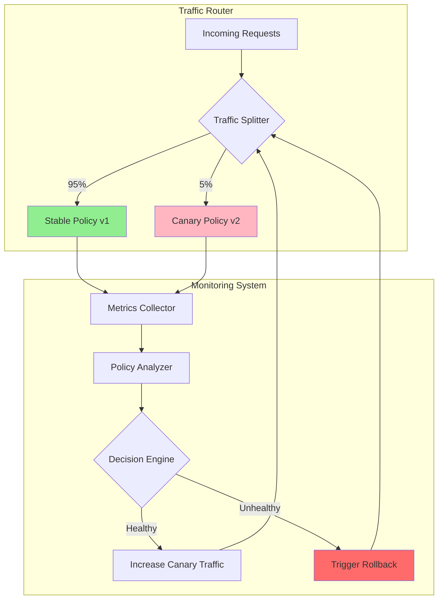

# Canary Rollout and Automatic Rollback for Agent Policy Changes - Research Report

**Pattern**: canary-rollout-and-automatic-rollback-for-agent-policy-changes
**Report Date**: 2026-02-27
**Status**: Complete

---

## Executive Summary

This report synthesizes research on canary rollout and automatic rollback strategies specifically applied to **AI agent policy changes**.

**Key Finding**: While canary deployments and automatic rollback are well-established practices in traditional software and ML model deployment, the specific application to **agent policy changes**—particularly for LLM-based agents with system prompts, tool configurations, and behavioral policies—is an emerging practice with unique challenges and considerations.

The pattern bridges:
- Traditional SRE canary deployment practices (Google SRE, Netflix)
- ML model deployment strategies (shadow testing, A/B testing, drift detection)
- Agent-specific concerns (policy changes, prompt management, tool access control)

---

## 1. Canary Deployment Fundamentals

### Definition and Origins

**Canary Deployment** (金丝雀部署) is a progressive deployment strategy where new versions are deployed to a small subset of users first (typically 1-5% traffic), allowing teams to monitor performance and stability before full rollout. The name derives from historical mining practices where canaries detected toxic gases.

### Core Traffic Splitting Strategies

1. **Percentage-Based Traffic Splitting**
   - Route fixed percentage of traffic (e.g., 1%, 5%, 10%, 50%)
   - Gradual increase: 1-10% → 30% → 50% → 100%
   - Implementation: Load balancer, API gateway, or service mesh level

2. **Header/Request-Based Traffic Splitting**
   - Route based on HTTP headers, cookies, or specific attributes
   - Enables targeting specific user segments (internal users, beta testers, geographic regions)
   - Example: `x-canary: true` header routes to canary version

3. **User ID Hash-Based Splitting**
   - Consistent hashing based on user_id ensures same user always routes to same version
   - Formula: `hash(user_id + layer) % 100 <= 50` routes to canary

### Key Monitoring Metrics

**Technical Metrics:**
- Error Rate: 4xx and 5xx responses (thresholds >1-5%)
- Response Time: P50, P95, P99 latency percentiles (>50% increase triggers rollback)
- Throughput: QPS/RPS (Requests Per Second)
- Resource Utilization: CPU, Memory, Disk I/O

**Business Metrics:**
- Conversion rates
- User activity levels
- Transaction success rates
- Revenue indicators

### Progressive Rollout Stages

```
5% traffic → 30 minutes observation
25% traffic → 1 hour observation
100% traffic → full deployment
```

### Implementation Technologies

- **Service Mesh**: Istio (VirtualService, DestinationRule), Linkerd (TrafficSplit CRD)
- **Kubernetes-Native Tools**: Argo Rollouts, Flagger
- **Cloud Platforms**: Google Cloud App Engine, AWS CodeDeploy, Azure Pipelines

---

## 2. ML/AI Model Rollout Strategies

### ML Model Deployment vs. Traditional Software

**Key Differences:**
1. **Concept Drift**: Model performance degrades over time due to data distribution changes
2. **Data Drift**: Changes in input data distribution
3. **Need for Continuous Monitoring**: Prediction quality, feature importance changes
4. **Retraining Requirements**: Regular model updates needed

### Shadow Testing vs. Canary Deployment

| Aspect | Shadow Testing | Canary Deployment |
|--------|---------------|-------------------|
| **User Exposure** | Zero risk (predictions not returned) | Limited risk (small % of users affected) |
| **Business Metrics** | Cannot measure (no user impact) | Can measure real business outcomes |
| **Purpose** | Technical validation (stability, performance) | Business + technical validation |
| **Duration** | Extended period for comprehensive testing | Gradual rollout based on success criteria |
| **Cost** | Higher (both models running) | Lower (gradual resource transition) |
| **Typical Starting Point** | Earlier in deployment pipeline | Later, after shadow testing passes |

### ML-Specific Monitoring Metrics

**Data Drift Detection Methods:**
- PSI (Population Stability Index)
- KS Test (Kolmogorov-Smirnov)
- AD (Anderson-Darling) test

**Model Performance Metrics:**
- Accuracy/Precision/Recall (classification)
- MAE/MSE/R² (regression)
- Prediction distribution shifts
- Feature importance changes

### Recommended Combined Strategy

1. **Shadow Testing First**: Validate technical stability, performance, and prediction quality without user risk
2. **Canary Deployment Second**: After shadow testing passes, gradually expose to real users to validate business metrics

### Tools and Platforms

- **AWS SageMaker**: Shadow testing, canary deployments
- **Google Vertex AI**: Model monitoring, A/B testing, canary roll-outs
- **Azure ML**: A/B experimentation, CI/CD integration
- **Specialized Platforms**: Evidently AI, Arize AI, WhyLabs, NannyML

---

## 3. Agent Policy Change Management

### What is "Agent Policy"?

**Formal Definition (Reinforcement Learning):**
> A function that accepts a state and produces an action to be taken, or produces a probability distribution over the action space given a state. Denoted as π(a|s).

**In LLM Agent Context:**
- **System Prompts**: Define agent behavior and decision-making approach
- **Tool Configuration**: Which tools/APIs the agent can access
- **Guardrails**: Safety constraints and behavioral boundaries
- **Memory/Context Management**: How the agent stores and retrieves information

### Agent Configuration Management

**LangChain Configuration:**
- **Langfuse**: Prompt management with version control and collaborative editing
- **LangSmith**: Advanced prompt versioning with commit tracking
- Prompt template management with input variables
- Configuration includes model parameters (model_name, temperature)

**AutoGPT Configuration Files:**
- `ai_settings.yaml`: Agent goals, name, role definition, subtasks
- `prompt_settings.yaml`: Pre-built prompts for model interactions
- `.env`: API keys and environment variables

**CrewAI Configuration:**
- `agents.yaml`: Agent roles, goals, backstory
- `tasks.yaml`: Task definitions and execution order
- Advanced settings: `allow_code_execution`, `max_execution_time`, `max_retry_limit`

### Agent Policy Version Control

**AWS AgentCore Policy (Late 2025):**
- Natural language policy definition
- Real-time policy enforcement through AgentCore Gateway
- Multi-layered access control for tools, APIs, data sources
- Conditional logic: "auto-approve refunds under $100, require approval for amounts over $1,000"
- Cedar Language integration for automated authorization reasoning

### Safety Validation Frameworks

**Academic Frameworks (2024-2025):**

1. **MI9 - Runtime Governance Framework** ([arXiv](https://arxiv.org/html/2508.03858v3))
   - Runtime safety for agentic AI
   - Rule-based, telemetry-driven governance logic

2. **AGENTSAFE - Ethical Assurance Framework** ([arXiv](https://arxiv.org/html/2512.03180v1))
   - 50-100 tailored test cases
   - Metrics: Prompt-Injection Block Rate, Exfiltration Detection Recall, Hallucination-to-Action Rate

3. **OpenAgentSafety** ([arXiv](https://arxiv.org/html/2507.06134v1))
   - Even top models (Claude Sonnet 3.7, GPT-4o) show unsafe behavior in 40-51% of tasks
   - Hybrid evaluation: rule-based + LLM-as-Judge

### Agent-Specific Monitoring Metrics

**Unique to AI Agents:**
- **Goal Achievement Rate**: Tasks successfully completed (<80% triggers alerts)
- **Average Tool Calls per Task**: 50% increase from baseline triggers warning
- **Infinite Loop Detection**: ≥1 repetitive action sequence triggers circuit breaker
- **Context Switch Frequency**: High values indicate planning issues
- **Prompt Injection Detection**: Monitor for adversarial input attacks
- **Unexpected Tool Usage**: Detect unauthorized tool/API access

---

## 4. Automatic Rollback Mechanisms

### Core Principles

**Three Key Principles:**
1. **Detectable**: Systems must quickly identify anomalies and trigger rollbacks
2. **Replaceable**: Old versions must be recoverable within short timeframes
3. **Verifiable**: Every deployment and rollback must be tested and validated

### Automated Rollback Architecture

**Three-Layer Architecture:**
- **Monitoring Trigger**: Real-time health assessment through preset metrics
- **Policy Engine**: Decides whether to rollback based on anomaly type and impact scope
- **Execution Layer**: Automatically invokes rollback scripts, restores environments, or switches traffic

### Common Rollback Trigger Thresholds

| Metric | Common Threshold | Example |
|--------|------------------|---------|
| **Error Rate** | > 1-5% (30% for some systems) | HTTP 5xx errors exceeding threshold |
| **Latency (P99)** | > 1000ms | 99th percentile latency > 1 second |
| **Combined Conditions** | Multiple metrics | Error rate > 30% AND latency > 1000ms |

### Critical Rollback Triggers

```
1. Health Status == "critical"
2. Drifted columns > 5 (data quality issues)
3. Overall drift score > 0.3 (significant data distribution change)
4. Error rate > 0.1 (10% failure rate)
5. P99 latency > 1000ms
6. Component status in "PermanentError" or "FatalError"
```

### Rollback Decision Logic Example

```python
def deployment_rollback_decision(health_metrics):
    """Deployment rollback decision based on monitoring metrics"""
    critical_conditions = [
        health_metrics["health_status"] == "critical",
        len(health_metrics["drifted_columns"]) > 5,
        health_metrics["overall_drift_score"] > 0.3,
        any(metric["error_rate"] > 0.1 for metric in health_metrics["performance"])
    ]

    if any(critical_conditions):
        return {
            "decision": "rollback",
            "reason": "Detected severe performance degradation or data drift",
            "timestamp": pd.Timestamp.now()
        }
```

### Progressive vs. Full Rollback

**Progressive Rollback:**
- Gradual traffic reduction (100% → 50% → 0%)
- Phased approach tied to canary deployments
- Continuous monitoring at each phase
- Used when issue severity is uncertain

**Full Rollback:**
- Immediate complete reversion to previous version
- All-or-nothing approach
- Nearly instantaneous in blue-green deployments
- Used for critical issues requiring immediate action

### Circuit Breaker Pattern

**Kubernetes Integration:**
- **Health Checks**: Liveness and readiness probes
- **Automatic Recovery**: Containers restarted or traffic stopped when unhealthy
- **Quick Rollback Commands**: `kubectl rollout undo deployment/my-app`

### CI/CD Integration

**Automatic Health Check + Auto Rollback Pipeline:**
```
1. Deploy new version to production
2. Call health API or monitoring system (Prometheus) to check status
3. If unhealthy state persists > 5 minutes, trigger rollback
4. Revert using image tags or Git tags (e.g., v1.2.3)
5. Notify team via Slack/email with rollback reason
```

### Best Practices

1. **Observation Windows**: Set minimum duration (e.g., 2 minutes) above thresholds to avoid false positives
2. **Data Consistency**: Ensure database rollback scripts (down.sql) are always paired with changes
3. **Automation Speed**: Complete rollback within minutes, without manual confirmation
4. **Double Verification**: Cross-check logs and metrics to prevent false triggers

---

## 5. Industry Implementations

### Netflix

**Automated Canary Analysis (ACA) Platform (Kayenta):**
- Integrated with Spinnaker continuous delivery platform
- Multi-dimensional weighted evaluation of metrics
- Converts system stability assessments into quantifiable mathematical models
- Enables zero-risk deployments with intelligent release decisions
- "10,000 Experiments Rule" from Amazon and Facebook

**Chaos Engineering Origins:**
- Pioneered around 2008-2010 after significant service outages
- **Chaos Monkey**: Randomly terminates instances to test stability (reduces MTTR by 60%)
- **Simian Army Suite**: Latency Monkey, Chaos Kong, Fault Injection Testing

### Google / DeepMind

**Google Cloud ML Infrastructure:**
- **Vertex AI**: Unified framework for deploying models with automated scaling
- **KServe**: Multi-framework model deployment with serverless inferencing, supports canary roll-outs
- **Vertex AI Model Monitoring**: Data drift, concept drift detection
- **GKE Inference**: Quickstart and Gateway for simplified model deployment

### AWS

**AWS SageMaker:**
- Shadow testing: Validates models with production data before directing actual traffic
- Copies of inference requests routed to shadow models while production model responses returned to applications
- Automatic comparison between shadow and production model performance

**AWS Fault Injection Simulator (FIS):**
- Rollback configurations (post actions) within action parameters
- Stop conditions on guardrail metrics to automatically stop experiments

### Spotify

**Experimentation Platform:**
- Over 250 online experiments annually on Spotify Home
- **Home Config**: Configuration-as-a-service tool for personalization parameters
- **Experimentation Platform (EP)**: Accelerates experimentation with automated analysis
- **Experiment Validation Assistant (EVA)**: Automatically validates proposed A/B test configurations

### Microsoft Azure

**Azure AI A/B Experimentation:**
- GitHub Actions integration for evaluation and experimentation
- Azure AI Evaluation SDK for manual/automatic evaluations
- Built-in AI model metrics and custom metrics
- Online experimentation in limited preview

### LaunchDarkly

**Feature Flag Platform:**
- Serves over 20 trillion feature flags daily
- **Generative AI Support**:
  - Safely test and iterate on GenAI features in production
  - Manage runtime configurations for prompts and models
  - Target AI configurations to specific audiences with instant rollback
- **Full-Stack Experiments**: Conduct experiments across diverse environments

### Case Studies of Failures

**Common Failure Themes (2024-2025):**
1. **Data Quality Issues**: Training data doesn't match production reality
2. **Lack of Monitoring**: Insufficient drift detection and observability
3. **Architecture Problems**: Outdated batch processing for real-time needs
4. **Process Gaps**: Poor rollback mechanisms and change management

**"天狼星计划" (Project Sirius) - August 2025:**
- Multi-million dollar AI project failure
- 95% accuracy in testing but failed completely in production
- Root cause: Data gap between laboratory and production environments

---

## 6. Pattern Specification

### Problem Statement

AI agents require policy changes (system prompts, tool configurations, behavioral rules) to improve functionality or address safety concerns. However, these changes introduce risks:

1. **Unpredictable Behavior**: Complex interactions among agents, memory, tools, and tasks create behaviors that evade static testing
2. **Safety Concerns**: New policies may inadvertently allow harmful actions or violate constraints
3. **Performance Degradation**: Policy changes may reduce goal achievement rates or increase resource usage
4. **Business Impact**: Poor agent performance directly affects user experience and operational metrics

### Solution: Canary Rollout with Automatic Rollback

**Pattern Definition:**
Gradually expose new agent policies to a subset of traffic while monitoring for safety and performance issues, with automatic rollback to previous policies if thresholds are breached.

**Architecture:**



### Key Components

1. **Policy Version Control**
   - Versioned system prompts and configurations
   - Git-based or prompt management system (Langfuse, LangSmith)
   - Immutable policy versions for easy rollback

2. **Traffic Splitting**
   - Percentage-based routing (start 1-5%)
   - User-segment targeting (internal users, beta testers)
   - Consistent hashing for session affinity

3. **Agent-Specific Monitoring**
   - Goal achievement rate
   - Tool call frequency and patterns
   - Infinite loop detection
   - Context switch frequency
   - Prompt injection detection
   - Safety constraint violations

4. **Automatic Rollback Triggers**
   - Goal achievement rate < 80%
   - Error rate > 5%
   - Latency increase > 50%
   - Safety constraint violations
   - Tool usage anomalies

5. **Progressive Rollout Strategy**
   ```
   1% (internal users) → 30 min observation
   5% (beta users) → 1 hour observation
   10% → 2 hours observation
   25% → 4 hours observation
   50% → 8 hours observation
   100% (full rollout)
   ```

### Implementation Example

```yaml
# Agent Policy Canary Configuration
apiVersion: agents/v1
kind: PolicyCanary
metadata:
  name: customer-service-agent-v2
spec:
  stablePolicy:
    version: "v1.2.3"
    promptHash: "abc123"
    toolAllowList: ["search", "database_query"]

  canaryPolicy:
    version: "v2.0.0"
    promptHash: "def456"
    toolAllowList: ["search", "database_query", "api_external"]
    trafficPercentage: 5

  analysis:
    metrics:
      - name: goal_achievement_rate
        threshold: 0.8
        rollback: true
      - name: error_rate
        threshold: 0.05
        rollback: true
      - name: avg_tool_calls
        threshold: 10
        rollback: true
      - name: safety_violations
        threshold: 0
        rollback: true
      - name: prompt_injection_attempts
        threshold: 0.01
        rollback: true

    duration: "30m"
    checkInterval: "1m"

  rolloutStrategy:
    steps:
      - percentage: 5
        duration: "30m"
      - percentage: 10
        duration: "1h"
      - percentage: 25
        duration: "2h"
      - percentage: 50
        duration: "4h"
      - percentage: 100
        duration: "8h"
```

### Anti-Patterns to Avoid

1. **Direct Production Deployment**: Never deploy agent policy changes directly to 100% of traffic
2. **Insufficient Monitoring**: Traditional software metrics are insufficient for agent behavior
3. **Ignoring Safety Metrics**: Focus on performance without monitoring safety constraints
4. **Manual Rollback**: Automatic rollback is essential given agent unpredictability
5. **Skipping Shadow Testing**: Validate technical stability before exposing to real users

---

## 7. References

### Academic Papers

1. **MI9: Runtime Governance Framework** - [arXiv](https://arxiv.org/html/2508.03858v3) (August 2025)
2. **Safety Risk Evaluation Framework** - [arXiv](https://arxiv.org/html/2507.09820v1) (July 2025)
3. **AGENTSAFE** - [arXiv](https://arxiv.org/html/2512.03180v1)
4. **OpenAgentSafety** - [arXiv](https://arxiv.org/html/2507.06134v1)

### Industry Documentation

1. **Google SRE Book** - Site Reliability Engineering fundamentals
2. **AWS SageMaker Documentation** - Shadow testing and canary deployments
3. **Google Vertex AI** - Model monitoring and A/B testing
4. **Netflix Tech Blog** - Kayenta Automated Canary Analysis
5. **Spotify Engineering** - Experimentation Platform architecture

### Tools and Platforms

- **Argo Rollouts**: Progressive delivery for Kubernetes
- **Flagger**: Automated canary deployments
- **Istio**: Service mesh traffic management
- **Prometheus + Grafana**: Metrics collection and visualization
- **Evidently AI**: ML model monitoring
- **Langfuse**: Prompt management with version control
- **LangSmith**: Prompt versioning and iteration

### Deployment Platforms

- **AWS**: SageMaker, CodeDeploy
- **Google Cloud**: Vertex AI, GKE Inference
- **Azure**: Azure ML, Azure Pipelines
- **Feature Flags**: LaunchDarkly, Flagsmith, Unleash

---

*Report compiled from research conducted across 6 parallel research agents covering canary deployment fundamentals, ML/AI model rollout strategies, agent policy management, automatic rollback mechanisms, and industry implementations.*

**Research Date**: 2026-02-27
**Pattern**: canary-rollout-and-automatic-rollback-for-agent-policy-changes
