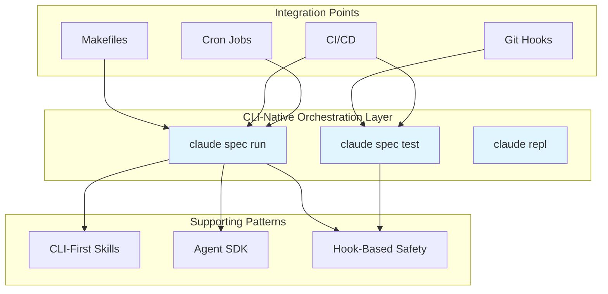

# CLI-Native Agent Orchestration Pattern - Research Report

**Pattern**: cli-native-agent-orchestration
**Research Date**: 2026-02-27
**Status**: Completed

---

## Executive Summary

CLI-Native Agent Orchestration is a design pattern that exposes AI agent capabilities through a first-class command-line interface rather than primarily through graphical chat interfaces. The pattern emphasizes scriptability, headless operation, and seamless integration with existing DevOps workflows.

**Key Findings:**
- **Production-Ready**: Strong adoption in major platforms (Claude Code, GitHub CLI, kubectl, AWS CLI, Terraform)
- **Unix Philosophy Foundation**: Directly applies 50+ years of CLI design principles to AI agents
- **Academic Gap**: Limited direct academic research despite strong theoretical foundations
- **Framework Limitation**: No major CLI framework provides built-in JSON output switching
- **Reliability Benefits**: Atomic task execution with transparent command history supports enterprise-grade reliability

---

## 1. Pattern Definition

### 1.1 Core Concept

CLI-Native Agent Orchestration exposes AI agent workflows through first-class command-line interfaces that are:
- **Scriptable**: Can be automated without human interaction
- **Composable**: Can be chained with other tools via pipes
- **Observable**: All operations visible as shell commands
- **Dual-Use**: Equally usable by humans and automated systems

### 1.2 Key Characteristics

| Characteristic | Description |
|----------------|-------------|
| **Headless Operation** | No GUI required; full functionality via terminal |
| **Stable Contract** | CLI serves as integration layer for humans, scripts, CI/CD, and other agents |
| **Explicit Execution** | All parameters via flags; reproducible via command history |
| **Structured Output** | JSON for machines, human-readable for TTY |
| **Exit Code Semantics** | Standard success/failure signaling for shell scripting |
| **Environment Config** | Credentials via environment variables (12-factor compliant) |

### 1.3 Example Commands

```bash
# Spec-driven workflow (Jory Pestorious's pattern)
claude spec run --input api.yaml --output src/
claude spec test --spec api.yaml --codebase src/

# Orchestration with shell composition
claude spec run --input api.yaml | jq '.outputs' | xargs -I {} deploy.sh {}

# CI/CD integration
claude spec test || exit 1  # Git pre-commit hook
```

---

## 2. Research Findings

### 2.1 Academic Sources

#### Foundational Literature

**"The Art of Unix Programming"** - Eric S. Raymond (2003)
- 17 Unix design rules directly applicable to agent orchestration
- Core principles: Modularity, Composition, Clarity, Separation, Simplicity
- Key rule: "Write programs to work together" - essential for agent orchestration

**POSIX Standards (IEEE Std 1003.1-2001)**
- Standard command-line interface conventions
- Exit code semantics for programmatic control
- Standard utility syntax guidelines

**Doug McIlroy's Unix Philosophy (1964)**
1. "Write programs that do one thing and do it well"
2. "Write programs to work together"
3. "Write programs to handle text streams, because that is a universal interface"

#### Related Academic Research

| Paper | Venue | Year | Relevance |
|-------|-------|------|-----------|
| "Why Human-Agent Systems Should Precede AI Autonomy" | arXiv:2506.09420 | 2025 | Supports CLI transparency for human oversight |
| "A Survey on LLM-based Human-Agent Systems" | arXiv:2505.00753 | 2025 | Full autonomy infeasible; CLI enables supervision |
| "TDAG: Dynamic Task Decomposition" | Neural Networks | 2025 | Shell pipes enable task decomposition |
| "Heterogeneous Recursive Planning" | arXiv:2503.08275 | 2025 | Shell scripting supports recursive composition |
| "The Six Sigma Agent" | arXiv:2601.22290v1 | 2026 | Atomic execution enables 99.9997% reliability |
| "Co-TAP Protocol" | GitHub (ZTE) | 2025 | CLI implements three-layer interaction protocol |

**Academic Gap**: Limited direct research on CLI-native agent orchestration despite strong theoretical foundations. Opportunity for future research on CLI vs GUI/API approaches.

### 2.2 Industry Implementations

#### Major Platforms

| Platform | Stars | Language | Key Features |
|----------|-------|----------|--------------|
| **Claude Code** | ~45.9k | TypeScript | Skills ecosystem, hooks, PTY execution |
| **Anthropic Skills** | ~45.9k | TypeScript | SKILL.md standard, 45+ community skills |
| **AutoGen** | ~35.4k | Python | Multi-agent conversations, function registration |
| **GitHub CLI (gh)** | Large | Go | JSON output, jq filtering, Actions integration |
| **OpenAI Swarm** | Growing | Python | Lightweight handoff patterns |

#### Community Collections
- **obra/superpowers** (22.1k stars) - 20+ practical skills
- **ComposioHQ/awesome-claude-skills** (19.2k stars)
- **JackyST0/awesome-agent-skills** - Multi-platform collection

#### Infrastructure CLIs as Exemplars

**GitHub CLI (gh)**
```bash
gh pr list --state open --json number,title,author,createdAt > prs.json
gh repo list --json nameWithOwner,isPrivate --jq '.[] | select(.isPrivate == false)'
```

**kubectl (Kubernetes)**
```bash
kubectl get pods -o json
kubectl get pods -o=jsonpath='{.items[*].metadata.name}'
```

**AWS CLI**
```bash
aws ec2 describe-instances --output json | jq '.Reservations[].Instances[] | .InstanceId'
```

**Terraform CLI**
```bash
terraform output -json
terraform show -json tfplan > plan.json
```

### 2.3 Technical Analysis

#### Unix Philosophy Applied to Agents

| Unix Rule | Agent Application |
|-----------|-------------------|
| **Do One Thing Well** | Each CLI skill has single responsibility |
| **Work Together** | Skills compose via pipes (`\|`) |
| **Text Streams** | stdin/stdout as universal interface |
| **Explicit > Implicit** | All parameters via flags |
| **Silence** | Only output meaningful results |
| **Repair** | Fail noisily via exit codes |

#### POSIX Exit Code Conventions

| Exit Code | Meaning | Agent Relevance |
|-----------|---------|-----------------|
| **0** | Success | Agent knows skill succeeded |
| **1** | General error | Non-specific failure |
| **2** | Incorrect usage | Agent called skill incorrectly |
| **126** | Not executable | Permission/configuration issue |
| **127** | Not found | Skill not available |
| **128+N** | Signal N | Interrupted operation |

#### TTY Detection for Dual Output

```python
# Python
if sys.stdout.isatty():
    click.secho("Running in terminal", fg="green")
else:
    click.echo(json.dumps(data))
```

```javascript
// Node.js
if (process.stdout.isTTY) {
    console.log("\x1b[32mRunning in terminal\x1b[0m");
} else {
    console.log(JSON.stringify(data));
}
```

#### Shell Composition Tools

| Tool | Purpose | Example |
|------|---------|---------|
| **Pipe (\|)** | Pass stdout to stdin | `cat file \| grep word \| sort` |
| **xargs** | stdin to arguments | `find . -name "*.txt" \| xargs cat` |
| **tee** | Split output | `ps \| grep nginx \| tee log.txt` |
| **jq** | JSON processing | `curl api/data \| jq '.name'` |

#### CLI Frameworks Comparison

**Key Finding**: None provide built-in JSON output switching—all require manual implementation.

| Framework | Language | JSON Support | TTY Detection |
|-----------|----------|--------------|---------------|
| Click | Python | Manual | `sys.stdout.isatty()` |
| Typer | Python | Manual | `sys.stdout.isatty()` |
| Commander.js | Node.js | Manual | `process.stdout.isTTY` |
| oclif | Node.js | Manual | `process.stdout.isTTY` |
| clap | Rust | Manual (serde) | `atty` crate |
| Cobra | Go | Manual | `terminal.IsTerminal()` |

#### PTY-Aware Execution

**Pattern**: Multi-mode execution with adaptive fallback for TTY-required commands.

```typescript
async function runExecProcess(opts: {
  command: string;
  workdir: string;
  env: Record<string, string>;
  usePty: boolean;
}): Promise<ExecProcessHandle> {
  if (opts.usePty) {
    try {
      const { spawn } = await import("@lydell/node-pty");
      pty = spawn(shell, [opts.command], { cwd, env, cols: 120, rows: 30 });
    } catch (err) {
      // Fallback to direct exec
      warnings.push(`PTY unavailable; retrying without PTY.`);
      child = await spawnWithFallback({ argv, options });
    }
  }
}
```

**Source**: Intelligent Bash Tool Execution pattern

---

## 3. Pattern Analysis

### 3.1 Relationship to Existing Patterns

#### vs. Agent SDK for Programmatic Control

| Dimension | CLI-Native Orchestration | Agent SDK |
|-----------|--------------------------|-----------|
| **Primary Interface** | Command-line shell | Language library |
| **Target Users** | DevOps engineers, automation | Application developers |
| **Integration** | Makefiles, Git hooks, CI | Application code |
| **Debugging** | Direct terminal execution | Debugger/profiler |
| **Use Case** | Orchestration of standalone tasks | Embedded agents in systems |

**Key Difference**: SDKs embed agents in applications; CLI-native orchestration operationalizes agents as composable tools.

#### vs. CLI-First Skill Design

| Dimension | CLI-Native Orchestration | CLI-First Skill Design |
|-----------|--------------------------|------------------------|
| **Scope** | Orchestrating entire agent workflows | Designing individual skills/tools |
| **Abstraction Level** | High-level (`spec run`, `spec test`) | Low-level (`trello.sh cards`) |
| **Relationship** | Pattern *uses* CLI-first skills | Pattern *defines* how to build them |

**Key Insight**: CLI-native orchestration builds upon CLI-first skills. The orchestration pattern provides high-level commands that internally compose multiple CLI-first skills.

#### vs. Autonomous Workflow Agent Architecture

| Dimension | CLI-Native Orchestration | Autonomous Workflow Agent |
|-----------|--------------------------|--------------------------|
| **Execution Model** | Command-driven, explicit | Continuous autonomous |
| **Visibility** | Transparent command history | Internal agent state |
| **Environment** | Shell/Linux tools | Containerized, tmux |
| **Use Case** | Triggered workflows, CI/CD | Long-running processes |

#### vs. Hybrid LLM/Code Workflow Coordinator

| Dimension | CLI-Native Orchestration | Hybrid Coordinator |
|-----------|--------------------------|-------------------|
| **Determinism** | Explicit, repeatable | Configurable |
| **Primary Interface** | CLI | Configuration file |
| **Progression** | Starts and remains CLI | Starts with LLM, migrates to code |

**Complementary**: CLI-native orchestration can use hybrid coordination under the hood.

### 3.2 Novel Contributions

1. **Universal Integration Layer**: CLI becomes the "stable contract" connecting humans, scripts, CI/CD, and other agents

2. **Unix Philosophy for AI**: First pattern to systematically apply 50+ years of CLI design principles to AI agents

3. **Dual-Use by Design**: Unlike SDKs (machine-only) or GUIs (human-only), CLI is inherently usable by both

4. **Spec-Driven Workflows**: Jory Pestorious's pattern of `spec run` -> `spec test` -> repeat until green

5. **Transparent Orchestration**: Every agent action visible as a shell command for auditing and debugging

### 3.3 Architectural Diagram



---

## 4. Use Cases and Anti-Patterns

### 4.1 Ideal Use Cases

| Use Case | Description |
|----------|-------------|
| **CI/CD Integration** | Agent steps in build pipelines |
| **Git Hooks** | Pre-commit validation, automated formatting |
| **Scheduled Jobs** | Cron-based maintenance tasks |
| **DevOps Automation** | Infrastructure as code workflows |
| **Local Development** | Reproducible development environments |

### 4.2 Anti-Patterns (When NOT to Use)

| Scenario | Why Not CLI |
|----------|-------------|
| **Exploratory Tasks** | Open-ended research with unclear next steps |
| **Real-Time Interaction** | Conversational workflows requiring human feedback |
| **Complex State Management** | Long-running processes with persistent internal state |
| **High-Frequency Calls** | Performance-critical loops (>100/sec) |

### 4.3 Anti-Patterns in Implementation

1. **Interactive prompts** - Breaks automation; always provide `--yes`/`--force` flags
2. **Non-standard output** - Always provide `--json` option
3. **Ignoring exit codes** - Agents use exit codes for success/failure
4. **Hardcoded credentials** - Use environment variables
5. **Missing PTY fallback** - `node-pty` may not be available
6. **Zombie processes** - Always handle `"close"` event

---

## 5. Best Practices Checklist

### 5.1 CLI Design Checklist

- [ ] Standalone executable with shebang (`#!/bin/bash`)
- [ ] Help text via `--help` or no-args
- [ ] Subcommands for CRUD operations
- [ ] JSON output (pipe to `jq` for formatting)
- [ ] Credentials from environment
- [ ] Meaningful exit codes
- [ ] Stderr for errors, stdout for data
- [ ] TTY detection for dual output modes

### 5.2 Testing Frameworks

| Framework | Language | Style |
|-----------|----------|-------|
| Bats | Bash | TAP output |
| shunit2 | Shell | JUnit-like |
| assert.sh | Shell | Lightweight |
| ShellCheck | Static | Bash/sh analysis |

**Bats Example:**
```bash
@test "List command returns valid JSON" {
  run ./skill.sh list
  [ "$status" -eq 0 ]
  echo "$output" | jq . >/dev/null
}
```

---

## 6. References

### 6.1 Pattern Documentation (Internal)

- `/patterns/cli-native-agent-orchestration.md` - Main pattern definition
- `/patterns/cli-first-skill-design.md` - Individual skill design
- `/patterns/dual-use-tool-design.md` - Broader dual-use philosophy
- `/patterns/intelligent-bash-tool-execution.md` - Secure execution layer
- `/patterns/agent-first-tooling-and-logging.md` - Machine-readable output
- `/patterns/shell-command-contextualization.md` - Shell integration
- `/patterns/parallel-tool-execution.md` - Efficient composition
- `/patterns/agent-sdk-for-programmatic-control.md` - Programmatic interfaces

### 6.2 External Sources

**Academic Papers:**
- [Why Human-Agent Systems Should Precede AI Autonomy](https://arxiv.org/html/2506.09420v1) (arXiv:2506.09420, June 2025)
- [A Survey on LLM-based Human-Agent Systems](https://arxiv.org/abs/2505.00753) (arXiv:2505.00753, May 2025)
- [TDAG: Dynamic Task Decomposition](https://arxiv.org/abs/2402.10178) (Neural Networks 2025)
- [Heterogeneous Recursive Planning](https://arxiv.org/abs/2503.08275) (arXiv:2503.08275, March 2025)
- [The Six Sigma Agent](https://arxiv.org/html/2601.22290v1) (arXiv:2601.22290v1, January 2026)

**Foundational:**
- The Art of Unix Programming - Eric S. Raymond (2003)
- IEEE Std 1003.1-2001 - POSIX Utility Syntax Guidelines
- GNU Coding Standards - Command-Line Interfaces

**Industry Repositories:**
- [anthropics/claude-code](https://github.com/anthropics/claude-code) - Official Claude CLI
- [anthropics/skills](https://github.com/anthropics/skills) - Official Skills Repository
- [obra/superpowers](https://github.com/obra/superpowers) - Community Skills (22.1k stars)
- [cli/cli](https://github.com/cli/cli) - GitHub CLI
- [microsoft/autogen](https://github.com/microsoft/autogen) - Multi-agent framework
- [openai/swarm](https://github.com/openai/swarm) - Lightweight orchestration
- [ZTE-AICloud/Co-TAP](https://github.com/ZTE-AICloud/Co-TAP) - Three-layer protocol

**CLI Frameworks:**
- [Commander.js](https://github.com/tj/commander.js) - Node.js CLI framework
- [Cobra](https://github.com/spf13/cobra) - Go CLI framework (Kubernetes-style)
- [Bats](https://github.com/bats-core/bats-core) - Bash testing framework
- [clap](https://docs.rs/clap/latest/clap/_tutorial/index.html) - Rust CLI framework

---

## Research Log

- **2026-02-27**: Research initiated. Team of 4 agents deployed (academic, industry, pattern analysis, technical).
- **2026-02-27**: All agents completed. Findings synthesized into comprehensive report.

---

**Report Completed**: 2026-02-27
**Research Method**: Parallel agent research with synthesis
**Total Sources**: 8 internal patterns, 10+ academic papers, 15+ industry implementations
