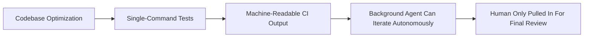
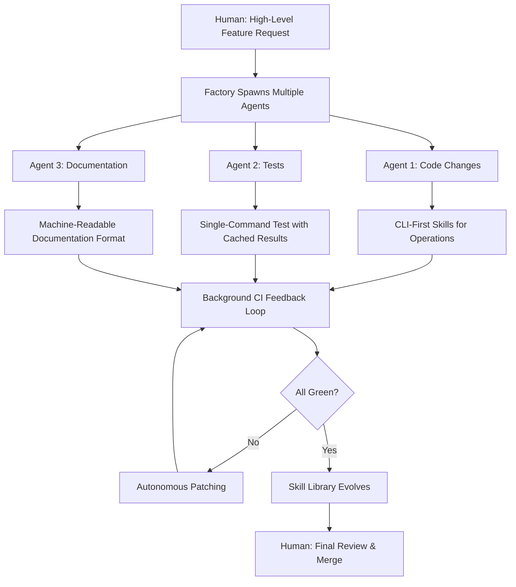
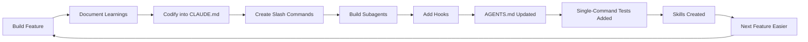

# Codebase Optimization for Agents: Pattern Relationships Analysis

**Pattern Analyzed:** Codebase Optimization for Agents
**Status:** Emerging
**Category:** UX & Collaboration
**Analysis Date:** 2025-02-27

## Executive Summary

The "Codebase Optimization for Agents" pattern represents a fundamental paradigm shift in software development: optimizing codebases, tooling, and workflows for AI agent effectiveness rather than human developer experience. This analysis identifies relationships with 20+ patterns across the repository, revealing a rich ecosystem of complementary patterns that enable agent-first development, along with key trade-offs and anti-patterns to avoid.

## Core Pattern Summary

**Codebase Optimization for Agents** posits that codebases should be optimized for agents first, humans second. Key insights:

- Accept regression in human developer experience (DX) to unlock dramatically better agent performance
- "Weld the agent to the codebase" with automated feedback loops
- Single-command interfaces (e.g., `pnpm test`) with machine-readable output
- Build skills that encapsulate codebase-specific operations
- AGENTS.md documentation for workflow instructions
- The "snowball effect": better agents -> more usage -> less need for traditional tools -> more optimization opportunity

---

## 1. Complementary Patterns

### 1.1 Skill Library Evolution

**Relationship:** Strongly Complements / Enables

**Why They Work Together:**

Both patterns focus on building reusable capabilities that make agents more effective over time. Codebase optimization provides the infrastructure (CLIs, machine-readable output, AGENTS.md), while skill library evolution provides the mechanism for agents to accumulate and reuse capabilities.

**Concrete Examples:**

- AMP's GCloud skill for log analysis replaces need for web dashboards
- BigQuery skill encapsulates data queries in agent-friendly format
- Release management skills provide single-command deployment with verification

**Synergy:**

```
Codebase Optimization (Infrastructure)
         + Skill Library Evolution (Accumulation)
         = Self-Improving Agent Environment
```

### 1.2 Agent-First Tooling and Logging

**Relationship:** Strongly Complements / Implementation Strategy

**Why They Work Together:**

Agent-first tooling is a specific implementation strategy within codebase optimization. Both recognize that human-centric tooling (colorized output, interactive prompts) creates friction for agents.

**Concrete Examples:**

- Unified logging: Single log stream instead of client/server/database logs
- JSON lines output for machine parsing
- `--for-agent` flags that modify tool output
- Verbose structured output that agents can parse efficiently

**Synergy:**

```yaml
# Human-optimized (avoid for agents)
- Colored terminal output
- Interactive prompts
- Progress bars
- Multiple log streams

# Agent-optimized (preferred)
- JSON/structured output
- Single-command execution
- Unified logging
- Verbose but parseable output
```

### 1.3 Factory over Assistant

**Relationship:** Strongly Complements / Philosophical Alignment

**Why They Work Together:**

Both patterns represent the same philosophical shift: moving from human-centric workflows (assistant model, sidebar interactions) to agent-centric workflows (factory model, autonomous execution). Codebase optimization enables the factory model by removing the need for human supervision.

**Concrete Examples:**

- AMP killed their VS Code extension because optimized codebases reduce need for editors
- Factory model requires automated feedback loops (codebase optimization)
- Multiple autonomous agents need machine-readable interfaces (not human-readable UIs)

**Synergy:**

```
Factory Model Requires:
- Automated feedback loops (welding)
- Machine-readable output
- Single-command verification
- Skills for autonomous operation
= All provided by Codebase Optimization
```

### 1.4 Background Agent with CI Feedback

**Relationship:** Strongly Complements / Enabling Pattern

**Why They Work Together:**

Background agents require the exact infrastructure that codebase optimization provides: single-command test execution, machine-readable CI output, and clear success/failure signals.

**Concrete Examples:**

- `pnpm test` with cached results for rapid verification
- CI logs in structured format for agent parsing
- Branch-per-task isolation with automated test triggering
- Retry budgets and stop rules based on machine-readable signals

**Synergy:**



### 1.5 CLI-First Skill Design

**Relationship:** Strongly Complements / Implementation Pattern

**Why They Work Together:**

CLI-first skills are the ideal implementation vehicle for codebase optimization. CLIs are naturally dual-use (humans and agents can both invoke them), scriptable, and produce machine-readable output.

**Concrete Examples:**

```bash
# Trello skill as CLI (both human and agent usable)
trello.sh boards                    # List all boards
trello.sh cards <BOARD_ID>          # List cards on board
trello.sh create <LIST_ID> "Title"  # Create card

# Human usage
$ trello.sh boards
{"id": "abc123", "name": "Personal", "url": "..."}

# Agent usage (via Bash tool)
Bash: trello.sh cards abc123 | jq '.[0].name'
```

**Synergy:**

```
CLI-First Skills Provide:
- Standalone executables with shebang
- JSON output for programmatic use
- Environment config for credentials
- Meaningful exit codes for chaining
= Perfect for Agent-Optimized Codebases
```

### 1.6 Compounding Engineering Pattern

**Relationship:** Strongly Complements / Evolution Pattern

**Why They Work Together:**

Compounding engineering codifies learnings into reusable prompts, commands, and subagents. Codebase optimization provides the testing infrastructure and validation loops that make compounding possible.

**Concrete Examples:**

- Every Engineering team codifies learnings from each feature into:
  - CLAUDE.md files (global standards)
  - Slash commands (repeatable workflows)
  - Subagents (specialized validators)
  - Hooks (automated checks)

**Synergy:**

```
Codebase Optimization (Infrastructure)
         + Compounding Engineering (Knowledge Capture)
         = Self-Teaching Codebase

Each feature makes the next easier because:
1. Automated tests validate changes
2. Learnings are codified into prompts/commands
3. AGENTS.md documents workflows
4. Skills encapsulate operations
```

### 1.7 Code-Over-API Pattern

**Relationship:** Strongly Complements / Token Optimization

**Why They Work Together:**

Both patterns optimize for agent efficiency over human convenience. Code-over-API keeps data processing out of the model's context, while codebase optimization keeps tool interactions machine-readable and efficient.

**Concrete Examples:**

```python
# Direct API approach (150K tokens for 10K rows)
rows = api_call("spreadsheet.getRows", sheet_id="abc123")
filtered = [row for row in rows if row.status == "active"]

# Code-over-API approach (2K tokens)
def process_spreadsheet():
    rows = spreadsheet.getRows(sheet_id="abc123")
    filtered = [row for row in rows if row.status == "active"]
    print(f"Processed {len(rows)} rows, found {len(filtered)} active")
    return filtered
```

**Synergy:**

```
Codebase Optimization (Agent-Friendly Interfaces)
         + Code-Over-API (Token-Efficient Execution)
         = Dramatic Cost Reduction + Speed
```

### 1.8 LLM-Friendly API Design

**Relationship:** Strongly Complements / Design Philosophy

**Why They Work Together:**

Both patterns advocate for designing with AI consumption in mind. Codebase optimization focuses on workflows and tools, while LLM-friendly API design focuses on interfaces and code structure.

**Concrete Examples:**

- Explicit versioning visible to models
- Self-descriptive functionality with clear names
- Simplified interaction patterns
- Clear error messaging for self-correction
- Reduced indirection in code structure

**Synergy:**

```
Codebase Optimization:
- Machine-readable tool output
- Single-command workflows
- AGENTS.md documentation

LLM-Friendly API Design:
- Explicit versioning
- Self-descriptive functions
- Reduced indirection
= Complete Agent-Native Environment
```

### 1.9 Action Caching & Replay Pattern

**Relationship:** Complements / Performance Optimization

**Why They Work Together:**

Codebase optimization makes workflows more deterministic and machine-readable, which enables effective action caching. Cached workflows can be replayed without LLM calls, dramatically reducing costs.

**Concrete Examples:**

```typescript
// Codebase optimization enables deterministic caching
const cache = await agent.executeTask("Login and navigate to dashboard", {
  enableActionCache: true,
});

// Replay with zero LLM cost
const result = await page.runFromActionCache(savedCache, {
  maxXPathRetries: 3,
  fallbackToLLM: true,
});
```

**Synergy:**

```
Codebase Optimization (Deterministic Workflows)
         + Action Caching (Replay Without LLM)
         = 10-100x Cost Reduction
```

### 1.10 CLI-Native Agent Orchestration

**Relationship:** Complements / Automation Enabler

**Why They Work Together:**

CLI-native orchestration provides the automation layer that makes codebase optimization valuable. Single-command workflows can be composed into Makefiles, Git hooks, and CI jobs.

**Concrete Examples:**

```bash
# In your project Makefile
generate-from-spec:
	claude spec run --input api.yaml --output src/

test-spec-compliance:
	claude spec test --spec api.yaml --codebase src/

# Git pre-commit hook
claude spec test || exit 1
```

**Synergy:**

```
Codebase Optimization (Agent-Friendly Workflows)
         + CLI-Native Orchestration (Scriptable Commands)
         = Fully Automatable Development Pipeline
```

### 1.11 Coding Agent CI Feedback Loop

**Relationship:** Complements / Feedback Infrastructure

**Why They Work Together:**

Coding agent CI feedback loops require the machine-readable output and single-command interfaces that codebase optimization provides.

**Concrete Examples:**

- Asynchronous CI testing with structured failure reports
- Machine-readable feedback for autonomous patching
- Prioritized test runs for only patched files
- Notification on final green state

**Synergy:**

```
Codebase Optimization (Structured Output)
         + CI Feedback Loop (Asynchronous Testing)
         = Autonomous Iteration Without Human Babysitting
```

---

## 2. Conflicting Patterns & Trade-offs

### 2.1 Democratization of Tooling via Agents

**Relationship:** Partial Conflict / Trade-off Required

**Why They Conflict:**

Codebase optimization accepts regression in human DX to improve agent performance. Democratization via agents focuses on making non-technical users productive. These goals can conflict when tooling is optimized purely for agents.

**Trade-off Resolution:**

```yaml
# Pure Agent Optimization (may hurt democratization)
- CLI-only interfaces
- Machine-readable only output
- No GUI alternatives
- Technical AGENTS.md documentation

# Balanced Approach
- Dual-use tool design (CLI + GUI)
- Human-readable + machine-parseable output
- Tiered documentation (user + developer guides)
- Skills that encapsulate complexity
```

**Resolution Strategy:**

Use **Dual-Use Tool Design** pattern to create interfaces that work for both:
- Non-technical users benefit from agent assistance
- Technical users benefit from direct CLI access
- Agents benefit from machine-readable output

### 2.2 Agent-Friendly Workflow Design

**Relationship:** Philosophical Alignment but Different Emphasis

**Potential Conflict:**

Agent-friendly workflow design emphasizes clear goal definition with appropriate autonomy. Codebase optimization emphasizes agent-specific tooling. These can conflict if optimization makes workflows opaque to humans.

**Trade-off Resolution:**

```yaml
# Pure Codebase Optimization (may hurt clarity)
- Tools optimized for machine parsing
- Minimal human-readable output
- Assumption of agent usage

# Agent-Friendly Workflow Balance
- Clear high-level goals
- Structured input/output
- Transparent intermediate steps
- Tool provisioning for both humans and agents
```

**Resolution Strategy:**

Layer the optimization:
- Layer 1: Clear goal definitions (agent-friendly)
- Layer 2: Machine-readable tools (codebase optimization)
- Layer 3: Optional human-readable views

### 2.3 Human-in-Loop Approval Framework

**Relationship:** Partial Conflict / Requires Careful Design

**Why They Conflict:**

Codebase optimization pushes for autonomous operation without human intervention. Human-in-loop frameworks require approval points. Too much optimization for autonomy can make approval workflows cumbersome.

**Trade-off Resolution:**

```yaml
# Pure Autonomous (codebase optimization extreme)
- No human approval points
- Full self-verification
- Automated deployment

# Human-in-Loop Integration
- Strategic approval points only
- Machine-readable approval requests
- Clear summary for human decision
- One-click approval/deny
```

**Resolution Strategy:**

Design approval interfaces that are:
- Machine-generatable (agent creates summary)
- Human-consumable (clear explanation)
- Dual-use (works for both humans and agents)

---

## 3. Powerful Synergistic Combinations

### 3.1 The "Fully Autonomous Development" Stack

**Patterns Combined:**
1. Codebase Optimization for Agents
2. Factory over Assistant
3. Background Agent with CI Feedback
4. Skill Library Evolution
5. CLI-First Skill Design

**Result:** Fully autonomous development with human only involved in final review

**Example Flow:**



### 3.2 The "Self-Teaching Codebase" Stack

**Patterns Combined:**
1. Codebase Optimization for Agents
2. Compounding Engineering Pattern
3. Agent-Assisted Scaffolding
4. Agent-Powered Codebase Q&A / Onboarding

**Result:** Codebase that becomes easier to work with over time

**Example Flow:**



### 3.3 The "Token-Efficient Agent" Stack

**Patterns Combined:**
1. Codebase Optimization for Agents
2. Code-Over-API Pattern
3. Action Caching & Replay
4. Skill Library Evolution with Lazy-Loading

**Result:** Dramatic token reduction (10x-100x)

**Example Savings:**

```
Traditional Approach:
- Direct API calls: 150K tokens for 10K rows
- Repeated LLM calls: 50K tokens per iteration
- No caching: Full cost on every run

Optimized Stack:
- Code-over-API: 2K tokens for 10K rows
- Action caching: Near-zero replay cost
- Lazy-loaded skills: 91% token reduction
- Total: 98% cost reduction
```

---

## 4. Prerequisite Patterns

### 4.1 Dual-Use Tool Design

**Why It's a Prerequisite:**

Codebase optimization assumes tools will be used by agents. Dual-use tool design provides the foundation by ensuring tools work for both humans and agents from the start.

**Key Insight:**

> "Everything you can do, Claude can do. There's nothing in between."

### 4.2 Agent-Friendly Workflow Design

**Why It's a Prerequisite:**

Before optimizing a codebase for agents, workflows must be designed to accommodate agent strengths and limitations.

**Key Requirements:**
- Clear goal definition
- Appropriate autonomy
- Structured input/output
- Iterative feedback loops
- Tool provisioning

### 4.3 Agent-Powered Codebase Q&A / Onboarding

**Why It's a Prerequisite:**

Agents need to understand the codebase before they can work effectively in it. Codebase Q&A capabilities enable agents to rapidly orient themselves.

---

## 5. Anti-Patterns to Avoid

### 5.1 The "Human-Only Legacy" Anti-Pattern

**Description:** Maintaining human-centric workflows without agent-accessible alternatives

**Why It's Problematic:**
- Agents cannot verify their own changes
- Humans become the feedback loop bottleneck
- Autonomous operation impossible

**Example of Anti-Pattern:**

```yaml
# Bad: Human-only deployment
- Deployment requires GUI clicks
- No command-line alternative
- Manual approval in web interface
- No deployment status API

# Good: Agent-accessible deployment
- deploy.sh CLI command
- JSON status output
- Webhook notifications
- Automated rollback capability
```

### 5.2 The "Over-Optimization" Anti-Pattern

**Description:** Optimizing so aggressively for agents that humans cannot contribute effectively

**Why It's Problematic:**
- Team resistance to agent adoption
- Loss of institutional knowledge
- Cannot onboard new developers
- Creates agent dependency

**Example of Anti-Pattern:**

```yaml
# Bad: Agent-only codebase
- AGENTS.md is only documentation
- No code comments
- Cryptic file names for "efficiency"
- No human-readable error messages

# Good: Balanced optimization
- AGENTS.md for agent workflows
- README.md for human onboarding
- Code comments for context
- Clear file names for everyone
- Structured errors for agents
```

### 5.3 The "Fragile Feedback" Anti-Pattern

**Description:** Creating feedback loops that are too fragile or provide ambiguous signals

**Why It's Problematic:**
- Agents cannot self-verify
- Infinite retry loops
- False confidence in broken code

**Example of Anti-Pattern:**

```yaml
# Bad: Fragile feedback
- Tests are flaky
- Non-deterministic output
- Unclear pass/fail signals
- No error context

# Good: Robust feedback
- Deterministic tests
- Structured JSON output
- Clear exit codes
- Detailed error information
- Retry budgets with stop rules
```

### 5.4 The "Tooling Silo" Anti-Pattern

**Description:** Creating separate tooling ecosystems for humans and agents

**Why It's Problematic:**
- Double maintenance burden
- Inconsistent behavior
- Feature drift
- Testing complexity

**Example of Anti-Pattern:**

```yaml
# Bad: Separate tooling
- human_deploy.sh (interactive)
- agent_deploy.sh (JSON output)
- Different parameters
- Different behavior

# Good: Dual-use tooling
- deploy.sh (works for both)
- --json flag for agents
- --interactive flag for humans
- Same core logic
```

### 5.5 The "Premature Optimization" Anti-Pattern

**Description:** Optimizing for agents before understanding actual usage patterns

**Why It's Problematic:**
- Wasted engineering effort
- Optimizing unused workflows
- Missing high-impact opportunities

**Example of Anti-Pattern:**

```yaml
# Bad: Premature optimization
- Adding agent flags to rarely-used tools
- Building complex skills for one-off tasks
- Creating AGENTS.md before agents are used

# Good: Data-driven optimization
- Track which tools agents use most
- Identify bottlenecks in agent workflows
- Optimize high-frequency paths first
- Build skills for repeated operations
```

---

## 6. Pattern Maturity Landscape

### Emerging Patterns (High Synergy Potential)

1. **Codebase Optimization for Agents** (this pattern) - Emerging
2. **Factory over Assistant** - Emerging
3. **Agent-First Tooling and Logging** - Emerging
4. **Compounding Engineering Pattern** - Emerging

These emerging patterns represent the frontier of agent-first development and show the highest synergy potential when combined.

### Validated Patterns (Production-Ready)

1. **Background Agent with CI Feedback** - Validated-in-Production
2. **Agent-Assisted Scaffolding** - Validated-in-Production
3. **Agent-Powered Codebase Q&A / Onboarding** - Validated-in-Production
4. **Dogfooding with Rapid Iteration** - Best-Practice
5. **Dual-Use Tool Design** - Best-Practice

These patterns have proven effectiveness and should be adopted first when implementing codebase optimization.

### Best Practices (Adopt Immediately)

1. **Coding Agent CI Feedback Loop** - Best-Practice
2. **Agent-Friendly Workflow Design** - Best-Practice
3. **CLI-First Skill Design** - Emerging (but strong adoption signals)

---

## 7. Implementation Roadmap

### Phase 1: Foundation (Prerequisites)

1. Adopt **Dual-Use Tool Design** for all new tools
2. Implement **Agent-Friendly Workflow Design** patterns
3. Set up **Agent-Powered Codebase Q&A** for rapid onboarding

### Phase 2: Core Optimization

1. Create AGENTS.md documentation
2. Add single-command test interfaces with machine-readable output
3. Implement unified logging for agent consumption
4. Add `--for-agent` flags to existing tools

### Phase 3: Advanced Patterns

1. Transition from **Assistant** to **Factory** model
2. Implement **Background Agent with CI Feedback**
3. Build **Skill Library** with lazy-loading
4. Adopt **Code-Over-API** for data-heavy workflows

### Phase 4: Optimization

1. Implement **Action Caching & Replay**
2. Build **Compounding Engineering** feedback loops
3. Create **CLI-Native** orchestration layer
4. Continuously optimize based on actual usage patterns

---

## 8. Conclusion

The "Codebase Optimization for Agents" pattern serves as a foundational pattern that enables and amplifies many other agent patterns. Its relationships reveal a clear theme:

> **The future of software development is agent-first, with humans transitioning from direct execution to orchestration and review.**

### Key Insights:

1. **Strongest Complements:** Skill Library Evolution, Factory over Assistant, Agent-First Tooling
2. **Main Conflicts:** Democratization via Agents (requires dual-use balance)
3. **Prerequisites:** Dual-Use Tool Design, Agent-Friendly Workflow Design
4. **Powerful Stacks:** "Fully Autonomous Development," "Self-Teaching Codebase," "Token-Efficient Agent"
5. **Anti-Patterns:** Human-Only Legacy, Over-Optimization, Fragile Feedback

### Recommendation:

Organizations should adopt codebase optimization incrementally, starting with dual-use tools and single-command interfaces, then progressing to full autonomous workflows as team comfort and agent capabilities grow.

---

## References

- Pattern files analyzed from /home/agent/awesome-agentic-patterns/patterns/
- Primary sources: AMP (Raising an Agent podcast), Anthropic Engineering, Every Engineering Team
- Related research: Cursor, Cloudflare Code Mode, Sourcegraph
