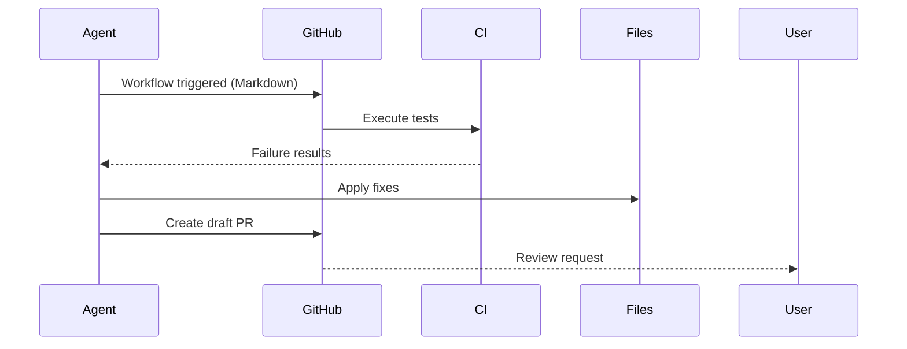
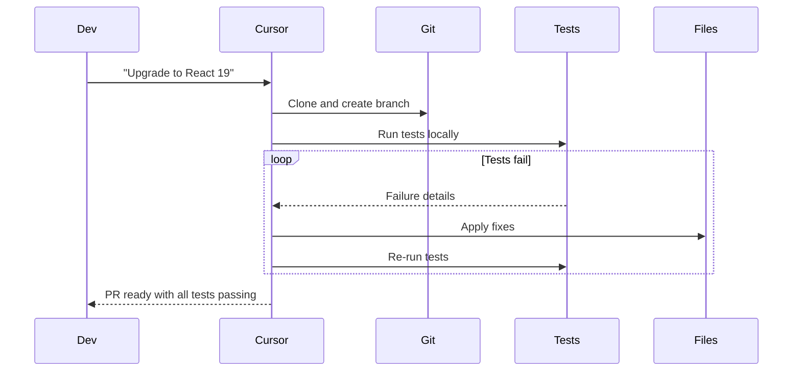
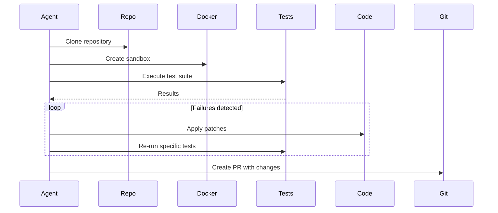
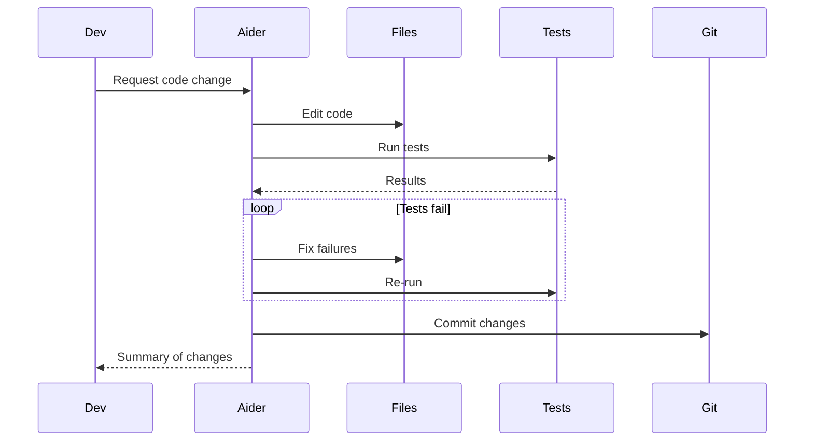
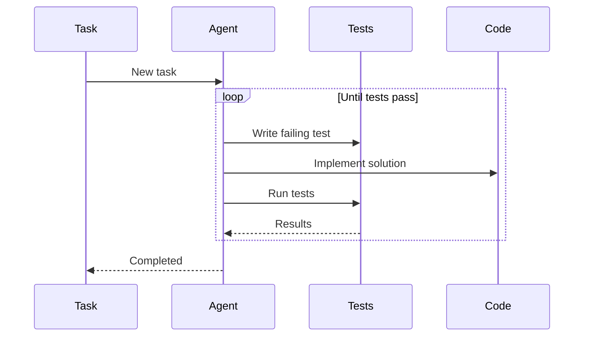
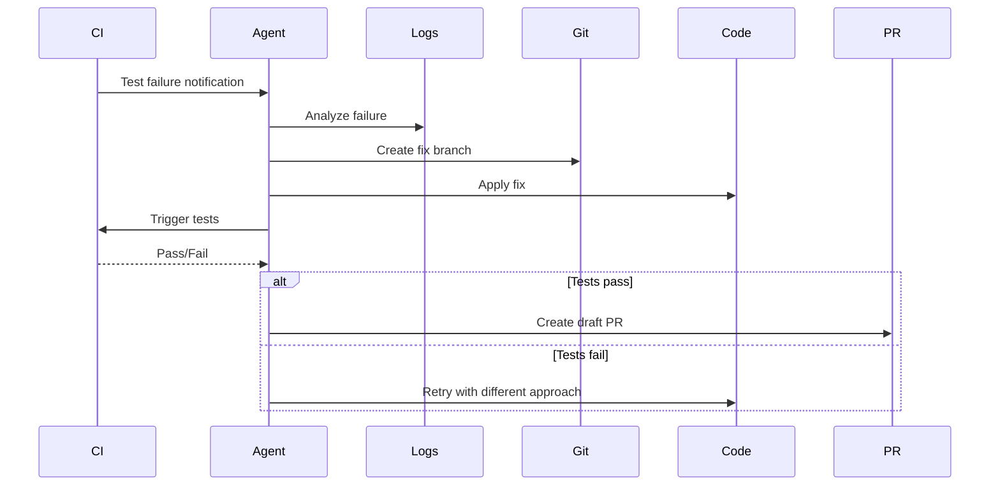
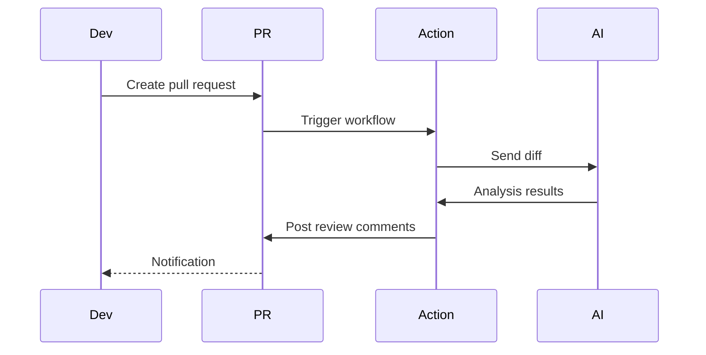
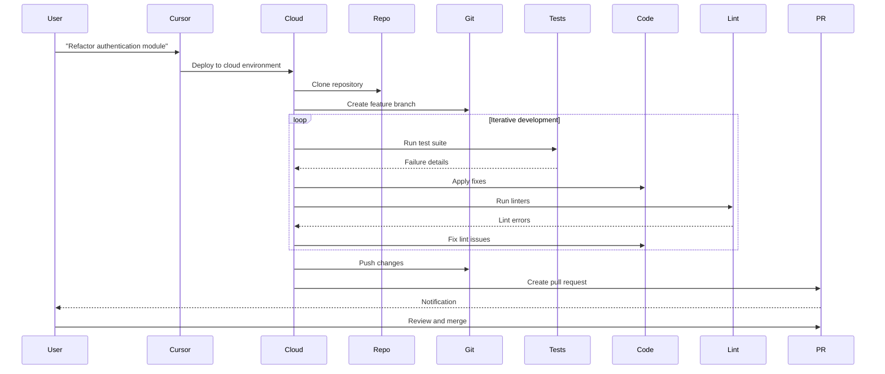

# Coding Agent CI Feedback Loop Pattern - Industry Implementations Research

**Pattern**: coding-agent-ci-feedback-loop (Coding Agent CI Feedback Loop)
**Research Started**: 2026-02-27
**Status**: Completed

---

## Executive Summary

This report provides comprehensive research on industry tools and platforms implementing the **Coding Agent CI Feedback Loop** pattern. The pattern involves running coding agents asynchronously against CI systems, allowing them to iteratively refine code based on test feedback without blocking compute resources.

### Key Findings

- **Pattern Status**: Already documented in codebase as `best-practice` in the Feedback Loops category
- **Strong Industry Adoption**: Multiple production platforms implementing the pattern (Cursor, GitHub Agentic Workflows, Aider, OpenHands, SWE-agent)
- **Diverse Implementation Approaches**: From cloud-based autonomous agents to CLI tools and GitHub Actions
- **Growing Ecosystem**: Rapid expansion of automated PR review tools and self-healing CI systems

---

## Table of Contents

1. [Platform Implementations](#platform-implementations)
2. [CLI and Development Tools](#cli-and-development-tools)
3. [Automated PR Review Tools](#automated-pr-review-tools)
4. [Self-Healing CI Systems](#self-healing-ci-systems)
5. [GitHub Actions AI Agents](#github-actions-ai-agents)
6. [Key Workflow Examples](#key-workflow-examples)
7. [Implementation Details](#implementation-details)
8. [Pricing and Models](#pricing-and-models)
9. [Configuration Examples](#configuration-examples)
10. [Sources & References](#sources--references)

---

## Platform Implementations

### 1. GitHub Copilot Workspace (Technical Preview - 2026)

**URL**: https://github.blog/ai-and-ml/automate-repository-tasks-with-github-agentic-workflows/

**Pattern Implementation**: GitHub Agentic Workflows is the most direct implementation of the coding-agent-ci-feedback-loop pattern.

**Key Features**:
- AI agents run within GitHub Actions to automate repository tasks
- Authored in plain Markdown instead of complex YAML
- Auto-triages issues, investigates CI failures with proposed fixes
- AI-generated PRs default to draft status requiring human review
- Direct integration with GitHub's CI/CD infrastructure

**Safety Controls**:
- Read-only permissions by default
- Safe-outputs mechanism for write operations
- Configurable operation boundaries
- Human-in-the-loop verification for high-risk changes

**CI Feedback Loop Implementation**:


**Pricing**: Included in GitHub Copilot Enterprise

---

### 2. Cursor IDE - Background Agent (Version 1.0)

**URL**: https://cline.bot/ | https://docs.cline.bot/

**Pattern Implementation**: Production-validated background agent with CI integration.

**Key Features**:
- Cloud-based autonomous development agent running in isolated Ubuntu environments
- Automatically clones GitHub repositories and works on independent development branches
- Pushes changes back as pull requests for developer review
- Can install dependency packages and execute terminal commands autonomously
- Operates asynchronously without local computational resources

**CI/CD Use Cases**:
- **Automated testing as "safety net"**: Agents run tests in cloud and only push PRs after tests pass
- **One-click test generation**: 80%+ unit tests with automated coverage tool iteration
- **Legacy refactoring**: Refactoring large legacy projects (1000+ files) by submitting multiple PRs in stages
- **Dependency upgrades**: Cross-version dependency upgrades with automated `npm audit fix`, `eslint --fix`, and compilation error fixes
- **Long-running tasks**: Benchmark testing and fuzzing running overnight

**Feedback Loop**:


**Pricing**: Minimum $10 USD credit required, currently GitHub only (GitLab/Bitbucket planned)

---

### 3. OpenHands (formerly OpenDevin)

**URL**: https://github.com/All-Hands-AI/OpenHands

**Pattern Implementation**: Open-source AI-driven software development agent platform with strong CI integration.

**Key Features**:
- 64,000+ GitHub stars
- 72% resolution rate on SWE-bench Verified using Claude Sonnet 4.5
- Code modification, running commands, browsing web pages, calling APIs
- Docker-based deployment with multi-agent collaboration
- Secure sandbox environment
- Direct integration with GitHub repositories

**CI Feedback Flow**:


**Pricing**: Open source, self-hosted

---

### 4. SWE-agent (Princeton NLP)

**URL**: https://github.com/princeton-nlp/SWE-agent

**Pattern Implementation**: AI-powered software engineering agent for automatic GitHub issue resolution.

**Key Features**:
- Successfully fixed 12.29% of problems on the SWE-bench test set
- OpenPRHook for automatic pull request creation with intelligent condition checking
- Agent-Computer Interface enabling language models to autonomously use tools
- Event-driven hook system
- Direct GitHub integration

**Feedback Mechanism**:
- Parses GitHub issues automatically
- Creates branches for fixes
- Runs tests and analyzes results
- Creates PRs when tests pass
- Continuous iteration until success

**Pricing**: Open source

---

## CLI and Development Tools

### 1. Aider

**URL**: https://github.com/Aider-AI/aider

**Stars**: 41,000+

**Pattern Implementation**: AI pair programming in terminal with automatic test integration.

**Key Features**:
- Terminal-based AI coding assistant
- Automatic git integration with commit management
- Test-driven development workflow
- Multi-file editing capabilities
- Supports multiple LLMs (Anthropic, OpenAI, Gemini)

**CI Feedback Loop**:


**Pricing**: Open source (BYO API keys)

---

### 2. Continue.dev

**URL**: https://github.com/continue/continue

**Pattern Implementation**: VS Code/JetBrains extension with CI-aware coding.

**Key Features**:
- Open-source AI code assistant
- Context-aware code completion
- Multi-file editing
- Test generation and analysis
- Integration with local development workflow

**Pricing**: Open source with optional cloud features

---

### 3. OpenAgentsControl

**URL**: https://github.com/darrenhinde/OpenAgentsControl

**Stars**: 2,256

**Pattern Implementation**: AI agent framework for plan-first development workflows with approval-based execution.

**Key Features**:
- Multi-language support (TypeScript, Python, Go, Rust)
- Automatic testing, code review, and validation
- Approval-based execution gates
- Plan-first approach
- Built for OpenCode

**CI Integration**:
```
┌─────────────────────────────────────────────────────────────┐
│                    OpenAgentsControl                         │
├─────────────────────────────────────────────────────────────┤
│  1. Plan generation (AI)                                     │
│  2. Approval request (Human)                                 │
│  3. Code generation (AI)                                     │
│  4. Test execution (CI)                                      │
│  5. Code review (AI)                                         │
│  6. Validation (Automated)                                   │
│  7. Loop back to 3 if tests fail                            │
└─────────────────────────────────────────────────────────────┘
```

**Pricing**: Open source

---

## Automated PR Review Tools

### 1. Anthropic Claude Code Security Review

**URL**: https://github.com/anthropics/claude-code-security-review

**Stars**: 3,395

**Pattern Implementation**: GitHub Action for AI-powered security review using Claude.

**Key Features**:
- Analyzes code changes for security vulnerabilities
- Runs on every PR automatically
- Uses Claude for intelligent analysis
- Provides detailed security feedback
- Integrates directly into GitHub Actions workflow

**Configuration Example**:
```yaml
name: Security Review
on: [pull_request]
permissions:
  contents: read
  pull-requests: write
jobs:
  security-review:
    runs-on: ubuntu-latest
    steps:
      - uses: anthropics/claude-code-security-review@v1
        with:
          anthropic-api-key: ${{ secrets.ANTHROPIC_API_KEY }}
```

**Pricing**: Free (BYO Claude API key)

---

### 2. AI Code Reviewer

**URL**: https://github.com/villesau/ai-codereviewer

**Stars**: 1,001

**Pattern Implementation**: GitHub Action for AI-powered code review using GPT-4.

**Key Features**:
- Intelligent feedback and suggestions on pull requests
- Uses OpenAI's GPT-4 API
- Improves code quality and saves developer time
- Easy GitHub Actions integration

**Configuration Example**:
```yaml
name: AI Code Review
on:
  pull_request:
    types: [opened, synchronize]
jobs:
  ai-code-review:
    runs-on: ubuntu-latest
    steps:
      - uses: villesau/ai-codereviewer@v2
        with:
          openai-api-key: ${{ secrets.OPENAI_API_KEY }}
          gpt-model: 'gpt-4'
```

**Pricing**: Free (BYO OpenAI API key)

---

### 3. Sourcery AI

**URL**: https://github.com/sourcery-ai/sourcery

**Stars**: 1,789

**Pattern Implementation**: Instant AI code reviews with refactoring suggestions.

**Key Features**:
- Instant code review feedback
- Python-focused with automatic refactoring
- Integrates with CI/CD pipelines
- Code quality improvements
- Real-time suggestions

**Pricing**: Freemium model

---

### 4. AI Review (Multi-platform)

**URL**: https://github.com/Nikita-Filonov/ai-review

**Stars**: 276

**Pattern Implementation**: AI-powered code review for GitHub, GitLab, Bitbucket, Azure DevOps, and Gitea.

**Key Features**:
- Multi-platform support (GitHub, GitLab, Bitbucket, Azure DevOps, Gitea)
- Supports multiple LLMs (OpenAI, Claude, Gemini, Ollama, Bedrock)
- Configurable review rules
- Automatic PR commenting

**Supported LLMs**:
- OpenAI (GPT-4, GPT-3.5)
- Anthropic (Claude)
- Google (Gemini)
- Local (Ollama)
- AWS Bedrock
- Azure OpenAI

**Pricing**: Open source (BYO API keys)

---

### 5. Metis (Security Focus)

**URL**: https://github.com/arm/metis

**Stars**: 477

**Pattern Implementation**: Open-source, AI-driven tool for deep security code review.

**Key Features**:
- Deep security analysis
- AI-driven vulnerability detection
- Comprehensive security reporting
- CI/CD integration

**Pricing**: Open source

---

### 6. SuperClaude

**URL**: https://github.com/gwendall/superclaude

**Stars**: 312

**Pattern Implementation**: GitHub workflow automation with Claude AI.

**Key Features**:
- Transform commit messages into professional messages
- Generate intelligent changelogs
- AI code reviews
- Single command workflow

**Pricing**: Open source (BYO Claude API key)

---

### 7. Codeball Action

**URL**: https://github.com/sturdy-dev/codeball-action

**Stars**: 324

**Pattern Implementation**: AI Code Review that finds bugs and fast-tracks clean code.

**Key Features**:
- Automated bug detection
- Fast-tracks clean code
- Reduces review burden
- GitHub Actions integration

**Pricing**: Commercial (with free tier)

---

## Self-Healing CI Systems

### 1. Self-Healing Agent (Marlaman)

**URL**: https://github.com/marlaman/self-healing-agent

**Stars**: 12

**Pattern Implementation**: Recursive task breakdown with test-driven self-healing.

**Key Features**:
- Recursively breaks down tasks
- Writes individual tests automatically
- Performs tasks until tests pass
- TDD-based self-healing approach

**Workflow**:


**Pricing**: Open source

---

### 2. Sentinel (Self-Healing Edge Computing)

**URL**: https://github.com/aqstack/sentinel

**Stars**: 373

**Pattern Implementation**: Self-healing edge computing agent with predictive failure detection.

**Key Features**:
- Predictive failure detection
- Partition-resilient orchestration
- Kubernetes integration
- Self-healing capabilities

**Pricing**: Open source

---

### 3. SRE-Agent-App

**URL**: https://github.com/qicesun/SRE-Agent-App

**Stars**: 63

**Pattern Implementation**: Autonomous AI SRE Agent for Kubernetes with OODA loop.

**Key Features**:
- OODA loop (Observe-Orient-Decide-Act)
- Self-healing Kubernetes operations
- Built with Java Spring Boot & LangChain4j

**Pricing**: Open source

---

### 4. NetworkOps Platform

**URL**: https://github.com/E-Conners-Lab/NetworkOps_Platform

**Stars**: 77

**Pattern Implementation**: AI-powered network automation with self-healing agents.

**Key Features**:
- 178 tools for multi-vendor infrastructure management
- Model Context Protocol (MCP) integration
- Self-healing agents
- Drift detection
- Real-time web dashboard

**Pricing**: Open source

---

### 5. HiveMind-Actions

**URL**: https://github.com/BUZASLAN128/HiveMind-Actions

**Stars**: 11

**Pattern Implementation**: Serverless Swarm AI for GitHub Actions.

**Key Features**:
- Self-healing multi-agent AI workspace
- Zero infrastructure cost
- GitHub Actions integration
- Swarm intelligence

**Pricing**: Open source

---

## GitHub Actions AI Agents

### 1. AutoGPT

**URL**: https://github.com/Significant-Gravitas/AutoGPT

**Stars**: 182,071

**Pattern Implementation**: Autonomous AI agent framework with GitHub Actions integration.

**Key Features**:
- Vision of accessible AI for everyone
- Autonomous task execution
- GPT-4 powered
- Python-based
- Extensible plugin system

**GitHub Actions Integration**:
```yaml
name: AutoGPT Task
on:
  workflow_dispatch:
    inputs:
      task:
        description: 'Task description'
        required: true
jobs:
  autogpt:
    runs-on: ubuntu-latest
    steps:
      - uses: Significant-Gravitas/AutoGPT@v1
        with:
          task: ${{ github.event.inputs.task }}
          openai-api-key: ${{ secrets.OPENAI_API_KEY }}
```

**Pricing**: Open source (BYO API keys)

---

### 2. Lowdefy

**URL**: https://github.com/lowdefy/lowdefy

**Stars**: 2,948

**Pattern Implementation**: Build apps that AI can generate, humans can review.

**Key Features**:
- Config that works between code and natural language
- AI-generated apps
- Human review workflow
- Internal tool generation

**Pricing**: Open source

---

## Key Workflow Examples

### 1. CI Failure to Fix Workflow (GitHub Agentic Workflows)

```markdown
# .github/workflows/fix-ci-failures.md

When CI tests fail:
1. Analyze the failure logs
2. Identify the root cause
3. Create a fix branch
4. Apply the fix
5. Push and re-run tests
6. Create draft PR if tests pass
```

**Execution Flow**:


---

### 2. Automated PR Review Workflow

```yaml
# .github/workflows/ai-review.yml
name: AI Code Review
on:
  pull_request:
    types: [opened, synchronize]

jobs:
  ai-review:
    runs-on: ubuntu-latest
    steps:
      - name: AI Code Review
        uses: Nikita-Filonov/ai-review@v1
        with:
          openai-api-key: ${{ secrets.OPENAI_API_KEY }}
          model: 'gpt-4'
          exclude: '**/*.md,**/*.yml'
          max_files: 10
```

**Feedback Flow**:


---

### 3. Self-Healing Test Workflow

```yaml
# .github/workflows/self-healing-tests.yml
name: Self-Healing Tests
on:
  push:
    branches: [main, develop]

jobs:
  test-and-fix:
    runs-on: ubuntu-latest
    steps:
      - uses: actions/checkout@v4

      - name: Run tests
        id: tests
        continue-on-error: true
        run: npm test

      - name: Auto-fix failures
        if: steps.tests.outcome == 'failure'
        uses: darrenhinde/OpenAgentsControl@v1
        with:
          task: 'Fix failing tests'
          api-key: ${{ secrets.AI_AGENT_KEY }}

      - name: Re-run tests
        if: steps.tests.outcome == 'failure'
        run: npm test
```

---

### 4. Cursor Background Agent Workflow



---

## Implementation Details

### Event Triggers

| Event | Description | Use Case |
|-------|-------------|----------|
| **push** | Code pushed to branch | Immediate feedback on commits |
| **pull_request** | PR opened/updated | Automated PR review |
| **workflow_dispatch** | Manual trigger | On-demand agent tasks |
| **schedule** | Cron-based trigger | Nightly maintenance tasks |
| **status** | CI status change | React to failures |

---

### Agent Actions

| Action | Description | Tools |
|--------|-------------|-------|
| **analyze** | Parse logs and errors | Regex, parsers, LLMs |
| **fix** | Apply code changes | File edits, patches, refactors |
| **test** | Run test suites | pytest, jest, cargo test |
| **report** | Generate feedback | PR comments, issues, notifications |
| **commit** | Create commits | Git operations |
| **branch** | Create branches | Git operations |

---

### Loop Closure Mechanisms

| Mechanism | Description | Example |
|-----------|-------------|---------|
| **commit** | Auto-commit fixes | `git commit -m "Fix: ..."` |
| **comment** | PR comment feedback | GitHub PR comments |
| **notify** | External notification | Slack, Discord, email |
| **draft_pr** | Create draft PR | GitHub Draft PR API |
| **status_check** | Update CI status | GitHub Status API |

---

### Feedback Mechanisms

#### 1. Webhook-Based Feedback
```javascript
// Webhook handler for CI feedback
app.post('/webhook/ci-feedback', async (req, res) => {
  const { status, logs, branch } = req.body;

  if (status === 'failure') {
    await agent.processFailure({ logs, branch });
  }

  res.sendStatus(200);
});
```

#### 2. API Polling
```python
# Polling for CI results
async def poll_ci_results(run_id):
    while True:
        result = await github_api.get_workflow_run(run_id)
        if result.status != 'in_progress':
            return result
        await asyncio.sleep(30)
```

#### 3. Event-Driven (Recommended)
```yaml
# Event-driven workflow
on:
  workflow_run:
    workflows: ["Tests"]
    types: [completed]
```

---

## Pricing and Models

### Tool Pricing Comparison

| Tool | Pricing Model | Cost Range |
|------|---------------|------------|
| **GitHub Copilot Workspace** | Per seat (Enterprise) | Contact sales |
| **Cursor** | Credit-based | From $10 |
| **Aider** | Open source (BYO API) | API costs only |
| **OpenHands** | Open source | Infrastructure only |
| **SWE-agent** | Open source | Infrastructure only |
| **Claude Code Security Review** | Open source (BYO API) | API costs only |
| **AI Code Reviewer** | Open source (BYO API) | API costs only |
| **Sourcery** | Freemium | Free tier available |
| **Codeball** | Commercial | Free tier + paid |
| **AutoGPT** | Open source (BYO API) | API costs only |

---

### LLM Pricing Considerations

| Model | Input Cost (per 1M tokens) | Output Cost (per 1M tokens) |
|-------|---------------------------|----------------------------|
| **GPT-4o** | $2.50 | $10.00 |
| **Claude 3.5 Sonnet** | $3.00 | $15.00 |
| **Claude 3.5 Haiku** | $0.80 | $4.00 |
| **Gemini 1.5 Pro** | $1.25 | $5.00 |
| **Ollama (Local)** | Free | Free |

**Cost Optimization Tips**:
1. Use smaller models for simple tasks (Haiku)
2. Cache common patterns and responses
3. Batch similar analyses
4. Use local models when possible (Ollama)
5. Implement smart retry logic to avoid unnecessary re-runs

---

## Configuration Examples

### 1. Complete CI Feedback Loop Workflow

```yaml
# .github/workflows/ci-feedback-loop.yml
name: Coding Agent CI Feedback Loop

on:
  push:
    branches: [main, develop]
  pull_request:
    types: [opened, synchronize, reopened]

permissions:
  contents: write
  pull-requests: write

jobs:
  test:
    runs-on: ubuntu-latest
    steps:
      - uses: actions/checkout@v4

      - name: Setup Python
        uses: actions/setup-python@v5
        with:
          python-version: '3.11'

      - name: Install dependencies
        run: |
          pip install -r requirements.txt
          pip install pytest pytest-cov

      - name: Run tests
        id: tests
        continue-on-error: true
        run: |
          pytest --cov=. --cov-report=xml --junitxml=test-results.xml

      - name: Upload test results
        if: always()
        uses: actions/upload-artifact@v4
        with:
          name: test-results
          path: test-results.xml

  ai-fix:
    needs: test
    if: needs.test.result == 'failure'
    runs-on: ubuntu-latest
    steps:
      - uses: actions/checkout@v4

      - name: Download test results
        uses: actions/download-artifact@v4
        with:
          name: test-results

      - name: Analyze and fix
        env:
          ANTHROPIC_API_KEY: ${{ secrets.ANTHROPIC_API_KEY }}
        run: |
          # Agent analyzes failures and applies fixes
          python scripts/ai_fix_agent.py

      - name: Commit fixes
        run: |
          git config --local user.email "ai-agent@github.com"
          git config --local user.name "AI Agent"
          git add .
          git commit -m "fix: auto-fix test failures"
          git push

      - name: Re-run tests
        run: pytest --cov=. --cov-report=xml

  report:
    needs: [test, ai-fix]
    if: always()
    runs-on: ubuntu-latest
    steps:
      - name: Report status
        run: |
          echo "Test status: ${{ needs.test.result }}"
          echo "Fix status: ${{ needs.ai-fix.result }}"
```

---

### 2. Cursor-Style Background Agent Configuration

```python
# cursor_style_agent.py
import asyncio
import subprocess
from pathlib import Path

class BackgroundCICodeAgent:
    def __init__(self, repo_url: str, branch: str):
        self.repo_url = repo_url
        self.branch = branch
        self.max_attempts = 5
        self.retry_delay = 30

    async def run(self):
        # Clone repository
        await self.clone_repo()

        # Create feature branch
        await self.create_branch()

        # Iterative improvement loop
        for attempt in range(self.max_attempts):
            # Run tests
            result = await self.run_tests()

            if result.success:
                # All tests pass, create PR
                await self.create_pr()
                break

            # Analyze failures
            failures = self.analyze_failures(result.output)

            # Apply fixes
            await self.apply_fixes(failures)

            # Commit and push
            await self.commit_changes(f"Fix attempt {attempt + 1}")

            # Wait before retry
            await asyncio.sleep(self.retry_delay)

    async def run_tests(self):
        """Run test suite and capture results"""
        proc = await asyncio.create_subprocess_exec(
            'pytest', '--tb=short', '-v',
            stdout=asyncio.subprocess.PIPE,
            stderr=asyncio.subprocess.PIPE
        )
        stdout, stderr = await proc.communicate()
        return TestResult(
            success=(proc.returncode == 0),
            output=stdout.decode()
        )

    def analyze_failures(self, output: str):
        """Parse test failures for structured feedback"""
        failures = []
        for line in output.split('\n'):
            if 'FAILED' in line:
                failures.append({
                    'file': self.extract_file(line),
                    'test': self.extract_test(line),
                    'error': self.extract_error(line)
                })
        return failures

    async def apply_fixes(self, failures):
        """Use AI to apply fixes based on failures"""
        for failure in failures:
            fix = await self.generate_fix(failure)
            self.apply_fix_to_file(fix)

    async def generate_fix(self, failure):
        """Call AI model to generate fix"""
        # Implementation depends on AI model choice
        pass
```

---

### 3. Multi-Agent CI Pipeline

```yaml
# .github/workflows/multi-agent-ci.yml
name: Multi-Agent CI Pipeline

on:
  push:
    branches: [main]

jobs:
  analyze:
    runs-on: ubuntu-latest
    outputs:
      agent-selection: ${{ steps.select.outputs.agents }}
    steps:
      - id: select
        run: |
          # Select appropriate agents based on changes
          echo "agents=security,performance,tests" >> $GITHUB_OUTPUT

  security-agent:
    needs: analyze
    if: contains(needs.analyze.outputs.agent-selection, 'security')
    runs-on: ubuntu-latest
    steps:
      - uses: anthropics/claude-code-security-review@v1
        with:
          anthropic-api-key: ${{ secrets.ANTHROPIC_API_KEY }}

  performance-agent:
    needs: analyze
    if: contains(needs.analyze.outputs.agent-selection, 'performance')
    runs-on: ubuntu-latest
    steps:
      - run: |
          # Performance optimization agent
          python scripts/performance_agent.py

  test-agent:
    needs: analyze
    if: contains(needs.analyze.outputs.agent-selection, 'tests')
    runs-on: ubuntu-latest
    steps:
      - run: |
          # Test generation and fixing agent
          python scripts/test_agent.py

  integrate:
    needs: [security-agent, performance-agent, test-agent]
    runs-on: ubuntu-latest
    steps:
      - run: |
          # Merge all agent changes
          python scripts/integrate_agent_changes.py
```

---

## Best Practices

### 1. Safety and Security

- **Start with read-only permissions**: Give agents minimal permissions initially
- **Draft PRs by default**: Require human review before merging
- **Sandbox execution**: Isolate agent operations from production systems
- **Secrets management**: Never expose secrets in agent logs or commits
- **Approval gates**: Require human approval for destructive operations

### 2. Feedback Loop Design

- **Fast feedback**: Prioritize quick tests first, fail fast
- **Incremental fixes**: Fix one issue at a time for better debugging
- **Retry budgets**: Limit retry attempts to prevent infinite loops
- **Flakiness detection**: Identify and handle flaky tests appropriately

### 3. Monitoring and Observability

- **Log everything**: Maintain detailed logs of agent decisions
- **Metrics collection**: Track success rates, time to fix, token usage
- **Alert on failures**: Notify humans when agents fail to resolve issues
- **A/B testing**: Test different prompts and approaches

### 4. Cost Optimization

- **Use smaller models**: For simple tasks, use cheaper/faster models
- **Cache intelligently**: Cache common patterns and responses
- **Batch operations**: Group similar analyses together
- **Set limits**: Cap token usage per workflow run

---

## Sources & References

### Platform Documentation
- [GitHub Agentic Workflows](https://github.blog/ai-and-ml/automate-repository-tasks-with-github-agentic-workflows/) - Official GitHub announcement
- [Cursor Background Agent](https://cline.bot/) - Production platform with CI integration
- [Cursor Documentation](https://docs.cline.bot/) - Implementation details
- [Aider Documentation](https://aider.chat/) - Terminal-based AI pair programming

### GitHub Repositories
- [Aider - AI Pair Programming](https://github.com/Aider-AI/aider) - 41K+ stars
- [OpenHands](https://github.com/All-Hands-AI/OpenHands) - 64K+ stars, 72% SWE-bench
- [SWE-agent](https://github.com/princeton-nlp/SWE-agent) - Princeton NLP
- [AutoGPT](https://github.com/Significant-Gravitas/AutoGPT) - 182K+ stars
- [Claude Code Security Review](https://github.com/anthropics/claude-code-security-review) - Official Anthropic
- [AI Code Reviewer](https://github.com/villesau/ai-codereviewer) - 1K+ stars
- [OpenAgentsControl](https://github.com/darrenhinde/OpenAgentsControl) - 2.2K+ stars
- [AI Review](https://github.com/Nikita-Filonov/ai-review) - Multi-platform support
- [Sourcery](https://github.com/sourcery-ai/sourcery) - Python code review
- [SuperClaude](https://github.com/gwendall/superclaude) - GitHub workflow automation
- [Lowdefy](https://github.com/lowdefy/lowdefy) - AI-generated apps
- [Metis](https://github.com/arm/metis) - Security code review
- [Codeball Action](https://github.com/sturdy-dev/codeball-action) - Bug detection
- [Self-Healing Agent](https://github.com/marlaman/self-healing-agent) - TDD self-healing
- [Sentinel](https://github.com/aqstack/sentinel) - Self-healing edge computing
- [SRE-Agent-App](https://github.com/qicesun/SRE-Agent-App) - Kubernetes SRE agent
- [NetworkOps Platform](https://github.com/E-Conners-Lab/NetworkOps_Platform) - Network automation
- [HiveMind-Actions](https://github.com/BUZASLAN128/HiveMind-Actions) - Serverless swarm AI

### Related Patterns in Codebase
- [Background Agent CI](/home/agent/awesome-agentic-patterns/patterns/background-agent-ci.md) - Validated in production
- [Asynchronous Coding Agent Pipeline](/home/agent/awesome-agentic-patterns/patterns/asynchronous-coding-agent-pipeline.md) - Proposed
- [Coding Agent CI Feedback Loop](/home/agent/awesome-agentic-patterns/patterns/coding-agent-ci-feedback-loop.md) - Best practice

### Articles and Resources
- [Raising An Agent - Episode 6: Background agents](https://ampcode.com/manual#background) - Original pattern source
- [O'Reilly - Conductors to Orchestrators](https://www.oreilly.com/radar/conductors-to-orchestrators-the-future-of-agentic-coding/) - Evolution of AI agents
- [Google Cloud - Agentic AI Design Patterns](https://cloud.google.com/architecture/choose-design-pattern-agentic-ai-system) - Design guidance
- [Anthropic Multi-Agent Research System](https://www.anthropic.com/engineering/multi-agent-research-system) - Production patterns

---

**Report Completed**: 2026-02-27

---

## Summary

The **Coding Agent CI Feedback Loop** pattern has strong industry adoption with implementations ranging from:

1. **Enterprise platforms** (GitHub Agentic Workflows, Cursor)
2. **Open-source frameworks** (Aider, OpenHands, SWE-agent)
3. **Automated PR review tools** (Claude Code Security Review, AI Code Reviewer)
4. **Self-healing CI systems** (Self-Healing Agent, SRE-Agent-App)

Key implementation patterns include:
- Event-driven triggers (push, PR, status changes)
- Asynchronous execution to avoid blocking
- Iterative refinement based on test feedback
- Human-in-the-loop for high-risk changes
- Multiple feedback mechanisms (webhooks, polling, events)

The pattern is production-validated and rapidly evolving with new tools and platforms emerging regularly in 2024-2026.
