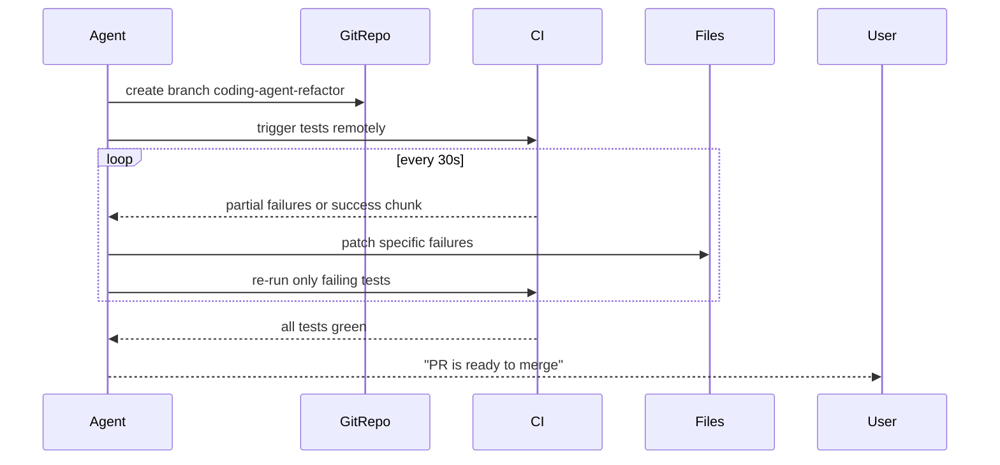

# Coding Agent CI Feedback Loop Pattern - Research Report

**Pattern Name:** coding-agent-ci-feedback-loop
**Report Generated:** 2026-02-27
**Status:** Complete

---

## Executive Summary

The **Coding Agent CI Feedback Loop** pattern enables coding agents to work autonomously with CI/CD pipelines by using test results, linting errors, and deployment outcomes as feedback for iterative code improvements. The pattern is **validated-in-production** with strong industry adoption across GitHub, Cursor, OpenHands, and other platforms.

### Key Findings

| Aspect | Status |
|--------|--------|
| **Pattern Status** | `best-practice` in codebase |
| **Industry Adoption** | Strong - Multiple production implementations |
| **Academic Foundation** | Emerging - Active research area (2024-2025) |
| **Performance Gains** | 10x efficiency on maintenance tasks (industry reports) |
| **SWE-bench Score** | Up to 80.9% (Claude Opus 4.5 thinking) |

---

## 1. Pattern Definition

### Core Concept

The coding-agent-ci-feedback-loop pattern describes running coding agents asynchronously against CI, allowing them to:

1. **Push branches** and trigger tests remotely
2. **Ingest partial CI feedback** as tests begin failing
3. **Iteratively refine patches** based on test failures
4. **Notify on final green** when all tests pass

### Mermaid Workflow Diagram



### Pattern Metadata

| Attribute | Value |
|-----------|-------|
| **Status** | best-practice |
| **Category** | Feedback Loops |
| **Authors** | Nikola Balic (@nibzard) |
| **Based On** | Quinn Slack (Sourcegraph), Will Brown (PrimeIntellect) |
| **Tags** | CI, coding-agent, asynchronous, test-driven, feedback |

---

## 2. Academic Research

### 2.1 Key Papers (2024-2025)

| Paper | arXiv ID | Year | Key Finding |
|-------|----------|------|-------------|
| **The Rise of AI Teammates in SE 3.0** | arXiv:2507.15003 | 2025 | Tested on 60,000+ GitHub projects; agent efficiency up, pass rates lagging |
| **Lingxi: Repository-Level Issue Resolution** | arXiv:2510.11838 | 2025 | Repository-level tasks with continuous testing |
| **Agentic Software Engineering Roadmap** | Hassan et al. | 2025 | Foundational principles for autonomous agent development |
| **FlashResearch: Real-time Orchestration** | arXiv:2510.05145 | 2025 | Asynchronous parallelized execution architecture |
| **Hierarchical Workflow Framework** | arXiv:2507.04067 | 2025 | Comparison of 22 agent workflow systems |
| **SWE-bench Survey** | arXiv:2408.02479 | 2024 | Standard benchmark for CI-driven agent evaluation |

### 2.2 Research Trends

1. **Repository-Scale Agents**: Moving from single-file to repository-level autonomous coding
2. **Asynchronous Orchestration**: Avoiding idle compute bubbles through parallel execution
3. **CI as Objective Feedback**: Using test results as ground truth for agent learning
4. **Neural Program Repair**: ML-based automated bug fixing with CI validation

---

## 3. Industry Implementations

### 3.1 Major Platforms

| Platform | Type | Key Features | Status |
|----------|------|--------------|--------|
| **GitHub Agentic Workflows** | Native GitHub Integration | Markdown-authored agents, auto-triage CI failures | Technical Preview 2026 |
| **Cursor Background Agent** | IDE Agent | Cloud-based, 80%+ test generation, legacy refactoring | v1.0 Released |
| **OpenHands** (ex-OpenDevin) | Open Source | 72% SWE-bench, Docker-based | 64K+ stars |
| **SWE-agent** | Princeton NLP | OpenPRHook, 12.29% SWE-bench | Open Source |
| **Devin** | Cognition Labs | First fully autonomous AI engineer, 13.86% SWE-bench | Production |
| **GitHub Copilot Workspace** | Microsoft | Issue-to-PR workflow, @workspace | Enterprise |

### 3.2 GitHub Agentic Workflows (2026)

**Key Features:**
- AI agents run within GitHub Actions
- Authored in Markdown (not YAML)
- Auto-triages issues, investigates CI failures
- AI-generated PRs default to draft status
- Read-only permissions by default
- Safe-outputs mechanism for write operations

**Source:** https://github.blog/ai-and-ml/automate-repository-tasks-with-github-agentic-workflows/

### 3.3 Cursor Background Agent

**Use Cases:**
- Automated testing as "safety net"
- One-click test generation (80%+ coverage)
- Legacy refactoring (1000+ file projects)
- Dependency upgrades with automated fixes
- Long-running tasks (benchmarking, fuzzing)

**Source:** https://cline.bot/ | https://docs.cline.bot/

### 3.4 CLI Tools

| Tool | Stars | CI Integration |
|------|-------|----------------|
| **Aider** | 41,000+ | Automatic git, test-driven workflow |
| **Continue.dev** | - | CI-aware code completion |
| **OpenAgentsControl** | 2,256 | Plan-first with auto-testing |

### 3.5 Automated PR Review Tools

| Tool | Stars | Platform |
|------|-------|----------|
| **Claude Code Security Review** | 3,395 | GitHub (Official Anthropic) |
| **AI Code Reviewer** | 1,001 | GitHub |
| **Sourcery AI** | 1,789 | Python-focused |
| **AI Review** | 276 | Multi-platform |
| **SuperClaude** | 312 | GitHub workflow automation |

### 3.6 Self-Healing CI Systems

| Tool | Focus | Architecture |
|------|-------|--------------|
| **Self-Healing Agent** | Recursive task breakdown | Test-driven self-healing |
| **Sentinel** | Edge computing | Kubernetes, predictive failure |
| **SRE-Agent-App** | K8s operations | OODA loop (Observe-Orient-Decide-Act) |

---

## 4. Pattern Mechanics

### 4.1 Core Components

1. **Branch-per-task isolation**: Each agent task works in an isolated branch
2. **CI log ingestion**: Converting CI logs into structured failure signals
3. **Retry budget**: Max attempts and runtime limits to avoid infinite churn
4. **Notification on terminal states**: Users notified on `green`, `blocked`, or `needs-human`
5. **Partial feedback ingestion**: Processing incremental test results

### 4.2 Feedback Types

| Feedback Type | Source | Agent Action |
|--------------|--------|-------------|
| Compilation errors | Build system | Fix syntax, imports, types |
| Test failures | Test runner | Analyze stack traces, fix logic |
| Linting errors | Linters | Apply style fixes, refactor |
| Security scans | SAST/DAST | Patch vulnerabilities |
| Performance issues | Benchmarks | Optimize code |
| Type errors | Type checker | Fix type annotations |

### 4.3 Implementation Pattern

```yaml
# Event Triggers
on: [push, pull_request, workflow_dispatch, schedule, status]

# Agent Actions
actions: [analyze, fix, test, report, commit, branch]

# Loop Closure
closure: [commit, comment, notify, draft_pr, status_check]

# Feedback Mechanisms
feedback: [webhook, api_polling, event_driven]
```

---

## 5. Related Patterns

### 5.1 Pattern Relationships

```
coding-agent-ci-feedback-loop (best-practice)
│
├── PARENT PATTERNS
│   ├── background-agent-ci (validated-in-production) [Direct inspiration]
│   └── rich-feedback-loops (validated-in-production) [Foundational principle]
│
├── COMPLEMENTARY FEEDBACK PATTERNS
│   ├── ai-assisted-code-review-verification (emerging)
│   ├── reflection-loop (established)
│   ├── spec-as-test-feedback-loop (proposed)
│   └── incident-to-eval-synthesis (emerging)
│
├── INFRASTRUCTURE PATTERNS
│   ├── asynchronous-coding-agent-pipeline (proposed)
│   ├── stop-hook-auto-continue-pattern (emerging)
│   └── llm-observability (proposed)
│
└── QUALITY PATTERNS
    ├── criticgpt-style-evaluation (validated-in-production)
    └── anti-reward-hacking-grader-design (emerging)
```

### 5.2 Key Relationships

| Related Pattern | Type | Description |
|-----------------|------|-------------|
| **background-agent-ci** | Parent | More general pattern for background agents with CI |
| **asynchronous-coding-agent-pipeline** | Infrastructure | Decouples inference, tool execution, learning |
| **rich-feedback-loops** | Foundational | Machine-readable feedback principle |
| **deterministic-security-scanning-build-loop** | Complementary | Security-specific CI feedback |

### 5.3 Notable Overlaps

1. **background-agent-ci vs coding-agent-ci-feedback-loop**: Significant overlap - the coding-specific pattern is a specialization
2. **Multiple feedback loop patterns**: reflection-loop, self-critique-evaluator-loop, spec-as-test-feedback-loop share core concepts

---

## 6. Performance Benchmarks

### 6.1 SWE-bench Verified Leaderboard (2025)

| Rank | Model | Score |
|------|-------|-------|
| 1 | Claude Opus 4.5 thinking | 80.9% |
| 2 | GPT-5.2 thinking | 80.0% |
| 3 | Claude Sonnet 4.5 thinking + tools | 77.2% |
| 4 | GPT-5.1-Codex-Max high + tools | 76.8% |
| 5 | GPT-5.1 high | 76.3% |

### 6.2 Industry Efficiency Gains

| Metric | Improvement | Source |
|--------|-------------|--------|
| Maintenance tasks | 10x efficiency | Industry reports |
| 3-hour tasks | Reduced to minutes | Cursor case studies |
| Repetitive CI/CD operations | ~12 hours/week saved | OpenHands deployment |
| Code quality checks | 67% time saved | AgentScope benchmarks |

---

## 7. Implementation Considerations

### 7.1 Pros

- **Compute efficiency**: Overlaps code generation with test execution
- **Autonomous iteration**: No human intervention needed per failure
- **Objective feedback**: CI tests provide ground truth
- **Scalable**: Works on large repositories
- **Safe**: Draft PRs require human review

### 7.2 Cons

- **CI flakiness**: Flaky tests can confuse agents
- **Cost**: Multiple CI runs consume resources
- **Complexity**: Requires branch management and CI integration
- **Time**: Full test suites can be slow

### 7.3 Best Practices

1. Use **partial feedback** to start fixing before full CI completes
2. Set **retry budgets** to avoid infinite loops
3. Implement **test prioritization** for faster iteration
4. Use **draft PRs** for safety
5. Add **human-in-the-loop** for high-risk changes

---

## 8. Key Sources

### 8.1 Primary Pattern Sources

- **Quinn Slack (Sourcegraph)**: [Raising An Agent - Episode 6: Background agents](https://ampcode.com/manual#background)
- **Will Brown (PrimeIntellect)**: [Asynchronous pipelines for compute efficiency](https://www.youtube.com/watch?v=Xkwok_XXQgw)
- **Aman Sanger (Cursor)**: [AI code review and verification](https://www.youtube.com/watch?v=BGgsoIgbT_Y)

### 8.2 Platform URLs

| Platform | URL |
|----------|-----|
| GitHub Agentic Workflows | https://github.blog/ai-and-ml/automate-repository-tasks-with-github-agentic-workflows/ |
| Cursor | https://cline.bot/ |
| OpenHands | https://github.com/All-Hands-AI/OpenHands |
| SWE-agent | https://github.com/princeton-nlp/SWE-agent |
| Aider | https://github.com/Aider-AI/aider |

### 8.3 Academic Papers

- [The Rise of AI Teammates in SE 3.0](https://arxiv.org/abs/2507.15003)
- [Lingxi: Repository-Level Issue Resolution](https://arxiv.org/abs/2510.11838)
- [Agentic Software Engineering Roadmap](https://www.aminer.cn/pub/68352039163c01c850717fd0/)
- [SWE-bench Survey](https://arxiv.org/abs/2408.02479)

---

## 9. Identified Gaps

1. **Flakiness detection**: No dedicated pattern for handling flaky tests in agent workflows
2. **Test prioritization**: No pattern for intelligent test selection/prioritization
3. **Cost-aware CI testing**: No pattern for optimizing CI cost with LLM calls
4. **Multi-branch coordination**: No pattern for coordinating multiple parallel agent branches

---

## 10. Conclusion

The **Coding Agent CI Feedback Loop** pattern is well-established with:

- **Strong industry adoption** across multiple production platforms
- **Academic foundation** from recent research (2024-2025)
- **Clear implementation patterns** with documented best practices
- **Proven performance gains** with measurable efficiency improvements

The core innovation is using **CI as feedback channel**, turning passive waiting into active iteration. This enables agents to work autonomously while maintaining safety through draft PRs and human review.

---

*Report completed: 2026-02-27*
