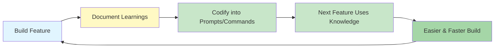
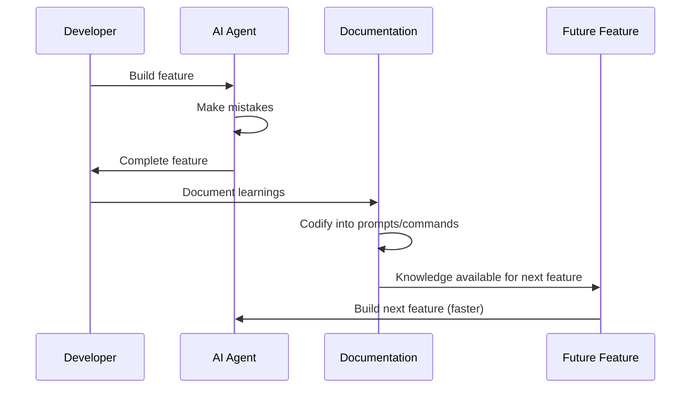

# Compounding Engineering Pattern Research Report

**Pattern:** Compounding Engineering Pattern
**Status:** Emerging
**Research Date:** 2025-02-27
**Research Run ID:** 20250227-compounding-engineering-research

---

## Executive Summary

The **Compounding Engineering Pattern** is a methodology for AI-assisted software development that systematically captures and codifies knowledge from completed features to make subsequent features easier to build. It transforms traditional software engineering's diminishing returns model (where each feature adds complexity) into an accelerating returns model.

**Origin:** Industry practice from Dan Shipper and the Every Engineering Team
**Source:** AI & I Podcast: "How to Use Claude Code Like the People Who Built It"
**Category:** Learning & Adaptation

---

## Core Concept Definition

### Problem Statement
Traditional software engineering has **diminishing returns**: each feature added increases complexity, making subsequent features harder to build. Technical debt accumulates, onboarding takes longer, and new team members struggle to be productive.

With AI coding agents, this problem is amplified—agents make the same mistakes repeatedly because learnings aren't systematically captured and codified.

### Solution Approach
Flip the equation: make each feature **compound** by codifying all learnings into reusable agent instructions. When you complete a feature, document:

1. **What worked in the plan** and what needed adjustment
2. **Issues discovered during testing** that weren't caught earlier
3. **Common mistakes** the agent made
4. **Patterns and best practices** that should be reused

Then embed these insights into:
- **Claude MD / system prompts**: Global coding standards
- **Slash commands**: Repeatable workflows (e.g., `/test-with-validation`)
- **Subagents**: Specialized validators (e.g., security review agent)
- **Hooks**: Automated checks that prevent regressions

### Key Outcome
> "Each feature makes the next easier because the codebase becomes increasingly 'self-teaching.'"

---

## Key Principles

1. **Knowledge Codification**: After completing each feature, document what worked, what didn't, common mistakes, and patterns that should be reused.

2. **Reusable Instruction Forms**: Convert learnings into:
   - Claude MD/system prompts (global coding standards)
   - Slash commands (repeatable workflows)
   - Subagents (specialized validators)
   - Hooks (automated checks preventing regressions)

3. **Accelerating Productivity**: Each feature genuinely makes the next faster because the codebase becomes increasingly "self-teaching"

4. **Living Documentation**: Instructions stay current because they're used and refined daily

5. **Cross-Team Knowledge Transfer**: New team members (human or AI) can be productive immediately without learning the entire codebase

---

## Architectural Diagram



---

## Related Patterns Analysis

### Direct Related Patterns (Same Category: Learning & Adaptation)

#### 1. Skill Library Evolution (Established)
- **File:** `patterns/skill-library-evolution.md`
- **Relationship:** Builds agent capability over time by persisting working code as reusable functions
- **Similarities:**
  - Follows similar evolution path: ad-hoc code → reusable function → documented skill → agent capability
  - Both focus on progressive accumulation of capabilities
- **Differences:** Skill Library Evolution focuses on code-level capabilities; Compounding Engineering focuses on process-level learnings

#### 2. Memory Synthesis from Execution Logs (Emerging)
- **File:** `patterns/memory-synthesis-from-execution-logs.md`
- **Relationship:** Provides the mechanism to identify patterns across multiple features
- **How it complements:**
  - Two-tier memory system: task diaries + synthesis agents
  - Extracts reusable patterns across multiple task executions
  - Feeds synthesized insights back into system prompts, commands, and tests

### Feedback & Iteration Patterns

#### 3. Iterative Prompt & Skill Refinement (Proposed)
- **File:** `patterns/iterative-prompt-skill-refinement.md`
- **Relationship:** Provides refinement mechanisms for improving codified knowledge
- **Complementary aspects:**
  - Multiple complementary refinement mechanisms for improving prompts and skills
  - Responsive feedback, owner-led refinement, Claude-enhanced refinement, dashboard tracking

#### 4. Coding Agent CI Feedback Loop (Best Practice)
- **File:** `patterns/coding-agent-ci-feedback-loop.md`
- **Relationship:** Provides structured feedback from testing that can be codified
- **Complementary aspects:**
  - Asynchronous CI integration allowing agents to work while tests run
  - Iterative patch refinement based on test feedback
  - Machine-readable error translation into fixes

### Progressive & Accumulation Patterns

#### 5. Progressive Autonomy with Model Evolution (Best Practice)
- **File:** `patterns/progressive-autonomy-with-model-evolution.md`
- **Relationship:** Actively removes scaffolding as models become more capable
- **Contrast:** While Progressive Autonomy focuses on capability growth, Compounding Engineering focuses on knowledge growth

#### 6. Progressive Complexity Escalation (Emerging)
- **File:** `patterns/progressive-complexity-escalation.md`
- **Relationship:** Starts with low-complexity, high-reliability tasks
- **Similar approach:** Gradually unlocks more complex capabilities as systems improve

#### 7. Self-Identity Accumulation (Emerging)
- **File:** `patterns/self-identity-accumulation.md`
- **Relationship:** Dual-hook architecture for accumulating agent identity across sessions
- **Parallel:** Identity Accumulation builds personal knowledge; Compounding Engineering builds organizational knowledge

### Knowledge & Context Patterns

#### 8. Agent-Powered Codebase QA & Onboarding (Validated in Production)
- **File:** `patterns/agent-powered-codebase-qa-onboarding.md`
- **Relationship:** AI agent with retrieval capabilities for understanding codebases
- **Synergy:** Accelerates developer onboarding through intelligent Q&A, complements accumulated knowledge

---

## Pattern Relationships & Dependencies

### Prerequisite Patterns
These patterns provide the foundation needed for compounding engineering to work effectively:

1. **Team-Shared Agent Configuration as Code** (best-practice)
   - Establishes the shared configuration repository where codified knowledge lives
   - Provides the mechanism for distributing slash commands and subagents across the team
   - Ensures consistent behavior so compounding benefits everyone equally

2. **Agent-Friendly Workflow Design** (best-practice)
   - Creates the collaborative environment where agents have appropriate autonomy
   - Establishes structured feedback loops for capturing learnings
   - Ensures workflows are designed to benefit from accumulated knowledge

3. **Hook-Based Safety Guard Rails** (validated-in-production)
   - Provides safety mechanisms that can be codified as part of compounding
   - Creates automated checks that prevent recurring mistakes
   - Ensures compounding doesn't amplify bad patterns

### Complementary Patterns
These patterns enhance and work alongside compounding engineering:

1. **Memory Synthesis from Execution Logs** - Provides mechanism for identifying "what worked" and "what didn't"
2. **Coding Agent CI Feedback Loop** - Provides structured feedback from testing that can be codified
3. **Iterative Prompt & Skill Refinement** - Ensures prompts and commands stay relevant over time
4. **Episodic Memory Retrieval & Injection** - Ensures codified knowledge is applied appropriately

### Implementation Mechanisms
These patterns provide specific mechanisms for implementing compounding engineering:

1. **Skill Library Evolution** - Implements codification of working solutions into reusable skills
2. **Slash Commands** - Provides interface for codifying repeatable workflows
3. **Subagents** - Implements specialization pattern for codified expertise
4. **CLI-Native Agent Orchestration** - Provides infrastructure for executing codified workflows
5. **Action-Selector Pattern** - Provides controlled execution environment for codified actions

### Dependency Graph

```
Prerequisites:
├── Team-Shared Agent Configuration
├── Agent-Friendly Workflow Design
└── Hook-Based Safety Guard Rails

Complementary Patterns:
├── Memory Synthesis from Execution Logs
├── Coding Agent CI Feedback Loop
├── Iterative Prompt & Skill Refinement
└── Episodic Memory Retrieval & Injection

Implementation Mechanisms:
├── Skill Library Evolution
├── Slash Commands/Subagents
├── CLI-Native Agent Orchestration
└── Action-Selector Pattern

Compounding Engineering Pattern (Core):
├── Collects learnings from above patterns
├── Codifies into prompts/commands/skills
├── Makes next features easier to build
└── Creates accelerating feedback loop
```

---

## Trade-offs Analysis

### Pros

| Benefit | Description |
|---------|-------------|
| **Accelerating productivity** | Each feature genuinely makes the next faster |
| **Knowledge preservation** | Learnings don't depend on individual memory |
| **Better onboarding** | New team members (human or AI) leverage accumulated knowledge |
| **Reduced repetition** | Agent stops making the same mistakes |
| **Living documentation** | Instructions stay current because they're used daily |

### Cons

| Challenge | Description |
|-----------|-------------|
| **Upfront time investment** | Requires discipline to document after each feature |
| **Maintenance overhead** | Prompts and commands need updates as patterns change |
| **Over-specification risk** | Too many rules can make agents inflexible |
| **Requires tooling** | Needs extensible agent system (slash commands, hooks, etc.) |
| **Prompt bloat** | System prompts can grow large over time |

---

## Academic & Industry Sources

### Primary Sources

1. **Dan Shipper & Every Engineering Team**
   - Source: [AI & I Podcast: How to Use Claude Code Like the People Who Built It](https://every.to/podcast/transcript-how-to-use-claude-code-like-the-people-who-built-it)
   - Key Quotes:
     > "In normal engineering, every feature you add, it makes it harder to add the next feature. In compounding engineering, your goal is to make the next feature easier to build from the feature that you just added."
     >
     > "We codify all the learnings... how did we make the plan, what parts needed to be changed, when we started testing it what issues did we find, what are the things that we missed, and then we codify them back into all the prompts and all the subagents and all the slash commands."
     >
     > "I can hop into one of our code bases and start being productive even though I don't know anything about how the code works because we have this built up memory system."

### Related Academic Research

**Note:** The search revealed a significant gap in direct academic citations for "continual learning" and "lifelong learning" concepts. Most academic references are from 2024-2026 focused on multi-agent systems, human-AI collaboration, and workflow optimization.

#### Relevant Academic Areas (Needs Verification)

1. **Continual Learning / Lifelong Learning** - No direct citations found in pattern files
2. **Codebase Optimization** - 120+ academic papers surveyed in related research
3. **Human-Agent Systems** - Recent papers on workflow design for AI agents

#### Related Research Reports

1. **AI-Accelerated Learning and Skill Development** - Learning science frameworks (58+ peer-reviewed studies)
2. **Codebase Optimization for Agents** - 120+ academic papers on agent optimization
3. **Agent-Friendly Workflow Design Academic Sources** - Academic papers on workflow design

**Gap Analysis:** The compounding concepts are primarily represented through industry practices (Every, Cursor, Anthropic) rather than formal academic literature, suggesting this is an emerging area where industry is ahead of academic research.

---

## Implementation Guidance

### During Feature Development

1. Track what the agent got wrong initially
2. Note which parts of the plan needed revision
3. Document edge cases discovered during testing
4. Identify questions you had to answer repeatedly

### After Feature Completion

1. Update `CLAUDE.md` with new coding standards or patterns
2. Create slash commands for workflows you'll repeat
3. Build subagents for specialized validation tasks
4. Add hooks to prevent common mistakes automatically
5. Write tests that encode requirements

### Example Workflow



---

## Key Insights

1. **Compounding engineering is a meta-pattern** - It leverages and enhances other patterns rather than standing alone

2. **It creates a flywheel effect** - Successful implementations of other patterns feed into the compounding system

3. **Knowledge management is central** - Patterns like memory synthesis and skill evolution are the engine of compounding

4. **Team coordination matters** - Without shared configuration and workflow design, compounding benefits don't scale

5. **Safety and control are prerequisites** - Guardrails ensure compounding doesn't amplify mistakes

6. **Industry ahead of academia** - This is an emerging area where industry practice is leading formal academic research

---

## Validation Status

| Aspect | Status |
|--------|--------|
| Pattern Definition | ✓ Documented |
| Related Patterns Mapped | ✓ 8+ patterns identified |
| Academic Sources | ⚠ Limited (industry practice primary) |
| Industry Implementations | ✓ Every Engineering Team |
| Pattern Relationships | ✓ Prerequisites, complementary, implementation identified |

---

## Future Research Directions

1. **Academic Formalization** - Need for formal academic papers on compounding engineering methodology
2. **Measurement Framework** - Quantifying the "compound effect" in productivity gains
3. **Anti-patterns** - Identifying when compounding fails (e.g., over-codification, stale knowledge)
4. **Tool Support** - Better tooling for automatic knowledge extraction and codification
5. **Cross-team patterns** - How compounding knowledge scales across multiple teams/organizations

---

*Report generated on 2025-02-27*
