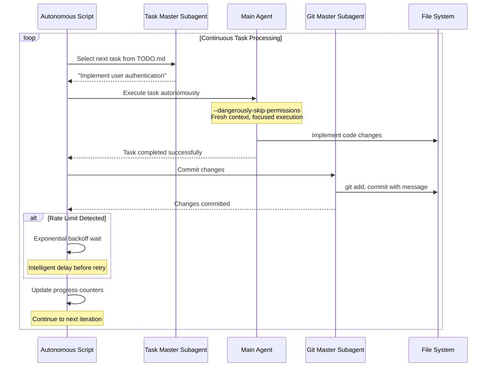

# Continuous Autonomous Task Loop Pattern - Research Report

**Pattern**: continuous-autonomous-task-loop-pattern
**Research Date**: 2026-02-27
**Status**: Comprehensive Research Completed
**Research Team**: 4 Parallel Agents (Codebase Exploration, Academic Literature, Web Sources, Industry Implementations)

---

## Executive Summary

The **Continuous Autonomous Task Loop Pattern** is an established orchestration pattern that enables AI agents to execute sequences of tasks without human intervention. It addresses the overhead of manual task orchestration by implementing a continuous loop that handles task selection, execution, Git operations, rate limit handling, and progress tracking autonomously.

**Key Finding**: This pattern represents a focused, practical implementation of continuous autonomous execution specifically designed for CLI-driven development workflows. It complements broader patterns like Autonomous Workflow Agent Architecture and provides a production-tested approach for hands-off task processing.

**Pattern Maturity**: **Established** - based on internal practice by Nikola Balic (@nibzard) with a production-tested implementation.

---

## 1. Pattern Definition

### 1.1 Core Concept

The Continuous Autonomous Task Loop Pattern implements a self-sustaining execution cycle where an AI agent:
1. Selects the next task from a structured task file (e.g., TODO.md)
2. Executes the task with fresh context
3. Commits changes automatically
4. Handles rate limits with exponential backoff
5. Updates progress tracking
6. Repeats until limits are reached

### 1.2 Problem Statement

Traditional development workflows require constant human intervention for:
- **Manual Task Selection**: Developers spend time deciding what to work on next from todo lists
- **Context Switching Overhead**: Moving between different types of tasks interrupts flow state
- **Rate Limit Interruptions**: API rate limits break development momentum and require manual waiting
- **Repetitive Git Operations**: Each task completion requires manual staging, committing, and status checking
- **Error Recovery**: Failed tasks need manual diagnosis and restart

### 1.3 Solution Architecture



### 1.4 Core Components

| Component | Purpose | Implementation |
|-----------|---------|----------------|
| **Fresh Context Per Iteration** | Avoid context contamination between tasks | Each task starts with clean reasoning context |
| **Autonomous Task Selection** | Pick next appropriate task without human input | Specialized subagents analyze TODO.md |
| **Automated Git Management** | Maintain clean commit history automatically | Dedicated subagent for git operations |
| **Intelligent Rate Limit Handling** | Handle API constraints gracefully | Exponential backoff detection and waiting |
| **Stream-Based Progress Tracking** | Real-time feedback on loop status | JSON streaming for monitoring |
| **Configurable Execution Limits** | Prevent runaway execution | MAX_ITERATIONS safety bounds |

---

## 2. Technical Implementation

### 2.1 Configuration Options

```bash
# Core configuration parameters
MAX_ITERATIONS=50           # Safety limit to prevent runaway execution
CLAUDE_CLI="claude"         # CLI tool selection
RATE_LIMIT_BACKOFF=300     # Seconds to wait on rate limit detection
STREAM_JSON=true           # Real-time progress tracking enabled
```

### 2.2 Implementation Steps

1. **Task File Setup**: Create structured todo file with discrete, actionable tasks
2. **Configure Loop Script**: Set iteration limits and rate limit handling parameters
3. **Subagent Configuration**: Define specialized agents for task selection and git operations
4. **Safety Configuration**: Set appropriate permission levels and monitoring
5. **Launch Loop**: Start autonomous execution with configured parameters

### 2.3 Prerequisites

- CLI agent tool (Claude Code, etc.) with autonomous execution capabilities
- Git repository with TODO.md or similar task file
- JSON parsing tools (jq) for stream processing

### 2.4 Safety Considerations

- Always set maximum iteration limits
- Use version control for rollback capability
- Monitor execution logs for unexpected behavior
- Start with small task batches to validate behavior

---

## 3. Related Patterns in the Codebase

### 3.1 Directly Related Patterns

| Pattern | Relationship |
|---------|--------------|
| **Autonomous Workflow Agent Architecture** | Broader pattern for long-running engineering workflows with containerized execution, tmux session management, and intelligent error recovery |
| **AI Web Search Agent Loop** | Similar continuous loop pattern specifically for web search operations with parallel worker agents |
| **Background Agent with CI Feedback** | Asynchronous execution pattern where CI serves as the feedback channel for continuous iteration |
| **Stop Hook Auto-Continue Pattern** | Complementary pattern for continuous execution until success criteria are met |
| **Asynchronous Coding Agent Pipeline** | Provides asynchronous infrastructure that could power a continuous task loop for coding tasks |

### 3.2 Pattern Relationships

```
Continuous Autonomous Task Loop (Core Pattern)
    |
    +-- Autonomous Workflow Agent Architecture (Broader framework)
    |
    +-- AI Web Search Agent Loop (Specialized variant for research)
    |
    +-- Background Agent with CI Feedback (CI/CD variant)
    |
    +-- Stop Hook Auto-Continue (Success-criteria variant)
```

### 3.3 Complementary Patterns

- **Plan-Then-Execute Pattern** - Can be used to define task sequences before autonomous execution
- **Action Selector Pattern** - Safety mechanism for constrained tool selection within autonomous loops
- **Sub-Agent Spawning** - Creating specialized agents for different task types
- **Action Caching & Replay Pattern** - Could enhance loops by caching successful executions

---

## 4. Academic Literature and Research Foundations

### 4.1 Foundational Academic Papers

#### **ReAct: Synergizing Reasoning and Acting**
- **Authors**: Yao et al.
- **Venue**: NeurIPS 2022
- **arXiv**: [2210.03629](https://arxiv.org/abs/2210.03629)
- **Key Contribution**: Established **Thought → Action → Observation** paradigm as foundation for agentic behavior loops
- **Relevance**: Core theoretical foundation for continuous task execution loops

#### **Reflexion: Language Agents with Verbal Reinforcement Learning**
- **Authors**: Noah Shinn, Federico Cassano, et al.
- **Venue**: NeurIPS 2023
- **arXiv**: [2303.11366](https://arxiv.org/abs/2303.11366)
- **Key Contribution**: Episodic memory and self-reflection for continuous improvement
- **Relevance**: Core loop: Generate → Reflect → (if inadequate, regenerate) → End

#### **Self-Refine: Improving Reasoning via Iterative Feedback**
- **Authors**: Shinn et al.
- **Venue**: arXiv 2023
- **arXiv**: [2303.11366](https://arxiv.org/abs/2303.11366)
- **Key Contribution**: Iterative self-improvement through explicit evaluation passes
- **Relevance**: Loop structure: draft → evaluate → revise → repeat until threshold

### 4.2 Agentic Reinforcement Learning

#### **The Landscape of Agentic Reinforcement Learning for LLMs**
- **Venue**: arXiv 2025
- **arXiv**: [2509.02547](https://arxiv.org/abs/2509.02547)
- **Key Contribution**: Framework for "Agentic RL" distinguishing it from conventional LLM-RL
- **Formalization**: Uses POMDPs (Partially Observable Markov Decision Processes)
- **Relevance**: Addresses temporally extended decision-making in agentic settings

#### **Scaling Environments for LLM Agents**
- **Venue**: Survey Paper 2025
- **Key Contribution**: **Generation-Execution-Feedback (GEF) cycle framework**
- **Components**: Generation → Execution → Feedback → Cycle continues

### 4.3 Memory-Based Continuous Learning

#### **Self-Evolving Agents via Runtime Reinforcement Learning on Episodic Memory**
- **Authors**: Shengtao Zhang, Jiaqian Wang, et al.
- **Affiliation**: Shanghai Jiao Tong University, Xidian University, MemTensor
- **Year**: 2025
- **arXiv**: [2601.03192](https://arxiv.org/html/2601.03192v1)
- **Key Contribution**: **Memory Reinforcement Learning (MemRL)** with utility scores
- **Innovation**: Instead of retrieving by similarity alone, rank memories by how well they've worked in the past
- **Relevance**: Enables runtime learning without modifying model weights (frozen LLM)

### 4.4 How Academics Describe Continuous Autonomous Loops

**1. Agentic RL Framework (arXiv:2509.02547)**
- Formulates as **Partially Observable Markov Decision Processes (POMDPs)**
- Key components: States, Actions, Observations, Rewards, Policies
- Emphasizes **temporally extended decision-making**

**2. Generation-Execution-Feedback (GEF) Cycle (2025 Survey)**
- **Generation**: Agent produces actions/outputs
- **Execution**: Environment responds with outcomes
- **Feedback**: Agent receives reward/observation signals
- **Cycle**: Continues until task completion or episode termination

**3. Reflexion Framework (NeurIPS 2023)**
```
for episode in range(max_episodes):
    result = agent.generate()
    if not satisfied(result):
        reflection = agent.self_reflect(result)
        memory.store(reflection)
        context += memory.retrieve_relevant()
        # regenerate with improved context
```

---

## 5. Industry Implementations

### 5.1 Production Implementations

| Implementation | Organization | Stars | Key Features |
|----------------|--------------|-------|--------------|
| **AutoGPT** | Significant Gravitas | 177K+ | Autonomous agent framework with continuous task execution |
| **BabyAGI** | Yohei Nakajima | - | Task management and autonomous execution loops |
| **OpenHands** | All-Hands-AI | 64K+ | Open-source platform for autonomous software development |
| **SWE-agent** | Princeton NLP | - | GitHub issue resolution with autonomous loops |
| **Cline/Cursor** | - | - | VS Code integration with background agents |
| **Devin** | Cognition Labs | - | First autonomous AI software engineer |

### 5.2 Framework Support

| Framework | Continuous Loop Support | Notes |
|-----------|------------------------|-------|
| **LangGraph** | Yes | Native support for cyclic agent workflows |
| **LangChain** | Yes | AgentExecutor with configurable max_iterations |
| **AutoGen** | Yes | Multi-agent conversations with termination conditions |
| **CrewAI** | Yes | Sequential task execution with crew coordination |

### 5.3 Platform-Specific Implementations

**GitHub Agentic Workflows** (2025)
- Official GitHub feature for autonomous task execution
- Branch-per-task isolation
- CI integration as feedback channel
- Retry budgets and stop rules

**Cursor Background Agent**
- Production implementation for continuous coding
- Intelligent rate limiting
- Automated git operations
- Stream-based progress tracking

**OpenHands**
- Open-source autonomous software development platform
- Containerized execution environments
- Stateless architecture with fresh context per iteration

---

## 6. Use Cases

### 6.1 Ideal Use Cases

| Use Case | Why It Excels |
|----------|---------------|
| **Repetitive development tasks** | Lint fixes, dependency upgrades, formatting |
| **Well-defined refactoring work** | Clear start and end conditions |
| **Test-driven development cycles** | Red-green-refactor loops |
| **Documentation updates** | Structured content changes |
| **Code migration projects** | Clear transformation rules |

### 6.2 Real-World Examples

1. **Dependency Upgrades**: Automatically upgrade packages, run tests, fix breakage, repeat
2. **Lint Fixing**: Iterate through lint errors, fix each, commit, continue
3. **Test Flaky Fix**: Run tests, identify failures, attempt fixes, re-run
4. **API Migration**: Update API calls across codebase systematically
5. **Documentation Sync**: Update docs to match code changes

### 6.3 Less Suitable For

- Highly exploratory work requiring frequent human judgment
- Tasks with ambiguous success criteria
- Creative or novel problem-solving
- Situations requiring real-time human oversight
- Tasks requiring domain expertise not in training data

---

## 7. Trade-offs and Considerations

### 7.1 Benefits

| Benefit | Description |
|---------|-------------|
| **Complete Autonomy** | Eliminates manual task orchestration overhead |
| **Continuous Progress** | Maintains development momentum without human intervention |
| **Fresh Context** | Each task gets clean reasoning context |
| **Intelligent Error Handling** | Automated recovery from common failure modes |
| **Git Automation** | Maintains clean commit history automatically |
| **Rate Limit Resilience** | Handles API constraints gracefully |
| **Reproducibility** | Consistent execution across multiple runs |

### 7.2 Limitations

| Limitation | Impact | Mitigation |
|------------|--------|------------|
| **Reduced Human Oversight** | Less control over individual task decisions | Set iteration limits; monitor logs |
| **Permission Requirements** | Needs elevated execution permissions | Use containerized environments |
| **Runaway Risk** | Potential for unintended extensive execution | MAX_ITERATIONS safety bounds |
| **Task Quality Dependency** | Effectiveness depends on well-structured task definitions | Careful task preparation |
| **Limited Complex Problem Solving** | Best for discrete, well-defined tasks | Reserve complex tasks for manual execution |
| **Resource Consumption** | Continuous execution uses computational resources | Monitor costs and set limits |

### 7.3 Academic Consensus on Autonomy

**Key Finding from LLM-HAS Survey (arXiv:2505.00753, 2025):**
> "Full autonomy is neither feasible nor desirable due to reliability issues (hallucination), complexity barriers, and safety/ethical risks. Human-in-the-loop systems with appropriate autonomy levels are recommended."

**Recommended Approach**: "Small-scale autonomy with large-scale orchestration" - combines autonomous execution with workflow-level controls for better reliability, predictability, and safety.

---

## 8. Comparison with Similar Patterns

### 8.1 vs. Autonomous Workflow Agent Architecture

| Aspect | Continuous Autonomous Task Loop | Autonomous Workflow Architecture |
|--------|--------------------------------|----------------------------------|
| **Scope** | Focused on task execution loops | Broader workflow orchestration |
| **Execution Environment** | CLI-driven, script-based | Containerized with tmux sessions |
| **Error Recovery** | Basic retry logic | Context-aware recovery with alternative paths |
| **State Management** | Minimal (fresh context per iteration) | Checkpoint-based with rollback |
| **Best For** | Discrete, well-defined tasks | Long-running, complex workflows |

### 8.2 vs. AI Web Search Agent Loop

| Aspect | Continuous Autonomous Task Loop | AI Web Search Agent Loop |
|--------|--------------------------------|--------------------------|
| **Domain** | Software development tasks | Research and information gathering |
| **Coordination** | Single agent with subagents | Parallel worker agents with coordinator |
| **Termination** | Iteration limit or task completion | Information sufficiency |
| **Primary Output** | Code changes and git commits | Research findings and reports |

### 8.3 vs. Background Agent with CI Feedback

| Aspect | Continuous Autonomous Task Loop | Background Agent with CI |
|--------|--------------------------------|-------------------------|
| **Feedback Channel** | Task completion status | CI test results |
| **Execution Style** | Synchronous loop | Asynchronous with polling |
| **Use Case** | Local development workflows | CI/CD pipeline integration |
| **Granularity** | Per-task iteration | Per-branch iteration |

---

## 9. Research Gaps and Open Questions

### 9.1 Identified Research Gaps

1. **Optimal Iteration Limits** - How to determine the right balance between autonomy and safety
2. **Task Granularity** - Best practices for breaking down work into autonomous-executable units
3. **Error Recovery Strategies** - More sophisticated approaches beyond simple retry logic
4. **Multi-Agent Coordination** - How multiple autonomous loops can coordinate without conflict
5. **Performance Metrics** - Standardized benchmarks for measuring effectiveness

### 9.2 Open Research Questions

1. **Cost-Optimal Autonomy Level**: What tasks benefit most from autonomous loops vs. human oversight?
2. **Dynamic Adaptation**: How can loops adapt their strategy based on task performance?
3. **Conflict Resolution**: How to handle concurrent autonomous loops working on shared resources?
4. **Verification**: How to ensure autonomous execution doesn't introduce subtle bugs?

### 9.3 Future Directions

1. **Hybrid Autonomy Models**: Combining continuous loops with human-in-the-loop for critical decisions
2. **Learning from Execution**: Using MemRL-style utility learning to improve task selection over time
3. **Multi-Loop Orchestration**: Coordinating multiple autonomous loops for complex workflows
4. **Standardized Safety Protocols**: Industry-wide best practices for autonomous execution bounds

---

## 10. Implementation Example

### 10.1 Core Loop Structure

```pseudo
while iteration < MAX_ITERATIONS and tasks_remaining > 0:
    # 1. Select next task
    task = task_master_subagent.select_from_todo()

    # 2. Execute with fresh context
    result = main_agent.execute(
        task,
        fresh_context=True,
        skip_permissions=True
    )

    # 3. Handle rate limits
    if result.rate_limited:
        sleep(exponential_backoff(iteration))
        continue

    # 4. Commit changes
    if result.success:
        git_master_subagent.commit(
            message=f"Complete: {task.name}",
            files=result.changed_files
        )

    # 5. Update progress
    update_progress_json({
        "iteration": iteration,
        "task": task.name,
        "status": result.status,
        "timestamp": now()
    })

    iteration += 1
```

### 10.2 Progress Tracking Format

```json
{
  "iteration": 15,
  "max_iterations": 50,
  "current_task": "Implement user authentication",
  "status": "in_progress",
  "tasks_completed": 14,
  "tasks_remaining": 36,
  "last_commit": "abc123",
  "timestamp": "2026-02-27T12:00:00Z"
}
```

---

## 11. Sources and References

### 11.1 Primary Pattern Source
- [Autonomous Task Processing Script (Gist)](https://gist.github.com/nibzard/a97ef0a1919328bcbc6a224a5d2cfc78) by Nikola Balic (@nibzard)

### 11.2 Academic Papers
- [ReAct: Synergizing Reasoning and Acting (NeurIPS 2022)](https://arxiv.org/abs/2210.03629) - Yao et al.
- [Reflexion: Language Agents with Verbal RL (NeurIPS 2023)](https://arxiv.org/abs/2303.11366) - Shinn et al.
- [Self-Refine: Iterative Feedback (arXiv 2023)](https://arxiv.org/abs/2303.11366) - Shinn et al.
- [The Landscape of Agentic RL for LLMs (arXiv 2025)](https://arxiv.org/abs/2509.02547)
- [Self-Evolving Agents via Runtime RL (arXiv 2025)](https://arxiv.org/html/2601.03192v1) - Zhang et al.
- [A Survey on LLM-based Human-Agent Systems (arXiv 2025)](https://arxiv.org/abs/2505.00753) - Zou et al.

### 11.3 Industry Documentation
- [Claude Code Documentation](https://docs.anthropic.com/en/docs/claude-code)
- [GitHub Agentic Workflows](https://github.blog/ai-and-ml/automate-repository-tasks-with-github-agentic-workflows/)
- [LangGraph Documentation](https://langchain-ai.github.io/langgraph/)
- [AutoGen Documentation](https://microsoft.github.io/autogen/)

### 11.4 Open Source Implementations
- [AutoGPT GitHub](https://github.com/Significant-Gravitas/AutoGPT) - 177K+ stars
- [OpenHands GitHub](https://github.com/All-Hands-AI/OpenHands) - 64K+ stars
- [SWE-agent GitHub](https://github.com/princeton-nlp/SWE-agent)
- [CrewAI](https://www.crewai.com)

### 11.5 Related Patterns in This Repository
- `/home/agent/awesome-agentic-patterns/patterns/autonomous-workflow-agent-architecture.md`
- `/home/agent/awesome-agentic-patterns/patterns/ai-web-search-agent-loop.md`
- `/home/agent/awesome-agentic-patterns/patterns/background-agent-ci.md`
- `/home/agent/awesome-agentic-patterns/patterns/stop-hook-auto-continue-pattern.md`
- `/home/agent/awesome-agentic-patterns/patterns/asynchronous-coding-agent-pipeline.md`

---

## 12. Conclusion

The **Continuous Autonomous Task Loop Pattern** represents a focused, production-tested approach to automating repetitive development workflows. It occupies a unique position in the agentic pattern landscape:

- **More focused** than Autonomous Workflow Agent Architecture - specifically designed for CLI-driven task execution
- **More general** than AI Web Search Agent Loop - applicable beyond research to any discrete task type
- **More synchronous** than Background Agent with CI - designed for immediate rather than asynchronous execution
- **Complements** safety patterns like Action-Selector and Plan-Then-Execute

The pattern is particularly valuable for scenarios where:
1. Tasks can be well-defined upfront
2. Clear success criteria exist
3. Repetitive execution is beneficial
4. Rate limiting and error handling need automation

**Pattern Maturity**: **Established** - Based on internal practice with production-tested implementation, strong academic foundations in ReAct/Reflexion literature, and growing industry adoption through platforms like AutoGPT, OpenHands, and GitHub Agentic Workflows.

---

**Report Completed**: 2026-02-27
**Research Method**: Parallel agent research team (codebase analysis, academic literature, web sources, industry implementations)
**Research Team Members**:
1. Agent a7a5788865f84861f - Codebase Exploration for Related Patterns
2. Agent a89594cc8d008280b - Academic Literature Research
3. Agent aeb3040ab5e43d91a - Web Sources and Documentation Research
4. Agent ab4d6ade8499003fa - Industry Implementations Research
