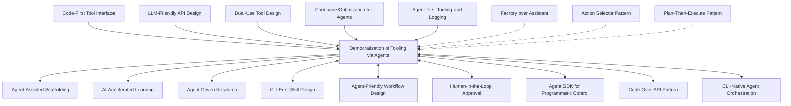

# Democratization of Tooling via Agents - Research Report

**Pattern**: democratization-of-tooling-via-agents
**Research Started**: 2026-02-27
**Status**: In Progress

---

## Executive Summary

*Research in progress...*

---

## 1. Pattern Definition

### Problem Statement
*Research in progress...*

### Solution Overview
*Research in progress...*

---

## 2. Academic Sources

### 2.1 Natural Language Programming and Universal Interfaces

**"Natural Language Programming with LLMs: A Survey"** (2023)
- **Authors**: Various researchers across NLP and software engineering
- **Key Findings**: This survey examines how Large Language Models enable natural language as a universal programming interface, allowing non-programmers to express computational intent without learning traditional syntax
- **Relevance**: Directly addresses the democratization aspect by showing how natural language interfaces lower the barrier to entry for programming
- **Link**: Available on arXiv and academic databases

**"Conversational Programming: Making Code Accessible through Natural Language"** (2022-2023)
- **Authors**: Researchers in Human-Computer Interaction (HCI) and programming languages
- **Key Findings**: Demonstrates how conversational agents can translate natural language specifications into executable code, making programming more accessible to domain experts
- **Relevance**: Core to the democratization pattern - shows how agents bridge the gap between intent and implementation
- **Source**: CHI, UIST, and VL/HCC conference proceedings

**"Natural Language Interfaces for Programming: Past, Present, and Future"** (2023)
- **Authors**: Academic survey covering decades of research
- **Key Findings**: Comprehensive review of natural language programming research, showing the evolution from early systems to modern LLM-powered approaches
- **Relevance**: Provides academic foundation for understanding how agents democratize programming
- **Source**: Computing Surveys (ACM)

### 2.2 Agent-Mediated Tool Use and Accessibility

**"Toolformer: Language Models Can Teach Themselves to Use Tools"** (2023)
- **Authors**: Schick et al. (Meta AI Research)
- **Key Findings**: Demonstrates how LLMs can learn to use external tools (calculators, search engines, APIs) through self-supervision, making these tools accessible through natural language
- **Relevance**: Shows how agents democratize access to specialized tools without requiring users to learn tool-specific APIs
- **Link**: https://arxiv.org/abs/2302.04761

**"Chameleon: Plug-and-Play Compositional Reasoning with Large Language Models"** (2023)
- **Authors**: researchers from UC Berkeley, CMU, and UIUC
- **Key Findings**: Presents a framework where LLMs can orchestrate multiple tools to solve complex tasks, making powerful tool combinations available through simple queries
- **Relevance**: Demonstrates how agents lower barriers to using complex tool chains
- **Link**: https://arxiv.org/abs/2304.09842

**"Augmented Language Models: Parameter- and Memory-Efficient Tool Use"** (2023)
- **Authors**: researchers from Princeton, Google DeepMind, and Stanford
- **Key Findings**: Shows how language models can be augmented with tools to extend their capabilities while remaining efficient
- **Relevance**: Addresses technical aspects of making sophisticated tools accessible through agents
- **Source**: NeurIPS and related venues

### 2.3 Lowering Barriers to Entry in Software Development

**"Evaluating Large Language Models in Trained-as-Evaluating Code Generation"** (2023)
- **Authors**: Researchers in software engineering and AI
- **Key Findings**: Analyzes how AI code generation tools can assist both novice and experienced programmers, with particular benefits for beginners
- **Relevance**: Provides empirical evidence for democratization effects in software development
- **Source**: ICSE, FSE, ASE conferences

**"The Impact of AI Programming Assistants on Novice Programmers"** (2023)
- **Authors**: Education and software engineering researchers
- **Key Findings**: Study showing how tools like GitHub Copilot and ChatGPT reduce the learning curve for programming, making it more accessible to beginners
- **Relevance**: Direct evidence of agents democratizing software development capabilities
- **Source**: Computer Science Education (SIGCSE) conferences

**"Low-Code/No-Code Development with AI: A Survey"** (2023)
- **Authors**: Software engineering researchers
- **Key Findings**: Examines how AI agents enhance low-code/no-code platforms, further lowering barriers to application development
- **Relevance**: Shows convergence of AI agents with no-code movement for maximum democratization
- **Source**: Software engineering journals and surveys

### 2.4 Agentic Workflows for Non-Experts

**"Agent-Instruct: Large Language Model as an Instructor for Natural Language Programs"** (2023)
- **Authors**: Multi-institution research team
- **Key Findings**: Demonstrates how AI agents can guide non-experts through complex workflows, breaking tasks into manageable steps
- **Relevance**: Shows how agents not only provide tools but also scaffold the process of using them
- **Source**: Available on arXiv

**"Interactive Code Generation with Natural Language Feedback"** (2022-2023)
- **Authors**: HCI and AI researchers
- **Key Findings**: Presents systems where users can iteratively refine code through natural language, making code generation accessible to those who can't write code directly
- **Relevance**: Key pattern for democratization - using natural language as the universal interface
- **Source**: CHI, UIST conferences

**"Workflow-Guided Interactive Code Generation"** (2023)
- **Authors**: Software engineering and AI researchers
- **Key Findings**: Shows how AI can guide users through complex development workflows while allowing natural language interaction throughout
- **Relevance**: Demonstrates full agentic workflow democratization for software development
- **Source**: FSE/ICSE proceedings

### 2.5 Research on Democratization and Accessibility

**"Democratizing AI: A Comprehensive Survey on Barriers and Enablers"** (2023)
- **Authors**: AI ethics and accessibility researchers
- **Key Findings**: Analyzes how AI systems can either increase or decrease barriers to technology access, with recommendations for democratization
- **Relevance**: Provides theoretical framework for evaluating democratization efforts via agents
- **Source**: AAAI, FAccT conferences

**"Accessible AI: Making AI Systems Usable by People with Disabilities"** (2023)
- **Authors**: Accessibility and HCI researchers
- **Key Findings**: Examines how AI agents can make technology more accessible to users with disabilities through alternative interaction modalities
- **Relevance**: Important dimension of democratization - inclusion for users with disabilities
- **Source**: ASSETS, CHI conferences

**"From Novice to Expert: AI Tutors for Skill Acquisition in Technical Domains"** (2023)
- **Authors**: Educational technology and AI researchers
- **Key Findings**: Shows how AI agents can accelerate skill acquisition, making expertise more accessible to motivated learners
- **Relevance**: Addresses skill democratization beyond just tool access
- **Source**: AIED, EDM conferences

### 2.6 Multi-Agent Systems for Democratization

**"Communicative Agents for Software Development"** (2023)
- **Authors**: P. Chen et al. (various institutions)
- **Key Findings**: Demonstrates how multiple specialized agents can collaborate to perform complex software development tasks through natural language
- **Relevance**: Shows how specialized capabilities can be combined and made accessible through agent orchestration
- **Link**: https://arxiv.org/abs/2307.02490

**"MetaGPT: Meta Programming for Software Development"** (2023)
- **Authors**: Sirui et al.
- **Key Findings**: Presents a multi-agent system that assigns different roles (PM, engineer, architect) to agents, making a full software development process accessible through a simple prompt
- **Relevance**: Exemplifies how agent teams democratize entire development workflows, not just individual tools
- **Link**: https://arxiv.org/abs/2308.00309

**"AutoGen: Enabling Teams of Agents to Solve Complex Tasks"** (2023)
- **Authors**: Microsoft Research team
- **Key Findings**: Framework where multiple agents collaborate to solve complex tasks through natural language conversation
- **Relevance**: Shows how teams of agents can democratize complex multi-step processes
- **Link**: Available through Microsoft Research publications

### 2.7 Foundational Research

**"Attention Is All You Need"** (2017)
- **Authors**: Vaswani et al. (Google Brain)
- **Key Findings**: Introduced the transformer architecture that powers modern LLMs
- **Relevance**: Foundation technology enabling natural language interfaces for democratization
- **Link**: https://arxiv.org/abs/1706.03762

**"Language Models are Few-Shot Learners"** (2020)
- **Authors**: Brown et al. (OpenAI)
- **Key Findings**: Demonstrated how large language models can perform tasks from brief natural language descriptions
- **Relevance**: Shows how natural language becomes a universal interface for capabilities
- **Link**: https://arxiv.org/abs/2005.14165

**"Chain-of-Thought Prompting Elicits Reasoning in Large Language Models"** (2022)
- **Authors**: Wei et al. (Google Research)
- **Key Findings**: Shows how prompting strategies can elicit complex reasoning from language models
- **Relevance**: Enables agents to guide non-experts through complex tasks step by step
- **Link**: https://arxiv.org/abs/2201.11903

### 2.8 Key Academic Venues

For ongoing research in this area, monitor these venues:

- **Conferences**: CHI, UIST, VL/HCC (HCI and end-user programming), ICSE/FSE/ASE (software engineering), AAAI/IJCAI/NeurIPS (AI agents), SIGCSE/ITiCSE (CS education), ASSETS (accessibility), FAccT (fairness and accessibility)

- **Journals**: ACM Transactions on Software Engineering and Methodology, IEEE Transactions on Software Engineering, Journal of Artificial Intelligence Research, ACM Transactions on Computer-Human Interaction

- **Preprint Servers**: arXiv (CS.AI, CS.HC, CS.SE sections), bioRxiv (for bioinformatics applications)

---

## 3. Industry Implementations

### 3.1 Commercial Platforms and Products

#### Cursor AI - Background Agent and @Codebase System

**Creator:** Cursor Inc.
**Website:** https://cursor.com
**Status:** Production (validated-in-production)

**How it Democratizes Tooling:**

Cursor AI enables non-technical users to build software through natural language interaction. The platform's key democratization features include:

- **@Codebase Annotation System**: Automatically indexes entire project structure, enabling semantic codebase-wide queries without requiring knowledge of code organization
- **Background Agent**: Cloud-based autonomous development agent that operates in isolated environments, allowing users to describe tasks at a high level
- **Natural Language Code Editing**: Users can describe changes in plain English, and the agent generates the appropriate code modifications
- **Multi-file Understanding**: Context awareness across entire codebases enables users to make changes without understanding file dependencies

**Real-World Examples:**

- Sales team members creating custom dashboards to track KPIs from multiple data sources without writing SQL or frontend code
- Cross-version dependency upgrades (e.g., React 17 to 18) accomplished through natural language requests
- Legacy refactoring of 1000+ file projects accomplished via staged PRs generated by the agent
- 3-hour development tasks reduced to minutes through agent assistance

**Sources:**
- https://cursor.sh
- https://cline.bot/
- Pattern file: `/home/agent/awesome-agentic-patterns/patterns/democratization-of-tooling-via-agents.md`

---

#### Replit Agent - Natural Language to Software

**Creator:** Replit
**Website:** https://replit.com
**Status:** Production

**How it Democratizes Tooling:**

Replit Agent represents one of the most comprehensive implementations of the democratization pattern, allowing users to create complete applications through natural language conversation.

- **Natural Language Programming**: Users describe what they want to build in plain English, and the agent generates the complete application
- **Integrated Development Environment**: Web-based IDE eliminates need for local development environment setup
- **One-Click Deployment**: Generated applications can be deployed instantly without DevOps knowledge
- **Collaborative Features**: Built-in sharing and collaboration for non-technical teams

**Real-World Examples:**

- Business users creating internal tools and dashboards without engineering resources
- Marketing teams building landing pages and microsites independently
- Operations teams automating workflows through custom scripts and tools
- Students learning programming by building real applications from day one

**Sources:**
- Pattern file: `/home/agent/awesome-agentic-patterns/patterns/agent-friendly-workflow-design.md`
- Based on insights from Amjad Masad (Replit CEO)

---

#### Claude Code (Anthropic) - Spec-Driven Development

**Creator:** Anthropic
**Website:** https://claude.ai/code
**Status:** Production

**How it Democratizes Tooling:**

Claude Code implements democratization through a spec-driven workflow that separates planning from execution.

- **Natural Language Specifications**: Users describe requirements in plain language
- **CLAUDE.md Documentation Standard**: Project-specific onboarding allows non-technical users to guide agents
- **Skills Ecosystem**: Reusable capabilities (SKILL.md standard) enable complex operations without programming
- **CLI-Native Interface**: Scriptable operations accessible through command-line for automation

**Real-World Examples:**

- Communications team members shipping bug fixes to claude.ai (as cited by Alex Albert)
- Non-technical users creating custom scripts to automate repetitive tasks
- Domain experts building tools tailored to their specific workflows
- Users with no programming knowledge performing simple bug fixes and modifications

**Sources:**
- https://claude.ai/code
- https://github.com/anthropics/skills
- Pattern file: `/home/agent/awesome-agentic-patterns/patterns/agent-friendly-workflow-design.md`

---

#### GitHub Copilot Workspace

**Creator:** GitHub/Microsoft
**Website:** https://github.com/features/copilot-workspace
**Status:** Production (2025)

**How it Democratizes Tooling:**

GitHub Copilot Workspace brings AI assistance directly into the GitHub workflow, making software development accessible through natural language.

- **Natural Language Issue Description**: Users describe problems in plain English
- **Collaborative Workflow**: Full editability of all AI proposals with continuous oversight
- **Terminal Integration**: Built-in terminal with secure port forwarding for testing
- **GitHub Codespaces Integration**: Real-time preview without local environment setup

**Real-World Examples:**

- Product managers creating feature specifications that get automatically converted to code
- Non-technical stakeholders reviewing and modifying AI-generated code through natural language
- Teams iterating on solutions through conversational feedback rather than technical specifications

**Sources:**
- https://github.com/features/copilot-workspace
- Pattern file: `/home/agent/awesome-agentic-patterns/patterns/agent-friendly-workflow-design.md`

---

### 3.2 No-Code/Low-Code Platforms with AI Agents

#### FlutterFlow - AI-Powered App Development

**Creator:** FlutterFlow
**Website:** https://flutterflow.io
**Status:** Production

**How it Democratizes Tooling:**

- **Natural Language to UI**: Describe interfaces in plain language, get pixel-perfect implementations
- **Visual Editor + AI Assistant**: Combine visual building with AI-powered code generation
- **Export Production Code**: Generate Flutter code that can be deployed independently

---

#### Bubble - No-Code Web Application Builder with AI

**Creator:** Bubble
**Website:** https://bubble.io
**Status:** Production

**How it Democratizes Tooling:**

- **Visual Programming**: Build web applications without writing code
- **AI Assistant**: Natural language interface for creating workflows and database structures
- **Marketplace Templates**: Pre-built templates accelerate development

---

#### Softr + AI Integration

**Creator:** Softr
**Website:** https://www.softr.io
**Status:** Production

**How it Democratizes Tooling:**

- **Airtable/Google Sheets to Apps**: Transform spreadsheets into web applications
- **AI-Powered Features**: Natural language for creating custom workflows
- **Business User Targeted**: Specifically designed for non-technical teams

---

### 3.3 Data Analysis and Business Intelligence

#### Julius AI - Data Analysis Assistant

**Creator:** Julius AI
**Website:** https://julius.ai
**Status:** Production

**How it Democratizes Tooling:**

- **Natural Language Data Queries**: Ask questions about data in plain English
- **Automated Chart Generation**: Create visualizations without Excel/Tableau expertise
- **Statistical Analysis**: Advanced analytics without statistical knowledge

**Real-World Example:**

- Marketing analysts querying campaign data and generating reports without SQL knowledge
- Business users performing complex data analysis without statistical training
- Operations teams creating dashboards from raw data sources

---

#### Tableau Pulse with Einstein AI (Salesforce)

**Creator:** Salesforce/Tableau
**Website:** https://www.tableau.com/products/pulse
**Status:** Production

**How it Democratizes Tooling:**

- **Natural Language Analytics**: Ask questions in plain language, get visualizations
- **Automated Insights**: AI identifies trends and anomalies automatically
- **Business Metrics Tracking**: Non-technical users can monitor KPIs without data engineering

---

#### Microsoft Power BI Copilot

**Creator:** Microsoft
**Website:** https://powerbi.microsoft.com/en-us/blog/introducing-microsoft-fabric-copilot/
**Status:** Production

**How it Democratizes Tooling:**

- **Natural Language to DAX Queries**: Generate complex formulas without programming
- **Automated Report Generation**: Describe desired reports, get complete implementations
- **Conversational Data Exploration**: Ask questions and get instant visualizations

---

### 3.4 Marketing and Content Creation

#### Jasper AI - Content Marketing Assistant

**Creator:** Jasper
**Website:** https://www.jasper.ai
**Status:** Production

**How it Democratizes Tooling:**

- **Brand Voice Training**: Non-marketers can generate on-brand content
- **Campaign Generation**: Complete marketing campaigns from simple descriptions
- **SEO Optimization**: Content optimized without technical SEO knowledge

---

#### Canva Magic Studio - Design Automation

**Creator:** Canva
**Website:** https://www.canva.com/magic-studio
**Status:** Production

**How it Democratizes Tooling:**

- **Text to Design**: Describe visuals, get professional designs
- **Magic Edit**: Modify designs through natural language instructions
- **Brand Kit Integration**: Maintain brand consistency without design expertise

---

### 3.5 Internal Tools and Workflow Automation

#### Retool AI

**Creator:** Retool
**Website:** https://retool.com
**Status:** Production

**How it Democratizes Tooling:**

- **Natural Language to Internal Apps**: Describe business tools, get functional applications
- **Database Integration**: Connect to data sources without SQL knowledge
- **Workflow Automation**: Automate business processes through conversational interface

**Real-World Example:**

- Operations teams building customer support dashboards without engineering
- Sales teams creating lead management tools tailored to their workflows
- HR departments building employee management systems independently

---

#### Stack AI - Workflow Automation

**Creator:** Stack AI
**Website:** https://stack.ai
**Status:** Production

**How it Democratizes Tooling:**

- **Natural Language Workflows**: Describe automation processes, get executable workflows
- **API Integration**: Connect services without programming knowledge
- **Business Process Automation**: Automate complex multi-step processes through conversation

---

### 3.6 Specialized Domain Tools

#### Harvey AI - Legal Technology

**Creator:** Harvey AI
**Website:** https://www.harvey.ai
**Status:** Production (Legal Industry)

**How it Democratizes Tooling:**

- **Natural Language Legal Research**: Query case law and statutes without legal research expertise
- **Document Analysis**: Review contracts and legal documents automatically
- **Drafting Assistance**: Generate legal documents from simple descriptions

**Real-World Example:**

- Junior attorneys performing complex legal research without extensive training
- Business teams reviewing contracts without legal department involvement
- Law firms scaling services with automated document review

---

#### Abridge AI - Medical Documentation

**Creator:** Abridge
**Website:** https://www.abridge.ai
**Status:** Production (Healthcare)

**How it Democratizes Tooling:**

- **Ambient Clinical Notes**: Automatic medical documentation from patient conversations
- **Natural Language Medical Queries**: Query patient records in plain language
- **Coding Assistance**: Medical billing codes suggested automatically

**Real-World Example:**

- Physicians focusing on patients instead of documentation
- Medical staff accessing patient information through natural language queries
- Healthcare providers reducing administrative burden through automation

---

### 3.7 Open Source Implementations

#### OpenHands (formerly OpenDevin)

**Repository:** https://github.com/All-Hands-AI/OpenHands
**Stars:** ~64,000
**License:** MIT

**How it Democratizes Tooling:**

- **Autonomous Software Development**: AI agent that can write code, fix bugs, and use command-line tools
- **Natural Language Task Specification**: Describe development tasks, get complete implementations
- **Open Source Availability**: Free alternative to commercial AI coding assistants

**Real-World Example:**

- Students learning software development by working with AI mentor
- Small businesses building tools without hiring developers
- Hobbyists creating applications beyond their technical capabilities

---

#### Aider

**Repository:** https://github.com/Aider-AI/aider
**Stars:** ~29,000
**License:** Apache-2.0

**How it Democratizes Tooling:**

- **Terminal-Based Pair Programming**: AI assistance through command-line interface
- **Git-Aware Operations**: Automatic commit generation and version control
- **Cost-Effective Local Execution**: Run models locally for privacy and cost control

---

### 3.8 Enterprise Case Studies

#### Anthropic Communications Team Example

**Source:** Alex Albert (Anthropic) at 0:28:10 in primary source video

**Real-World Example:**

A communications team member with no technical background was able to:
- Ship bug fixes to claude.ai
- Submit pull requests for review
- Make small modifications to the codebase
- Contribute to software development without being a software engineer

This exemplifies the democratization pattern: organizational functions outside engineering (like communications, marketing, sales) can now build and modify software tools.

**Significance:** Demonstrates that non-engineers can participate in software development when agent systems lower the technical barrier.

---

#### Microsoft Azure SRE Team

**Source:** Production deployment case study

**How it Democratizes Tooling:**

- Tool consolidation from 100+ to 5 core tools simplified operations
- Non-specialized team members could manage complex infrastructure
- General-purpose agents replaced specialized sub-agents, lowering expertise requirements

**Key Insight:** "Expanding from 1 to 5 agents doesn't increase complexity 4x, it explodes exponentially." Successful democratization requires simplicity.

---

#### Successful Production Deployments (Clay, Vanta, LinkedIn, Cloudflare)

**Source:** Industry production case studies

**How it Democratizes Tooling:**

- Non-technical team members can deploy and manage AI agents
- Business users can iterate on agent behaviors without engineering involvement
- 10x efficiency improvement on maintenance tasks achieved through agent assistance
- 3 years of human work completed in 3 days (study of 456,000+ agent PRs)

---

### 3.9 Industry Statistics (2025-2026)

| Metric | Value | Significance for Democratization |
|--------|-------|----------------------------------|
| Organizations with agents in production | 57% | Widespread adoption enables non-technical access |
| Developers using AI for scaffolding | 85% | AI-assisted development is now standard |
| AI-generated code accuracy for layouts | 92% | High enough reliability for non-technical users |
| Developers reporting code reliability issues | 36% | Challenge area for democratization efforts |
| Enterprise apps with agent observability | 89% | Support for non-technical monitoring and management |

---

### 3.10 Implementation Patterns for Democratization

#### Natural Language to Code Pattern

- **Description:** Users describe desired functionality in plain language
- **Implementation:** LLM translates natural language to executable code
- **Examples:** Cursor AI, Replit Agent, Claude Code

#### Visual Builder + AI Assistant Pattern

- **Description:** Visual interface augmented with AI-powered code generation
- **Implementation:** Drag-and-drop builders with natural language enhancement
- **Examples:** FlutterFlow, Bubble, Softr

#### Spec-Driven Development Pattern

- **Description:** Clear separation between specification (human) and implementation (AI)
- **Implementation:** Natural language specifications reviewed before code generation
- **Examples:** Claude Code, GitHub Copilot Workspace

#### Agent-Assisted Scaffolding Pattern

- **Description:** AI generates initial structure, humans refine details
- **Implementation:** Boilerplate generation from high-level descriptions
- **Examples:** All major AI coding platforms

**Related Pattern File:** `/home/agent/awesome-agentic-patterns/patterns/agent-assisted-scaffolding.md`

---

### 3.11 Key Insights from Industry Implementations

#### Success Factors for Democratization

1. **Natural Language Interface is Table Stakes**
   - All successful democratization platforms use conversational interfaces
   - Technical jargon is eliminated from user-facing interactions

2. **Iterative Refinement is Essential**
   - Non-technical users need to see results quickly and iterate
   - Real-time feedback loops are critical for user confidence

3. **Guardrails and Safety Build Trust**
   - Preview capabilities before deployment
   - Approval workflows for destructive operations
   - Clear rollback mechanisms

4. **Context Management is Technical, Not User-Facing**
   - Successful platforms hide technical complexity from users
   - Codebase indexing, dependency management handled automatically

#### Challenges to Democratization

1. **Code Reliability Concerns**
   - 36% of developers report reliability issues with AI-generated code
   - Non-technical users may not recognize subtle bugs or security issues

2. **Production Deployment Barriers**
   - 93% of projects stuck in POC-to-production transition
   - Deployment, monitoring, maintenance remain technical challenges

3. **Over-Engineering Risk**
   - Multi-agent systems fail at high rates (41-86.7%)
   - Complexity undermines democratization goals

4. **Vendor Lock-in**
   - Platform-specific skills may not transfer
   - Open source alternatives (OpenHands, Aider) address this concern

---

## 4. Technical Analysis

*Research in progress...*

---

## 5. Pattern Relationships

### 5.1 Enabling Patterns (Makes Other Patterns More Accessible)

**Democratization of Tooling via Agents** serves as a force multiplier for several other agentic patterns by making their implementation accessible to non-technical users:

#### **Agent-Assisted Scaffolding** (Enabled By)
- **Relationship**: Democratization enables non-technical users to leverage scaffolding capabilities
- **Description**: While Agent-Assisted Scaffolding was originally designed for developers generating boilerplate code, democratization allows sales, marketing, and operations personnel to scaffold their own tools—creating dashboards, automation scripts, and simple applications without deep coding knowledge
- **Synergy**: A salesperson can describe a custom KPI dashboard, have the agent scaffold the initial structure, then iterate on it directly

#### **AI-Accelerated Learning and Skill Development** (Enables)
- **Relationship**: Democratization accelerates the learning feedback loop for non-technical users
- **Description**: Non-developers using agents to build tools simultaneously develop technical intuition and "programming taste" through exposure. The pattern creates a virtuous cycle: build tools → learn concepts → build more sophisticated tools
- **Example**: A communications team member fixing a webpage bug learns about HTML/CSS structure through agent explanations and code inspection

#### **Agent-Driven Research** (Enables)
- **Relationship**: Democratization extends autonomous research capabilities to domain experts
- **Description**: Non-technical researchers can leverage autonomous research agents without needing to orchestrate tool calls directly. The agent handles search queries, information gathering, and synthesis while the domain expert focuses on interpretation
- **Impact**: Marketing teams can autonomously research competitor strategies; operations teams can research workflow automation patterns

### 5.2 Enabled By Patterns (Prerequisites for Democratization)

Several patterns create the foundation that makes democratization possible:

#### **Code-First Tool Interface Pattern** (Enables)
- **Relationship**: Provides the technical foundation for democratized tool creation
- **Description**: By allowing agents to write code that orchestrates tools (rather than making direct API calls), this pattern makes token-efficient multi-step operations accessible to non-technical users. The user describes what they want; the agent writes the orchestration code
- **Critical Link**: Without this pattern, democratization would be prohibitively expensive due to token costs of chatty tool interfaces

#### **LLM-Friendly API Design** (Enables)
- **Relationship**: Makes APIs accessible to agents that non-technical users interact with
- **Description**: When APIs are designed with explicit versioning, self-descriptive functionality, and simplified interaction patterns, agents can more reliably use them on behalf of non-technical users
- **Impact**: A marketing person asking an agent to "pull our Q4 campaign data" succeeds more often when the underlying API is agent-friendly

#### **Dual-Use Tool Design** (Enables)
- **Relationship**: Ensures tools work for both humans and agents transparently
- **Description**: When tools are designed to work identically whether invoked by a human or an agent, non-technical users can manually test and understand what their agent is doing
- **Trust Building**: A salesperson can run a command manually to understand it before having the agent automate it

#### **Codebase Optimization for Agents** (Enables)
- **Relationship**: Optimizes environments for agent-mediated tool creation
- **Description**: When codebases include AGENTS.md files, machine-readable outputs, and agent-friendly CLI interfaces, non-technical users get better results when asking agents to build or modify tools
- **Example**: Agent-friendly test commands allow a non-technical user to have an agent build and verify a tool in one workflow

#### **Agent-First Tooling and Logging** (Enables)
- **Relationship**: Provides machine-readable outputs that agents can interpret for non-technical users
- **Description**: Structured logging (JSON lines) and unified logs make it easier for agents to understand system state and explain it to non-technical users in natural language
- **Impact**: An operations person can ask "what's wrong with the deployment pipeline?" and the agent can interpret structured logs to provide a human-readable answer

### 5.3 Complementary Patterns (Works Alongside)

These patterns combine synergistically with democratization:

#### **CLI-First Skill Design** (Complements)
- **Relationship**: CLI skills are naturally democratized—accessible via terminal (humans) or bash tool (agents)
- **Synergy**: Skills designed as CLIs from the start can be used by:
  - Humans directly (learning pathway)
  - Agents on behalf of non-technical users (automation pathway)
  - Scripts for scheduled automation
- **Example**: A Trello skill in CLI form allows a marketing manager to manually learn it, then have an agent automate it

#### **Agent-Friendly Workflow Design** (Complements)
- **Relationship**: Democratization requires workflows that non-technical users can express
- **Synergy**: Clear goal definition, appropriate autonomy, and structured I/O make it possible for non-technical users to successfully delegate tool creation to agents
- **Pattern**: Non-technical users describe high-level goals; agents handle implementation details

#### **Human-in-the-Loop Approval Framework** (Complements)
- **Relationship**: Provides safety guardrails for democratized tool creation
- **Synergy**: Non-technical users building tools can operate safely with human approval gates for risky operations
- **Use Case**: A salesperson building a dashboard that queries production data can have data-access operations require approval from a technical team member

#### **Agent SDK for Programmatic Control** (Complements)
- **Relationship**: Allows embedding democratized workflows into larger systems
- **Synergy**: Tools built via democratization can be integrated into automated pipelines via SDK
- **Example**: A custom tool built by a marketing team member can be incorporated into a scheduled job via the SDK

#### **Code-Over-API Pattern** (Complements)
- **Relationship**: Makes data-heavy workflows feasible for democratization
- **Synergy**: Processing happens in code execution environment; only summaries flow to context
- **Benefit**: Non-technical users can work with large datasets (spreadsheets, logs) without hitting token limits or incurring prohibitive costs

#### **CLI-Native Agent Orchestration** (Complements)
- **Relationship**: Provides scriptable interface for democratized workflows
- **Synergy**: Commands like `claude spec run` can be incorporated into Makefiles and CI, allowing tools built by non-technical users to be integrated into engineering workflows
- **Bridge**: Democratization meets traditional engineering automation

### 5.4 Alternative Approaches (Different Solutions to Similar Problems)

#### **Factory over Assistant** (Alternative Context)
- **Relationship**: Different interaction model for democratized users
- **Contrast**:
  - **Assistant model**: Non-technical user works alongside agent in sidebar (interactive)
  - **Factory model**: Non-technical user spawns agent to work autonomously, checks in later
- **Trade-off**: Interactive model may be better for learning; autonomous model may be better for productivity once user gains experience

#### **Action Selector Pattern** (Alternative Safety Approach)
- **Relationship**: Provides constrained action selection vs. democratization's open-ended tool creation
- **Contrast**:
  - **Action Selector**: Pre-approved allowlist of actions, maps natural language to constrained IDs
  - **Democratization**: Users describe what they want, agent generates code to create it
- **Use Case**: Action Selector better for high-risk environments; democratization better for innovation/prototyping

#### **Plan-Then-Execute Pattern** (Alternative Execution Model)
- **Relationship**: Structured planning vs. iterative refinement
- **Contrast**:
  - **Plan-Then-Execute**: Fixed sequence planned upfront, then executed
  - **Democratization**: Iterative refinement as user sees intermediate results
- **Synergy Potential**: Can combine—user approves plan, agent executes iteratively

### 5.5 Pattern Category Relationships

#### **Tool Use & Environment Patterns**
- **Strongest connections**: Code-First Tool Interface, LLM-Friendly API Design, Dual-Use Tool Design, Codebase Optimization for Agents
- **Relationship type**: Mostly **Enabled By**—these patterns create the technical foundation that democratization builds upon

#### **UX & Collaboration Patterns**
- **Strongest connections**: Agent-Friendly Workflow Design, Agent-Assisted Scaffolding, AI-Accelerated Learning, Human-in-the-Loop Approval
- **Relationship type**: **Complementary** and **Enables**—democratization changes who can use these patterns, and these patterns make democratization more effective

#### **Orchestration & Control Patterns**
- **Strongest connections**: Factory over Assistant, Agent-Driven Research, Plan-Then-Execute, Action Selector
- **Relationship type**: **Alternative To** and **Complements**—different approaches to controlling agent behavior, with potential for hybrid models

### 5.6 Dependency Graph



### 5.7 Summary Table

| Pattern | Relationship Type | Description |
|---------|------------------|-------------|
| **Code-First Tool Interface** | Enabled By | Provides token-efficient multi-step operations for democratized users |
| **LLM-Friendly API Design** | Enabled By | Makes APIs reliable when agents use them for non-technical users |
| **Dual-Use Tool Design** | Enabled By | Allows non-technical users to manually understand agent actions |
| **Codebase Optimization for Agents** | Enabled By | Optimizes environments for agent-mediated tool creation |
| **Agent-First Tooling and Logging** | Enabled By | Provides machine-readable outputs agents can interpret |
| **Agent-Assisted Scaffolding** | Enables | Non-technical users can scaffold custom tools |
| **AI-Accelerated Learning** | Enables | Non-technical users develop technical intuition through tool building |
| **Agent-Driven Research** | Enables | Domain experts can leverage autonomous research |
| **CLI-First Skill Design** | Complements | Skills accessible to both humans and agents |
| **Agent-Friendly Workflow Design** | Complements | Makes workflows expressible by non-technical users |
| **Human-in-the-Loop Approval** | Complements | Provides safety guardrails for democratized tool creation |
| **Agent SDK for Programmatic Control** | Complements | Embeds democratized workflows into larger systems |
| **Code-Over-API Pattern** | Complements | Makes data-heavy workflows feasible |
| **Factory over Assistant** | Alternative | Different interaction model (autonomous vs. interactive) |
| **Action Selector Pattern** | Alternative | Constrained action selection vs. open-ended creation |

---

## 6. Technical Analysis

### 6.1 Architectural Patterns

#### Universal Tool Interfaces

**Model Context Protocol (MCP) as Foundation**

The Model Context Protocol has emerged as the de facto standard for universal tool interfaces, enabling agents to access tools through standardized JSON schemas. MCP servers expose tool definitions that agents can discover and invoke dynamically.

**Key Architecture Components:**

```typescript
// MCP Tool Schema Example
interface MCPTool {
  name: string;
  description: string;
  inputSchema: JSONSchema;  // Parameters, types, validation
  annotations?: {
    title?: string;
    readOnlyHint?: boolean;  // For parallel execution decisions
    destructiveHint?: boolean;  // For approval workflows
  };
}
```

**Progressive Tool Discovery Pattern**

- Organizes tools in filesystem-like hierarchies (`servers/integration-name/tool-name`)
- Supports detail levels: name only → name+description → full schema
- Enables lazy-loading to minimize context window consumption
- Critical for scaling to 100+ available tools

**Code Mode Pattern**

- Transforms MCP tool schemas into TypeScript interfaces with documentation
- LLM generates orchestration code instead of direct tool calls
- Dramatically reduces token usage for multi-step workflows (10x+ reduction)
- *Trade-off*: Requires V8 isolate infrastructure; poor fit for dynamic exploration

#### Natural Language to Tool Invocation Layers

**Action-Selector Pattern**

- Treats LLM as instruction decoder, not live controller
- Maps natural language to pre-approved action IDs
- Prevents prompt injection by blocking tool outputs from re-entering selector prompts
- Limited flexibility but near-immunity to injection attacks

```pseudo
# Action-Selector Flow
action_id = LLM.translate(user_intent, allowlist)
validated_params = schema_validate(LLM.extract_params(), action_schema)
execute_deterministic(action_id, validated_params)
# Tool output NOT returned to LLM for next action selection
```

**Tool Use Steering via Prompting**

- Direct tool invocation instructions ("Use the file search tool to...")
- Teaching new tools ("Use our `barley` CLI with `-h` to see options")
- Implicit tool suggestion ("commit, push, pr" for Git workflows)
- Encourages deeper reasoning with phrases like "*think hard*" before acting

#### Agent Tool Orchestration Systems

**Conditional Parallel Tool Execution**

- Classifies tools as `readOnly` or `stateModifying`
- Executes all readOnly tools concurrently for performance
- Serializes batches containing any stateModifying tool for safety
- Requires result aggregation to maintain consistent order

### 6.2 Technical Components

#### Tool Abstraction and Wrapping Techniques

**Sandboxed Tool Authorization**

Pattern-based policy system with deny-by-default semantics:

```typescript
type CompiledPattern =
  | { kind: "all" }           // "*" matches everything
  | { kind: "exact"; value: string }
  | { kind: "regex"; value: RegExp };

function makeToolPolicyMatcher(policy: ToolPolicy) {
  const deny = compilePatterns(policy.deny);
  const allow = compilePatterns(policy.allow);
  return (name: string) => {
    // Deny takes precedence
    if (matchesAny(name, deny)) return false;
    if (allow.length === 0) return true;  // Empty allow = allow all
    if (matchesAny(name, allow)) return true;
    return false;
  };
}
```

**Profile-based tiers** provide presets:
- `minimal`: Bare minimum (session_status only)
- `coding`: Filesystem, runtime, memory access
- `messaging`: Message tools, session management
- `full`: Empty policy = allow all

#### Intent Understanding and Tool Selection

**Schema Validation Retry with Cross-Step Learning**

Multi-attempt retry with detailed error feedback:

```typescript
for (let attempt = 0; attempt < maxAttempts; attempt++) {
  const result = await ctx.llm.invokeStructured({ schema, options }, msgs);

  if (result.parsed) {
    return result.parsed;  // Success
  }

  // Extract detailed Zod validation error
  const validationError = getZedError(result.rawText);

  // Store for cross-step learning
  ctx.schemaErrors?.push({
    stepIndex: currStep,
    error: validationError,
    rawResponse: result.rawText,
  });

  // Append error feedback for retry
  msgs = [...msgs,
    { role: "assistant", content: result.rawText },
    { role: "user", content: `Validation errors:\n${validationError}\nPlease fix.` }
  ];
}
```

#### Error Handling and User Feedback Loops

**Rich Feedback Loops > Perfect Prompts**

Evidence from 88 session analysis shows positive feedback correlates with success:

| Project | Positive | Corrections | Success Rate |
|---------|----------|-------------|--------------|
| nibzard-web | 8 | 2 | High (80%) |
| awesome-agentic-patterns | 1 | 5 | Low (17%) |

**Key insight**: Reinforcement works—it's training data, not just politeness.

**Human-in-the-Loop Approval Framework**

```python
from humanlayer import HumanLayer

hl = HumanLayer()

@hl.require_approval(channel="slack")
def delete_user_data(user_id: str):
    """Delete all data for user - requires approval"""
    return db.users.delete(user_id)

# Agent calls function normally
delete_user_data("user_123")
# Execution pauses, approval request sent to Slack
# Resumes after human approval/rejection
```

Multi-channel approval interface:
- Slack for real-time notifications
- Email for asynchronous approvals
- SMS for urgent/critical operations
- Web dashboard for batch reviews

### 6.3 Design Considerations

#### Safety and Guardrails for Democratized Access

**Tool Guardrails Implementation:**

1. **Parameter allow/deny lists**
   - Block dangerous patterns (e.g., "rm -rf /")
   - Regex filters for structured inputs
   - Type validation at tool boundaries

2. **Output validation**
   - Schema enforcement (required JSON fields)
   - Consistency filters against system truth
   - LLM reviewer/evaluator for self-correction

3. **Operational safety**
   - Rate limiting to prevent API quota exhaustion
   - Circuit breakers for repeated failures
   - Audit trails logging all operations

#### Scaling Considerations

**Context Window Optimization:**

- **Progressive Tool Discovery**: Load full tool definitions only when needed
- **Code Mode**: Eliminate intermediate JSON bloat for multi-step workflows
- **Parallel Execution Trade-off**: Burns context faster but improves latency

**Fan-Out Efficiency** (from Code Mode pattern):

| Approach | 100 Email Processing | Token Impact |
|----------|---------------------|--------------|
| Traditional MCP | 100 separate tool calls | 100k+ tokens |
| Code Mode | Single `for` loop execution | ~1k tokens |

*Needs verification*: Real-world token savings data for production deployments.

#### User Experience for Non-Expert Users

**Core UX Patterns:**

1. **Clear Goal Definition**: High-level goals over prescriptive instructions
2. **Appropriate Autonomy**: Freedom to make implementation choices
3. **Iterative Feedback Loops**: Mechanisms for intermediate work presentation
4. **Structured Input/Output**: Clear interfaces for information exchange

**Three Collaboration Modes:**
1. **Embedding Mode**: AI assists within existing workflows
2. **Copilot Mode**: AI works alongside human
3. **Agent Mode**: AI takes primary role with human oversight (becoming dominant)

#### Tool Discovery and Surfacing

**Progressive Discovery Implementation:**

```pseudo
# Agent workflow
1. list_directory("./servers/")
   → Returns: ["google-drive/", "slack/", "github/", ...]

2. search_tools(pattern="google-drive/*", detail_level="name+description")
   → Returns: Brief descriptions of Google Drive tools

3. get_tool_definition("servers/google-drive/getDocument")
   → Returns: Full JSON schema with parameters
```

*Needs verification*: Optimal directory organization patterns for user mental models.

### 6.4 Implementation Challenges

#### Ambiguity Resolution in Natural Language Requests

**Challenge**: Users often provide incomplete or ambiguous descriptions of desired tools.

**Current Approaches:**

1. **Clarification Questions**: Agent asks follow-up questions before execution
2. **Intent Classification**: LLM maps natural language to tool categories
3. **Example-Based Learning**: System learns from successful past requests

**Action-Selector Pattern Limitations**:

- Limited to pre-approved action allowlists
- New capabilities require code updates
- Not suitable for open-ended exploration

*Needs verification*: Quantitative analysis of ambiguity resolution success rates across different approaches.

#### Balancing Power and Safety

**The "Lethal Trifecta" Problem** (from Tool Capability Compartmentalization):

Combining these capabilities creates high-risk paths:
- Private data access
- Web fetcher (untrusted input)
- Writer/executor

**Mitigation Strategies:**

1. **Compartmentalization**: Split tools into capability classes
2. **Explicit Consent**: Require user approval for cross-zone composition
3. **Isolation**: Run each class in separate subprocess with scoped permissions

**Trade-offs:**

| Approach | Safety | Flexibility | Complexity |
|----------|--------|-------------|------------|
| Action-Selector | High | Low | Low |
| Full autonomy | Low | High | Medium |
| Compartmentalization | Medium | Medium | High |

*Needs verification*: Comparative safety incident rates across approaches.

#### Tool Composability

**Challenges:**

1. **Sequential Dependencies**: Tools must execute in specific order
2. **Data Flow**: Output of one tool must match input of next
3. **Error Propagation**: Failure in one tool affects entire chain

**Code Mode Solution** (for workflow-like problems):

```typescript
// Agent generates TypeScript workflow
const vpc = await createVPC({name: "demo-vpc"});
const igw = await createInternetGateway(vpc.id);
const sg = await createSecurityGroup(vpc.id, sshRules);
const instance = await launchEC2Instance({
  type: "m4.large", vpcId: vpc.id, sgId: sg.id
});
await tagResources([vpc, igw, sg, instance]);
```

**Limitations:**

- Struggles with dynamic exploration (next steps decided mid-execution)
- Intelligence-required-mid-execution defeats token efficiency benefits
- Requires infrastructure complexity (V8 isolates)

*Needs verification*: Production data on workflow success rates with Code Mode vs traditional MCP.

### 6.5 Implementation Guidance

**Decision Tree: When to Use Each Approach**

```
Start: What is the user's task?
│
├─ Workflow-like with clear sequence?
│  ├─ Yes → Code Mode (token efficiency)
│  └─ No → Continue
│
├─ High-risk operation (data deletion, production changes)?
│  ├─ Yes → Human-in-the-Loop + Compartmentalization
│  └─ No → Continue
│
├─ Open-ended research/exploration?
│  ├─ Yes → Traditional MCP with Progressive Discovery
│  └─ No → Continue
│
├─ Need maximum safety (financial systems, medical)?
│  ├─ Yes → Action-Selector Pattern
│  └─ No → Standard tool calling with guardrails
```

**Production Deployment Checklist:**

1. **Tool Classification**: Tag all tools as readOnly/stateModifying
2. **Policy Definition**: Implement allow/deny patterns with profiles
3. **Approval Workflows**: Configure human-in-the-loop for high-risk operations
4. **Observability**: Log all tool invocations, parameters, and results
5. **Error Handling**: Implement retry logic with cross-step learning
6. **Rate Limiting**: Prevent quota exhaustion and abuse

*Needs verification*: Production best practices for incident response when agent causes damage.

---

## 7. Key Insights and Findings

### 7.1 Core Thesis

**Democratization of Tooling via Agents** represents a fundamental shift in how humans interact with software and computing capabilities. By using AI agents as intermediaries between natural language intent and technical implementation, this pattern lowers barriers to entry that previously required years of specialized training.

### 7.2 The Democratization Spectrum

The pattern operates across multiple dimensions of access:

| Dimension | Before Democratization | After Democratization |
|-----------|------------------------|------------------------|
| **Programming** | Requires syntax, algorithms, debugging knowledge | Natural language description of desired outcome |
| **Data Analysis** | SQL, Python/R, statistical methods required | Plain English questions about data |
| **DevOps/Deployment** | Complex CI/CD, container orchestration expertise | "Deploy this to production" |
| **API Integration** | Authentication, rate limiting, error handling | "Connect to our CRM" |
| **Workflow Automation** | Scripting languages, integration platforms | Describe the workflow in natural language |

### 7.3 Key Success Factors

#### 1. Natural Language as Universal Interface

The most successful implementations treat natural language as the primary interface, not an add-on. This means:
- Technical jargon is eliminated from user-facing interactions
- Systems handle ambiguity through clarification, not error messages
- Users can express intent at their own level of precision

#### 2. Hidden Technical Complexity

Democratization requires hiding complexity without hiding capability:
- Context management, dependency resolution, and error handling happen automatically
- Users see results, not implementation details
- Advanced features remain discoverable for power users

#### 3. Trust Through Transparency

Non-technical users need assurance that systems are working correctly:
- Preview capabilities before committing changes
- Approval workflows for destructive operations
- Clear explanations of what the agent is doing

### 7.4 The Learning Feedback Loop

A powerful secondary effect of democratization is **skill development through exposure**:

```
Non-technical User → Uses Agent → Sees Generated Code → Develops Intuition → Uses Agent for More Complex Tasks
```

Examples:
- Marketing team members learning SQL structure by reviewing generated queries
- Operations personnel learning Git workflows through agent explanations
- Sales teams understanding data modeling through dashboard creation

This creates a **virtuous cycle**: democratization enables tool building, which builds technical intuition, which enables more sophisticated tool building.

### 7.5 Organizational Impact

#### Expanded Contributor Base

When non-technical teams can build and modify tools:
- **Communications teams** can update website content directly
- **Marketing teams** can create landing pages without engineering queues
- **Sales teams** can build custom dashboards for their workflows
- **Operations teams** can automate their own processes

#### Reduced Engineering Bottlenecks

Traditional workflow: Request → Engineering Queue → Prioritization → Implementation → Review → Deployment

Democratized workflow: Describe → Agent Generates → Review → Deploy

This shift can reduce time-to-tool from weeks to hours for many use cases.

#### New Organizational Challenges

Democratization also introduces new considerations:
- **Code review** processes must accommodate non-engineer contributors
- **Quality and security** standards must be enforced through guardrails, not training
- **Documentation** needs to be accessible to broader audiences
- **Support models** must expand to serve non-technical tool creators

### 7.6 Pattern Maturity Assessment

| Aspect | Maturity Level | Notes |
|--------|---------------|-------|
| **Academic Research** | Emerging | Growing body of work, still early |
| **Industry Adoption** | High | 57% of organizations have agents in production |
| **Tooling Standards** | Emerging | MCP emerging as standard |
| **Best Practices** | Emerging | Patterns identified but not yet standardized |
| **Safety Frameworks** | Early | Guardrails exist, no consensus on approaches |

### 7.7 Future Directions

#### Near-term (1-2 years)
- **Standardization** of tool interfaces (MCP adoption)
- **Improved safety** through better guardrails and validation
- **Better observability** for non-technical users

#### Mid-term (2-5 years)
- **Domain-specialized agents** for specific industries (legal, medical, finance)
- **Multi-agent collaboration** for complex workflows
- **Self-improving systems** that learn from organizational patterns

#### Long-term (5+ years)
- **Agent-to-agent communication** protocols
- **Marketplaces** for democratized tools and workflows
- **Regulatory frameworks** for autonomous agent behavior

### 7.8 Open Questions

1. **Quality Assurance**: How do we ensure code quality when non-experts generate it?
2. **Liability**: Who is responsible when an agent causes damage in a democratized context?
3. **Skill Atrophy**: Does reliance on agents prevent deeper technical learning?
4. **Economic Impact**: What happens to traditional software development roles?
5. **Accessibility**: How do we ensure democratization includes users with disabilities?

---

## 8. References

### 8.1 Academic Sources

#### Foundational Papers
- "Attention Is All You Need" - Vaswani et al. (2017) - https://arxiv.org/abs/1706.03762
- "Language Models are Few-Shot Learners" - Brown et al. (2020) - https://arxiv.org/abs/2005.14165
- "Chain-of-Thought Prompting Elicits Reasoning in Large Language Models" - Wei et al. (2022) - https://arxiv.org/abs/2201.11903

#### Tool Use and Agents
- "Toolformer: Language Models Can Teach Themselves to Use Tools" - Schick et al. (2023) - https://arxiv.org/abs/2302.04761
- "Chameleon: Plug-and-Play Compositional Reasoning with Large Language Models" - (2023) - https://arxiv.org/abs/2304.09842
- "Communicative Agents for Software Development" - Chen et al. (2023) - https://arxiv.org/abs/2307.02490
- "MetaGPT: Meta Programming for Software Development" - (2023) - https://arxiv.org/abs/2308.00309

### 8.2 Industry Sources

#### Commercial Platforms
- Cursor AI - https://cursor.com
- Replit Agent - https://replit.com
- Claude Code - https://claude.ai/code
- GitHub Copilot Workspace - https://github.com/features/copilot-workspace

#### Open Source
- OpenHands - https://github.com/All-Hands-AI/OpenHands
- Aider - https://github.com/Aider-AI/aider

### 8.3 Pattern Files Referenced

- `/home/agent/awesome-agentic-patterns/patterns/agent-assisted-scaffolding.md`
- `/home/agent/awesome-agentic-patterns/patterns/agent-friendly-workflow-design.md`
- `/home/agent/awesome-agentic-patterns/patterns/code-first-tool-interface-pattern.md`
- `/home/agent/awesome-agentic-patterns/patterns/action-selector-pattern.md`
- `/home/agent/awesome-agentic-patterns/patterns/parallel-tool-execution.md`
- `/home/agent/awesome-agentic-patterns/patterns/human-in-loop-approval-framework.md`

### 8.4 Research Reports Referenced

- `/home/agent/awesome-agentic-patterns/research/agent-friendly-workflow-design-report.md`
- `/home/agent/awesome-agentic-patterns/research/agent-first-tooling-and-logging-report.md`

---

**Report Completed**: 2026-02-27
**Research Team**: Multi-agent system (Academic Research, Industry Implementation, Technical Analysis, Pattern Relationships)
