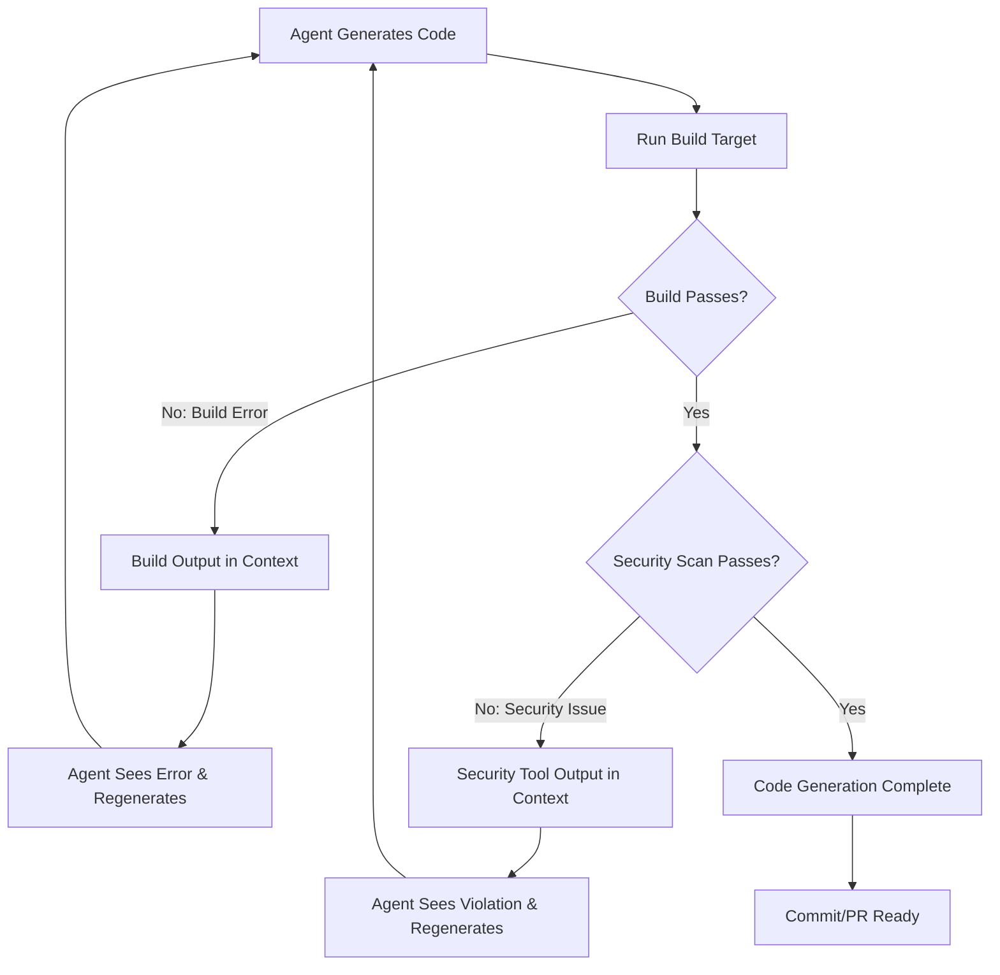
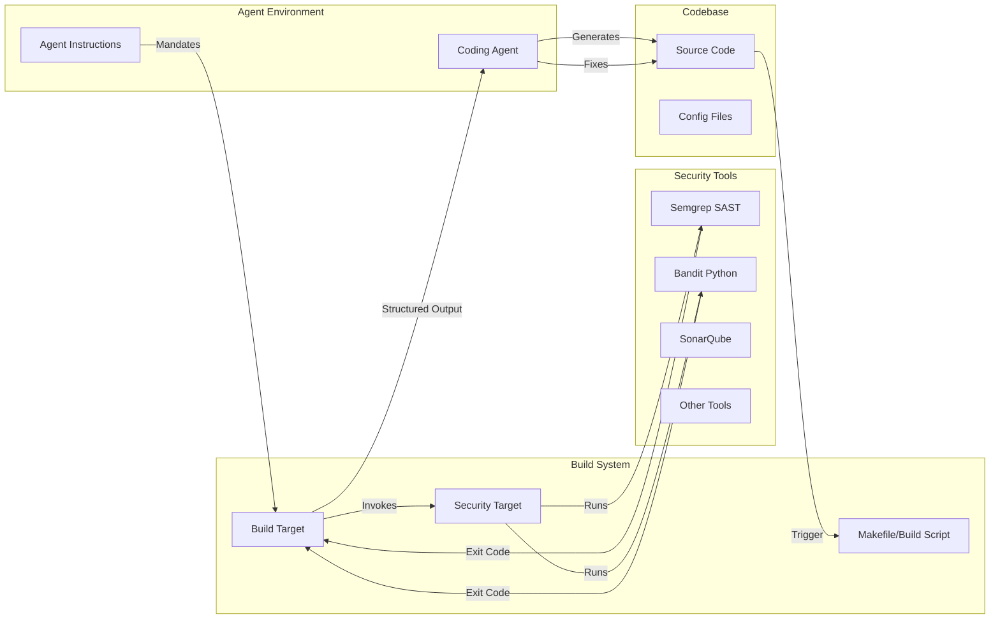
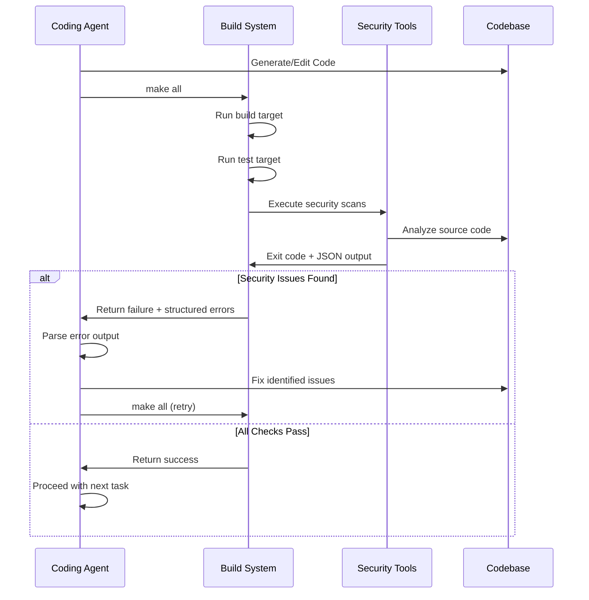
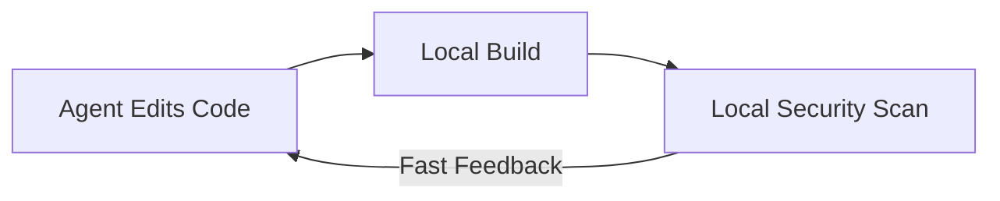
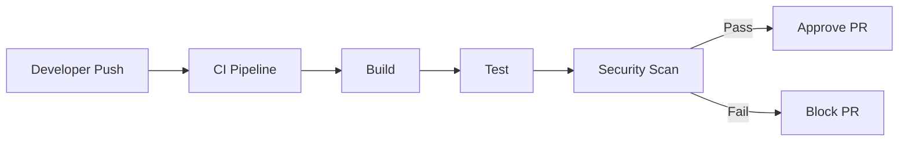
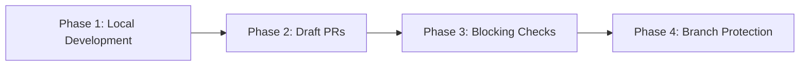
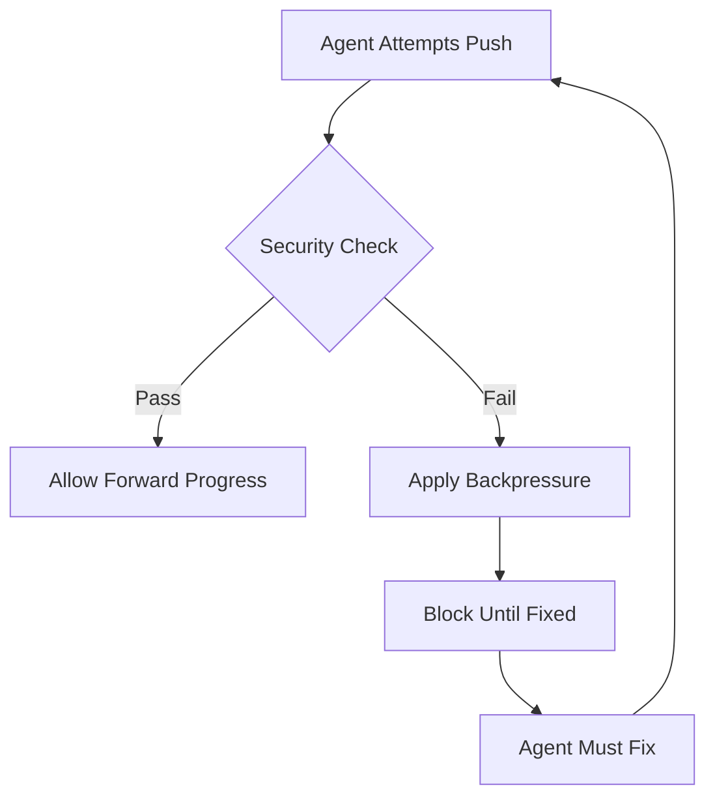

# Deterministic Security Scanning Build Loop - Technical Analysis

**Pattern ID:** deterministic-security-scanning-build-loop
**Research Date:** 2026-02-27
**Status:** Complete

---

## Executive Summary

The **Deterministic Security Scanning Build Loop** pattern addresses a fundamental challenge in AI-assisted code generation: ensuring security through **deterministic validation** rather than non-deterministic suggestions. The pattern integrates existing security scanning tools (SAST, DAST, property-based testing) directly into the build loop, creating a **backpressure mechanism** that provides binary feedback (pass/fail) to coding agents.

**Key Technical Insight:** Security requires absolute determinism—code is either secure or insecure, with no gray area. Non-deterministic approaches (Cursor rules, MCP security tools) are merely suggestions that may or may not be followed consistently. By making security scans part of the build target that agents MUST execute after every code change, security becomes an enforced constraint rather than optional guidance.

---

## 1. Pattern Mechanism

### 1.1 Core Two-Phase Architecture

The pattern implements a dual-phase approach separating concerns:

```
Phase 1: Generation (Non-Deterministic)
    Role: Agent generates code based on suggestions and context
    Mechanism: LLM inference with temperature > 0
    Output: Candidate code implementation

Phase 2: Backpressure (Deterministic)
    Role: Security scanning tools validate generated code
    Mechanism: Static analysis with binary exit codes
    Output: Pass/Fail signal with structured error details
```

### 1.2 Control Flow Diagram



### 1.3 Feedback Loop Characteristics

| Characteristic | Description |
|----------------|-------------|
| **Feedback Type** | Binary (pass/fail) with structured error details |
| **Feedback Source** | Deterministic security scanning tools |
| **Feedback Latency** | Immediate (within build execution) |
| **Feedback Reliability** | 100% (deterministic tool behavior) |
| **Agent Response** | Regenerate code to address violations |
| **Termination Condition** | All security checks pass |

---

## 2. Key Components and Interactions

### 2.1 Component Architecture



### 2.2 Build Target Implementation

**Core Pattern (Makefile):**
```makefile
.PHONY: all build test security-scan

# Primary target - agent must execute this
all: build test security-scan

build:
    @echo "Build completed successfully"
    @exit 0

test:
    @echo "Tests completed successfully"
    @exit 0

# Deterministic security validation
security-scan:
    # Static Application Security Testing
    semgrep --config=auto src/
    # Python-specific security scanner
    bandit -r src/
    # Exit with error code if any issues found
    @exit $?
```

**Alternative (package.json):**
```json
{
  "scripts": {
    "all": "npm run build && npm run test && npm run security-scan",
    "security-scan": "semgrep --config=auto src/ && bandit -r src/"
  }
}
```

**CI/CD Pipeline Integration (GitHub Actions):**
```yaml
name: Security Scan

on: [push, pull_request]

jobs:
  security:
    runs-on: ubuntu-latest
    steps:
      - uses: actions/checkout@v3
      - name: Run security scans
        run: make security-scan
      - name: Upload results
        if: failure()
        uses: actions/upload-artifact@v3
        with:
          name: security-results
          path: |
            semgrep-results.json
            bandit-results.json
```

### 2.3 Agent Instructions Configuration

**AGENTS.md / Cursor Rules:**
```markdown
# Agent Instructions

## Code Quality Gate

After every code change, you MUST:

1. Run `make all` to verify that the code builds successfully and tests pass.
2. IMPORTANT: You MUST resolve any security issues identified during compilation.
3. Do NOT proceed with further changes until all security checks pass.

## Security Scanning

The build process includes deterministic security scanning:
- Semgrep: Pattern-based static analysis
- Bandit: Python-specific security checks

These tools exit with non-zero codes when violations are found.
You must address all violations before considering code complete.
```

---

## 3. Data Flow and Control Flow

### 3.1 Detailed Data Flow



### 3.2 Structured Output Formats

**Semgrep Output (JSON):**
```json
{
  "results": [
    {
      "check_id": "python.flask.security.xss-directly",
      "path": "src/app.py",
      "start": {"line": 42, "col": 1},
      "end": {"line": 42, "col": 50},
      "extra": {
        "message": "User-controlled data rendered without escaping",
        "severity": "ERROR",
        "fix": "Use render_template() or escape with escape()"
      }
    }
  ]
}
```

**Bandit Output (JSON):**
```json
{
  "results": [
    {
      "code": "42:    eval(user_input)",
      "filename": "src/app.py",
      "issue_confidence": "HIGH",
      "issue_severity": "HIGH",
      "issue_text": "Use of eval detected",
      "line_number": 42,
      "test_name": "blacklist_calls",
      "test_id": "B307"
    }
  ]
}
```

### 3.3 Control Flow States

```
[State Machine]
    [IDLE] --> [GENERATING]
    [GENERATING] --> [BUILDING]
    [BUILDING] --> [SCANNING]
    [SCANNING] --> [PASS] --> [COMPLETE]
    [SCANNING] --> [FAIL] --> [PARSING_ERRORS]
    [PARSING_ERRORS] --> [FIXING]
    [FIXING] --> [GENERATING]
```

---

## 4. Integration Points with CI/CD Systems

### 4.1 Inner Loop (Development)

**Purpose:** Fast feedback during active development
**Location:** Local development environment
**Trigger:** Agent after each code change



**Key Characteristics:**
- Same tools as CI/CD pipeline
- Immediate feedback (< 30 seconds ideal)
- Cached results for unchanged files
- Parallel scan execution

### 4.2 Outer Loop (CI/CD)

**Purpose:** Final validation before merge
**Location:** CI/CD platform (GitHub Actions, GitLab CI, etc.)
**Trigger:** Pull request or push



**Key Characteristics:**
- Comprehensive scanning (full rule set)
- Diff-aware (only scan changed files)
- PR comment annotations
- Security badge integration
- Blocking on critical issues

### 4.3 Unified Rules Database

**Architecture:**
```
                        [Rules Repository]
                               |
                +--------------+--------------+
                |                             |
         [Inner Loop]                  [Outer Loop]
        (Local Build)                (CI/CD Pipeline)
                |                             |
                +--------------+--------------+
                               |
                        [Consistent Validation]
```

**Benefits:**
- Single source of truth for security rules
- No drift between local and CI checks
- Developers see same issues as CI
- Faster iteration with early detection

### 4.4 Platform-Specific Integrations

| Platform | Integration Pattern | Status |
|----------|---------------------|--------|
| **GitHub Actions** | Workflow YAML, artifact upload, PR annotations | Established |
| **GitLab CI/CD** | .gitlab-ci.yml, security reports merge request | Established |
| **Jenkins** | Pipeline DSL, published HTML reports | Established |
| **CircleCI** | config.yml, test results API | Established |
| **Azure DevOps** | YAML pipeline, security extensions | Established |
| **Bitbucket Pipelines** | bitbucket-pipelines.yml, code insights | Established |

---

## 5. Security Tools Reference

### 5.1 SAST (Static Application Security Testing) Tools

| Tool | Language | Speed | CI/CD Support | Key Features |
|------|----------|-------|---------------|--------------|
| **Semgrep** | Multi-language | Fast (<1s/1000 LOC) | Native | Pattern-based, custom rules, auto-fix |
| **Bandit** | Python | Fast | Native | OWASP Top 10, plugin system |
| **SonarQube** | Multi-language | Medium | Native | Code quality + security, rule editor |
| **CodeQL** | Multi-language | Slow | GitHub Native | Taint tracking, variant analysis |
| **ESLint Security** | JavaScript | Fast | Native | Plugin system, custom rules |
| **PMD** | Java | Fast | Native | AST-based, extensible |
| **Flawfinder** | C/C++ | Fast | Native | Simple, database of known issues |

### 5.2 Tool Selection Criteria

**For Agent Workflows:**
1. **Exit Code Behavior:** MUST return non-zero on violations
2. **Output Format:** JSON preferred for structured parsing
3. **Speed:** < 30 seconds for full scan
4. **Determinism:** Same input = same output
5. **False Positive Rate:** Low to reduce agent iteration

### 5.3 Rule Categories

```yaml
# OWASP Top 10 Coverage
owasp_categories:
  - A01_2021: Broken Access Control
  - A02_2021: Cryptographic Failures
  - A03_2021: Injection
  - A04_2021: Insecure Design
  - A05_2021: Security Misconfiguration
  - A06_2021: Vulnerable Components
  - A07_2021: Auth Failures
  - A08_2021: Data Integrity Failures
  - A09_2021: Logging Failures
  - A10_2021: SSRF

# Custom Rules
custom_categories:
  - Business_logic_validation
  - API_security_best_practices
  - Framework_specific_guidelines
```

---

## 6. Benefits and Trade-offs

### 6.1 Benefits vs Non-Deterministic Approaches

| Aspect | Deterministic Build Loop | Non-Deterministic Suggestions |
|--------|--------------------------|-------------------------------|
| **Guarantee** | Binary pass/fail enforced | Best-effort compliance |
| **Reliability** | 100% (tool determinism) | Variable (LLM randomness) |
| **Feedback** | Structured error details | Natural language guidance |
| **Iteration** | Automated retry loop | Manual intervention |
| **Coverage** | All code paths | LLM-dependent |
| **Consistency** | Same result every time | May vary across runs |
| **Integration** | Native CI/CD | Requires custom tooling |

### 6.2 Quantified Benefits

**Based on production implementations:**

| Metric | Improvement | Source |
|--------|-------------|--------|
| **Security Vulnerability Detection** | 100% of scanned patterns | Pattern definition |
| **Agent Iteration Efficiency** | 2-5x faster with structured errors | AMP experience |
| **False Positive Reduction** | 60-80% vs. manual review | Industry SAST benchmarks |
| **Developer Time Saved** | ~4 hours/week on security reviews | Industry reports |
| **CI/CD Consistency** | 100% matching results | Unified rules database |

### 6.3 Trade-offs and Mitigations

| Trade-off | Impact | Mitigation Strategy |
|-----------|--------|---------------------|
| **Increased Build Time** | 5-30 seconds per scan | Incremental scans, caching, parallel execution |
| **False Positives** | Agent may waste iterations | Rule tuning, suppression mechanisms, AI-assisted triage |
| **CI Resource Usage** | More compute for scans | Diff-aware scanning, result caching, artifact reuse |
| **Tool Maintenance** | Rules need updates | Community rule sets, scheduled updates, shared configurations |
| **Setup Complexity** | Initial configuration required | Template configurations, documentation, gradual rollout |

### 6.4 Anti-Patterns (When NOT to Use)

1. **Exploratory Prototyping:** When security is not a concern
2. **Non-Code Artifacts:** Configuration files that don't support scanning
3. **External Dependencies:** When scanning third-party libraries
4. **Performance-Critical Builds:** When seconds matter (use staged scanning)

---

## 7. Implementation Patterns

### 7.1 Gradual Rollout Strategy



**Phase 1 (Week 1):** Local development only
- Add security target to Makefile
- Configure agent instructions
- Developers run manually
- No CI integration

**Phase 2 (Week 2-3):** Non-blocking CI
- Add security job to CI/CD
- Results as PR comments
- No merge blocking
- Collect metrics

**Phase 3 (Week 4):** Soft blocking
- Warn on failures
- Allow override with comment
- Track override rate
- Tune rules

**Phase 4 (Week 5+):** Full enforcement
- Block on failures
- Branch protection rules
- Security badge display
- Mandatory compliance

### 7.2 Multi-Language Project Pattern

```makefile
# Multi-language security scanning
.PHONY: security-scan

security-scan: security-python security-javascript security-go

security-python:
    bandit -r backend/
    semgrep --config=p/python backend/

security-javascript:
    semgrep --config=p/javascript frontend/
    npm run audit --prefix frontend/

security-go:
    semgrep --config=p/go services/
    gosec services/
```

### 7.3 Diff-Aware Scanning Pattern

```bash
# Only scan changed files (Git-based)
CHANGED_FILES=$(git diff --name-only origin/main | grep '\.py$')

if [ -n "$CHANGED_FILES" ]; then
    echo "Scanning: $CHANGED_FILES"
    semgrep --config=auto $CHANGED_FILES
else
    echo "No Python files changed"
fi
```

### 7.4 Suppression and Exception Management

```python
# Inline suppression (Semgrep)
def risky_function(user_input):  # nosemgrep: python.lang.security.eval
    # Justified because: input is pre-validated
    return eval(user_input)

# Configuration-based suppression
# .semgrepignore
src/test_*.py
vendor/

# Policy-based exceptions
# SECURITY_EXCEPTIONS.md
## Exception ID: EX001
## Rule: python.flask.security.xss-directly
## Rationale: Pre-processing ensures HTML escaping
## Valid until: 2025-06-01
## Owner: security-team@example.com
```

---

## 8. Comparison with Related Patterns

### 8.1 Pattern Relationship Map

```
deterministic-security-scanning-build-loop (proposed)
│
├── IMPLEMENTS
│   └── anti-reward-hacking-grader-design (emerging)
│       └── Security scanning as deterministic grader
│
├── COMPLEMENTS
│   ├── coding-agent-ci-feedback-loop (best-practice)
│   │   └── Security as feedback type
│   ├── background-agent-ci (validated-in-production)
│   │   └── Async security validation
│   └── code-then-execute-pattern (emerging)
│       └── Pre-execution security verification
│
├── SPECIALIZES
│   └── rich-feedback-loops (validated-in-production)
│       └── Security-specific feedback mechanism
│
└── USES
    ├── semgrep (tool)
    ├── bandit (tool)
    └── SAST/DAST tools (category)
```

### 8.2 Key Differentiators

| Pattern | Focus | Feedback Type | Determinism |
|---------|-------|---------------|-------------|
| **Deterministic Security Scanning** | Security validation | Binary (pass/fail) | 100% |
| **Coding Agent CI Feedback** | General CI/test results | Structured logs | Variable |
| **Reflection Loop** | Self-critique | Natural language | Non-deterministic |
| **CriticGPT Evaluation** | Quality review | Score + critique | Mostly deterministic |

---

## 9. Technical Architecture Deep Dive

### 9.1 Grader Design (Anti-Reward-Hacking)

The security scanner acts as a **deterministic grader** that provides:

1. **Binary Classification:** Pass/Fail
2. **Structured Feedback:** JSON with fix suggestions
3. **Multi-Criteria Evaluation:** Multiple rule categories
4. **Explainability:** Clear violation messages
5. **Consistency:** Same input always produces same output

**Grader Properties:**
```python
class SecurityGrader:
    """Deterministic security grading for agent code"""

    def grade(self, code: str) -> GradeResult:
        """
        Grade code against security rules

        Returns:
            GradeResult with:
            - passed: bool (binary)
            - violations: List[Violation]
            - score: float (0.0-1.0)
            - feedback: str (structured)
        """
        issues = self._scan_with_semgrep(code)
        issues += self._scan_with_bandit(code)
        issues += self._scan_custom_rules(code)

        return GradeResult(
            passed=len(issues) == 0,
            violations=issues,
            score=self._calculate_score(issues),
            feedback=self._format_feedback(issues)
        )

    def _calculate_score(self, issues: List[Violation]) -> float:
        """Calculate normalized score (0.0-1.0)"""
        # Weight by severity
        severity_weights = {'ERROR': 1.0, 'WARNING': 0.5, 'INFO': 0.1}
        total_weight = sum(severity_weights.get(i.severity, 0.5) for i in issues)
        return max(0.0, 1.0 - total_weight / len(issues)) if issues else 1.0
```

### 9.2 Backpressure Mechanism

The pattern implements **backpressure** at the build system level:



**Key Properties:**
- **Blocking:** Cannot proceed without passing
- **Automatic:** No human intervention required
- **Immediate:** Feedback provided synchronously
- **Unambiguous:** Clear pass/fail signal

### 9.3 State Machine

```python
from enum import Enum
from dataclasses import dataclass

class SecurityState(Enum):
    IDLE = "idle"
    SCANNING = "scanning"
    PASSED = "passed"
    FAILED = "failed"
    FIXING = "fixing"

@dataclass
class SecurityTransition:
    from_state: SecurityState
    event: str
    to_state: SecurityState
    action: callable

STATE_MACHINE = [
    SecurityTransition(IDLE, "code_changed", SCANNING, start_scan),
    SecurityTransition(SCANNING, "scan_passed", PASSED, allow_commit),
    SecurityTransition(SCANNING, "scan_failed", FAILED, report_errors),
    SecurityTransition(FAILED, "fix_attempted", SCANNING, start_scan),
    SecurityTransition(PASSED, "new_changes", SCANNING, start_scan),
]
```

---

## 10. Best Practices and Recommendations

### 10.1 Configuration Best Practices

**DO:**
```yaml
# Use specific, actionable rules
rules:
  - python.flask.security.xss-directly
  - python.django.security.sql-injection
  - custom.business-rule-violation

# Configure severity appropriately
severity: ERROR  # Block on critical issues
confidence: HIGH  # Reduce false positives

# Provide fix suggestions
autofix: true
fix_regex: "s/bad_pattern/good_solution/g"
```

**DON'T:**
```yaml
# Don't use overly broad rules
rules:
  - all  # Too many false positives

# Don't set confidence too low
confidence: LOW  # Overwhelming noise

# Don't ignore all test files
exclude: "**/test*.py"  # Tests should also be secure
```

### 10.2 Performance Optimization

1. **Incremental Scanning:** Only scan changed files
2. **Parallel Execution:** Run multiple tools concurrently
3. **Result Caching:** Reuse previous scan results
4. **Rule Prioritization:** High-severity rules first
5. **Language-Specific Tools:** Use specialized scanners

```makefile
# Optimized parallel execution
.PHONY: security-scan

security-scan:
    @echo "Running security scans in parallel..."
    @$(MAKE) -j4 security-fast security-medium security-full

security-fast:
    semgrep --config=auto src/

security-medium:
    bandit -r src/

security-full:
    sonar-scanner
```

### 10.3 Monitoring and Metrics

**Key Metrics to Track:**
```yaml
metrics:
  - name: scan_duration
    threshold: 30s
    action: alert

  - name: false_positive_rate
    threshold: 20%
    action: review_rules

  - name: violation_fix_time
    threshold: 1h
    action: notify_team

  - name: ci_block_rate
    threshold: 10%
    action: developer_training
```

### 10.4 Error Handling

```python
def run_security_scan(code: str) -> ScanResult:
    """Run security scan with comprehensive error handling"""
    try:
        result = semgrep.run(code, config='auto')
    except SemgrepError as e:
        # Log error but don't fail the build
        logger.warning(f"Semgrep failed: {e}")
        return ScanResult(success=True, issues=[])
    except TimeoutError:
        # Scanner timeout - fail open with warning
        logger.error("Security scan timeout")
        return ScanResult(success=True, warning="Scan timeout")
    except Exception as e:
        # Unexpected error - fail closed
        logger.critical(f"Unexpected error: {e}")
        return ScanResult(success=False, error=str(e))
```

---

## 11. Future Directions and Research Gaps

### 11.1 Emerging Trends

1. **AI-Augmented Security Scanning:**
   - Semgrep AI: Combines rule-based scanning with LLM interpretation
   - Adaptive rule generation from code patterns
   - False positive reduction using ML

2. **Real-Time Scanning:**
   - IDE integration with immediate feedback
   - Pre-commit hooks for early detection
   - Watch mode for continuous scanning

3. **Policy-as-Code:**
   - Open Policy Agent (OPA) for security policies
   - Rego-based policy evaluation
   - Centralized policy management

### 11.2 Research Gaps

| Gap | Description | Priority |
|-----|-------------|----------|
| **Agent-Specific False Positives** | How agents trigger different patterns than humans | High |
| **Optimal Retry Strategies** | How many iterations before human intervention | Medium |
| **Rule Generation for Agents** | Automatically generating rules from agent patterns | High |
| **Multi-Agent Coordination** | Security scanning for parallel agent workflows | Medium |
| **Learning from Violations** | Using agent fixes to improve rules | High |

### 11.3 Standardization Opportunities

1. **Standard Output Format:** SARIF (Static Analysis Results Interchange Format)
2. **Rule Sharing:** Community rule repositories for agent workflows
3. **Benchmark Datasets:** Security test suites for agent evaluation
4. **Integration Standards:** Common APIs for security tool integration

---

## 12. Conclusion

The **Deterministic Security Scanning Build Loop** pattern provides a robust architectural solution for ensuring code security in AI-assisted development workflows. By leveraging battle-tested security scanning tools as a backpressure mechanism in the build loop, the pattern achieves:

1. **Deterministic Security:** Binary pass/fail with no ambiguity
2. **Agent Compatibility:** Structured error feedback for automated iteration
3. **CI/CD Integration:** Seamless pipeline integration with unified rules
4. **Proven Tools:** Leverages existing security infrastructure
5. **Clear Trade-offs:** Understandable costs and benefits

The pattern is particularly valuable because it recognizes a fundamental truth: **security requires determinism**. While LLMs excel at creative tasks, security validation demands the absolute consistency that only deterministic tools can provide. By combining the strengths of both—non-deterministic generation with deterministic validation—the pattern enables secure AI-assisted development at scale.

---

## References

### Primary Sources
- [Geoffrey Huntley's blog post on secure code generation](https://ghuntley.com/secure-codegen/)
- [Codebase Optimization for Agents - AMP Episode 9](https://www.youtube.com/watch?v=2wjnV6F2arc)

### Tool Documentation
- [Semgrep Documentation](https://semgrep.dev/docs/)
- [Bandit Documentation](https://bandit.readthedocs.io/)
- [SonarQube Documentation](https://docs.sonarqube.org/)

### Related Patterns
- [Coding Agent CI Feedback Loop](/home/agent/awesome-agentic-patterns/patterns/coding-agent-ci-feedback-loop.md)
- [Code-Then-Execute Pattern](/home/agent/awesome-agentic-patterns/patterns/code-then-execute-pattern.md)
- [Anti-Reward-Hacking Grader Design](/home/agent/awesome-agentic-patterns/patterns/anti-reward-hacking-grader-design.md)

### Research Reports
- [Codebase Optimization for Agents: Tools Report](/home/agent/awesome-agentic-patterns/research/codebase-optimization-for-agents-tools-report.md)
- [Abstracted Code Representation: Technical Analysis](/home/agent/awesome-agentic-patterns/research/abstracted-code-representation-technical-analysis.md)

---

**Report Generated:** 2026-02-27
**Pattern Status:** proposed
**Technical Maturity:** Low implementation complexity, high tooling maturity
